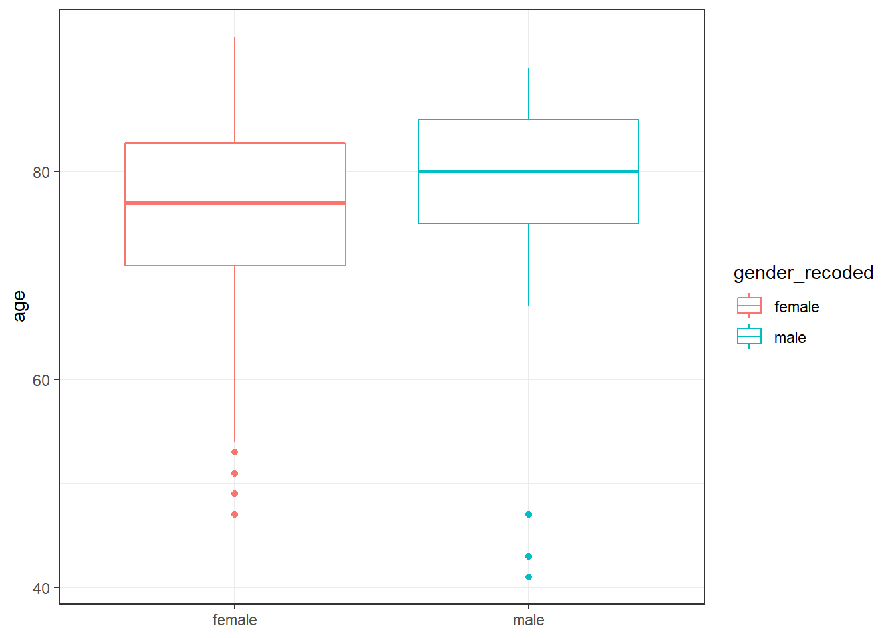

# Case Example {#edacase}

This Chapter illustrates a case example for EDA with real-life data. It takes you through some of the steps of the EDA checklist and illustrates the Problem-Plan-Data-Analysis-Conclusion, shortly 'PPDAC' cycle of EDA. More details on EDA will be discussed in Chapter \@ref(lab5eda)

## Packages needed for the analysis below

```r
library(tidyverse)
library(DiagrammeR)
library(magrittr)
library(ggplot2)
library(ggpubr)
library(ggExtra)
library(captioner)
```

## The curious case of the Frederick Shipman murders

[From Wikipedia](https://en.wikipedia.org/wiki/Harold_Shipman) 

"Harold Frederick Shipman (14 January 1946 – 13 January 2004) was an English general practitioner and is one of the most prolific serial killers in history. On 31 January 2000, a jury found Shipman guilty of the murder of 15 patients under his care. He was sentenced to life imprisonment with the recommendation that he never be released.

The Shipman Inquiry, a two-year-long investigation of all deaths certified by Shipman, which was chaired by Dame Janet Smith, examined Shipman's crimes. _The inquiry identified 215 victims and estimated his total victim count at 250, about 80% of whom were elderly women. His youngest confirmed victim was a 41-year-old man,[4] although "significant suspicion" arose that he had killed patients as young as four_." 

"Thanks to David Spiegelhalter for pointing me to this nice example for my teaching. I am hoping that you will allow me to 'borrow' it from you" [@spiegelhalter2019]

Some of the R-code chunks below were reproduced from the Github repository accompanying [@spiegelhalter2019]

## The PPDAC cycle 
The PPDAC Cycle [@spiegelhalter2019; @mackay2000] is a conceptualization for the iterative EDA process where you: 

 1. Start with a **PROBLEM** (or question)
 1. You devise a **PLAN** to solve the problem (or answer the question)
 1. You collect **DATA** to execute the plan (or perform an experiment)
 1. You **ANALYZE** the data
 1. Finally, you draw a **CONCLUSION** from the analysis
 1. You probably start the cycle again, with a different or slightly different question

<div class="figure">
<!--html_preserve--><div id="htmlwidget-ce645d8c6bbc5a85bd04" style="width:672px;height:480px;" class="grViz html-widget"></div>
<script type="application/json" data-for="htmlwidget-ce645d8c6bbc5a85bd04">{"x":{"diagram":"\ndigraph rmarkdown {\n  Problem -> Plan\n  Plan -> Data\n  Data -> Analysis\n  Analysis -> Conclusion \n  Conclusion -> Problem\n}\n","config":{"engine":"dot","options":null}},"evals":[],"jsHooks":[]}</script><!--/html_preserve-->
<p class="caption">(\#fig:unnamed-chunk-2)The PPDAC cycle of Exploratory Data Analysis in a diagram. Please note that sometimes shortcuts are possible and even feasible. [@spiegelhalter2019, @mackay2000]</p>
</div>

## The PPDAC Cycle Starts with a relevant _PROBLEM_.

(ref:shipquestion) The _PROBLEM_ in the case at hand could be: "Did the author of the Wikipedia article above get the facts straight? For example: Is it true that the victims are maninly elderly? Is the statement about the majority of the gender of the victims being female correct? Is the amount of victims right?"

(ref:shipquestion)

## Let's try to come up with a _PLAN_

We already defined our _PROBLEM_, now we need a _PLAN_. When creating a plan it is good to think about what type of information we would need to solve our problem. Think about information in terms of variables in a dataset. In R, we usually work with tabular data in which variables are the columns of our dataset and rows are the observations.

**DISCUSS WITH YOUR NEIGHBOUR**
If we design a datatable that would provide data with which we could answer the problem, which information would we need?

The data would need to include at least:

 - A list with 'suspected' victims
 - The age at deadt of each victim
 - The gender of the victim

With information on these three variables we would be able to solve at least:
 
 1. How many victims Shipman is suspected of having murdered?
 1. What is the gender distribution among victims?
 1. What is the age distribution is among victims? 
 
These three subquestions solve our main question: (ref:shipquestion)
 
## Let's look at the available _DATA_

Now that we defined the problem and we have come up with a plan to solve it, we need _DATA_. When acquiring data you carefully need to take into consideration the quality of it. In this case we rely on the integrity of the author of "The art of Statistics" David Speigelhalter. But it is always good to take a look at the original source of the date and in many cases it is preferrable to do the acquisition of the data directly from the (original) source if possible. In later chapters you will learn techniques like webscraping and accessing databases directly from R to achieve this. 

[Here is a link to the original source](https://webarchive.nationalarchives.gov.uk/20090808221518/http://www.the-shipman-inquiry.org.uk/fr_casesbyyear.asp?year=74&from=r)

## Load the Shipman murders data 
Dataset derived from: https://github.com/dspiegel29/ArtofStatistics [@spiegelhalter2019]

To load the data into R you can run the following command. The datafile is in csv format: 

(ref:csvformat) CSV-format is a non proprietary standard format where columns are seperated by either a `,` (comma) or a `;` (semi-colon). Which is used depends on the region of the World and whether the decimal seperator in that region is a `,` or a `.`. When reading a CSV in R, alway make sure you define the appropriate seperator.

(ref:csvformat)

When loading the data the `data.frame` is stored in the Global Environment of your R-session as `shipman_murders`. You can access this variable by typing its name in the `Console` or inspecting it in the RStudio interactive viewer under the `Environment` tab. 

Run the code below to read the data into R.

```r
shipman_murders <- read_csv(
  here::here(
    "data", 
    "00-1-shipman-confirmed-victims-x.csv"
    )
  )
```

```
## 
## -- Column specification --------------------------------------------------------
## cols(
##   DateofDeath = col_character(),
##   Name = col_character(),
##   Age = col_double(),
##   PlaceofDeath = col_character(),
##   Decision = col_character(),
##   yearOfDeath = col_double(),
##   gender = col_double(),
##   fractionalDeathYear = col_double(),
##   ageBracket = col_character(),
##   gender2 = col_character()
## )
```

**EXERCISE 1** Study the code above and discuss the following questions with your neighbour.

A) Without looking in the csv file: What type of seperator does the file data: "00-1-shipman-confirmed-victims-x.csv" have? How would you be able to discover this?
_There are multiple options._

**TIPS** 
 
 - Try running `help("read_csv")` and read over the manual for this function.
 - There is also a Linux Terminal solution, do you know which?

B) Can you discover what information is stored in this data by running the command `names(shipman_murders)` in the R Console?

C) How many murdered people are included in the data?

## Analyzing the data
When obtaining the data it is good to review the EDA checklist to see what could be explored.

When perfoming EDA consider:

 1. What question(s) are you trying to solve (or prove wrong)?
 1. Which information do you need and can you come up with a plan to answer the question(s)
 1. What kind of data do you have and how do you treat different types?
 1. What’s missing from the data and how do you deal with it?
 1. Where are the outliers and why should you care about them?
 1. How can you add, change or remove features to get more out of your data?
 1. Do you need additional data from other sources to relate to the dataset under scrutany?
 1. Are underlying statistical assumptions met / how is data distribution looking?
 1. What (exploratory) models apply or fit well to the data?
 1. What is the undelying (experimental) design?
 1. Is there multi-colinearity?

If we review the list above we can already check a number of items from the list that we have taken care of. Let's take a look at the data first


```r
DT::datatable(shipman_murders)
```

<!--html_preserve--><div id="htmlwidget-04c832961ac798d3809a" style="width:100%;height:auto;" class="datatables html-widget"></div>
<script type="application/json" data-for="htmlwidget-04c832961ac798d3809a">{"x":{"filter":"none","data":[["1","2","3","4","5","6","7","8","9","10","11","12","13","14","15","16","17","18","19","20","21","22","23","24","25","26","27","28","29","30","31","32","33","34","35","36","37","38","39","40","41","42","43","44","45","46","47","48","49","50","51","52","53","54","55","56","57","58","59","60","61","62","63","64","65","66","67","68","69","70","71","72","73","74","75","76","77","78","79","80","81","82","83","84","85","86","87","88","89","90","91","92","93","94","95","96","97","98","99","100","101","102","103","104","105","106","107","108","109","110","111","112","113","114","115","116","117","118","119","120","121","122","123","124","125","126","127","128","129","130","131","132","133","134","135","136","137","138","139","140","141","142","143","144","145","146","147","148","149","150","151","152","153","154","155","156","157","158","159","160","161","162","163","164","165","166","167","168","169","170","171","172","173","174","175","176","177","178","179","180","181","182","183","184","185","186","187","188","189","190","191","192","193","194","195","196","197","198","199","200","201","202","203","204","205","206","207","208","209","210","211","212","213","214","215"],["17-Mar-75","07-Aug-78","30-Aug-78","07-Dec-78","20-Dec-78","10-Aug-79","28-Nov-79","18-Apr-81","26-Aug-81","04-Jan-83","28-Jun-83","07-Jan-84","08-Feb-84","15-Apr-84","24-Apr-84","21-Sep-84","27-Nov-84","17-Dec-84","18-Dec-84","24-Dec-84","02-Jan-85","01-Feb-85","04-Feb-85","15-Feb-85","22-Feb-85","26-Jun-85","26-Jun-85","23-Aug-85","17-Dec-85","20-Dec-85","31-Dec-85","07-Jan-86","23-Apr-86","06-Jun-86","15-Sep-86","07-Oct-86","17-Nov-86","16-Dec-86","23-Dec-86","30-Mar-87","01-Apr-87","16-Apr-87","08-May-87","14-Sep-87","11-Dec-87","29-Dec-87","30-Dec-87","05-Jan-88","15-Jan-88","09-Feb-88","15-Feb-88","15-Feb-88","16-Feb-88","18-Sep-88","20-Oct-88","06-Nov-88","17-Dec-88","19-Dec-88","31-Jan-89","08-Mar-89","12-May-89","05-Jun-89","06-Jul-89","14-Aug-89","22-Sep-89","26-Sep-89","15-Oct-89","16-Oct-89","18-Oct-89","06-Nov-89","18-Sep-90","30-Dec-90","07-Oct-92","24-Feb-93","24-Feb-93","22-Mar-93","08-Apr-93","17-Apr-93","26-Apr-93","27-Apr-93","02-May-93","04-May-93","12-May-93","13-May-93","22-Jul-93","16-Aug-93","16-Dec-93","22-Dec-93","31-Dec-93","04-Jan-94","13-Jan-94","09-Feb-94","17-May-94","25-May-94","15-Jun-94","17-Jun-94","27-Jul-94","25-Nov-94","30-Nov-94","29-Dec-94","09-Jan-95","01-Mar-95","03-Mar-95","06-Mar-95","07-Mar-95","07-Mar-95","13-Mar-95","21-Mar-95","26-Mar-95","31-Mar-95","10-Apr-95","13-Apr-95","14-Apr-95","21-Apr-95","04-May-95","02-Jun-95","13-Jun-95","17-Jun-95","29-Jun-95","12-Jul-95","31-Jul-95","29-Aug-95","14-Sep-95","26-Sep-95","24-Oct-95","08-Nov-95","22-Nov-95","25-Nov-95","14-Dec-95","14-Dec-95","02-Jan-96","11-Jan-96","21-Feb-96","27-Feb-96","12-Mar-96","18-Apr-96","24-Apr-96","07-May-96","13-May-96","29-May-96","30-May-96","06-Jun-96","10-Jun-96","17-Jun-96","25-Jun-96","25-Jun-96","02-Jul-96","11-Jul-96","16-Jul-96","19-Jul-96","24-Jul-96","29-Jul-96","30-Aug-96","12-Sep-96","20-Sep-96","23-Oct-96","20-Nov-96","23-Nov-96","04-Dec-96","17-Dec-96","02-Jan-97","03-Jan-97","08-Jan-97","20-Jan-97","27-Jan-97","03-Feb-97","04-Feb-97","23-Feb-97","28-Feb-97","22-Mar-97","27-Mar-97","21-Apr-97","25-Apr-97","25-Apr-97","02-May-97","12-May-97","21-May-97","29-May-97","24-Jun-97","07-Jul-97","14-Jul-97","25-Jul-97","28-Jul-97","10-Aug-97","01-Sep-97","22-Sep-97","26-Sep-97","29-Sep-97","10-Nov-97","14-Nov-97","21-Nov-97","24-Nov-97","08-Dec-97","09-Dec-97","10-Dec-97","18-Dec-97","24-Dec-97","22-Jan-98","26-Jan-98","02-Feb-98","09-Feb-98","13-Feb-98","15-Feb-98","18-Feb-98","27-Feb-98","04-Mar-98","06-Mar-98","07-Mar-98","13-Mar-98","17-Mar-98","20-Mar-98","24-Mar-98","11-May-98","12-Jun-98","24-Jun-98"],["Eva Lyons","Sarah Hannah Marsland","Mary Ellen Jordan","Harold Bramwell","Annie Campbell","Alice Maude Gorton","Jack Leslie Shelmerdine","May Slater","Elizabeth Ashworth","Percy Ward","Moira Ashton Fox","Dorothy Tucker","Gladys Roberts","Joseph Bardsley","Winifred Arrowsmith","Mary Winterbottom","Ada Ashworth","Joseph Vincent Everall","Edith Wibberley","Eileen Theresa Cox","Peter Lewis","May Brookes","Ellen Higson","Margaret Ann Conway","Kathleen McDonald","Thomas Moult","Mildred Robinson","Frances Elizabeth Turner","Selina Mackenzie","Vera Bramwell","Fred Kellett","Deborah Middleton","Dorothy Fletcher","Thomas Fowden","Mona Ashton White","Mary Tomlin","Beatrice Toft","Lily Broadbent","James Wood","Frank Halliday","Albert Cheetham","Alice Thomas","Jane Frances Rostron","Nancy Anne Brassington","Margaret Townsend","Nellie Bardsley","Elizabeth Ann Rogers","Elizabeth Fletcher","Alice Mary Jones","Dorothea Hill Renwick","Ann Cooper","Jane Jones","Lavinia Robinson","Rose Ann Adshead","Alice Prestwich","Walter Tingle","Harry Stafford","Ethel Bennett","Wilfred Chappell","Mary Emma Hamer","Beatrice Helen Clee","Josephine Hall","Hilda Fitton","Marion Carradice","Elsie Harrop","Elizabeth Mary Burke","Sarah Jane Williamson","John Charlton","George Edgar Vizor","Joseph Frank Wilcockson","Dorothy Rowarth","Mary Rose Dudley","Monica Rene Sparkes","Olive Heginbotham","Hilda Mary Couzens","Amy Whitehead","Mary Emma Andrew","Sarah Ashworth","Fanny Nichols","Marjorie Parker","Nellie Mullen","Edna May Llewellyn","Emily Morgan","Violet May Bird","Jose Kathleen Diana Richards","Edith Calverley","Joseph Leigh","Eileen Robinson","Charles Edward Brocklehurst","Joan Milray Harding","Christine Hancock","Elsie Platt","Mary Alice Smith","Ronnie Devenport","Cicely Sharples","Alice Christine Kitchen","Maria Thornton","Henrietta Walker","Elizabeth Ellen Mellor","John Bennett Molesdale","Alice Kennedy","Lucy Virgin","Joseph Shaw","Maria West","Netta Ashcroft","Lily Bardsley","Marie Antoinette Fernley","John Crompton","Frank Crompton","Vera Brocklehurst","Angela Philomena Tierney","Edith Scott","Clara Hackney","Renate Eldtraude Overton","Kate Maud Sellors","Clifford Barnes Heapey","Bertha Moss","Brenda Ashworth","Ernest Rudol","Ada Matley Hilton","Irene Aitken","Arthur Henderson Stopford","Geoffrey Bogle","Dora Elizabeth Ashton","Muriel Margaret Ward","Edith Brock","Charles Henry Barlow","Konrad Peter Ovcar-Robinson","Elizabeth Teresa Sigley","Kenneth Wharmby Woodhead","Hilda Mary Hibbert","Erla Copeland","Jane Elizabeth Shelmerdine","John Sheard Greenhalgh","Minnie Doris Irene Galpin","Marjorie Hope Waller","John Stone","Elsie Godfrey","Edith Brady","Valerie Cuthbert","Lilian Cullen","Renee Lacey","Leah Fogg","Gladys Saunders","Nellie Bennett","Margaret Mary Vickers","Tom Balfour Russell","Irene Turner","Carrie Leigh","Marion Elizabeth Higham","Elsie Hannible","Elsie Barker","Sidney Arthur Smith","Dorothy Mary Andrew","Anne Lilian Ralphs","Millicent Garside","Irene Heathcote","Samuel Mills","Thomas Cheetham","Kenneth Ernest Smith","Eileen Daphne Crompton","David Alan Harrison","Elsie Lorna Dean","Irene Brooder","Charlotte Bennison","Charles Henry Killan","Betty Royston","Joyce Woodhead","Lizzie Adams","Rose Garlick","May Lowe","Mary Coutts","Elsie Cheetham","Jean Lilley","Lena Norah Slater","Ethel May Kellett","Doris Earls","Ivy Lomas","Vera Whittingslow","Maureen Lamonnier Jackson","Muriel Grimshaw","John Louden Livesey","Lily Newby Taylor","Dorothy Doretta Hopkins","Nancy Jackson","Mavis Mary Pickup","Bessie Swann","Enid Otter","Florence Lewis","Mary Walls","Elizabeth Mary Baddeley","Marie Quinn","Elizabeth Battersby","Laura Kathleen Wagstaff","Bianka Pomfret","Alice Black","James Joseph King","Mabel Shawcross","Norah Nuttall","Cissie Davies","Pamela Marguerite Hillier","Laura Frances Linn","Irene Berry","Maureen Alice Ward","Joan Edwina Dean","Harold Eddleston","Margaret Anne Waldron","Irene Chapman","Dorothy Long","Lily Higgins","Ada Warburton","Martha Marley","Winifred Mellor","Joan May Melia","Kathleen Grundy"],[70,86,73,73,88,76,77,84,81,90,77,51,78,83,70,76,87,80,76,72,41,74,84,69,73,70,84,85,77,79,79,81,74,81,63,73,59,75,82,76,85,83,78,71,80,69,74,90,83,90,93,83,84,80,69,85,87,80,80,81,78,69,75,80,82,82,82,81,67,85,56,69,72,86,92,82,86,74,84,74,77,68,84,60,74,77,78,54,90,82,53,73,84,57,87,70,78,87,75,81,88,70,88,81,71,88,53,82,86,70,71,85,84,47,75,85,68,63,82,88,65,82,72,87,87,74,88,43,67,75,81,79,80,88,71,79,77,85,72,54,77,63,82,82,86,81,77,67,81,84,85,84,76,85,75,76,76,89,78,73,75,47,69,76,89,90,70,74,77,76,84,80,76,58,68,74,79,63,69,51,76,69,86,72,81,79,79,77,79,78,83,67,70,81,49,73,83,79,64,73,68,83,74,57,75,77,65,74,84,83,77,88,73,73,81],["Own home","Own home","Own home","Own home","Own home","Own home","Hospital","Own home","Own home","Own home","Own home","Own home","Own home","Own home","Own home","Own home","Own home","Own home","Own home","Own home","Own home","Own home","Own home","Own home","Own home","Own home","Own home","Own home","Own home","Own home","Own home","Own home","Residential Home","Own home","Own home","Own home","Own home","Own home","Own home","Own home","Own home","Own home","Own home","Own home","Own home","Own home","Own home","Own home","Own home","Own home","Own home","Own home","Own home","Own home","Own home","Own home","Own home","Own home","Own home","Shipman's surgery","Own home","Own home","Own home","Own home","Own home","Own home","Own home","Own home","Own home","Own home","Own home","Own home","Own home","Own home","Own home","Own home","Own home","Own home","Own home","Own home","Own home","Own home","Own home","Own home","Own home","Own home","Own home","Own home","Own home","Shipman's surgery","Own home","Own home","Own home","Own home","Own home","Own home","Own home","Own home","Own home","Own home","Own home","Own home","Own home","Own home","Own home","Own home","Own home","Own home","Own home","Own home","Own home","Own home","Own home","Hospital","Own home","Nursing home","Shipman's surgery","Own home","Own home","Own home","Own home","Own home","Own home","Shipman's surgery","Own home","Own home","Own home","Own home","Own home","Own home","Own home","Own home","Own home","Own home","Own home","Own home","Own home","Own home","Shipman's surgery","Own home","Own home","Own home","Own home","Own home","Own home","Own home","Own home","Own home","Own home","Own home","Own home","Own home","Own home","Own home","Own home","Own home","Own home","Own home","Own home","Own home","Residential home","Own home","Own home","Own home","Own home","Own home","Own home","Own home","Own home","Own home","Own home","Own home","Own home","Own home","Own home","Own home","Own home","Shipman's surgery","Own home","Own home","Own home","Own home","Own home","Own home","Own home","Own home","Own home","Own home","Own home","Own home","Own home","Own home","Own home","Own home","Own home","Own home","Own home","Own home","Own home","Own home","Own home","Own home","Own home","Own home","Own home","Own home","Own home","Own home","Own home","Own home","Own home","Own home","Own home","Own home","Own home"],["Unlawful killing","Unlawful killing","Unlawful killing","Unlawful killing","Unlawful killing","Unlawful killing","Unlawful killing","Unlawful killing","Unlawful killing","Unlawful killing","Unlawful killing","Unlawful killing","Unlawful killing","Unlawful killing","Unlawful killing","Unlawful killing","Unlawful killing","Unlawful killing","Unlawful killing","Unlawful killing","Unlawful killing","Unlawful killing","Unlawful killing","Unlawful killing","Unlawful killing","Unlawful killing","Unlawful killing","Unlawful killing","Unlawful killing","Unlawful killing","Unlawful killing","Unlawful killing","Unlawful killing","Unlawful killing","Unlawful killing","Unlawful killing","Unlawful killing","Unlawful killing","Unlawful killing","Unlawful killing","Unlawful killing","Unlawful killing","Unlawful killing","Unlawful killing","Unlawful killing","Unlawful killing","Unlawful killing","Unlawful killing","Unlawful killing","Unlawful killing","Unlawful killing","Unlawful killing","Unlawful killing","Unlawful killing","Unlawful killing","Unlawful killing","Unlawful killing","Unlawful killing","Unlawful killing","Unlawful killing","Unlawful killing","Unlawful killing","Unlawful killing","Unlawful killing","Unlawful killing","Unlawful killing","Unlawful killing","Unlawful killing","Unlawful killing","Unlawful killing","Unlawful killing","Unlawful killing","Unlawful killing","Unlawful killing","Unlawful killing","Unlawful killing","Unlawful killing","Unlawful killing","Unlawful killing","Unlawful killing","Unlawful killing","Unlawful killing","Unlawful killing","Unlawful killing","Unlawful killing","Unlawful killing","Unlawful killing","Unlawful killing","Unlawful killing","Unlawful killing","Unlawful killing","Unlawful killing","Unlawful killing","Unlawful killing","Unlawful killing","Unlawful killing","Unlawful killing","Unlawful killing","Unlawful killing","Unlawful killing","Unlawful killing","Unlawful killing","Unlawful killing","Conviction","Unlawful killing","Unlawful killing","Unlawful killing","Unlawful killing","Unlawful killing","Unlawful killing","Unlawful killing","Unlawful killing","Unlawful killing","Unlawful killing","Unlawful killing","Unlawful killing","Unlawful killing","Unlawful killing","Unlawful killing","Unlawful killing","Unlawful killing","Unlawful killing","Unlawful killing","Unlawful killing","Unlawful killing","Unlawful killing","Unlawful killing","Unlawful killing","Unlawful killing","Unlawful killing","Unlawful killing","Unlawful killing","Unlawful killing","Unlawful killing","Unlawful killing","Unlawful killing","Unlawful killing","Unlawful killing","Unlawful killing","Unlawful killing","Unlawful killing","Unlawful killing","Unlawful killing","Unlawful killing","Unlawful killing","Unlawful killing","Unlawful killing","Conviction","Unlawful killing","Unlawful killing","Unlawful killing","Unlawful killing","Unlawful killing","Unlawful killing","Unlawful killing","Unlawful killing","Unlawful killing","Unlawful killing","Unlawful killing","Unlawful killing","Unlawful killing","Unlawful killing","Unlawful killing","Unlawful killing","Unlawful killing","Unlawful killing","Unlawful killing","Unlawful killing","Conviction","Unlawful killing","Unlawful killing","Unlawful killing","Unlawful killing","Conviction","Unlawful killing","Unlawful killing","Unlawful killing","Conviction","Unlawful killing","Unlawful killing","Conviction","Unlawful killing","Unlawful killing","Unlawful killing","Unlawful killing","Unlawful killing","Unlawful killing","Unlawful killing","Unlawful killing","Unlawful killing","Unlawful killing","Conviction","Unlawful killing","Conviction","Conviction","Unlawful killing","Unlawful killing","Unlawful killing","Conviction","Unlawful killing","Conviction","Unlawful killing","Unlawful killing","Conviction","Unlawful killing","Unlawful killing","Unlawful killing","Unlawful killing","Unlawful killing","Unlawful killing","Unlawful killing","Unlawful killing","Conviction","Conviction","Conviction"],[1975,1978,1978,1978,1978,1979,1979,1981,1981,1983,1983,1984,1984,1984,1984,1984,1984,1984,1984,1984,1985,1985,1985,1985,1985,1985,1985,1985,1985,1985,1985,1986,1986,1986,1986,1986,1986,1986,1986,1987,1987,1987,1987,1987,1987,1987,1987,1988,1988,1988,1988,1988,1988,1988,1988,1988,1988,1988,1989,1989,1989,1989,1989,1989,1989,1989,1989,1989,1989,1989,1990,1990,1992,1993,1993,1993,1993,1993,1993,1993,1993,1993,1993,1993,1993,1993,1993,1993,1993,1994,1994,1994,1994,1994,1994,1994,1994,1994,1994,1994,1995,1995,1995,1995,1995,1995,1995,1995,1995,1995,1995,1995,1995,1995,1995,1995,1995,1995,1995,1995,1995,1995,1995,1995,1995,1995,1995,1995,1995,1995,1996,1996,1996,1996,1996,1996,1996,1996,1996,1996,1996,1996,1996,1996,1996,1996,1996,1996,1996,1996,1996,1996,1996,1996,1996,1996,1996,1996,1996,1996,1997,1997,1997,1997,1997,1997,1997,1997,1997,1997,1997,1997,1997,1997,1997,1997,1997,1997,1997,1997,1997,1997,1997,1997,1997,1997,1997,1997,1997,1997,1997,1997,1997,1997,1997,1997,1997,1998,1998,1998,1998,1998,1998,1998,1998,1998,1998,1998,1998,1998,1998,1998,1998,1998,1998],[0,0,0,1,0,0,1,0,0,1,0,0,0,1,0,0,0,1,0,0,1,0,0,0,0,1,0,0,0,0,1,0,0,1,0,0,0,0,1,1,1,0,0,0,0,0,0,0,0,0,0,0,0,0,0,1,1,0,0,0,0,0,0,0,0,0,0,1,1,1,0,0,0,0,0,0,0,0,0,0,0,0,0,0,0,0,0,0,1,0,0,0,0,0,0,0,0,0,0,0,0,0,1,0,0,0,0,1,1,0,0,0,0,0,0,1,0,0,0,0,0,1,1,0,0,0,1,1,0,1,0,0,0,1,0,0,1,0,0,0,0,0,0,0,0,0,1,0,0,0,0,0,1,0,0,0,0,0,1,1,0,1,0,0,0,0,0,0,0,0,0,0,0,0,0,0,0,0,0,0,0,1,0,0,0,0,0,0,0,0,0,0,0,0,0,0,1,0,0,0,0,0,0,0,0,1,0,0,0,0,0,0,0,0,0],[1974.71,1978.1,1978.16,1978.44,1978.47,1979.11,1979.41,1980.8,1981.15,1982.51,1982.99,1983.52,1983.61,1983.79,1983.81,1984.22,1984.41,1984.46,1984.47,1984.48,1984.51,1984.59,1984.6,1984.63,1984.65,1984.99,1984.99,1985.15,1985.46,1985.47,1985.5,1985.52,1985.81,1985.93,1986.21,1986.27,1986.38,1986.46,1986.48,1986.75,1986.75,1986.79,1986.85,1987.21,1987.45,1987.5,1987.5,1987.51,1987.54,1987.61,1987.62,1987.62,1987.63,1988.22,1988.3,1988.35,1988.46,1988.47,1988.59,1988.68,1988.86,1988.93,1989.01,1989.12,1989.23,1989.24,1989.29,1989.29,1989.3,1989.35,1990.22,1990.5,1992.27,1992.65,1992.65,1992.72,1992.77,1992.79,1992.82,1992.82,1992.84,1992.84,1992.86,1992.87,1993.06,1993.13,1993.46,1993.48,1993.5,1993.51,1993.54,1993.61,1993.88,1993.9,1993.96,1993.96,1994.07,1994.4,1994.42,1994.5,1994.53,1994.67,1994.67,1994.68,1994.68,1994.68,1994.7,1994.72,1994.73,1994.75,1994.78,1994.78,1994.79,1994.81,1994.84,1994.92,1994.95,1994.96,1994.99,1995.03,1995.08,1995.16,1995.21,1995.24,1995.32,1995.36,1995.39,1995.4,1995.45,1995.45,1995.5,1995.53,1995.64,1995.66,1995.7,1995.8,1995.81,1995.85,1995.87,1995.91,1995.91,1995.93,1995.94,1995.96,1995.98,1995.98,1996,1996.03,1996.04,1996.05,1996.06,1996.08,1996.16,1996.2,1996.22,1996.31,1996.39,1996.4,1996.43,1996.46,1996.51,1996.51,1996.52,1996.56,1996.58,1996.59,1996.6,1996.65,1996.66,1996.72,1996.74,1996.81,1996.82,1996.82,1996.84,1996.86,1996.89,1996.91,1996.98,1997.02,1997.04,1997.07,1997.07,1997.11,1997.17,1997.23,1997.24,1997.25,1997.36,1997.37,1997.39,1997.4,1997.44,1997.44,1997.44,1997.47,1997.48,1997.56,1997.57,1997.59,1997.61,1997.62,1997.63,1997.64,1997.66,1997.67,1997.68,1997.68,1997.7,1997.71,1997.72,1997.73,1997.86,1997.95,1997.98],["70-74","85-89","70-74","70-74","85-89","75-79","75-79","80-84","80-84","90-94","75-79","50-54","75-79","80-84","70-74","75-79","85-89","80-84","75-79","70-74","40-44","70-74","80-84","65-69","70-74","70-74","80-84","85-89","75-79","75-79","75-79","80-84","70-74","80-84","60-64","70-74","55-59","75-79","80-84","75-79","85-89","80-84","75-79","70-74","80-84","65-69","70-74","90-94","80-84","90-94","90-94","80-84","80-84","80-84","65-69","85-89","85-89","80-84","80-84","80-84","75-79","65-69","75-79","80-84","80-84","80-84","80-84","80-84","65-69","85-89","55-59","65-69","70-74","85-89","90-94","80-84","85-89","70-74","80-84","70-74","75-79","65-69","80-84","60-64","70-74","75-79","75-79","50-54","90-94","80-84","50-54","70-74","80-84","55-59","85-89","70-74","75-79","85-89","75-79","80-84","85-89","70-74","85-89","80-84","70-74","85-89","50-54","80-84","85-89","70-74","70-74","85-89","80-84","45-49","75-79","85-89","65-69","60-64","80-84","85-89","65-69","80-84","70-74","85-89","85-89","70-74","85-89","40-44","65-69","75-79","80-84","75-79","80-84","85-89","70-74","75-79","75-79","85-89","70-74","50-54","75-79","60-64","80-84","80-84","85-89","80-84","75-79","65-69","80-84","80-84","85-89","80-84","75-79","85-89","75-79","75-79","75-79","85-89","75-79","70-74","75-79","45-49","65-69","75-79","85-89","90-94","70-74","70-74","75-79","75-79","80-84","80-84","75-79","55-59","65-69","70-74","75-79","60-64","65-69","50-54","75-79","65-69","85-89","70-74","80-84","75-79","75-79","75-79","75-79","75-79","80-84","65-69","70-74","80-84","45-49","70-74","80-84","75-79","60-64","70-74","65-69","80-84","70-74","55-59","75-79","75-79","65-69","70-74","80-84","80-84","75-79","85-89","70-74","70-74","80-84"],["Women","Women","Women","Men","Women","Women","Men","Women","Women","Men","Women","Women","Women","Men","Women","Women","Women","Men","Women","Women","Men","Women","Women","Women","Women","Men","Women","Women","Women","Women","Men","Women","Women","Men","Women","Women","Women","Women","Men","Men","Men","Women","Women","Women","Women","Women","Women","Women","Women","Women","Women","Women","Women","Women","Women","Men","Men","Women","Women","Women","Women","Women","Women","Women","Women","Women","Women","Men","Men","Men","Women","Women","Women","Women","Women","Women","Women","Women","Women","Women","Women","Women","Women","Women","Women","Women","Women","Women","Men","Women","Women","Women","Women","Women","Women","Women","Women","Women","Women","Women","Women","Women","Men","Women","Women","Women","Women","Men","Men","Women","Women","Women","Women","Women","Women","Men","Women","Women","Women","Women","Women","Men","Men","Women","Women","Women","Men","Men","Women","Men","Women","Women","Women","Men","Women","Women","Men","Women","Women","Women","Women","Women","Women","Women","Women","Women","Men","Women","Women","Women","Women","Women","Men","Women","Women","Women","Women","Women","Men","Men","Women","Men","Women","Women","Women","Women","Women","Women","Women","Women","Women","Women","Women","Women","Women","Women","Women","Women","Women","Women","Women","Men","Women","Women","Women","Women","Women","Women","Women","Women","Women","Women","Women","Women","Women","Women","Men","Women","Women","Women","Women","Women","Women","Women","Women","Men","Women","Women","Women","Women","Women","Women","Women","Women","Women"]],"container":"<table class=\"display\">\n  <thead>\n    <tr>\n      <th> <\/th>\n      <th>DateofDeath<\/th>\n      <th>Name<\/th>\n      <th>Age<\/th>\n      <th>PlaceofDeath<\/th>\n      <th>Decision<\/th>\n      <th>yearOfDeath<\/th>\n      <th>gender<\/th>\n      <th>fractionalDeathYear<\/th>\n      <th>ageBracket<\/th>\n      <th>gender2<\/th>\n    <\/tr>\n  <\/thead>\n<\/table>","options":{"columnDefs":[{"className":"dt-right","targets":[3,6,7,8]},{"orderable":false,"targets":0}],"order":[],"autoWidth":false,"orderClasses":false}},"evals":[],"jsHooks":[]}</script><!--/html_preserve-->

_If you are viewing this book in a browser you should see an interactive table. Take 5 minutes to study the data and 2 additional minutes to discuss what you see with one of your fellow course participants._

Try accessing the variable called `shipman_murders` by typing it's name in the Console. If all goes well this is what you see:


```
## # A tibble: 215 x 10
##    DateofDeath Name    Age PlaceofDeath Decision yearOfDeath gender
##    <chr>       <chr> <dbl> <chr>        <chr>          <dbl>  <dbl>
##  1 17-Mar-75   Eva ~    70 Own home     Unlawfu~        1975      0
##  2 07-Aug-78   Sara~    86 Own home     Unlawfu~        1978      0
##  3 30-Aug-78   Mary~    73 Own home     Unlawfu~        1978      0
##  4 07-Dec-78   Haro~    73 Own home     Unlawfu~        1978      1
##  5 20-Dec-78   Anni~    88 Own home     Unlawfu~        1978      0
##  6 10-Aug-79   Alic~    76 Own home     Unlawfu~        1979      0
##  7 28-Nov-79   Jack~    77 Hospital     Unlawfu~        1979      1
##  8 18-Apr-81   May ~    84 Own home     Unlawfu~        1981      0
##  9 26-Aug-81   Eliz~    81 Own home     Unlawfu~        1981      0
## 10 04-Jan-83   Perc~    90 Own home     Unlawfu~        1983      1
## # ... with 205 more rows, and 3 more variables: fractionalDeathYear <dbl>,
## #   ageBracket <chr>, gender2 <chr>
```

The data consists of 10 columns (called `variables` in R lingo) and 215 rows (or sometimes called `observations`, `cases`,`incidences` or in this case `subjects`)

## How many people did Shipman kill?

Now that we have the data loaded into R, let's see if we can answer the first of our subquestions.

We could just guess from the table that the `Name` variable identifies the victim and considerig that we have 215 observations, can we conclude that there are 215 people in this list? That would indeed lead us to conclude that the number of 215 victims mentioned on the Wiki page is correct. Can you think of one or more important conditions for the data that need to be met in order for this to be the correct conclusion? 

One important condition could be that there are no duplicated names in the dataset. If we want to confirm there are not, we could take a look at all 215 records and try to remember if we see duplicated names. If we look at this list often enough, this would problably work, but takes quite some time and is error prone.

Now that we have the data in R, why not use The Power of R to shed light on this issue.

## Detecting duplicated names:

The following code:

 1. Turns all capitals in the variable names into lower case (I will explain in chapter \@ref(lab5eda)) why this is good idea
 1. Turns all names in the now `name` variable into lowercase. (can you think why this is a good idea)
 1. Removes spaces from all names (assume somebody made a typo)
 1. Removes all leading and trailing white spaces from the names
 1. Tries to find duplicates in the subject names
 

```r
names(shipman_murders) <- names(shipman_murders) %>%
  tolower()

shipman_murders <- shipman_murders %>%
  mutate(name = tolower(name),
         name = str_replace_all(string = name, pattern = " ", replacement = ""),
         names = trimws(name))

## show first five names
shipman_murders$name[1:5]
```

```
## [1] "evalyons"            "sarahhannahmarsland" "maryellenjordan"    
## [4] "haroldbramwell"      "anniecampbell"
```

```r
## now look at duplicates
duplicated(shipman_murders$name) %>% which(arr.ind = TRUE) %>% length()
```

```
## [1] 0
```

Let's conclude from the above, that indeed there are 215 unique names in the dataset and that no duplicates exist. So we can answer the first question on how many people Shipman killed with `215`. This number was mentioned on the Wiki as well. 
_Can you think of an additional check for duplicated names before we move on?_

There are still a number of assumptions that underly this statement and when doing data-analysis it is good practice to clearly and very explicitly state these assumptions. 
We will first look at the other 2 questions remaining. At the end of this chapter, I will summarize some explicit assumptions to the conclusion of the complete analysis and maybe you can add more.

## Lets investigate what the gender distribution was of the victims and what their ages were

We can do this in several ways: 

 - By just counting the number of males and females
 - By plotting a bar graph with the number of females and males
 - By looking at the age distribution by gender

## Inspecting the variables `gender` and `age`
Below we show the first 5 entries for both variables

```r
shipman_murders$gender[1:5]
```

```
## [1] 0 0 0 1 0
```

```r
shipman_murders$age[1:5]
```

```
## [1] 70 86 73 73 88
```

The `gender` variable is a so-called dummy or one-hot encoded variable. Mind that 0 stands for "female" and 1 stand for "male". 

We can recode the variable by doing:

```r
fct_recode(as_factor(shipman_murders$gender), 
           male = "1",
           female = "0"
           )
```

```
##   [1] female female female male   female female male   female female male  
##  [11] female female female male   female female female male   female female
##  [21] male   female female female female male   female female female female
##  [31] male   female female male   female female female female male   male  
##  [41] male   female female female female female female female female female
##  [51] female female female female female male   male   female female female
##  [61] female female female female female female female male   male   male  
##  [71] female female female female female female female female female female
##  [81] female female female female female female female female male   female
##  [91] female female female female female female female female female female
## [101] female female male   female female female female male   male   female
## [111] female female female female female male   female female female female
## [121] female male   male   female female female male   male   female male  
## [131] female female female male   female female male   female female female
## [141] female female female female female female male   female female female
## [151] female female male   female female female female female male   male  
## [161] female male   female female female female female female female female
## [171] female female female female female female female female female female
## [181] female male   female female female female female female female female
## [191] female female female female female female male   female female female
## [201] female female female female female male   female female female female
## [211] female female female female female
## Levels: female male
```

```r
## Writing this in a dplyr pipe:
shipman_murders <- shipman_murders %>%
  mutate(
    gender_recoded = fct_recode(as_factor(gender), 
           male = "1",
           female = "0"
           )

  )

## check recoded factor
shipman_murders$gender_recoded[1:5]
```

```
## [1] female female female male   female
## Levels: female male
```

## Counting males and females 
Now that we recoded the variable to something more meaningful, we can answer the questions, first with a simple table

```r
names(shipman_murders)
```

```
##  [1] "dateofdeath"         "name"                "age"                
##  [4] "placeofdeath"        "decision"            "yearofdeath"        
##  [7] "gender"              "fractionaldeathyear" "agebracket"         
## [10] "gender2"             "names"               "gender_recoded"
```

```r
gender_table <- shipman_murders %>%
  group_by(gender_recoded) %>%
  select(gender_recoded) %>%
  tally()

knitr::kable(gender_table)
```


|gender_recoded |   n|
|:--------------|---:|
|female         | 178|
|male           |  37|
 
From the little table above we can concluded that Shipman indeed murdered more females than males, about 5 times as many  

## Now let's look at a bar graph representing this table

```r
shipman_murders %>%
  group_by(gender_recoded) %>%
  select(gender_recoded) %>%
  tally %>%
  ggplot(aes(x = reorder(gender_recoded, n), y = n)) +
  geom_col() +
  xlab(NULL) +
  ylab("Number of victims") +
  theme_bw()
```


## Let's investigate the age distributions
Firstly, only those of the females and secondly all victims. The dashed blue line indicates the median age, the solid blue line indicates the mean. The graph shows a frequency distribution. 


```r
shipman_murders
```

```
## # A tibble: 215 x 12
##    dateofdeath name    age placeofdeath decision yearofdeath gender
##    <chr>       <chr> <dbl> <chr>        <chr>          <dbl>  <dbl>
##  1 17-Mar-75   eval~    70 Own home     Unlawfu~        1975      0
##  2 07-Aug-78   sara~    86 Own home     Unlawfu~        1978      0
##  3 30-Aug-78   mary~    73 Own home     Unlawfu~        1978      0
##  4 07-Dec-78   haro~    73 Own home     Unlawfu~        1978      1
##  5 20-Dec-78   anni~    88 Own home     Unlawfu~        1978      0
##  6 10-Aug-79   alic~    76 Own home     Unlawfu~        1979      0
##  7 28-Nov-79   jack~    77 Hospital     Unlawfu~        1979      1
##  8 18-Apr-81   mays~    84 Own home     Unlawfu~        1981      0
##  9 26-Aug-81   eliz~    81 Own home     Unlawfu~        1981      0
## 10 04-Jan-83   perc~    90 Own home     Unlawfu~        1983      1
## # ... with 205 more rows, and 5 more variables: fractionaldeathyear <dbl>,
## #   agebracket <chr>, gender2 <chr>, names <chr>, gender_recoded <fct>
```

```r
age_descriptors <- shipman_murders %>%
  group_by(gender_recoded) %>%
  dplyr::select(age, gender_recoded) %>%
  summarise(mean_age = mean(age),
            median_age = median(age),
            sd_age = sd(age))
```

```
## `summarise()` ungrouping output (override with `.groups` argument)
```

```r
age_descriptors
```

```
## # A tibble: 2 x 4
##   gender_recoded mean_age median_age sd_age
##   <fct>             <dbl>      <dbl>  <dbl>
## 1 female             76.0         77   9.15
## 2 male               77.2         80  11.7
```

```r
shipman_murders %>%
  dplyr::filter(gender_recoded == "female") %>%
  ggplot(aes(x = age)) +
#  geom_freqpoly(colour = "darkred", size = 1.5) +
  geom_histogram(alpha = 0.5, fill = "black", colour = "darkgreen") +
  geom_vline(aes(xintercept = age_descriptors$median_age[1]), 
             linetype = "dashed", 
             colour = "red", 
             size = 1) +
  geom_vline(aes(xintercept = age_descriptors$mean_age[1]), 
             linetype = "solid", 
             colour = "red", 
             size = 1) +
  theme_bw() +
  ggtitle("Age distributions in females, \n dashed line is the median, solid line the mean age")
```

```
## `stat_bin()` using `bins = 30`. Pick better value with `binwidth`.
```


## Distribution for both genders
Here we include the males into the distribution analysis. We use a frequency distribution represented by a line in stead of a histogram for easier comparison. Red vertical lines are mean (solid) and median (dashed) for the females, blue vertical lines for the males.

```r
shipman_murders %>%
#  dplyr::filter(gender_recoded == "female") %>%
  ggplot(aes(x = age, y = ..scaled..)) +
#  geom_freqpoly(colour = "darkred", size = 1.5) +
  geom_density(aes(colour = gender_recoded)) +
  geom_vline(aes(xintercept = age_descriptors$median_age[1]), 
             linetype = "dashed", 
             colour = "red", 
             size = 1) +
  geom_vline(aes(xintercept = age_descriptors$mean_age[1]), 
             linetype = "solid", 
             colour = "red", 
             size = 1) +
  geom_vline(aes(xintercept = age_descriptors$median_age[2]), 
             linetype = "dashed", 
             colour = "blue", 
             size = 1) +
  geom_vline(aes(xintercept = age_descriptors$mean_age[2]), 
             linetype = "solid", 
             colour = "blue", 
             size = 1) +
  theme_bw()
```


## Boxplots
Another, more condensed and maybe clearer represnetation of the data in the figure above is a box plot showing both genders:


```r
shipman_murders %>%
  ggplot(aes(y = age, x = gender_recoded)) +
  geom_boxplot(aes(group = gender_recoded, colour = gender_recoded)) +
  xlab(NULL) +
  theme_bw()
```



## Date of death
One question that might come to mind is when did Shipman murder all those people and is there a relationship between the age of the victim, the gender and the date on which they died. The last figure of this case example can also be found in [@spiegelhalter2019] and is the culminative graph that sums it all.

Below is a reproduction of figure 0.1 from [@spiegelhalter2019], based on the code for this graph on the accompanying github repo to the book, mentioned above.


```r
plot <- shipman_murders %>%
ggplot(aes(
  x = fractionaldeathyear,
  y = age,
  colour = reorder(gender2, gender)
  )) +      
  geom_point(size = 2) +
  labs(x = "Year", y = "Age of victim") +
  scale_x_continuous(breaks = seq(1975, 1995, 5),
    limits = c(1974, 1998)) +
  scale_y_continuous(breaks = seq(40, 90, 10), limits = c(39, 95)) +
  scale_size_continuous(name = "Size", guide = FALSE) +
  scale_colour_brewer(palette = "Set1")  + 
  theme_bw() +
  theme(
    legend.position = c(0.125, 1.12),
    legend.background = element_rect(colour = "black"),
    legend.title = element_blank()
  ) 

  ggMarginal(plot, type="histogram")
```


Can you spot something peculiar in the histogram for the `Year` variable?
