# Visualize & Explore Data {#viz}

## Introduction
Creating plots is essential for EDA and formal inference or any data-analysis activities. There are a number of arbitrary stages in plot-making, not necessarily in any specific order or consecutiveness and also iterative in nature but these stages can help if you are just starting at it.
Here we talk about EDA and we discuss visualization as a means to generate hypotheses about the data. If information about the data (data-journal) is available, that will help! **So when you generate data: document!** In Chapter \@ref(lab7communicatereproduce) we will talk about this some more.

**The EDA visualization stages:** 

 1. `Characteristics`; Variable types, number of data points, patterns, grouping information etc. Usually this is done by creating plots showing all data available or a random sample if you have really a lot of data. Creating plots for missing values can be a good first step. A next step is creating scatter plots.
 1. `Distributions`; By looking at distributions you can generate hypothesis about the nature of sampling of the data, whether there are outliers, whether distriibutions are skewed or whether a transformation is feasible
 1. `Outliers`; No matter what you hear about removing outliers, never do it whitout solid understanding of your data and the reason why an outlier exists. Outliers can be discovered using box-plots, distribution plots or scatter plots (individual points)
 1. `Sorting`; There can be a logical hierarchy in the data when variables are sorted according others
 1. `Trends`; Trends sometimes require you to subset the data or generate summary data based on grouping variables. This means that part of the data is not visible anymore, but if performed well, it will also reveal new information. Removing data for the sake of summarizing and keeping data for the sake of completeness are in delicate balance. Again this is an interative process 
 1. `Models`; Once hypothesis are generated and patterns have been identified it is time to try some models on the data. Visualizing models and their paramters is part of checking model quality and fit to the data 
 1. `Formal`; Visualizations are usually included in scientific publications, reports, websites etc. The requirements for these are usually different and more formal, from the ones in the previous stages.

<div class="figure">
<!--html_preserve--><div id="htmlwidget-8324ecb04d4fc3bcfe95" style="width:672px;height:480px;" class="grViz html-widget"></div>
<script type="application/json" data-for="htmlwidget-8324ecb04d4fc3bcfe95">{"x":{"diagram":"\ndigraph rmarkdown {\n  \"New DATA\" -> \"Characteristics\"\n  \"Characteristics\" -> \"Distributions\"\n  \"Distributions\" -> \"Outliers\" \n  \"Outliers\" -> \"Sorting\"\n  \"Sorting\" -> \"Trends\"\n  \"Trends\" -> \"Models\"\n  \"Models\" -> \"Formal\"\n  \"Formal\" -> \"Characteristics\"\n}\n","config":{"engine":"dot","options":null}},"evals":[],"jsHooks":[]}</script><!--/html_preserve-->
<p class="caption">(\#fig:unnamed-chunk-1)Visualizing stages for EDA</p>
</div>

We will demonstrate each stage below

## Prerequisites
We load the packages, the data and get everything ready for creating visualizations

### Packages {-}

```r
library(dslabs)
library(tidyverse)
library(reshape)
library(pastecs)
library(naniar)
library(GGally)
```

### Gapminder {-}
The gapminder dataset is a rich dataset containing data from the World Health Organization on socio-economic parameters worldwide and over time.

To see an animated interactive graph:
https://www.gapminder.org/tools/#$state$time$value=2018;;&chart-type=bubbles 

### Citations {-}
Developers of packages put a lot of effort in their package. If you are using packages for official publications, this is how you cite them in your work.

```r
citation(package = "ggplot2")
citation(package = "tidyverse")
citation(package = "dslabs")
```

### Data package {-}
This demo makes extensive use of the the Gapminder data. One of the packages containing this data is the `{dslabs}` package. It contains a number of other datasets which you can view these sets with

```r
data(package="dslabs") %>% print()
```

### ggplot2 {-}
For this demo on visualizations we will use the ggplot2 package. It was build with the grammar of graphics in mind. It is a versatile and much-used package. Much documentation can be found online and there are many extensions and other packages that build upon `{ggplot2}`. It is one of three plotting systems in R. The other two which we will hardly use in this course are `base` plotting and `{lattice}`.

The ggplot hexagon:


### The grammar of graphics {-}
This informal language is build on the principle that graphs can be commnicated trough a 'natural' language that describes aspects of a graphs in terms of layers, aestetics, geometric forms and attributes or so-called themes. This language has been translated to specific functions in the `{ggplot2}` package.

I will explain the grammar of graphics through a set of graphs, following the different stages of visualizations for EDA.

### Data wrangling scripts {-}
With these commands you can get an insight in how the different datasets were created. It is a nice example on how reproducibility can be implemented using R'packaging system.

```r
list.files(system.file("script", package = "dslabs"))
```

```
##  [1] "make-admissions.R"                   
##  [2] "make-brca.R"                         
##  [3] "make-brexit_polls.R"                 
##  [4] "make-death_prob.R"                   
##  [5] "make-divorce_margarine.R"            
##  [6] "make-gapminder-rdas.R"               
##  [7] "make-greenhouse_gases.R"             
##  [8] "make-historic_co2.R"                 
##  [9] "make-mnist_27.R"                     
## [10] "make-movielens.R"                    
## [11] "make-murders-rda.R"                  
## [12] "make-na_example-rda.R"               
## [13] "make-nyc_regents_scores.R"           
## [14] "make-olive.R"                        
## [15] "make-outlier_example.R"              
## [16] "make-polls_2008.R"                   
## [17] "make-polls_us_election_2016.R"       
## [18] "make-reported_heights-rda.R"         
## [19] "make-research_funding_rates.R"       
## [20] "make-stars.R"                        
## [21] "make-temp_carbon.R"                  
## [22] "make-tissue-gene-expression.R"       
## [23] "make-trump_tweets.R"                 
## [24] "make-weekly_us_contagious_diseases.R"
## [25] "save-gapminder-example-csv.R"
```

### Opening one of the scripts {-}

```r
wrangle_files <- list.files(system.file("script", package = "dslabs"), full.names = TRUE)
wrangle_files[[25]]
```

```
## [1] "C:/Program Files/R/R-4.0.2/library/dslabs/script/save-gapminder-example-csv.R"
```

### Loading a specific dataset by name {-}

```r
data("gapminder", package = "dslabs")
## ?gapminder for more info on the variables in the dataset
gapminder <- gapminder %>% as_tibble
```

## The EDA visualization stages

The gapminder dataset contains a number of measurements on health and income outcomes for 184 countries from 1960 to 2016. It also includes two character vectors, OECD and OPEC, with the names of OECD and OPEC countries from 2016. 

### Inspecting the data {-}

```r
gapminder <- gapminder %>% as_tibble()
gapminder %>% head(2)
```

```
## # A tibble: 2 x 9
##   country  year infant_mortality life_expectancy fertility population      gdp
##   <fct>   <int>            <dbl>           <dbl>     <dbl>      <dbl>    <dbl>
## 1 Albania  1960             115.            62.9      6.19    1636054 NA      
## 2 Algeria  1960             148.            47.5      7.65   11124892  1.38e10
## # ... with 2 more variables: continent <fct>, region <fct>
```

```r
head(gapminder, 2)
```

```
## # A tibble: 2 x 9
##   country  year infant_mortality life_expectancy fertility population      gdp
##   <fct>   <int>            <dbl>           <dbl>     <dbl>      <dbl>    <dbl>
## 1 Albania  1960             115.            62.9      6.19    1636054 NA      
## 2 Algeria  1960             148.            47.5      7.65   11124892  1.38e10
## # ... with 2 more variables: continent <fct>, region <fct>
```

```r
names(gapminder)
```

```
## [1] "country"          "year"             "infant_mortality" "life_expectancy" 
## [5] "fertility"        "population"       "gdp"              "continent"       
## [9] "region"
```

### Missingness {-}

```r
naniar::vis_miss(gapminder) + 
  toolboxr::rotate_axis_labels(axis = "x", angle = 90)
```


```r
ggsave(filename = "missing_gapminder.svg", height = 11, width = 10)

naniar::gg_miss_var(gapminder) 
```


```r
naniar::gg_miss_case(gapminder)
```


A special ggplot2 plot showing missing values, left from the zero on the x-axis

```r
gapminder %>%
  dplyr::filter(year == 1960 | year == 2000) %>%
  dplyr::filter(continent == "Europe") %>%
  ggplot(aes(x = country,
         y = gdp)) +
  naniar::stat_miss_point() +
  coord_flip() +
  facet_wrap(~year)
```


**DISCUSS: What can you can conclude from these plots? What plot would you like to make next to investigate what is going on with the missingness for GDP over time?**

Above we see a typical ggplot2 graph workflow: The data is subsetted for only the years 1960 and 2000 and continent Europe with a call to the `filter()` function from the `{dplyr}` package. Next the aesthetics (`aes()`) are the definitions for which variable should come on which axis of the plot. Then a geometric form (`stat_miss_point()`) is added to the canvas (this is a special geom that also shows missing values left from the zero on the x-axis). Finaly the whole plot is rotated (`coord_flip()`) and panels are created for both years with `facet_wrap(~year)`. You can discover what each element does if you run the code above line-for-line.   

### Looking at all data {-}
A correlation matrix or a variant thereon can be a good quick way to look at all variables in a dataset. The `{GGaly}` packages has an easy to use function

```r
gapminder %>%
  dplyr::select(-c(country, region)) %>%
ggpairs()
```


This is a busy graph and for this Gapminder dataset not so informative but parts of it can be useful as a next step to zoom in at with additional graphs.

### Looking at two variables with a scatter plots {-}

```r
gapminder %>% 
  ggplot(aes(x = fertility,
             y = life_expectancy)) +
  geom_point()
```

```
## Warning: Removed 187 rows containing missing values (geom_point).
```


This is a very dense plot showing 'overplotting. We can fix this in several ways:

 1. Reducing the transparency of data points  
 1. Mapping colour to a variable (continuous or categorical)
 1. Reduce the data in the plot
 1. Mapping a shape to a variable
 1. Add noise (`"jitter"`) to points
 1. Facetting - create panels for 'categorical' or so-called 'factor' variables in R
 1. Summarize the data
 1. Displaying a model / relationship that represents the data (and not sho the actual data itself) 
 1. Or any combination of the above strategies
 1. Sometimes choosing a alternative plot-type can also help (for example `geom_tiles()` which can be used for creating heatmaps)

__Basically you map an `aesthetic` (`aes()`) to a variable for instance to map a colour to a categorical variable__
 
Let's go over these solutions to overplotting one by one 

### A. Reducing transparency (`alpha`) of points or lines in the data {-}

```r
gapminder %>% 
  ggplot(aes(x = fertility,
             y = life_expectancy)) +
  geom_point(alpha = 0.05)
```

```
## Warning: Removed 187 rows containing missing values (geom_point).
```


#### B. Mapping colour to a variable {-} 

```r
gapminder %>% 
  ggplot(aes(x = fertility,
             y = life_expectancy)) +
  geom_point(aes(colour = continent))
```

```
## Warning: Removed 187 rows containing missing values (geom_point).
```

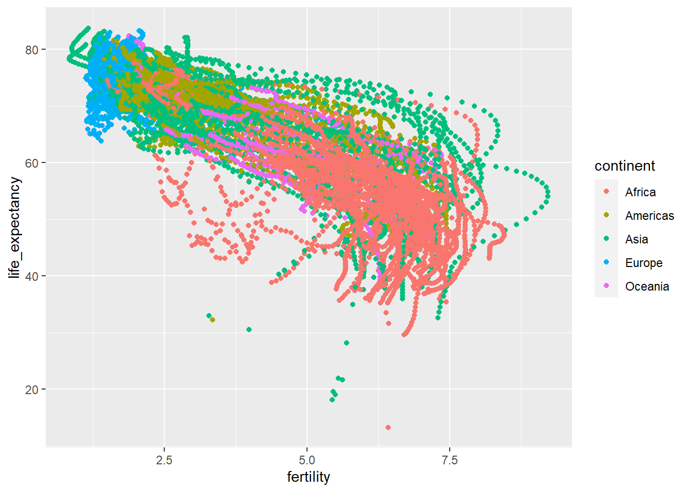

```r
## or combined with transparancy
gapminder %>% 
  ggplot(aes(x = fertility,
             y = life_expectancy)) +
  geom_point(aes(colour = continent), alpha = 0.1) +
  guides(colour = guide_legend(override.aes = list(alpha = 1)))
```

```
## Warning: Removed 187 rows containing missing values (geom_point).
```


#### C. Reduce the amount of data {-}
Only Africa, using `dplyr::filter()`. Here we use a different set of variables from the `gapminder` dataset to illustrate the options. Mind the log10 transformation in the second graph of this code chunk. What is striking about this figure?

```r
gapminder %>% 
  dplyr::filter(continent == "Africa") %>%
  ggplot(aes(x = year, y = population)) + 
  geom_point() +
  theme(axis.text.x = element_text(angle = 90, hjust = 1))
```

```
## Warning: Removed 51 rows containing missing values (geom_point).
```


```r
## using a colour for continent
gapminder %>% 
  dplyr::filter(continent == "Africa") %>%
  ggplot(aes(x = year, y = log10(population))) + ## why log10?
  geom_line(aes(group = country, 
                colour = country), 
            show.legend = FALSE, size = 1) +
  theme(axis.text.x = element_text(angle = 90, hjust = 1))
```

```
## Warning: Removed 51 row(s) containing missing values (geom_path).
```


### <mark>**EXERCISE 1; Make a plan**</mark> {-}

A) On the basis of the above picture: Create an EDA plan to investigate whether the population growth rate is different between Africa and Asia in general. How would you approach this? Create a step wise plan, describe the PPDAC cycle


B) How would you formally 'prove' that growth rates between Africa and Asia in general are the same or different? What statistical model do you think is appropriate. What are the underlying assumptions for your model(s)?


C) How would you, using the same strategy as under 1A) and 1B) subset the data for African countries that have deviating growth rate differences from the overall trend.


D) Can you create a plan to create a graph showing the general overall growth rate over the years for all continents in the `gapminder` dataset? What kind of data-wrangling operation is neccessary to create such a graph (what kind of summary of the data do you need and how would you group the data). Make a conceptual data table that shows the endproduct.

```r
## see above but for every continent, how would you keep all the models built for all countries together?
```

**Extend the filter to exclude more data** 

```r
names(gapminder)
```

```
## [1] "country"          "year"             "infant_mortality" "life_expectancy" 
## [5] "fertility"        "population"       "gdp"              "continent"       
## [9] "region"
```

```r
africa_high_life_exp <- gapminder %>% 
 dplyr::filter(continent == "Africa") %>%
 dplyr::filter(life_expectancy > 60 & fertility < 3) %>%
ggplot(aes(x = year,
             y = life_expectancy)) +
  geom_point(aes(colour = continent)) +
  guides(colour = guide_legend(
    override.aes = list(alpha = 1))) +        
  theme_bw() +
  facet_wrap(~ country) +
  theme(legend.position="none") +
  theme(axis.text.x = element_text(angle = 90, hjust = 1))

africa_high_life_exp
```


### <mark>**EXERCISE 2; Playing around with the aes() and other ggplot options**</mark> {-}

 - Try adjusting some of the arguments in the previous `ggplot2` call. 
For example, adjust the `alpha = ...` or change the variable in `x = ...`, `y = ...` or `colour = ...`
 - `names(gapminder)` gives you the variable names that you can change
 - Show and discuss the resulting plot with your neighbour
 - What do you think this part does: 
 
 `guides(colour = guide_legend(override.aes = list(alpha = 1)))`
 
 - Try to find out by disabling with `#`
 - Can you find the country that over time showed a very low life expectancy?
 - Play around with the `alpha = 1` setting.

Filter for two continents to see the difference

```
## Warning: Removed 90 rows containing missing values (geom_point).
```

 - What does the `aes()` part of the `geom_point()` do?
 - Compare the code below with the code above, can you spot the difference, what is the advantage of the code below? Run the code yourself to see it.

### D. Mapping a shape to a variable {-}

```r
## or e.g. show only two years and map a shape to continent
shape_plot <- gapminder %>% 
  dplyr::filter(continent == "Africa" | continent == "Europe",
         year == "1960" | year == "2010") %>%
  ggplot(aes(x = fertility,
             y = life_expectancy)) +
  geom_point(aes(colour = as_factor(as.character(year)), 
                 shape = continent), 
             alpha = 0.7) +
  theme_bw() +
  guides(colour = guide_legend(override.aes = list(alpha = 1)))
shape_plot
```


### <mark>**EXERCISE 3; Do it youself**</mark> {-}

 - Try removing the `as_factor(as.character(year))` call and replace this by only `year` above and rerun the plot, what happened?


### E. Facetting {-}

Create panels for 'categorical' or so-called 'factor' variables in R

```r
facets_plot <- gapminder %>% 
  dplyr::filter(continent == "Africa" | continent == "Europe",
         year == "1960" | year == "2010") %>%
  ggplot(aes(x = fertility,
             y = life_expectancy)) +
  geom_point(aes(colour = continent), alpha = 0.5) +
  facet_wrap(~ year) + 
  guides(colour = guide_legend(override.aes = list(alpha = 1)))

facets_plot
```

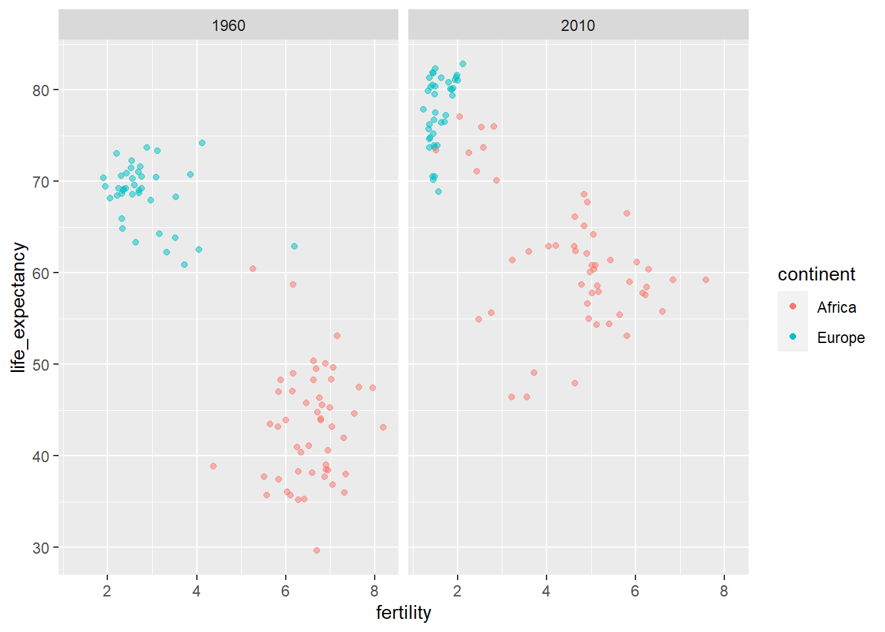

### F. Summarize the data {-}
Plotting `colour` to one variable, and `shape` to another

```r
library(ggrepel)

years <- c("1960", "1970", "1980", "1990", "2000", "2010")

summarize_plot <- gapminder %>% 
  dplyr::filter(year %in% years) %>%
  group_by(continent, year) %>%
  summarise(mean_life_expectancy = mean(life_expectancy),
            mean_fertility = mean(fertility)) %>%
  ggplot(aes(x = mean_fertility,
             y = mean_life_expectancy)) +
  geom_point(aes(colour = continent, shape = as_factor(year)), alpha = 0.7) +    guides(colour = guide_legend(override.aes = list(alpha = 1)))
```

```
## `summarise()` regrouping output by 'continent' (override with `.groups` argument)
```

```r
summarize_plot
```


Adding labels to the points with `{ggrepel}`
An alternative to using shape for the year.

```r
library(ggrepel)

years <- c("1960", "1970", "1980", "1990", "2000", "2010")

labels_plot <- gapminder %>% 
  dplyr::filter(year %in% years) %>%
  group_by(continent, year) %>%
  summarise(mean_life_expectancy = mean(life_expectancy),
            mean_fertility = mean(fertility)) %>%
  ggplot(aes(x = mean_fertility,
             y = mean_life_expectancy)) +
  geom_point(aes(colour = continent), alpha = 0.7) +
  geom_label_repel(aes(label=year), size = 2.5, box.padding = .5) +              guides(colour = guide_legend(override.aes = list(alpha = 1)))
```

```
## `summarise()` regrouping output by 'continent' (override with `.groups` argument)
```

```r
labels_plot
```


#### G. Displaying a model {-}  

```r
## Model
lm <- gapminder %>% lm(formula = life_expectancy ~ fertility)

correlation <- cor.test(x = gapminder$fertility, y = gapminder$life_expectancy, method = "pearson")

# save predictions of the model in the new data frame 
# together with variable you want to plot against
predicted_df <- data.frame(gapminder_pred = predict(lm, gapminder), 
                           fertility = gapminder$fertility)
```

Add model to plot

### <mark>**EXERCISE 4; Using a model in practice**</mark> {-}
Can you think of an application for such models?
Try to write pseudocode on how you would 
 
 1. Gather the data
 1. Pepare the data for modelling (wrangling)
 1. Preprocess the data (hold-out?)
 1. Build a model
 1. Use the model in practice to ...?


```r
model_plot <- gapminder %>% 
  ggplot(aes(x = fertility,
             y = life_expectancy)) +
  geom_point(alpha = 0.03) +
  geom_line(data = predicted_df, aes(x = fertility, 
                                     y = gapminder_pred),
            colour = "darkred", size = 1)

model_plot
```

```
## Warning: Removed 187 rows containing missing values (geom_point).
```

```
## Warning: Removed 187 row(s) containing missing values (geom_path).
```

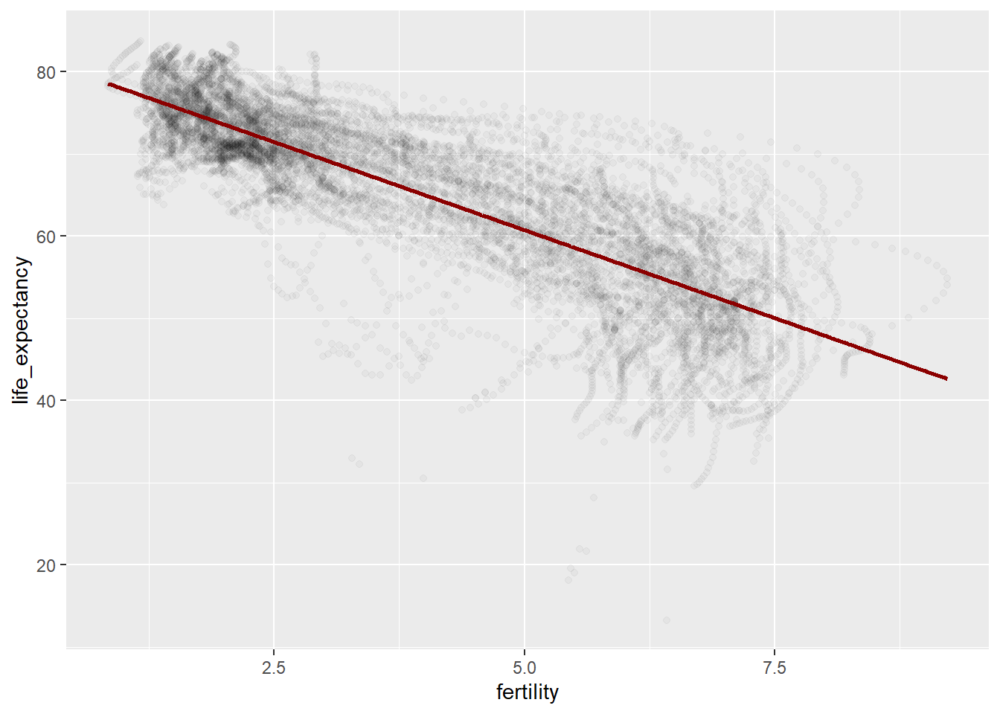

Plotting statistical parameters to the graph with the `{ggpubr}` package

```
## Warning: Removed 187 rows containing non-finite values (stat_cor).
```

```
## Warning: Removed 187 rows containing missing values (geom_point).
```

```
## Warning: Removed 187 row(s) containing missing values (geom_path).
```

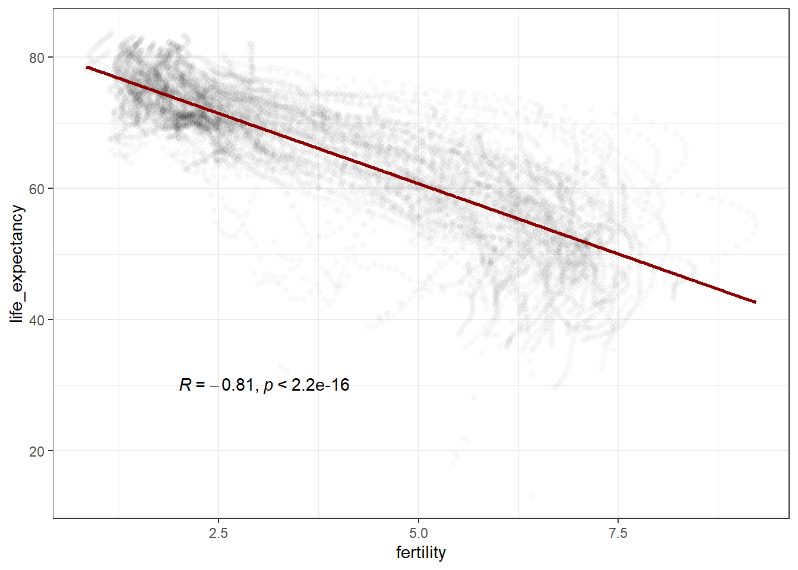

Using a smoother `geom_smooth` to display potential relationships

```r
gapminder %>% 
  ggplot(aes(x = fertility,
             y = life_expectancy)) +
  geom_point(alpha = 0.02) +
  geom_smooth(method = "lm") +
  stat_cor(method = "pearson", label.x = 2, label.y = 30) +
  theme_bw()
```

```
## `geom_smooth()` using formula 'y ~ x'
```

```
## Warning: Removed 187 rows containing non-finite values (stat_smooth).
```

```
## Warning: Removed 187 rows containing non-finite values (stat_cor).
```

```
## Warning: Removed 187 rows containing missing values (geom_point).
```


### <mark>**EXERCISE 5; recap - Discuss with your neighbour**</mark> {-}
Which tricks can we use to reduce the dimensionality of the plotted data (prevent overplotting)?

Try listing at least 6 methods:

## A case for history
Let's look at a relevant question and see of we can again go over the 
PPDAC cycle. From the gapminder animation we have learned that historic events can have a profound effect on life expectancy and income. Most countries show a gradual increase over time for their life expectancy and their income, but we already noticed strong differences between continent. Let's focus on Africa for the next investigation.

The central `PROBLEM` here:
Which African countires show strong fluctuations on their life expectancy and income and which show a gradual increase?

To answer this problem we need a `PLAN`. It seems a good idea to isolate the data for africa and somehow plot trends of life expectancy and income over time. Maybe we can reduce the dimensions by calculation of the product of life expectancy and income. Let's call this metric the `WelfareIndex`. We devide by 10000 to normalise and te get numbers that we can work with. 

$WelfareIndex = \frac{(LifeExpectancy * Income)} {1000}$

### <mark>**EXERCISE 6; DISCUSS: Which `DATA` are we going to use and how are we going to get it?**</mark> {-}

Now we are ready to get going:

#### Getting the right subset of the data
We are focusing on Africa, so it makes sense to subset the data (filter) for those cases that involve Africa. 


```r
africa <- gapminder %>%
  dplyr::filter(continent == "Africa")
```

#### Creating a new variable called `welfare_index`
For each year this index is calculated, we are removing one dimension by catching two variables in one.

```r
africa <- africa %>%
  mutate(welfare_index = (life_expectancy*gdp)/1000)
```

#### Let's make a plot to see if this new metric works out

```r
africa %>%
  ggplot(aes(x = year, y = welfare_index)) +
  geom_line(aes(group = country, colour = country), 
            show.legend = FALSE, size = 1) 
```

```
## Warning: Removed 637 row(s) containing missing values (geom_path).
```

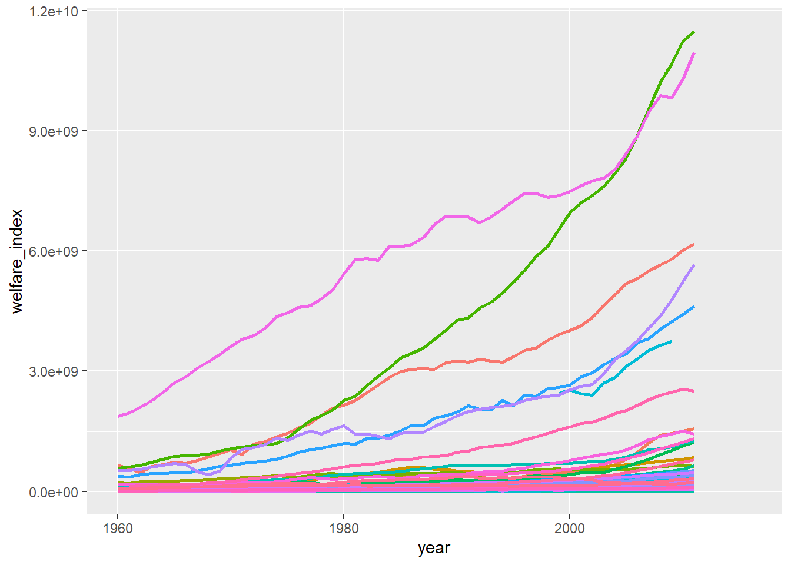

The countries at the bottom are a bit squished up. A transformation of the y-scale could help

```r
africa %>%
  ggplot(aes(x = year, y = log10(welfare_index))) +
  geom_line(aes(group = country, colour = country), 
            show.legend = FALSE, size = 1) 
```

```
## Warning: Removed 637 row(s) containing missing values (geom_path).
```


This yields an interesting view on the data: Most countries in Africa follow a comparable upwards trend for the `welfare_index` over time. There a a few exceptions. Think about how you would approach the problem of getting the data for those countries that show a deviating trend from the rest, without having to sift through many lines of data in an Excel file. 

## Mapping to continuous variables
So far we have been mapping colours and shapes to categorical variables. You can also map to continuous variables though.

```r
continuous <- gapminder %>%
  dplyr::filter(country == "Netherlands" | 
                country == "China" |
                country == "India") %>%
  dplyr::filter(year %in% years) %>%
  ggplot(aes(x = year,
         y = life_expectancy)) +
  geom_point(aes(size = population, colour = country)) +
  guides(colour = guide_legend(override.aes = list(alpha = 1))) +
  geom_line(aes(group = country, colour = country), size = 1) +
  theme_bw()
continuous
```


## Heatmaps

```r
gapminder$year %>% unique()
```

```
##  [1] 1960 1961 1962 1963 1964 1965 1966 1967 1968 1969 1970 1971 1972 1973 1974
## [16] 1975 1976 1977 1978 1979 1980 1981 1982 1983 1984 1985 1986 1987 1988 1989
## [31] 1990 1991 1992 1993 1994 1995 1996 1997 1998 1999 2000 2001 2002 2003 2004
## [46] 2005 2006 2007 2008 2009 2010 2011 2012 2013 2014 2015 2016
```

```r
gapminder %>%
  group_by(continent, country, year) %>%
  summarise(mean_pop = mean(population)) %>%
  ggplot(aes(x = year, y = country)) +
  geom_tile(aes(fill = mean_pop)) +
  toolboxr::rotate_axis_labels(axis = "x", angle = 90) +
  theme(axis.text.y= element_text(size = 5))
```

```
## `summarise()` regrouping output by 'continent', 'country' (override with `.groups` argument)
```


### <mark>**EXERCISE 7; Discuss with your neighbor, and write the R code to:**</mark> {-}

Try plotting the `infant_mortality` against the filtered years for the same countries as the code above (Netherlands, India, China), recycling some of the code above. Discuss the resulting graph in the light of the life_expectancy graph, what do you think about the the developments in China? 

Want to know more? see: https://www.ncbi.nlm.nih.gov/pmc/articles/PMC4331212/
Babxiarz, 2016

### <mark>**EXERCISE 8; Analyzing the code, line by line**</mark> {-}

Analyze the following code chunk: try running line by line to see what happens:

 - How many observations are we plotting here?
 - How many variables are we plotting?
 - Try adding or removing variables to the `group_by()` statement, what happens if you do?

#### Summarize per continent and sum population {-}

```r
population_plot <- gapminder %>% 
  dplyr::group_by(continent, year) %>%
  dplyr::filter(year %in% years) %>%
  summarise(sum_population = sum(population, na.rm = TRUE),
            mean_life_exp = mean(life_expectancy, na.rm = TRUE)) %>% 
  ggplot(aes(x = year, 
             y = log10(sum_population))) +
    geom_point(aes(colour = continent, 
                   size = mean_life_exp),
                   alpha = 0.5) +
    geom_line(aes(group = continent,
                  colour = continent)) +
    guides(colour = guide_legend(override.aes = list(alpha = 1)))
```

```
## `summarise()` regrouping output by 'continent' (override with `.groups` argument)
```

```r
population_plot
```


## Ranking data
Sometimes it can be helpful to rank data according a numeric variable if you are plotting numeric values to a categorical variable. Here I show you the gapminder countries in Europe, ranked for the log10 of their respective population sizes. Red dots indicate those countries with more than 1*10E6 (so 10 million) inhabitants

```r
over_10_million <- gapminder %>%
  dplyr::filter(
  continent == "Europe",
  year == 2010, 
  population >= 1e7)

ranking_plot <- gapminder %>%
  dplyr::filter(continent == "Europe",
                year == 2010) %>%
  ggplot(aes(x = reorder(as_factor(country), population),
             y = log10(population))) +
  geom_point() +
  ylab("log10(Population)") +
  xlab("Country") + 
  coord_flip() +
  geom_point(data = over_10_million, colour = "red")

ranking_plot
```


## Time series
We filter for "Americas" and "Oceania" and look at `life_expectancy` over the years.

```r
## without summarizing for countries
gapminder$continent %>% as_factor() %>% levels()
```

```
## [1] "Africa"   "Americas" "Asia"     "Europe"   "Oceania"
```

```r
gapminder %>% 
  dplyr::filter(continent == "Americas" | continent == "Oceania") %>%
  ggplot(aes(x = year,
             y = life_expectancy)) +
  geom_line(aes(group = continent,
                colour = continent))
```


### <mark>**EXERCISE 9; Obviously something went wrong here. Please, discuss with (your neighbour) what you think happened or needs to be done to fix this (without looking ahead ;-) )**</mark> {-}

### Grouping
We can see what happened if we plot individual datapoints

```r
gapminder %>% 
  dplyr::filter(continent == "Americas" | continent == "Oceania") %>%
  ggplot(aes(x = year,
             y = life_expectancy)) +
  geom_point(aes(colour = country)) +
  theme(legend.position="none") +
  facet_wrap( ~ continent) +
  theme(legend.position="none") 
```


### Summarizing time series data {-}
What happened in 1999/2010? The dat shows a dip.

```r
gapminder$continent %>% as_factor() %>% levels()
```

```
## [1] "Africa"   "Americas" "Asia"     "Europe"   "Oceania"
```

```r
gapminder %>% 
  dplyr::filter(continent == "Americas" | continent == "Oceania") %>%
  group_by(continent, year) %>%
  summarise(mean_life_expectancy = mean(life_expectancy)) %>%
  ggplot(aes(x = year,
             y = mean_life_expectancy)) +
  geom_line(aes(group = continent,
                colour = continent), size = 3) +
  theme(axis.text.x = element_text(angle = 90, hjust = 1))
```

```
## `summarise()` regrouping output by 'continent' (override with `.groups` argument)
```


## One more option: categorical values and "jitter"
Sometimes you have overlapping plots and adding transparency with `alpha()` or mapping colour to underlying categorical values is not working because there are simple to many points overlapping

Let's look at an example

```r
gapminder %>% 
  dplyr::filter(continent == "Americas" |
                continent == "Africa") %>%
  group_by(continent) %>%
  dplyr::filter(year %in% years) %>%
  ggplot(aes(x = year,
             y = infant_mortality)) +
  geom_point(aes(colour = country)) +
  theme(legend.position="none")
```

```
## Warning: Removed 45 rows containing missing values (geom_point).
```

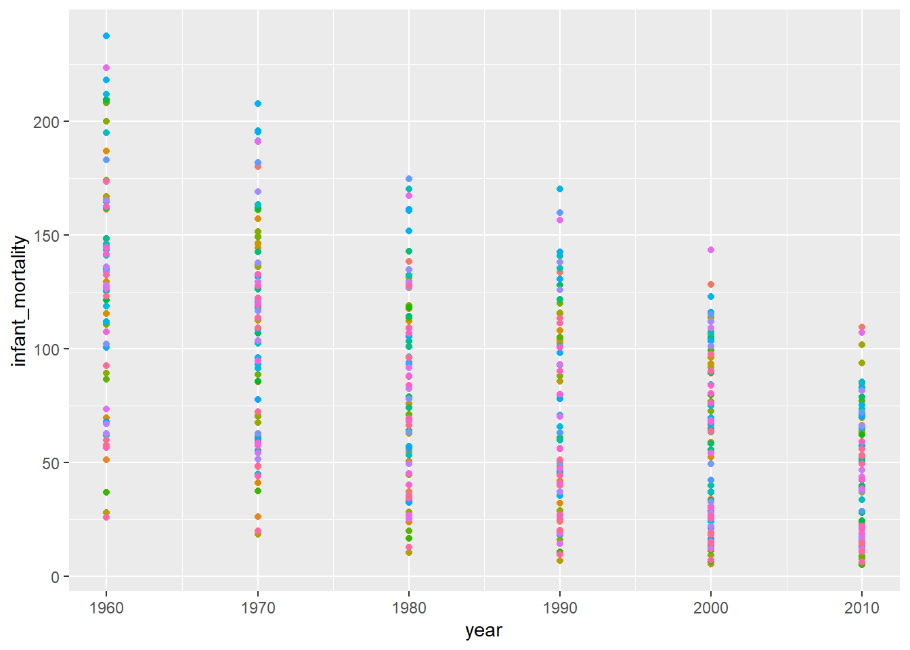

In such cases it can be helpfull to add some noise to the points (`position = "jitter"`) to reduce overlapping. This can be a powerfull approach, especially when combined with setting `alpha()`

```r
gapminder %>% 
  dplyr::filter(continent == "Americas" |
                continent == "Africa") %>%
  dplyr::filter(year %in% years) %>%
    group_by(continent) %>%
  ggplot(aes(x = year,
             y = infant_mortality)) +
  geom_point(aes(colour = continent), position = "jitter") 
```

```
## Warning: Removed 45 rows containing missing values (geom_point).
```


### {-} Adding summary data to an existing plot
Now that we have the mean infant mortality for each year for the two continents, let's add that data to the previous dot plot where we used jitter

```r
mean_inf_mort <- gapminder %>% 
  dplyr::filter(continent == "Americas" |
                continent == "Africa") %>%
  dplyr::filter(year %in% years) %>%
  group_by(continent, year) %>%
  summarise(mean_infant_mortality = mean(infant_mortality, na.rm = TRUE))
```

```
## `summarise()` regrouping output by 'continent' (override with `.groups` argument)
```

```r
gapminder %>% 
  dplyr::filter(continent == "Americas" |
                continent == "Africa") %>%
  dplyr::filter(year %in% years) %>%
    group_by(continent) %>%
  ggplot(aes(x = year,
             y = infant_mortality)) +
  geom_point(aes(colour = continent), position = "jitter") +

## summary data added to previous 
  geom_line(data = mean_inf_mort, aes(x = year, 
                                      y = mean_infant_mortality, 
                                      colour = continent),  size = 2)
```

```
## Warning: Removed 45 rows containing missing values (geom_point).
```


### Interactive visualizations {-}
In the figure above we can observe a number of countries in 'Americas' continent that have a child mortality that are above the average (over the years) of 'Africa'. Which countries are this?


```r
library(ggiraph)

gapminder$country <- 
  str_replace_all(string = gapminder$country, 
                pattern = "'", 
                replacement = "_")


interactive_inf_mort <- gapminder %>% 
  dplyr::filter(continent == "Americas" |
                continent == "Africa") %>%
  dplyr::filter(year %in% years) %>%
    group_by(region, country) %>%
  ggplot(aes(x = year,
             y = infant_mortality)) +
  
  geom_point_interactive(aes(tooltip = country, colour = region), position = "jitter") +
  
#  geom_point(aes(colour = continent), position = "jitter") +

## summary data added to previous 
 geom_line(data = mean_inf_mort, aes(x = year, 
                                      y = mean_infant_mortality, 
                                      colour = continent, group = continent),  size = 2
            )

interactive_inf_mort
```

```
## Warning: Removed 45 rows containing missing values (geom_interactive_point).
```

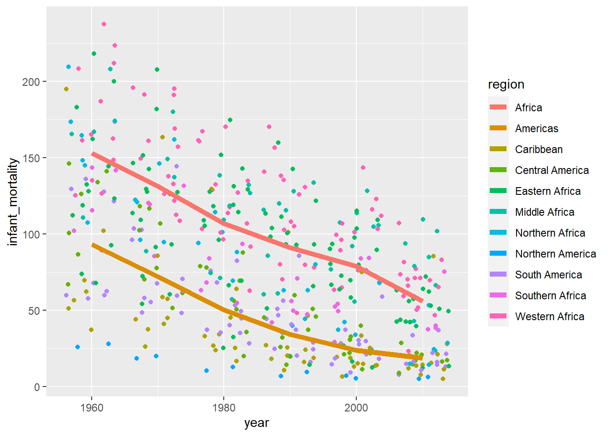

```r
gapminder$country %>% as_factor() %>% levels()
```

```
##   [1] "Albania"                        "Algeria"                       
##   [3] "Angola"                         "Antigua and Barbuda"           
##   [5] "Argentina"                      "Armenia"                       
##   [7] "Aruba"                          "Australia"                     
##   [9] "Austria"                        "Azerbaijan"                    
##  [11] "Bahamas"                        "Bahrain"                       
##  [13] "Bangladesh"                     "Barbados"                      
##  [15] "Belarus"                        "Belgium"                       
##  [17] "Belize"                         "Benin"                         
##  [19] "Bhutan"                         "Bolivia"                       
##  [21] "Bosnia and Herzegovina"         "Botswana"                      
##  [23] "Brazil"                         "Brunei"                        
##  [25] "Bulgaria"                       "Burkina Faso"                  
##  [27] "Burundi"                        "Cambodia"                      
##  [29] "Cameroon"                       "Canada"                        
##  [31] "Cape Verde"                     "Central African Republic"      
##  [33] "Chad"                           "Chile"                         
##  [35] "China"                          "Colombia"                      
##  [37] "Comoros"                        "Congo, Dem. Rep."              
##  [39] "Congo, Rep."                    "Costa Rica"                    
##  [41] "Cote d_Ivoire"                  "Croatia"                       
##  [43] "Cuba"                           "Cyprus"                        
##  [45] "Czech Republic"                 "Denmark"                       
##  [47] "Djibouti"                       "Dominican Republic"            
##  [49] "Ecuador"                        "Egypt"                         
##  [51] "El Salvador"                    "Equatorial Guinea"             
##  [53] "Eritrea"                        "Estonia"                       
##  [55] "Ethiopia"                       "Fiji"                          
##  [57] "Finland"                        "France"                        
##  [59] "French Polynesia"               "Gabon"                         
##  [61] "Gambia"                         "Georgia"                       
##  [63] "Germany"                        "Ghana"                         
##  [65] "Greece"                         "Greenland"                     
##  [67] "Grenada"                        "Guatemala"                     
##  [69] "Guinea"                         "Guinea-Bissau"                 
##  [71] "Guyana"                         "Haiti"                         
##  [73] "Honduras"                       "Hong Kong, China"              
##  [75] "Hungary"                        "Iceland"                       
##  [77] "India"                          "Indonesia"                     
##  [79] "Iran"                           "Iraq"                          
##  [81] "Ireland"                        "Israel"                        
##  [83] "Italy"                          "Jamaica"                       
##  [85] "Japan"                          "Jordan"                        
##  [87] "Kazakhstan"                     "Kenya"                         
##  [89] "Kiribati"                       "South Korea"                   
##  [91] "Kuwait"                         "Kyrgyz Republic"               
##  [93] "Lao"                            "Latvia"                        
##  [95] "Lebanon"                        "Lesotho"                       
##  [97] "Liberia"                        "Libya"                         
##  [99] "Lithuania"                      "Luxembourg"                    
## [101] "Macao, China"                   "Macedonia, FYR"                
## [103] "Madagascar"                     "Malawi"                        
## [105] "Malaysia"                       "Maldives"                      
## [107] "Mali"                           "Malta"                         
## [109] "Mauritania"                     "Mauritius"                     
## [111] "Mexico"                         "Micronesia, Fed. Sts."         
## [113] "Moldova"                        "Mongolia"                      
## [115] "Montenegro"                     "Morocco"                       
## [117] "Mozambique"                     "Namibia"                       
## [119] "Nepal"                          "Netherlands"                   
## [121] "New Caledonia"                  "New Zealand"                   
## [123] "Nicaragua"                      "Niger"                         
## [125] "Nigeria"                        "Norway"                        
## [127] "Oman"                           "Pakistan"                      
## [129] "Panama"                         "Papua New Guinea"              
## [131] "Paraguay"                       "Peru"                          
## [133] "Philippines"                    "Poland"                        
## [135] "Portugal"                       "Puerto Rico"                   
## [137] "Qatar"                          "Romania"                       
## [139] "Russia"                         "Rwanda"                        
## [141] "St. Lucia"                      "St. Vincent and the Grenadines"
## [143] "Samoa"                          "Saudi Arabia"                  
## [145] "Senegal"                        "Serbia"                        
## [147] "Seychelles"                     "Sierra Leone"                  
## [149] "Singapore"                      "Slovak Republic"               
## [151] "Slovenia"                       "Solomon Islands"               
## [153] "South Africa"                   "Spain"                         
## [155] "Sri Lanka"                      "Sudan"                         
## [157] "Suriname"                       "Swaziland"                     
## [159] "Sweden"                         "Switzerland"                   
## [161] "Syria"                          "Tajikistan"                    
## [163] "Tanzania"                       "Thailand"                      
## [165] "Timor-Leste"                    "Togo"                          
## [167] "Tonga"                          "Trinidad and Tobago"           
## [169] "Tunisia"                        "Turkey"                        
## [171] "Turkmenistan"                   "Uganda"                        
## [173] "Ukraine"                        "United Arab Emirates"          
## [175] "United Kingdom"                 "United States"                 
## [177] "Uruguay"                        "Uzbekistan"                    
## [179] "Vanuatu"                        "Venezuela"                     
## [181] "West Bank and Gaza"             "Vietnam"                       
## [183] "Yemen"                          "Zambia"                        
## [185] "Zimbabwe"
```

```r
ggiraph(ggobj = interactive_inf_mort)
```

```
## Warning: Removed 45 rows containing missing values (geom_interactive_point).
```

<!--html_preserve--><div id="htmlwidget-8ea0b316f1003e973a1d" style="width:672px;height:480px;" class="girafe html-widget"></div>
<script type="application/json" data-for="htmlwidget-8ea0b316f1003e973a1d">{"x":{"html":"<?xml version=\"1.0\" encoding=\"UTF-8\"?>\n<svg xmlns='http://www.w3.org/2000/svg' xmlns:xlink='http://www.w3.org/1999/xlink' id='svg_8c1bef1a-656f-46ac-94b1-e4564b434654' viewBox='0 0 432.00 360.00'>\n  <g>\n    <defs>\n      <clipPath id='svg_8c1bef1a-656f-46ac-94b1-e4564b434654_cl_1'>\n        <rect x='0.00' y='0.00' width='432.00' height='360.00'/>\n      <\/clipPath>\n    <\/defs>\n    <rect x='0.00' y='0.00' width='432.00' height='360.00' id='svg_8c1bef1a-656f-46ac-94b1-e4564b434654_el_1' clip-path='url(#svg_8c1bef1a-656f-46ac-94b1-e4564b434654_cl_1)' fill='#FFFFFF' fill-opacity='1' stroke='#FFFFFF' stroke-opacity='1' stroke-width='0.75' stroke-linejoin='round' stroke-linecap='round'/>\n    <defs>\n      <clipPath id='svg_8c1bef1a-656f-46ac-94b1-e4564b434654_cl_2'>\n        <rect x='0.00' y='0.00' width='432.00' height='360.00'/>\n      <\/clipPath>\n    <\/defs>\n    <rect x='0.00' y='0.00' width='432.00' height='360.00' id='svg_8c1bef1a-656f-46ac-94b1-e4564b434654_el_2' clip-path='url(#svg_8c1bef1a-656f-46ac-94b1-e4564b434654_cl_2)' fill='#FFFFFF' fill-opacity='1' stroke='#FFFFFF' stroke-opacity='1' stroke-width='1.07' stroke-linejoin='round' stroke-linecap='round'/>\n    <defs>\n      <clipPath id='svg_8c1bef1a-656f-46ac-94b1-e4564b434654_cl_3'>\n        <rect x='38.02' y='5.48' width='274.86' height='323.03'/>\n      <\/clipPath>\n    <\/defs>\n    <rect x='38.02' y='5.48' width='274.86' height='323.03' id='svg_8c1bef1a-656f-46ac-94b1-e4564b434654_el_3' clip-path='url(#svg_8c1bef1a-656f-46ac-94b1-e4564b434654_cl_3)' fill='#EBEBEB' fill-opacity='1' stroke='none'/>\n    <polyline points='38.02,288.44 312.89,288.44' id='svg_8c1bef1a-656f-46ac-94b1-e4564b434654_el_4' clip-path='url(#svg_8c1bef1a-656f-46ac-94b1-e4564b434654_cl_3)' fill='none' stroke='#FFFFFF' stroke-opacity='1' stroke-width='0.53' stroke-linejoin='round' stroke-linecap='butt'/>\n    <polyline points='38.02,225.29 312.89,225.29' id='svg_8c1bef1a-656f-46ac-94b1-e4564b434654_el_5' clip-path='url(#svg_8c1bef1a-656f-46ac-94b1-e4564b434654_cl_3)' fill='none' stroke='#FFFFFF' stroke-opacity='1' stroke-width='0.53' stroke-linejoin='round' stroke-linecap='butt'/>\n    <polyline points='38.02,162.13 312.89,162.13' id='svg_8c1bef1a-656f-46ac-94b1-e4564b434654_el_6' clip-path='url(#svg_8c1bef1a-656f-46ac-94b1-e4564b434654_cl_3)' fill='none' stroke='#FFFFFF' stroke-opacity='1' stroke-width='0.53' stroke-linejoin='round' stroke-linecap='butt'/>\n    <polyline points='38.02,98.98 312.89,98.98' id='svg_8c1bef1a-656f-46ac-94b1-e4564b434654_el_7' clip-path='url(#svg_8c1bef1a-656f-46ac-94b1-e4564b434654_cl_3)' fill='none' stroke='#FFFFFF' stroke-opacity='1' stroke-width='0.53' stroke-linejoin='round' stroke-linecap='butt'/>\n    <polyline points='38.02,35.82 312.89,35.82' id='svg_8c1bef1a-656f-46ac-94b1-e4564b434654_el_8' clip-path='url(#svg_8c1bef1a-656f-46ac-94b1-e4564b434654_cl_3)' fill='none' stroke='#FFFFFF' stroke-opacity='1' stroke-width='0.53' stroke-linejoin='round' stroke-linecap='butt'/>\n    <polyline points='110.00,328.51 110.00,5.48' id='svg_8c1bef1a-656f-46ac-94b1-e4564b434654_el_9' clip-path='url(#svg_8c1bef1a-656f-46ac-94b1-e4564b434654_cl_3)' fill='none' stroke='#FFFFFF' stroke-opacity='1' stroke-width='0.53' stroke-linejoin='round' stroke-linecap='butt'/>\n    <polyline points='196.72,328.51 196.72,5.48' id='svg_8c1bef1a-656f-46ac-94b1-e4564b434654_el_10' clip-path='url(#svg_8c1bef1a-656f-46ac-94b1-e4564b434654_cl_3)' fill='none' stroke='#FFFFFF' stroke-opacity='1' stroke-width='0.53' stroke-linejoin='round' stroke-linecap='butt'/>\n    <polyline points='283.43,328.51 283.43,5.48' id='svg_8c1bef1a-656f-46ac-94b1-e4564b434654_el_11' clip-path='url(#svg_8c1bef1a-656f-46ac-94b1-e4564b434654_cl_3)' fill='none' stroke='#FFFFFF' stroke-opacity='1' stroke-width='0.53' stroke-linejoin='round' stroke-linecap='butt'/>\n    <polyline points='38.02,320.02 312.89,320.02' id='svg_8c1bef1a-656f-46ac-94b1-e4564b434654_el_12' clip-path='url(#svg_8c1bef1a-656f-46ac-94b1-e4564b434654_cl_3)' fill='none' stroke='#FFFFFF' stroke-opacity='1' stroke-width='1.07' stroke-linejoin='round' stroke-linecap='butt'/>\n    <polyline points='38.02,256.86 312.89,256.86' id='svg_8c1bef1a-656f-46ac-94b1-e4564b434654_el_13' clip-path='url(#svg_8c1bef1a-656f-46ac-94b1-e4564b434654_cl_3)' fill='none' stroke='#FFFFFF' stroke-opacity='1' stroke-width='1.07' stroke-linejoin='round' stroke-linecap='butt'/>\n    <polyline points='38.02,193.71 312.89,193.71' id='svg_8c1bef1a-656f-46ac-94b1-e4564b434654_el_14' clip-path='url(#svg_8c1bef1a-656f-46ac-94b1-e4564b434654_cl_3)' fill='none' stroke='#FFFFFF' stroke-opacity='1' stroke-width='1.07' stroke-linejoin='round' stroke-linecap='butt'/>\n    <polyline points='38.02,130.55 312.89,130.55' id='svg_8c1bef1a-656f-46ac-94b1-e4564b434654_el_15' clip-path='url(#svg_8c1bef1a-656f-46ac-94b1-e4564b434654_cl_3)' fill='none' stroke='#FFFFFF' stroke-opacity='1' stroke-width='1.07' stroke-linejoin='round' stroke-linecap='butt'/>\n    <polyline points='38.02,67.40 312.89,67.40' id='svg_8c1bef1a-656f-46ac-94b1-e4564b434654_el_16' clip-path='url(#svg_8c1bef1a-656f-46ac-94b1-e4564b434654_cl_3)' fill='none' stroke='#FFFFFF' stroke-opacity='1' stroke-width='1.07' stroke-linejoin='round' stroke-linecap='butt'/>\n    <polyline points='66.65,328.51 66.65,5.48' id='svg_8c1bef1a-656f-46ac-94b1-e4564b434654_el_17' clip-path='url(#svg_8c1bef1a-656f-46ac-94b1-e4564b434654_cl_3)' fill='none' stroke='#FFFFFF' stroke-opacity='1' stroke-width='1.07' stroke-linejoin='round' stroke-linecap='butt'/>\n    <polyline points='153.36,328.51 153.36,5.48' id='svg_8c1bef1a-656f-46ac-94b1-e4564b434654_el_18' clip-path='url(#svg_8c1bef1a-656f-46ac-94b1-e4564b434654_cl_3)' fill='none' stroke='#FFFFFF' stroke-opacity='1' stroke-width='1.07' stroke-linejoin='round' stroke-linecap='butt'/>\n    <polyline points='240.07,328.51 240.07,5.48' id='svg_8c1bef1a-656f-46ac-94b1-e4564b434654_el_19' clip-path='url(#svg_8c1bef1a-656f-46ac-94b1-e4564b434654_cl_3)' fill='none' stroke='#FFFFFF' stroke-opacity='1' stroke-width='1.07' stroke-linejoin='round' stroke-linecap='butt'/>\n    <circle cx='69.02' cy='132.82' r='1.47pt' id='svg_8c1bef1a-656f-46ac-94b1-e4564b434654_el_20' clip-path='url(#svg_8c1bef1a-656f-46ac-94b1-e4564b434654_cl_3)' fill='#00BADE' fill-opacity='1' stroke='#00BADE' stroke-opacity='1' stroke-width='0.71' stroke-linejoin='round' stroke-linecap='round' title='Algeria'/>\n    <circle cx='81.34' cy='57.30' r='1.47pt' id='svg_8c1bef1a-656f-46ac-94b1-e4564b434654_el_21' clip-path='url(#svg_8c1bef1a-656f-46ac-94b1-e4564b434654_cl_3)' fill='#00C1A7' fill-opacity='1' stroke='#00C1A7' stroke-opacity='1' stroke-width='0.71' stroke-linejoin='round' stroke-linecap='round' title='Angola'/>\n    <circle cx='82.58' cy='244.41' r='1.47pt' id='svg_8c1bef1a-656f-46ac-94b1-e4564b434654_el_22' clip-path='url(#svg_8c1bef1a-656f-46ac-94b1-e4564b434654_cl_3)' fill='#B385FF' fill-opacity='1' stroke='#B385FF' stroke-opacity='1' stroke-width='0.71' stroke-linejoin='round' stroke-linecap='round' title='Argentina'/>\n    <circle cx='53.72' cy='255.61' r='1.47pt' id='svg_8c1bef1a-656f-46ac-94b1-e4564b434654_el_23' clip-path='url(#svg_8c1bef1a-656f-46ac-94b1-e4564b434654_cl_3)' fill='#AEA200' fill-opacity='1' stroke='#AEA200' stroke-opacity='1' stroke-width='0.71' stroke-linejoin='round' stroke-linecap='round' title='Bahamas'/>\n    <circle cx='79.50' cy='232.24' r='1.47pt' id='svg_8c1bef1a-656f-46ac-94b1-e4564b434654_el_24' clip-path='url(#svg_8c1bef1a-656f-46ac-94b1-e4564b434654_cl_3)' fill='#AEA200' fill-opacity='1' stroke='#AEA200' stroke-opacity='1' stroke-width='0.71' stroke-linejoin='round' stroke-linecap='round' title='Barbados'/>\n    <circle cx='56.89' cy='83.93' r='1.47pt' id='svg_8c1bef1a-656f-46ac-94b1-e4564b434654_el_25' clip-path='url(#svg_8c1bef1a-656f-46ac-94b1-e4564b434654_cl_3)' fill='#FF63B6' fill-opacity='1' stroke='#FF63B6' stroke-opacity='1' stroke-width='0.71' stroke-linejoin='round' stroke-linecap='round' title='Benin'/>\n    <circle cx='69.22' cy='100.99' r='1.47pt' id='svg_8c1bef1a-656f-46ac-94b1-e4564b434654_el_26' clip-path='url(#svg_8c1bef1a-656f-46ac-94b1-e4564b434654_cl_3)' fill='#B385FF' fill-opacity='1' stroke='#B385FF' stroke-opacity='1' stroke-width='0.71' stroke-linejoin='round' stroke-linecap='round' title='Bolivia'/>\n    <circle cx='57.20' cy='174.12' r='1.47pt' id='svg_8c1bef1a-656f-46ac-94b1-e4564b434654_el_27' clip-path='url(#svg_8c1bef1a-656f-46ac-94b1-e4564b434654_cl_3)' fill='#EF67EB' fill-opacity='1' stroke='#EF67EB' stroke-opacity='1' stroke-width='0.71' stroke-linejoin='round' stroke-linecap='round' title='Botswana'/>\n    <circle cx='55.97' cy='156.57' r='1.47pt' id='svg_8c1bef1a-656f-46ac-94b1-e4564b434654_el_28' clip-path='url(#svg_8c1bef1a-656f-46ac-94b1-e4564b434654_cl_3)' fill='#B385FF' fill-opacity='1' stroke='#B385FF' stroke-opacity='1' stroke-width='0.71' stroke-linejoin='round' stroke-linecap='round' title='Brazil'/>\n    <circle cx='80.77' cy='116.28' r='1.47pt' id='svg_8c1bef1a-656f-46ac-94b1-e4564b434654_el_29' clip-path='url(#svg_8c1bef1a-656f-46ac-94b1-e4564b434654_cl_3)' fill='#FF63B6' fill-opacity='1' stroke='#FF63B6' stroke-opacity='1' stroke-width='0.71' stroke-linejoin='round' stroke-linecap='round' title='Burkina Faso'/>\n    <circle cx='80.96' cy='136.75' r='1.47pt' id='svg_8c1bef1a-656f-46ac-94b1-e4564b434654_el_30' clip-path='url(#svg_8c1bef1a-656f-46ac-94b1-e4564b434654_cl_3)' fill='#00BD5C' fill-opacity='1' stroke='#00BD5C' stroke-opacity='1' stroke-width='0.71' stroke-linejoin='round' stroke-linecap='round' title='Burundi'/>\n    <circle cx='61.97' cy='109.20' r='1.47pt' id='svg_8c1bef1a-656f-46ac-94b1-e4564b434654_el_31' clip-path='url(#svg_8c1bef1a-656f-46ac-94b1-e4564b434654_cl_3)' fill='#00C1A7' fill-opacity='1' stroke='#00C1A7' stroke-opacity='1' stroke-width='0.71' stroke-linejoin='round' stroke-linecap='round' title='Cameroon'/>\n    <circle cx='64.71' cy='284.89' r='1.47pt' id='svg_8c1bef1a-656f-46ac-94b1-e4564b434654_el_32' clip-path='url(#svg_8c1bef1a-656f-46ac-94b1-e4564b434654_cl_3)' fill='#00A6FF' fill-opacity='1' stroke='#00A6FF' stroke-opacity='1' stroke-width='0.71' stroke-linejoin='round' stroke-linecap='round' title='Canada'/>\n    <circle cx='82.34' cy='110.99' r='1.47pt' id='svg_8c1bef1a-656f-46ac-94b1-e4564b434654_el_33' clip-path='url(#svg_8c1bef1a-656f-46ac-94b1-e4564b434654_cl_3)' fill='#00C1A7' fill-opacity='1' stroke='#00C1A7' stroke-opacity='1' stroke-width='0.71' stroke-linejoin='round' stroke-linecap='round' title='Central African Republic'/>\n    <circle cx='64.20' cy='158.83' r='1.47pt' id='svg_8c1bef1a-656f-46ac-94b1-e4564b434654_el_34' clip-path='url(#svg_8c1bef1a-656f-46ac-94b1-e4564b434654_cl_3)' fill='#B385FF' fill-opacity='1' stroke='#B385FF' stroke-opacity='1' stroke-width='0.71' stroke-linejoin='round' stroke-linecap='round' title='Chile'/>\n    <circle cx='50.52' cy='207.24' r='1.47pt' id='svg_8c1bef1a-656f-46ac-94b1-e4564b434654_el_35' clip-path='url(#svg_8c1bef1a-656f-46ac-94b1-e4564b434654_cl_3)' fill='#B385FF' fill-opacity='1' stroke='#B385FF' stroke-opacity='1' stroke-width='0.71' stroke-linejoin='round' stroke-linecap='round' title='Colombia'/>\n    <circle cx='61.67' cy='67.39' r='1.47pt' id='svg_8c1bef1a-656f-46ac-94b1-e4564b434654_el_36' clip-path='url(#svg_8c1bef1a-656f-46ac-94b1-e4564b434654_cl_3)' fill='#00BD5C' fill-opacity='1' stroke='#00BD5C' stroke-opacity='1' stroke-width='0.71' stroke-linejoin='round' stroke-linecap='round' title='Comoros'/>\n    <circle cx='63.03' cy='100.23' r='1.47pt' id='svg_8c1bef1a-656f-46ac-94b1-e4564b434654_el_37' clip-path='url(#svg_8c1bef1a-656f-46ac-94b1-e4564b434654_cl_3)' fill='#00C1A7' fill-opacity='1' stroke='#00C1A7' stroke-opacity='1' stroke-width='0.71' stroke-linejoin='round' stroke-linecap='round' title='Congo, Dem. Rep.'/>\n    <circle cx='61.86' cy='180.31' r='1.47pt' id='svg_8c1bef1a-656f-46ac-94b1-e4564b434654_el_38' clip-path='url(#svg_8c1bef1a-656f-46ac-94b1-e4564b434654_cl_3)' fill='#00C1A7' fill-opacity='1' stroke='#00C1A7' stroke-opacity='1' stroke-width='0.71' stroke-linejoin='round' stroke-linecap='round' title='Congo, Rep.'/>\n    <circle cx='54.76' cy='210.72' r='1.47pt' id='svg_8c1bef1a-656f-46ac-94b1-e4564b434654_el_39' clip-path='url(#svg_8c1bef1a-656f-46ac-94b1-e4564b434654_cl_3)' fill='#64B200' fill-opacity='1' stroke='#64B200' stroke-opacity='1' stroke-width='0.71' stroke-linejoin='round' stroke-linecap='round' title='Costa Rica'/>\n    <circle cx='81.20' cy='56.79' r='1.47pt' id='svg_8c1bef1a-656f-46ac-94b1-e4564b434654_el_40' clip-path='url(#svg_8c1bef1a-656f-46ac-94b1-e4564b434654_cl_3)' fill='#FF63B6' fill-opacity='1' stroke='#FF63B6' stroke-opacity='1' stroke-width='0.71' stroke-linejoin='round' stroke-linecap='round' title='Cote d_Ivoire'/>\n    <circle cx='82.65' cy='273.29' r='1.47pt' id='svg_8c1bef1a-656f-46ac-94b1-e4564b434654_el_41' clip-path='url(#svg_8c1bef1a-656f-46ac-94b1-e4564b434654_cl_3)' fill='#AEA200' fill-opacity='1' stroke='#AEA200' stroke-opacity='1' stroke-width='0.71' stroke-linejoin='round' stroke-linecap='round' title='Cuba'/>\n    <circle cx='79.49' cy='191.04' r='1.47pt' id='svg_8c1bef1a-656f-46ac-94b1-e4564b434654_el_42' clip-path='url(#svg_8c1bef1a-656f-46ac-94b1-e4564b434654_cl_3)' fill='#AEA200' fill-opacity='1' stroke='#AEA200' stroke-opacity='1' stroke-width='0.71' stroke-linejoin='round' stroke-linecap='round' title='Dominican Republic'/>\n    <circle cx='67.40' cy='166.67' r='1.47pt' id='svg_8c1bef1a-656f-46ac-94b1-e4564b434654_el_43' clip-path='url(#svg_8c1bef1a-656f-46ac-94b1-e4564b434654_cl_3)' fill='#B385FF' fill-opacity='1' stroke='#B385FF' stroke-opacity='1' stroke-width='0.71' stroke-linejoin='round' stroke-linecap='round' title='Ecuador'/>\n    <circle cx='58.79' cy='55.26' r='1.47pt' id='svg_8c1bef1a-656f-46ac-94b1-e4564b434654_el_44' clip-path='url(#svg_8c1bef1a-656f-46ac-94b1-e4564b434654_cl_3)' fill='#00BADE' fill-opacity='1' stroke='#00BADE' stroke-opacity='1' stroke-width='0.71' stroke-linejoin='round' stroke-linecap='round' title='Egypt'/>\n    <circle cx='66.65' cy='160.62' r='1.47pt' id='svg_8c1bef1a-656f-46ac-94b1-e4564b434654_el_45' clip-path='url(#svg_8c1bef1a-656f-46ac-94b1-e4564b434654_cl_3)' fill='#64B200' fill-opacity='1' stroke='#64B200' stroke-opacity='1' stroke-width='0.71' stroke-linejoin='round' stroke-linecap='round' title='El Salvador'/>\n    <circle cx='73.33' cy='115.40' r='1.47pt' id='svg_8c1bef1a-656f-46ac-94b1-e4564b434654_el_46' clip-path='url(#svg_8c1bef1a-656f-46ac-94b1-e4564b434654_cl_3)' fill='#00BD5C' fill-opacity='1' stroke='#00BD5C' stroke-opacity='1' stroke-width='0.71' stroke-linejoin='round' stroke-linecap='round' title='Ethiopia'/>\n    <circle cx='70.58' cy='132.57' r='1.47pt' id='svg_8c1bef1a-656f-46ac-94b1-e4564b434654_el_47' clip-path='url(#svg_8c1bef1a-656f-46ac-94b1-e4564b434654_cl_3)' fill='#FF63B6' fill-opacity='1' stroke='#FF63B6' stroke-opacity='1' stroke-width='0.71' stroke-linejoin='round' stroke-linecap='round' title='Gambia'/>\n    <circle cx='72.73' cy='162.00' r='1.47pt' id='svg_8c1bef1a-656f-46ac-94b1-e4564b434654_el_48' clip-path='url(#svg_8c1bef1a-656f-46ac-94b1-e4564b434654_cl_3)' fill='#FF63B6' fill-opacity='1' stroke='#FF63B6' stroke-opacity='1' stroke-width='0.71' stroke-linejoin='round' stroke-linecap='round' title='Ghana'/>\n    <circle cx='70.96' cy='135.60' r='1.47pt' id='svg_8c1bef1a-656f-46ac-94b1-e4564b434654_el_49' clip-path='url(#svg_8c1bef1a-656f-46ac-94b1-e4564b434654_cl_3)' fill='#64B200' fill-opacity='1' stroke='#64B200' stroke-opacity='1' stroke-width='0.71' stroke-linejoin='round' stroke-linecap='round' title='Guatemala'/>\n    <circle cx='83.61' cy='234.49' r='1.47pt' id='svg_8c1bef1a-656f-46ac-94b1-e4564b434654_el_50' clip-path='url(#svg_8c1bef1a-656f-46ac-94b1-e4564b434654_cl_3)' fill='#B385FF' fill-opacity='1' stroke='#B385FF' stroke-opacity='1' stroke-width='0.71' stroke-linejoin='round' stroke-linecap='round' title='Guyana'/>\n    <circle cx='57.58' cy='73.97' r='1.47pt' id='svg_8c1bef1a-656f-46ac-94b1-e4564b434654_el_51' clip-path='url(#svg_8c1bef1a-656f-46ac-94b1-e4564b434654_cl_3)' fill='#AEA200' fill-opacity='1' stroke='#AEA200' stroke-opacity='1' stroke-width='0.71' stroke-linejoin='round' stroke-linecap='round' title='Haiti'/>\n    <circle cx='73.75' cy='142.05' r='1.47pt' id='svg_8c1bef1a-656f-46ac-94b1-e4564b434654_el_52' clip-path='url(#svg_8c1bef1a-656f-46ac-94b1-e4564b434654_cl_3)' fill='#64B200' fill-opacity='1' stroke='#64B200' stroke-opacity='1' stroke-width='0.71' stroke-linejoin='round' stroke-linecap='round' title='Honduras'/>\n    <circle cx='52.09' cy='241.70' r='1.47pt' id='svg_8c1bef1a-656f-46ac-94b1-e4564b434654_el_53' clip-path='url(#svg_8c1bef1a-656f-46ac-94b1-e4564b434654_cl_3)' fill='#AEA200' fill-opacity='1' stroke='#AEA200' stroke-opacity='1' stroke-width='0.71' stroke-linejoin='round' stroke-linecap='round' title='Jamaica'/>\n    <circle cx='69.40' cy='170.20' r='1.47pt' id='svg_8c1bef1a-656f-46ac-94b1-e4564b434654_el_54' clip-path='url(#svg_8c1bef1a-656f-46ac-94b1-e4564b434654_cl_3)' fill='#00BD5C' fill-opacity='1' stroke='#00BD5C' stroke-opacity='1' stroke-width='0.71' stroke-linejoin='round' stroke-linecap='round' title='Kenya'/>\n    <circle cx='73.95' cy='139.02' r='1.47pt' id='svg_8c1bef1a-656f-46ac-94b1-e4564b434654_el_55' clip-path='url(#svg_8c1bef1a-656f-46ac-94b1-e4564b434654_cl_3)' fill='#EF67EB' fill-opacity='1' stroke='#EF67EB' stroke-opacity='1' stroke-width='0.71' stroke-linejoin='round' stroke-linecap='round' title='Lesotho'/>\n    <circle cx='73.24' cy='52.24' r='1.47pt' id='svg_8c1bef1a-656f-46ac-94b1-e4564b434654_el_56' clip-path='url(#svg_8c1bef1a-656f-46ac-94b1-e4564b434654_cl_3)' fill='#FF63B6' fill-opacity='1' stroke='#FF63B6' stroke-opacity='1' stroke-width='0.71' stroke-linejoin='round' stroke-linecap='round' title='Liberia'/>\n    <circle cx='75.50' cy='112.24' r='1.47pt' id='svg_8c1bef1a-656f-46ac-94b1-e4564b434654_el_57' clip-path='url(#svg_8c1bef1a-656f-46ac-94b1-e4564b434654_cl_3)' fill='#00BADE' fill-opacity='1' stroke='#00BADE' stroke-opacity='1' stroke-width='0.71' stroke-linejoin='round' stroke-linecap='round' title='Libya'/>\n    <circle cx='80.62' cy='178.56' r='1.47pt' id='svg_8c1bef1a-656f-46ac-94b1-e4564b434654_el_58' clip-path='url(#svg_8c1bef1a-656f-46ac-94b1-e4564b434654_cl_3)' fill='#00BD5C' fill-opacity='1' stroke='#00BD5C' stroke-opacity='1' stroke-width='0.71' stroke-linejoin='round' stroke-linecap='round' title='Madagascar'/>\n    <circle cx='59.21' cy='44.42' r='1.47pt' id='svg_8c1bef1a-656f-46ac-94b1-e4564b434654_el_59' clip-path='url(#svg_8c1bef1a-656f-46ac-94b1-e4564b434654_cl_3)' fill='#00BD5C' fill-opacity='1' stroke='#00BD5C' stroke-opacity='1' stroke-width='0.71' stroke-linejoin='round' stroke-linecap='round' title='Malawi'/>\n    <circle cx='81.95' cy='20.16' r='1.47pt' id='svg_8c1bef1a-656f-46ac-94b1-e4564b434654_el_60' clip-path='url(#svg_8c1bef1a-656f-46ac-94b1-e4564b434654_cl_3)' fill='#FF63B6' fill-opacity='1' stroke='#FF63B6' stroke-opacity='1' stroke-width='0.71' stroke-linejoin='round' stroke-linecap='round' title='Mali'/>\n    <circle cx='67.87' cy='149.49' r='1.47pt' id='svg_8c1bef1a-656f-46ac-94b1-e4564b434654_el_61' clip-path='url(#svg_8c1bef1a-656f-46ac-94b1-e4564b434654_cl_3)' fill='#FF63B6' fill-opacity='1' stroke='#FF63B6' stroke-opacity='1' stroke-width='0.71' stroke-linejoin='round' stroke-linecap='round' title='Mauritania'/>\n    <circle cx='80.37' cy='234.38' r='1.47pt' id='svg_8c1bef1a-656f-46ac-94b1-e4564b434654_el_62' clip-path='url(#svg_8c1bef1a-656f-46ac-94b1-e4564b434654_cl_3)' fill='#00BD5C' fill-opacity='1' stroke='#00BD5C' stroke-opacity='1' stroke-width='0.71' stroke-linejoin='round' stroke-linecap='round' title='Mauritius'/>\n    <circle cx='56.84' cy='192.94' r='1.47pt' id='svg_8c1bef1a-656f-46ac-94b1-e4564b434654_el_63' clip-path='url(#svg_8c1bef1a-656f-46ac-94b1-e4564b434654_cl_3)' fill='#64B200' fill-opacity='1' stroke='#64B200' stroke-opacity='1' stroke-width='0.71' stroke-linejoin='round' stroke-linecap='round' title='Mexico'/>\n    <circle cx='70.49' cy='136.88' r='1.47pt' id='svg_8c1bef1a-656f-46ac-94b1-e4564b434654_el_64' clip-path='url(#svg_8c1bef1a-656f-46ac-94b1-e4564b434654_cl_3)' fill='#00BADE' fill-opacity='1' stroke='#00BADE' stroke-opacity='1' stroke-width='0.71' stroke-linejoin='round' stroke-linecap='round' title='Morocco'/>\n    <circle cx='53.43' cy='88.87' r='1.47pt' id='svg_8c1bef1a-656f-46ac-94b1-e4564b434654_el_65' clip-path='url(#svg_8c1bef1a-656f-46ac-94b1-e4564b434654_cl_3)' fill='#00BD5C' fill-opacity='1' stroke='#00BD5C' stroke-opacity='1' stroke-width='0.71' stroke-linejoin='round' stroke-linecap='round' title='Mozambique'/>\n    <circle cx='67.17' cy='191.17' r='1.47pt' id='svg_8c1bef1a-656f-46ac-94b1-e4564b434654_el_66' clip-path='url(#svg_8c1bef1a-656f-46ac-94b1-e4564b434654_cl_3)' fill='#EF67EB' fill-opacity='1' stroke='#EF67EB' stroke-opacity='1' stroke-width='0.71' stroke-linejoin='round' stroke-linecap='round' title='Namibia'/>\n    <circle cx='70.10' cy='150.75' r='1.47pt' id='svg_8c1bef1a-656f-46ac-94b1-e4564b434654_el_67' clip-path='url(#svg_8c1bef1a-656f-46ac-94b1-e4564b434654_cl_3)' fill='#64B200' fill-opacity='1' stroke='#64B200' stroke-opacity='1' stroke-width='0.71' stroke-linejoin='round' stroke-linecap='round' title='Nicaragua'/>\n    <circle cx='65.59' cy='111.59' r='1.47pt' id='svg_8c1bef1a-656f-46ac-94b1-e4564b434654_el_68' clip-path='url(#svg_8c1bef1a-656f-46ac-94b1-e4564b434654_cl_3)' fill='#FF63B6' fill-opacity='1' stroke='#FF63B6' stroke-opacity='1' stroke-width='0.71' stroke-linejoin='round' stroke-linecap='round' title='Nigeria'/>\n    <circle cx='79.90' cy='235.52' r='1.47pt' id='svg_8c1bef1a-656f-46ac-94b1-e4564b434654_el_69' clip-path='url(#svg_8c1bef1a-656f-46ac-94b1-e4564b434654_cl_3)' fill='#64B200' fill-opacity='1' stroke='#64B200' stroke-opacity='1' stroke-width='0.71' stroke-linejoin='round' stroke-linecap='round' title='Panama'/>\n    <circle cx='77.11' cy='240.94' r='1.47pt' id='svg_8c1bef1a-656f-46ac-94b1-e4564b434654_el_70' clip-path='url(#svg_8c1bef1a-656f-46ac-94b1-e4564b434654_cl_3)' fill='#B385FF' fill-opacity='1' stroke='#B385FF' stroke-opacity='1' stroke-width='0.71' stroke-linejoin='round' stroke-linecap='round' title='Paraguay'/>\n    <circle cx='67.91' cy='148.36' r='1.47pt' id='svg_8c1bef1a-656f-46ac-94b1-e4564b434654_el_71' clip-path='url(#svg_8c1bef1a-656f-46ac-94b1-e4564b434654_cl_3)' fill='#B385FF' fill-opacity='1' stroke='#B385FF' stroke-opacity='1' stroke-width='0.71' stroke-linejoin='round' stroke-linecap='round' title='Peru'/>\n    <circle cx='75.41' cy='158.47' r='1.47pt' id='svg_8c1bef1a-656f-46ac-94b1-e4564b434654_el_72' clip-path='url(#svg_8c1bef1a-656f-46ac-94b1-e4564b434654_cl_3)' fill='#00BD5C' fill-opacity='1' stroke='#00BD5C' stroke-opacity='1' stroke-width='0.71' stroke-linejoin='round' stroke-linecap='round' title='Rwanda'/>\n    <circle cx='61.48' cy='160.50' r='1.47pt' id='svg_8c1bef1a-656f-46ac-94b1-e4564b434654_el_73' clip-path='url(#svg_8c1bef1a-656f-46ac-94b1-e4564b434654_cl_3)' fill='#FF63B6' fill-opacity='1' stroke='#FF63B6' stroke-opacity='1' stroke-width='0.71' stroke-linejoin='round' stroke-linecap='round' title='Senegal'/>\n    <circle cx='58.87' cy='227.05' r='1.47pt' id='svg_8c1bef1a-656f-46ac-94b1-e4564b434654_el_74' clip-path='url(#svg_8c1bef1a-656f-46ac-94b1-e4564b434654_cl_3)' fill='#00BD5C' fill-opacity='1' stroke='#00BD5C' stroke-opacity='1' stroke-width='0.71' stroke-linejoin='round' stroke-linecap='round' title='Seychelles'/>\n    <circle cx='56.21' cy='37.58' r='1.47pt' id='svg_8c1bef1a-656f-46ac-94b1-e4564b434654_el_75' clip-path='url(#svg_8c1bef1a-656f-46ac-94b1-e4564b434654_cl_3)' fill='#FF63B6' fill-opacity='1' stroke='#FF63B6' stroke-opacity='1' stroke-width='0.71' stroke-linejoin='round' stroke-linecap='round' title='Sierra Leone'/>\n    <circle cx='79.28' cy='184.37' r='1.47pt' id='svg_8c1bef1a-656f-46ac-94b1-e4564b434654_el_76' clip-path='url(#svg_8c1bef1a-656f-46ac-94b1-e4564b434654_cl_3)' fill='#00BADE' fill-opacity='1' stroke='#00BADE' stroke-opacity='1' stroke-width='0.71' stroke-linejoin='round' stroke-linecap='round' title='Sudan'/>\n    <circle cx='65.77' cy='141.05' r='1.47pt' id='svg_8c1bef1a-656f-46ac-94b1-e4564b434654_el_77' clip-path='url(#svg_8c1bef1a-656f-46ac-94b1-e4564b434654_cl_3)' fill='#EF67EB' fill-opacity='1' stroke='#EF67EB' stroke-opacity='1' stroke-width='0.71' stroke-linejoin='round' stroke-linecap='round' title='Swaziland'/>\n    <circle cx='64.12' cy='137.76' r='1.47pt' id='svg_8c1bef1a-656f-46ac-94b1-e4564b434654_el_78' clip-path='url(#svg_8c1bef1a-656f-46ac-94b1-e4564b434654_cl_3)' fill='#00BD5C' fill-opacity='1' stroke='#00BD5C' stroke-opacity='1' stroke-width='0.71' stroke-linejoin='round' stroke-linecap='round' title='Tanzania'/>\n    <circle cx='56.68' cy='114.90' r='1.47pt' id='svg_8c1bef1a-656f-46ac-94b1-e4564b434654_el_79' clip-path='url(#svg_8c1bef1a-656f-46ac-94b1-e4564b434654_cl_3)' fill='#FF63B6' fill-opacity='1' stroke='#FF63B6' stroke-opacity='1' stroke-width='0.71' stroke-linejoin='round' stroke-linecap='round' title='Togo'/>\n    <circle cx='52.79' cy='248.54' r='1.47pt' id='svg_8c1bef1a-656f-46ac-94b1-e4564b434654_el_80' clip-path='url(#svg_8c1bef1a-656f-46ac-94b1-e4564b434654_cl_3)' fill='#AEA200' fill-opacity='1' stroke='#AEA200' stroke-opacity='1' stroke-width='0.71' stroke-linejoin='round' stroke-linecap='round' title='Trinidad and Tobago'/>\n    <circle cx='70.05' cy='100.99' r='1.47pt' id='svg_8c1bef1a-656f-46ac-94b1-e4564b434654_el_81' clip-path='url(#svg_8c1bef1a-656f-46ac-94b1-e4564b434654_cl_3)' fill='#00BADE' fill-opacity='1' stroke='#00BADE' stroke-opacity='1' stroke-width='0.71' stroke-linejoin='round' stroke-linecap='round' title='Tunisia'/>\n    <circle cx='55.39' cy='152.92' r='1.47pt' id='svg_8c1bef1a-656f-46ac-94b1-e4564b434654_el_82' clip-path='url(#svg_8c1bef1a-656f-46ac-94b1-e4564b434654_cl_3)' fill='#00BD5C' fill-opacity='1' stroke='#00BD5C' stroke-opacity='1' stroke-width='0.71' stroke-linejoin='round' stroke-linecap='round' title='Uganda'/>\n    <circle cx='55.17' cy='287.32' r='1.47pt' id='svg_8c1bef1a-656f-46ac-94b1-e4564b434654_el_83' clip-path='url(#svg_8c1bef1a-656f-46ac-94b1-e4564b434654_cl_3)' fill='#00A6FF' fill-opacity='1' stroke='#00A6FF' stroke-opacity='1' stroke-width='0.71' stroke-linejoin='round' stroke-linecap='round' title='United States'/>\n    <circle cx='70.47' cy='247.15' r='1.47pt' id='svg_8c1bef1a-656f-46ac-94b1-e4564b434654_el_84' clip-path='url(#svg_8c1bef1a-656f-46ac-94b1-e4564b434654_cl_3)' fill='#B385FF' fill-opacity='1' stroke='#B385FF' stroke-opacity='1' stroke-width='0.71' stroke-linejoin='round' stroke-linecap='round' title='Uruguay'/>\n    <circle cx='77.87' cy='244.35' r='1.47pt' id='svg_8c1bef1a-656f-46ac-94b1-e4564b434654_el_85' clip-path='url(#svg_8c1bef1a-656f-46ac-94b1-e4564b434654_cl_3)' fill='#B385FF' fill-opacity='1' stroke='#B385FF' stroke-opacity='1' stroke-width='0.71' stroke-linejoin='round' stroke-linecap='round' title='Venezuela'/>\n    <circle cx='80.55' cy='164.41' r='1.47pt' id='svg_8c1bef1a-656f-46ac-94b1-e4564b434654_el_86' clip-path='url(#svg_8c1bef1a-656f-46ac-94b1-e4564b434654_cl_3)' fill='#00BD5C' fill-opacity='1' stroke='#00BD5C' stroke-opacity='1' stroke-width='0.71' stroke-linejoin='round' stroke-linecap='round' title='Zambia'/>\n    <circle cx='56.95' cy='203.07' r='1.47pt' id='svg_8c1bef1a-656f-46ac-94b1-e4564b434654_el_87' clip-path='url(#svg_8c1bef1a-656f-46ac-94b1-e4564b434654_cl_3)' fill='#00BD5C' fill-opacity='1' stroke='#00BD5C' stroke-opacity='1' stroke-width='0.71' stroke-linejoin='round' stroke-linecap='round' title='Zimbabwe'/>\n    <circle cx='116.93' cy='135.60' r='1.47pt' id='svg_8c1bef1a-656f-46ac-94b1-e4564b434654_el_88' clip-path='url(#svg_8c1bef1a-656f-46ac-94b1-e4564b434654_cl_3)' fill='#00BADE' fill-opacity='1' stroke='#00BADE' stroke-opacity='1' stroke-width='0.71' stroke-linejoin='round' stroke-linecap='round' title='Algeria'/>\n    <circle cx='118.05' cy='92.67' r='1.47pt' id='svg_8c1bef1a-656f-46ac-94b1-e4564b434654_el_89' clip-path='url(#svg_8c1bef1a-656f-46ac-94b1-e4564b434654_cl_3)' fill='#00C1A7' fill-opacity='1' stroke='#00C1A7' stroke-opacity='1' stroke-width='0.71' stroke-linejoin='round' stroke-linecap='round' title='Angola'/>\n    <circle cx='123.22' cy='244.86' r='1.47pt' id='svg_8c1bef1a-656f-46ac-94b1-e4564b434654_el_90' clip-path='url(#svg_8c1bef1a-656f-46ac-94b1-e4564b434654_cl_3)' fill='#B385FF' fill-opacity='1' stroke='#B385FF' stroke-opacity='1' stroke-width='0.71' stroke-linejoin='round' stroke-linecap='round' title='Argentina'/>\n    <circle cx='120.27' cy='287.17' r='1.47pt' id='svg_8c1bef1a-656f-46ac-94b1-e4564b434654_el_91' clip-path='url(#svg_8c1bef1a-656f-46ac-94b1-e4564b434654_cl_3)' fill='#AEA200' fill-opacity='1' stroke='#AEA200' stroke-opacity='1' stroke-width='0.71' stroke-linejoin='round' stroke-linecap='round' title='Bahamas'/>\n    <circle cx='96.39' cy='268.09' r='1.47pt' id='svg_8c1bef1a-656f-46ac-94b1-e4564b434654_el_92' clip-path='url(#svg_8c1bef1a-656f-46ac-94b1-e4564b434654_cl_3)' fill='#AEA200' fill-opacity='1' stroke='#AEA200' stroke-opacity='1' stroke-width='0.71' stroke-linejoin='round' stroke-linecap='round' title='Barbados'/>\n    <circle cx='119.20' cy='231.21' r='1.47pt' id='svg_8c1bef1a-656f-46ac-94b1-e4564b434654_el_93' clip-path='url(#svg_8c1bef1a-656f-46ac-94b1-e4564b434654_cl_3)' fill='#64B200' fill-opacity='1' stroke='#64B200' stroke-opacity='1' stroke-width='0.71' stroke-linejoin='round' stroke-linecap='round' title='Belize'/>\n    <circle cx='108.42' cy='121.58' r='1.47pt' id='svg_8c1bef1a-656f-46ac-94b1-e4564b434654_el_94' clip-path='url(#svg_8c1bef1a-656f-46ac-94b1-e4564b434654_cl_3)' fill='#FF63B6' fill-opacity='1' stroke='#FF63B6' stroke-opacity='1' stroke-width='0.71' stroke-linejoin='round' stroke-linecap='round' title='Benin'/>\n    <circle cx='107.48' cy='137.64' r='1.47pt' id='svg_8c1bef1a-656f-46ac-94b1-e4564b434654_el_95' clip-path='url(#svg_8c1bef1a-656f-46ac-94b1-e4564b434654_cl_3)' fill='#B385FF' fill-opacity='1' stroke='#B385FF' stroke-opacity='1' stroke-width='0.71' stroke-linejoin='round' stroke-linecap='round' title='Bolivia'/>\n    <circle cx='112.69' cy='212.27' r='1.47pt' id='svg_8c1bef1a-656f-46ac-94b1-e4564b434654_el_96' clip-path='url(#svg_8c1bef1a-656f-46ac-94b1-e4564b434654_cl_3)' fill='#EF67EB' fill-opacity='1' stroke='#EF67EB' stroke-opacity='1' stroke-width='0.71' stroke-linejoin='round' stroke-linecap='round' title='Botswana'/>\n    <circle cx='97.27' cy='190.55' r='1.47pt' id='svg_8c1bef1a-656f-46ac-94b1-e4564b434654_el_97' clip-path='url(#svg_8c1bef1a-656f-46ac-94b1-e4564b434654_cl_3)' fill='#B385FF' fill-opacity='1' stroke='#B385FF' stroke-opacity='1' stroke-width='0.71' stroke-linejoin='round' stroke-linecap='round' title='Brazil'/>\n    <circle cx='110.49' cy='131.45' r='1.47pt' id='svg_8c1bef1a-656f-46ac-94b1-e4564b434654_el_98' clip-path='url(#svg_8c1bef1a-656f-46ac-94b1-e4564b434654_cl_3)' fill='#FF63B6' fill-opacity='1' stroke='#FF63B6' stroke-opacity='1' stroke-width='0.71' stroke-linejoin='round' stroke-linecap='round' title='Burkina Faso'/>\n    <circle cx='109.84' cy='135.12' r='1.47pt' id='svg_8c1bef1a-656f-46ac-94b1-e4564b434654_el_99' clip-path='url(#svg_8c1bef1a-656f-46ac-94b1-e4564b434654_cl_3)' fill='#00BD5C' fill-opacity='1' stroke='#00BD5C' stroke-opacity='1' stroke-width='0.71' stroke-linejoin='round' stroke-linecap='round' title='Burundi'/>\n    <circle cx='112.18' cy='160.62' r='1.47pt' id='svg_8c1bef1a-656f-46ac-94b1-e4564b434654_el_100' clip-path='url(#svg_8c1bef1a-656f-46ac-94b1-e4564b434654_cl_3)' fill='#00C1A7' fill-opacity='1' stroke='#00C1A7' stroke-opacity='1' stroke-width='0.71' stroke-linejoin='round' stroke-linecap='round' title='Cameroon'/>\n    <circle cx='92.67' cy='296.64' r='1.47pt' id='svg_8c1bef1a-656f-46ac-94b1-e4564b434654_el_101' clip-path='url(#svg_8c1bef1a-656f-46ac-94b1-e4564b434654_cl_3)' fill='#00A6FF' fill-opacity='1' stroke='#00A6FF' stroke-opacity='1' stroke-width='0.71' stroke-linejoin='round' stroke-linecap='round' title='Canada'/>\n    <circle cx='118.91' cy='178.04' r='1.47pt' id='svg_8c1bef1a-656f-46ac-94b1-e4564b434654_el_102' clip-path='url(#svg_8c1bef1a-656f-46ac-94b1-e4564b434654_cl_3)' fill='#FF63B6' fill-opacity='1' stroke='#FF63B6' stroke-opacity='1' stroke-width='0.71' stroke-linejoin='round' stroke-linecap='round' title='Cape Verde'/>\n    <circle cx='106.93' cy='146.97' r='1.47pt' id='svg_8c1bef1a-656f-46ac-94b1-e4564b434654_el_103' clip-path='url(#svg_8c1bef1a-656f-46ac-94b1-e4564b434654_cl_3)' fill='#00C1A7' fill-opacity='1' stroke='#00C1A7' stroke-opacity='1' stroke-width='0.71' stroke-linejoin='round' stroke-linecap='round' title='Central African Republic'/>\n    <circle cx='109.43' cy='148.35' r='1.47pt' id='svg_8c1bef1a-656f-46ac-94b1-e4564b434654_el_104' clip-path='url(#svg_8c1bef1a-656f-46ac-94b1-e4564b434654_cl_3)' fill='#00C1A7' fill-opacity='1' stroke='#00C1A7' stroke-opacity='1' stroke-width='0.71' stroke-linejoin='round' stroke-linecap='round' title='Chad'/>\n    <circle cx='98.91' cy='234.63' r='1.47pt' id='svg_8c1bef1a-656f-46ac-94b1-e4564b434654_el_105' clip-path='url(#svg_8c1bef1a-656f-46ac-94b1-e4564b434654_cl_3)' fill='#B385FF' fill-opacity='1' stroke='#B385FF' stroke-opacity='1' stroke-width='0.71' stroke-linejoin='round' stroke-linecap='round' title='Chile'/>\n    <circle cx='124.03' cy='231.09' r='1.47pt' id='svg_8c1bef1a-656f-46ac-94b1-e4564b434654_el_106' clip-path='url(#svg_8c1bef1a-656f-46ac-94b1-e4564b434654_cl_3)' fill='#B385FF' fill-opacity='1' stroke='#B385FF' stroke-opacity='1' stroke-width='0.71' stroke-linejoin='round' stroke-linecap='round' title='Colombia'/>\n    <circle cx='120.26' cy='128.66' r='1.47pt' id='svg_8c1bef1a-656f-46ac-94b1-e4564b434654_el_107' clip-path='url(#svg_8c1bef1a-656f-46ac-94b1-e4564b434654_cl_3)' fill='#00BD5C' fill-opacity='1' stroke='#00BD5C' stroke-opacity='1' stroke-width='0.71' stroke-linejoin='round' stroke-linecap='round' title='Comoros'/>\n    <circle cx='102.93' cy='131.80' r='1.47pt' id='svg_8c1bef1a-656f-46ac-94b1-e4564b434654_el_108' clip-path='url(#svg_8c1bef1a-656f-46ac-94b1-e4564b434654_cl_3)' fill='#00C1A7' fill-opacity='1' stroke='#00C1A7' stroke-opacity='1' stroke-width='0.71' stroke-linejoin='round' stroke-linecap='round' title='Congo, Dem. Rep.'/>\n    <circle cx='98.42' cy='208.23' r='1.47pt' id='svg_8c1bef1a-656f-46ac-94b1-e4564b434654_el_109' clip-path='url(#svg_8c1bef1a-656f-46ac-94b1-e4564b434654_cl_3)' fill='#00C1A7' fill-opacity='1' stroke='#00C1A7' stroke-opacity='1' stroke-width='0.71' stroke-linejoin='round' stroke-linecap='round' title='Congo, Rep.'/>\n    <circle cx='125.16' cy='242.71' r='1.47pt' id='svg_8c1bef1a-656f-46ac-94b1-e4564b434654_el_110' clip-path='url(#svg_8c1bef1a-656f-46ac-94b1-e4564b434654_cl_3)' fill='#64B200' fill-opacity='1' stroke='#64B200' stroke-opacity='1' stroke-width='0.71' stroke-linejoin='round' stroke-linecap='round' title='Costa Rica'/>\n    <circle cx='116.05' cy='116.66' r='1.47pt' id='svg_8c1bef1a-656f-46ac-94b1-e4564b434654_el_111' clip-path='url(#svg_8c1bef1a-656f-46ac-94b1-e4564b434654_cl_3)' fill='#FF63B6' fill-opacity='1' stroke='#FF63B6' stroke-opacity='1' stroke-width='0.71' stroke-linejoin='round' stroke-linecap='round' title='Cote d_Ivoire'/>\n    <circle cx='109.26' cy='272.76' r='1.47pt' id='svg_8c1bef1a-656f-46ac-94b1-e4564b434654_el_112' clip-path='url(#svg_8c1bef1a-656f-46ac-94b1-e4564b434654_cl_3)' fill='#AEA200' fill-opacity='1' stroke='#AEA200' stroke-opacity='1' stroke-width='0.71' stroke-linejoin='round' stroke-linecap='round' title='Cuba'/>\n    <circle cx='101.17' cy='211.78' r='1.47pt' id='svg_8c1bef1a-656f-46ac-94b1-e4564b434654_el_113' clip-path='url(#svg_8c1bef1a-656f-46ac-94b1-e4564b434654_cl_3)' fill='#AEA200' fill-opacity='1' stroke='#AEA200' stroke-opacity='1' stroke-width='0.71' stroke-linejoin='round' stroke-linecap='round' title='Dominican Republic'/>\n    <circle cx='115.28' cy='198.76' r='1.47pt' id='svg_8c1bef1a-656f-46ac-94b1-e4564b434654_el_114' clip-path='url(#svg_8c1bef1a-656f-46ac-94b1-e4564b434654_cl_3)' fill='#B385FF' fill-opacity='1' stroke='#B385FF' stroke-opacity='1' stroke-width='0.71' stroke-linejoin='round' stroke-linecap='round' title='Ecuador'/>\n    <circle cx='93.95' cy='115.40' r='1.47pt' id='svg_8c1bef1a-656f-46ac-94b1-e4564b434654_el_115' clip-path='url(#svg_8c1bef1a-656f-46ac-94b1-e4564b434654_cl_3)' fill='#00BADE' fill-opacity='1' stroke='#00BADE' stroke-opacity='1' stroke-width='0.71' stroke-linejoin='round' stroke-linecap='round' title='Egypt'/>\n    <circle cx='100.36' cy='185.25' r='1.47pt' id='svg_8c1bef1a-656f-46ac-94b1-e4564b434654_el_116' clip-path='url(#svg_8c1bef1a-656f-46ac-94b1-e4564b434654_cl_3)' fill='#64B200' fill-opacity='1' stroke='#64B200' stroke-opacity='1' stroke-width='0.71' stroke-linejoin='round' stroke-linecap='round' title='El Salvador'/>\n    <circle cx='102.82' cy='159.23' r='1.47pt' id='svg_8c1bef1a-656f-46ac-94b1-e4564b434654_el_117' clip-path='url(#svg_8c1bef1a-656f-46ac-94b1-e4564b434654_cl_3)' fill='#00BD5C' fill-opacity='1' stroke='#00BD5C' stroke-opacity='1' stroke-width='0.71' stroke-linejoin='round' stroke-linecap='round' title='Eritrea'/>\n    <circle cx='124.39' cy='140.02' r='1.47pt' id='svg_8c1bef1a-656f-46ac-94b1-e4564b434654_el_118' clip-path='url(#svg_8c1bef1a-656f-46ac-94b1-e4564b434654_cl_3)' fill='#00BD5C' fill-opacity='1' stroke='#00BD5C' stroke-opacity='1' stroke-width='0.71' stroke-linejoin='round' stroke-linecap='round' title='Ethiopia'/>\n    <circle cx='99.55' cy='160.88' r='1.47pt' id='svg_8c1bef1a-656f-46ac-94b1-e4564b434654_el_119' clip-path='url(#svg_8c1bef1a-656f-46ac-94b1-e4564b434654_cl_3)' fill='#FF63B6' fill-opacity='1' stroke='#FF63B6' stroke-opacity='1' stroke-width='0.71' stroke-linejoin='round' stroke-linecap='round' title='Gambia'/>\n    <circle cx='121.77' cy='168.31' r='1.47pt' id='svg_8c1bef1a-656f-46ac-94b1-e4564b434654_el_120' clip-path='url(#svg_8c1bef1a-656f-46ac-94b1-e4564b434654_cl_3)' fill='#FF63B6' fill-opacity='1' stroke='#FF63B6' stroke-opacity='1' stroke-width='0.71' stroke-linejoin='round' stroke-linecap='round' title='Ghana'/>\n    <circle cx='94.97' cy='170.73' r='1.47pt' id='svg_8c1bef1a-656f-46ac-94b1-e4564b434654_el_121' clip-path='url(#svg_8c1bef1a-656f-46ac-94b1-e4564b434654_cl_3)' fill='#64B200' fill-opacity='1' stroke='#64B200' stroke-opacity='1' stroke-width='0.71' stroke-linejoin='round' stroke-linecap='round' title='Guatemala'/>\n    <circle cx='97.01' cy='73.46' r='1.47pt' id='svg_8c1bef1a-656f-46ac-94b1-e4564b434654_el_122' clip-path='url(#svg_8c1bef1a-656f-46ac-94b1-e4564b434654_cl_3)' fill='#FF63B6' fill-opacity='1' stroke='#FF63B6' stroke-opacity='1' stroke-width='0.71' stroke-linejoin='round' stroke-linecap='round' title='Guinea'/>\n    <circle cx='121.83' cy='250.04' r='1.47pt' id='svg_8c1bef1a-656f-46ac-94b1-e4564b434654_el_123' clip-path='url(#svg_8c1bef1a-656f-46ac-94b1-e4564b434654_cl_3)' fill='#B385FF' fill-opacity='1' stroke='#B385FF' stroke-opacity='1' stroke-width='0.71' stroke-linejoin='round' stroke-linecap='round' title='Guyana'/>\n    <circle cx='117.26' cy='113.64' r='1.47pt' id='svg_8c1bef1a-656f-46ac-94b1-e4564b434654_el_124' clip-path='url(#svg_8c1bef1a-656f-46ac-94b1-e4564b434654_cl_3)' fill='#AEA200' fill-opacity='1' stroke='#AEA200' stroke-opacity='1' stroke-width='0.71' stroke-linejoin='round' stroke-linecap='round' title='Haiti'/>\n    <circle cx='98.58' cy='190.92' r='1.47pt' id='svg_8c1bef1a-656f-46ac-94b1-e4564b434654_el_125' clip-path='url(#svg_8c1bef1a-656f-46ac-94b1-e4564b434654_cl_3)' fill='#64B200' fill-opacity='1' stroke='#64B200' stroke-opacity='1' stroke-width='0.71' stroke-linejoin='round' stroke-linecap='round' title='Honduras'/>\n    <circle cx='126.59' cy='263.42' r='1.47pt' id='svg_8c1bef1a-656f-46ac-94b1-e4564b434654_el_126' clip-path='url(#svg_8c1bef1a-656f-46ac-94b1-e4564b434654_cl_3)' fill='#AEA200' fill-opacity='1' stroke='#AEA200' stroke-opacity='1' stroke-width='0.71' stroke-linejoin='round' stroke-linecap='round' title='Jamaica'/>\n    <circle cx='93.51' cy='204.68' r='1.47pt' id='svg_8c1bef1a-656f-46ac-94b1-e4564b434654_el_127' clip-path='url(#svg_8c1bef1a-656f-46ac-94b1-e4564b434654_cl_3)' fill='#00BD5C' fill-opacity='1' stroke='#00BD5C' stroke-opacity='1' stroke-width='0.71' stroke-linejoin='round' stroke-linecap='round' title='Kenya'/>\n    <circle cx='101.57' cy='153.80' r='1.47pt' id='svg_8c1bef1a-656f-46ac-94b1-e4564b434654_el_128' clip-path='url(#svg_8c1bef1a-656f-46ac-94b1-e4564b434654_cl_3)' fill='#EF67EB' fill-opacity='1' stroke='#EF67EB' stroke-opacity='1' stroke-width='0.71' stroke-linejoin='round' stroke-linecap='round' title='Lesotho'/>\n    <circle cx='107.94' cy='78.39' r='1.47pt' id='svg_8c1bef1a-656f-46ac-94b1-e4564b434654_el_129' clip-path='url(#svg_8c1bef1a-656f-46ac-94b1-e4564b434654_cl_3)' fill='#FF63B6' fill-opacity='1' stroke='#FF63B6' stroke-opacity='1' stroke-width='0.71' stroke-linejoin='round' stroke-linecap='round' title='Liberia'/>\n    <circle cx='112.61' cy='198.75' r='1.47pt' id='svg_8c1bef1a-656f-46ac-94b1-e4564b434654_el_130' clip-path='url(#svg_8c1bef1a-656f-46ac-94b1-e4564b434654_cl_3)' fill='#00BADE' fill-opacity='1' stroke='#00BADE' stroke-opacity='1' stroke-width='0.71' stroke-linejoin='round' stroke-linecap='round' title='Libya'/>\n    <circle cx='96.62' cy='202.30' r='1.47pt' id='svg_8c1bef1a-656f-46ac-94b1-e4564b434654_el_131' clip-path='url(#svg_8c1bef1a-656f-46ac-94b1-e4564b434654_cl_3)' fill='#00BD5C' fill-opacity='1' stroke='#00BD5C' stroke-opacity='1' stroke-width='0.71' stroke-linejoin='round' stroke-linecap='round' title='Madagascar'/>\n    <circle cx='122.33' cy='57.68' r='1.47pt' id='svg_8c1bef1a-656f-46ac-94b1-e4564b434654_el_132' clip-path='url(#svg_8c1bef1a-656f-46ac-94b1-e4564b434654_cl_3)' fill='#00BD5C' fill-opacity='1' stroke='#00BD5C' stroke-opacity='1' stroke-width='0.71' stroke-linejoin='round' stroke-linecap='round' title='Malawi'/>\n    <circle cx='107.91' cy='72.81' r='1.47pt' id='svg_8c1bef1a-656f-46ac-94b1-e4564b434654_el_133' clip-path='url(#svg_8c1bef1a-656f-46ac-94b1-e4564b434654_cl_3)' fill='#FF63B6' fill-opacity='1' stroke='#FF63B6' stroke-opacity='1' stroke-width='0.71' stroke-linejoin='round' stroke-linecap='round' title='Mali'/>\n    <circle cx='99.27' cy='182.98' r='1.47pt' id='svg_8c1bef1a-656f-46ac-94b1-e4564b434654_el_134' clip-path='url(#svg_8c1bef1a-656f-46ac-94b1-e4564b434654_cl_3)' fill='#FF63B6' fill-opacity='1' stroke='#FF63B6' stroke-opacity='1' stroke-width='0.71' stroke-linejoin='round' stroke-linecap='round' title='Mauritania'/>\n    <circle cx='113.87' cy='243.84' r='1.47pt' id='svg_8c1bef1a-656f-46ac-94b1-e4564b434654_el_135' clip-path='url(#svg_8c1bef1a-656f-46ac-94b1-e4564b434654_cl_3)' fill='#00BD5C' fill-opacity='1' stroke='#00BD5C' stroke-opacity='1' stroke-width='0.71' stroke-linejoin='round' stroke-linecap='round' title='Mauritius'/>\n    <circle cx='124.04' cy='222.14' r='1.47pt' id='svg_8c1bef1a-656f-46ac-94b1-e4564b434654_el_136' clip-path='url(#svg_8c1bef1a-656f-46ac-94b1-e4564b434654_cl_3)' fill='#64B200' fill-opacity='1' stroke='#64B200' stroke-opacity='1' stroke-width='0.71' stroke-linejoin='round' stroke-linecap='round' title='Mexico'/>\n    <circle cx='100.63' cy='167.43' r='1.47pt' id='svg_8c1bef1a-656f-46ac-94b1-e4564b434654_el_137' clip-path='url(#svg_8c1bef1a-656f-46ac-94b1-e4564b434654_cl_3)' fill='#00BADE' fill-opacity='1' stroke='#00BADE' stroke-opacity='1' stroke-width='0.71' stroke-linejoin='round' stroke-linecap='round' title='Morocco'/>\n    <circle cx='116.90' cy='90.25' r='1.47pt' id='svg_8c1bef1a-656f-46ac-94b1-e4564b434654_el_138' clip-path='url(#svg_8c1bef1a-656f-46ac-94b1-e4564b434654_cl_3)' fill='#00BD5C' fill-opacity='1' stroke='#00BD5C' stroke-opacity='1' stroke-width='0.71' stroke-linejoin='round' stroke-linecap='round' title='Mozambique'/>\n    <circle cx='124.98' cy='240.93' r='1.47pt' id='svg_8c1bef1a-656f-46ac-94b1-e4564b434654_el_139' clip-path='url(#svg_8c1bef1a-656f-46ac-94b1-e4564b434654_cl_3)' fill='#EF67EB' fill-opacity='1' stroke='#EF67EB' stroke-opacity='1' stroke-width='0.71' stroke-linejoin='round' stroke-linecap='round' title='Namibia'/>\n    <circle cx='116.28' cy='172.73' r='1.47pt' id='svg_8c1bef1a-656f-46ac-94b1-e4564b434654_el_140' clip-path='url(#svg_8c1bef1a-656f-46ac-94b1-e4564b434654_cl_3)' fill='#64B200' fill-opacity='1' stroke='#64B200' stroke-opacity='1' stroke-width='0.71' stroke-linejoin='round' stroke-linecap='round' title='Nicaragua'/>\n    <circle cx='121.33' cy='146.21' r='1.47pt' id='svg_8c1bef1a-656f-46ac-94b1-e4564b434654_el_141' clip-path='url(#svg_8c1bef1a-656f-46ac-94b1-e4564b434654_cl_3)' fill='#FF63B6' fill-opacity='1' stroke='#FF63B6' stroke-opacity='1' stroke-width='0.71' stroke-linejoin='round' stroke-linecap='round' title='Niger'/>\n    <circle cx='96.50' cy='106.69' r='1.47pt' id='svg_8c1bef1a-656f-46ac-94b1-e4564b434654_el_142' clip-path='url(#svg_8c1bef1a-656f-46ac-94b1-e4564b434654_cl_3)' fill='#FF63B6' fill-opacity='1' stroke='#FF63B6' stroke-opacity='1' stroke-width='0.71' stroke-linejoin='round' stroke-linecap='round' title='Nigeria'/>\n    <circle cx='126.66' cy='255.10' r='1.47pt' id='svg_8c1bef1a-656f-46ac-94b1-e4564b434654_el_143' clip-path='url(#svg_8c1bef1a-656f-46ac-94b1-e4564b434654_cl_3)' fill='#64B200' fill-opacity='1' stroke='#64B200' stroke-opacity='1' stroke-width='0.71' stroke-linejoin='round' stroke-linecap='round' title='Panama'/>\n    <circle cx='124.66' cy='246.75' r='1.47pt' id='svg_8c1bef1a-656f-46ac-94b1-e4564b434654_el_144' clip-path='url(#svg_8c1bef1a-656f-46ac-94b1-e4564b434654_cl_3)' fill='#B385FF' fill-opacity='1' stroke='#B385FF' stroke-opacity='1' stroke-width='0.71' stroke-linejoin='round' stroke-linecap='round' title='Paraguay'/>\n    <circle cx='103.34' cy='189.42' r='1.47pt' id='svg_8c1bef1a-656f-46ac-94b1-e4564b434654_el_145' clip-path='url(#svg_8c1bef1a-656f-46ac-94b1-e4564b434654_cl_3)' fill='#B385FF' fill-opacity='1' stroke='#B385FF' stroke-opacity='1' stroke-width='0.71' stroke-linejoin='round' stroke-linecap='round' title='Peru'/>\n    <circle cx='98.53' cy='156.56' r='1.47pt' id='svg_8c1bef1a-656f-46ac-94b1-e4564b434654_el_146' clip-path='url(#svg_8c1bef1a-656f-46ac-94b1-e4564b434654_cl_3)' fill='#00BD5C' fill-opacity='1' stroke='#00BD5C' stroke-opacity='1' stroke-width='0.71' stroke-linejoin='round' stroke-linecap='round' title='Rwanda'/>\n    <circle cx='116.73' cy='247.38' r='1.47pt' id='svg_8c1bef1a-656f-46ac-94b1-e4564b434654_el_147' clip-path='url(#svg_8c1bef1a-656f-46ac-94b1-e4564b434654_cl_3)' fill='#AEA200' fill-opacity='1' stroke='#AEA200' stroke-opacity='1' stroke-width='0.71' stroke-linejoin='round' stroke-linecap='round' title='St. Lucia'/>\n    <circle cx='111.68' cy='246.01' r='1.47pt' id='svg_8c1bef1a-656f-46ac-94b1-e4564b434654_el_148' clip-path='url(#svg_8c1bef1a-656f-46ac-94b1-e4564b434654_cl_3)' fill='#AEA200' fill-opacity='1' stroke='#AEA200' stroke-opacity='1' stroke-width='0.71' stroke-linejoin='round' stroke-linecap='round' title='St. Vincent and the Grenadines'/>\n    <circle cx='108.35' cy='166.30' r='1.47pt' id='svg_8c1bef1a-656f-46ac-94b1-e4564b434654_el_149' clip-path='url(#svg_8c1bef1a-656f-46ac-94b1-e4564b434654_cl_3)' fill='#FF63B6' fill-opacity='1' stroke='#FF63B6' stroke-opacity='1' stroke-width='0.71' stroke-linejoin='round' stroke-linecap='round' title='Senegal'/>\n    <circle cx='100.73' cy='251.68' r='1.47pt' id='svg_8c1bef1a-656f-46ac-94b1-e4564b434654_el_150' clip-path='url(#svg_8c1bef1a-656f-46ac-94b1-e4564b434654_cl_3)' fill='#00BD5C' fill-opacity='1' stroke='#00BD5C' stroke-opacity='1' stroke-width='0.71' stroke-linejoin='round' stroke-linecap='round' title='Seychelles'/>\n    <circle cx='92.86' cy='78.77' r='1.47pt' id='svg_8c1bef1a-656f-46ac-94b1-e4564b434654_el_151' clip-path='url(#svg_8c1bef1a-656f-46ac-94b1-e4564b434654_cl_3)' fill='#FF63B6' fill-opacity='1' stroke='#FF63B6' stroke-opacity='1' stroke-width='0.71' stroke-linejoin='round' stroke-linecap='round' title='Sierra Leone'/>\n    <circle cx='93.77' cy='200.41' r='1.47pt' id='svg_8c1bef1a-656f-46ac-94b1-e4564b434654_el_152' clip-path='url(#svg_8c1bef1a-656f-46ac-94b1-e4564b434654_cl_3)' fill='#00BADE' fill-opacity='1' stroke='#00BADE' stroke-opacity='1' stroke-width='0.71' stroke-linejoin='round' stroke-linecap='round' title='Sudan'/>\n    <circle cx='110.63' cy='169.34' r='1.47pt' id='svg_8c1bef1a-656f-46ac-94b1-e4564b434654_el_153' clip-path='url(#svg_8c1bef1a-656f-46ac-94b1-e4564b434654_cl_3)' fill='#EF67EB' fill-opacity='1' stroke='#EF67EB' stroke-opacity='1' stroke-width='0.71' stroke-linejoin='round' stroke-linecap='round' title='Swaziland'/>\n    <circle cx='96.33' cy='158.85' r='1.47pt' id='svg_8c1bef1a-656f-46ac-94b1-e4564b434654_el_154' clip-path='url(#svg_8c1bef1a-656f-46ac-94b1-e4564b434654_cl_3)' fill='#00BD5C' fill-opacity='1' stroke='#00BD5C' stroke-opacity='1' stroke-width='0.71' stroke-linejoin='round' stroke-linecap='round' title='Tanzania'/>\n    <circle cx='114.16' cy='152.28' r='1.47pt' id='svg_8c1bef1a-656f-46ac-94b1-e4564b434654_el_155' clip-path='url(#svg_8c1bef1a-656f-46ac-94b1-e4564b434654_cl_3)' fill='#FF63B6' fill-opacity='1' stroke='#FF63B6' stroke-opacity='1' stroke-width='0.71' stroke-linejoin='round' stroke-linecap='round' title='Togo'/>\n    <circle cx='106.17' cy='264.57' r='1.47pt' id='svg_8c1bef1a-656f-46ac-94b1-e4564b434654_el_156' clip-path='url(#svg_8c1bef1a-656f-46ac-94b1-e4564b434654_cl_3)' fill='#AEA200' fill-opacity='1' stroke='#AEA200' stroke-opacity='1' stroke-width='0.71' stroke-linejoin='round' stroke-linecap='round' title='Trinidad and Tobago'/>\n    <circle cx='121.72' cy='165.67' r='1.47pt' id='svg_8c1bef1a-656f-46ac-94b1-e4564b434654_el_157' clip-path='url(#svg_8c1bef1a-656f-46ac-94b1-e4564b434654_cl_3)' fill='#00BADE' fill-opacity='1' stroke='#00BADE' stroke-opacity='1' stroke-width='0.71' stroke-linejoin='round' stroke-linecap='round' title='Tunisia'/>\n    <circle cx='104.18' cy='176.65' r='1.47pt' id='svg_8c1bef1a-656f-46ac-94b1-e4564b434654_el_158' clip-path='url(#svg_8c1bef1a-656f-46ac-94b1-e4564b434654_cl_3)' fill='#00BD5C' fill-opacity='1' stroke='#00BD5C' stroke-opacity='1' stroke-width='0.71' stroke-linejoin='round' stroke-linecap='round' title='Uganda'/>\n    <circle cx='100.54' cy='294.89' r='1.47pt' id='svg_8c1bef1a-656f-46ac-94b1-e4564b434654_el_159' clip-path='url(#svg_8c1bef1a-656f-46ac-94b1-e4564b434654_cl_3)' fill='#00A6FF' fill-opacity='1' stroke='#00A6FF' stroke-opacity='1' stroke-width='0.71' stroke-linejoin='round' stroke-linecap='round' title='United States'/>\n    <circle cx='117.70' cy='258.64' r='1.47pt' id='svg_8c1bef1a-656f-46ac-94b1-e4564b434654_el_160' clip-path='url(#svg_8c1bef1a-656f-46ac-94b1-e4564b434654_cl_3)' fill='#B385FF' fill-opacity='1' stroke='#B385FF' stroke-opacity='1' stroke-width='0.71' stroke-linejoin='round' stroke-linecap='round' title='Uruguay'/>\n    <circle cx='119.39' cy='259.26' r='1.47pt' id='svg_8c1bef1a-656f-46ac-94b1-e4564b434654_el_161' clip-path='url(#svg_8c1bef1a-656f-46ac-94b1-e4564b434654_cl_3)' fill='#B385FF' fill-opacity='1' stroke='#B385FF' stroke-opacity='1' stroke-width='0.71' stroke-linejoin='round' stroke-linecap='round' title='Venezuela'/>\n    <circle cx='118.76' cy='181.96' r='1.47pt' id='svg_8c1bef1a-656f-46ac-94b1-e4564b434654_el_162' clip-path='url(#svg_8c1bef1a-656f-46ac-94b1-e4564b434654_cl_3)' fill='#00BD5C' fill-opacity='1' stroke='#00BD5C' stroke-opacity='1' stroke-width='0.71' stroke-linejoin='round' stroke-linecap='round' title='Zambia'/>\n    <circle cx='96.86' cy='228.57' r='1.47pt' id='svg_8c1bef1a-656f-46ac-94b1-e4564b434654_el_163' clip-path='url(#svg_8c1bef1a-656f-46ac-94b1-e4564b434654_cl_3)' fill='#00BD5C' fill-opacity='1' stroke='#00BD5C' stroke-opacity='1' stroke-width='0.71' stroke-linejoin='round' stroke-linecap='round' title='Zimbabwe'/>\n    <circle cx='145.60' cy='192.33' r='1.47pt' id='svg_8c1bef1a-656f-46ac-94b1-e4564b434654_el_164' clip-path='url(#svg_8c1bef1a-656f-46ac-94b1-e4564b434654_cl_3)' fill='#00BADE' fill-opacity='1' stroke='#00BADE' stroke-opacity='1' stroke-width='0.71' stroke-linejoin='round' stroke-linecap='round' title='Algeria'/>\n    <circle cx='146.22' cy='145.34' r='1.47pt' id='svg_8c1bef1a-656f-46ac-94b1-e4564b434654_el_165' clip-path='url(#svg_8c1bef1a-656f-46ac-94b1-e4564b434654_cl_3)' fill='#00C1A7' fill-opacity='1' stroke='#00C1A7' stroke-opacity='1' stroke-width='0.71' stroke-linejoin='round' stroke-linecap='round' title='Angola'/>\n    <circle cx='170.67' cy='273.04' r='1.47pt' id='svg_8c1bef1a-656f-46ac-94b1-e4564b434654_el_166' clip-path='url(#svg_8c1bef1a-656f-46ac-94b1-e4564b434654_cl_3)' fill='#B385FF' fill-opacity='1' stroke='#B385FF' stroke-opacity='1' stroke-width='0.71' stroke-linejoin='round' stroke-linecap='round' title='Argentina'/>\n    <circle cx='155.38' cy='288.20' r='1.47pt' id='svg_8c1bef1a-656f-46ac-94b1-e4564b434654_el_167' clip-path='url(#svg_8c1bef1a-656f-46ac-94b1-e4564b434654_cl_3)' fill='#AEA200' fill-opacity='1' stroke='#AEA200' stroke-opacity='1' stroke-width='0.71' stroke-linejoin='round' stroke-linecap='round' title='Bahamas'/>\n    <circle cx='162.15' cy='289.95' r='1.47pt' id='svg_8c1bef1a-656f-46ac-94b1-e4564b434654_el_168' clip-path='url(#svg_8c1bef1a-656f-46ac-94b1-e4564b434654_cl_3)' fill='#AEA200' fill-opacity='1' stroke='#AEA200' stroke-opacity='1' stroke-width='0.71' stroke-linejoin='round' stroke-linecap='round' title='Barbados'/>\n    <circle cx='143.60' cy='256.23' r='1.47pt' id='svg_8c1bef1a-656f-46ac-94b1-e4564b434654_el_169' clip-path='url(#svg_8c1bef1a-656f-46ac-94b1-e4564b434654_cl_3)' fill='#64B200' fill-opacity='1' stroke='#64B200' stroke-opacity='1' stroke-width='0.71' stroke-linejoin='round' stroke-linecap='round' title='Belize'/>\n    <circle cx='156.98' cy='157.45' r='1.47pt' id='svg_8c1bef1a-656f-46ac-94b1-e4564b434654_el_170' clip-path='url(#svg_8c1bef1a-656f-46ac-94b1-e4564b434654_cl_3)' fill='#FF63B6' fill-opacity='1' stroke='#FF63B6' stroke-opacity='1' stroke-width='0.71' stroke-linejoin='round' stroke-linecap='round' title='Benin'/>\n    <circle cx='137.53' cy='178.19' r='1.47pt' id='svg_8c1bef1a-656f-46ac-94b1-e4564b434654_el_171' clip-path='url(#svg_8c1bef1a-656f-46ac-94b1-e4564b434654_cl_3)' fill='#B385FF' fill-opacity='1' stroke='#B385FF' stroke-opacity='1' stroke-width='0.71' stroke-linejoin='round' stroke-linecap='round' title='Bolivia'/>\n    <circle cx='157.94' cy='250.93' r='1.47pt' id='svg_8c1bef1a-656f-46ac-94b1-e4564b434654_el_172' clip-path='url(#svg_8c1bef1a-656f-46ac-94b1-e4564b434654_cl_3)' fill='#EF67EB' fill-opacity='1' stroke='#EF67EB' stroke-opacity='1' stroke-width='0.71' stroke-linejoin='round' stroke-linecap='round' title='Botswana'/>\n    <circle cx='168.12' cy='224.15' r='1.47pt' id='svg_8c1bef1a-656f-46ac-94b1-e4564b434654_el_173' clip-path='url(#svg_8c1bef1a-656f-46ac-94b1-e4564b434654_cl_3)' fill='#B385FF' fill-opacity='1' stroke='#B385FF' stroke-opacity='1' stroke-width='0.71' stroke-linejoin='round' stroke-linecap='round' title='Brazil'/>\n    <circle cx='168.95' cy='171.48' r='1.47pt' id='svg_8c1bef1a-656f-46ac-94b1-e4564b434654_el_174' clip-path='url(#svg_8c1bef1a-656f-46ac-94b1-e4564b434654_cl_3)' fill='#FF63B6' fill-opacity='1' stroke='#FF63B6' stroke-opacity='1' stroke-width='0.71' stroke-linejoin='round' stroke-linecap='round' title='Burkina Faso'/>\n    <circle cx='136.51' cy='154.43' r='1.47pt' id='svg_8c1bef1a-656f-46ac-94b1-e4564b434654_el_175' clip-path='url(#svg_8c1bef1a-656f-46ac-94b1-e4564b434654_cl_3)' fill='#00BD5C' fill-opacity='1' stroke='#00BD5C' stroke-opacity='1' stroke-width='0.71' stroke-linejoin='round' stroke-linecap='round' title='Burundi'/>\n    <circle cx='150.66' cy='182.10' r='1.47pt' id='svg_8c1bef1a-656f-46ac-94b1-e4564b434654_el_176' clip-path='url(#svg_8c1bef1a-656f-46ac-94b1-e4564b434654_cl_3)' fill='#00C1A7' fill-opacity='1' stroke='#00C1A7' stroke-opacity='1' stroke-width='0.71' stroke-linejoin='round' stroke-linecap='round' title='Cameroon'/>\n    <circle cx='143.41' cy='307.01' r='1.47pt' id='svg_8c1bef1a-656f-46ac-94b1-e4564b434654_el_177' clip-path='url(#svg_8c1bef1a-656f-46ac-94b1-e4564b434654_cl_3)' fill='#00A6FF' fill-opacity='1' stroke='#00A6FF' stroke-opacity='1' stroke-width='0.71' stroke-linejoin='round' stroke-linecap='round' title='Canada'/>\n    <circle cx='145.44' cy='240.94' r='1.47pt' id='svg_8c1bef1a-656f-46ac-94b1-e4564b434654_el_178' clip-path='url(#svg_8c1bef1a-656f-46ac-94b1-e4564b434654_cl_3)' fill='#FF63B6' fill-opacity='1' stroke='#FF63B6' stroke-opacity='1' stroke-width='0.71' stroke-linejoin='round' stroke-linecap='round' title='Cape Verde'/>\n    <circle cx='165.57' cy='170.46' r='1.47pt' id='svg_8c1bef1a-656f-46ac-94b1-e4564b434654_el_179' clip-path='url(#svg_8c1bef1a-656f-46ac-94b1-e4564b434654_cl_3)' fill='#00C1A7' fill-opacity='1' stroke='#00C1A7' stroke-opacity='1' stroke-width='0.71' stroke-linejoin='round' stroke-linecap='round' title='Central African Republic'/>\n    <circle cx='138.29' cy='160.10' r='1.47pt' id='svg_8c1bef1a-656f-46ac-94b1-e4564b434654_el_180' clip-path='url(#svg_8c1bef1a-656f-46ac-94b1-e4564b434654_cl_3)' fill='#00C1A7' fill-opacity='1' stroke='#00C1A7' stroke-opacity='1' stroke-width='0.71' stroke-linejoin='round' stroke-linecap='round' title='Chad'/>\n    <circle cx='137.81' cy='284.40' r='1.47pt' id='svg_8c1bef1a-656f-46ac-94b1-e4564b434654_el_181' clip-path='url(#svg_8c1bef1a-656f-46ac-94b1-e4564b434654_cl_3)' fill='#B385FF' fill-opacity='1' stroke='#B385FF' stroke-opacity='1' stroke-width='0.71' stroke-linejoin='round' stroke-linecap='round' title='Chile'/>\n    <circle cx='146.41' cy='263.69' r='1.47pt' id='svg_8c1bef1a-656f-46ac-94b1-e4564b434654_el_182' clip-path='url(#svg_8c1bef1a-656f-46ac-94b1-e4564b434654_cl_3)' fill='#B385FF' fill-opacity='1' stroke='#B385FF' stroke-opacity='1' stroke-width='0.71' stroke-linejoin='round' stroke-linecap='round' title='Colombia'/>\n    <circle cx='143.83' cy='169.71' r='1.47pt' id='svg_8c1bef1a-656f-46ac-94b1-e4564b434654_el_183' clip-path='url(#svg_8c1bef1a-656f-46ac-94b1-e4564b434654_cl_3)' fill='#00BD5C' fill-opacity='1' stroke='#00BD5C' stroke-opacity='1' stroke-width='0.71' stroke-linejoin='round' stroke-linecap='round' title='Comoros'/>\n    <circle cx='157.96' cy='153.29' r='1.47pt' id='svg_8c1bef1a-656f-46ac-94b1-e4564b434654_el_184' clip-path='url(#svg_8c1bef1a-656f-46ac-94b1-e4564b434654_cl_3)' fill='#00C1A7' fill-opacity='1' stroke='#00C1A7' stroke-opacity='1' stroke-width='0.71' stroke-linejoin='round' stroke-linecap='round' title='Congo, Dem. Rep.'/>\n    <circle cx='143.51' cy='230.09' r='1.47pt' id='svg_8c1bef1a-656f-46ac-94b1-e4564b434654_el_185' clip-path='url(#svg_8c1bef1a-656f-46ac-94b1-e4564b434654_cl_3)' fill='#00C1A7' fill-opacity='1' stroke='#00C1A7' stroke-opacity='1' stroke-width='0.71' stroke-linejoin='round' stroke-linecap='round' title='Congo, Rep.'/>\n    <circle cx='143.06' cy='294.99' r='1.47pt' id='svg_8c1bef1a-656f-46ac-94b1-e4564b434654_el_186' clip-path='url(#svg_8c1bef1a-656f-46ac-94b1-e4564b434654_cl_3)' fill='#64B200' fill-opacity='1' stroke='#64B200' stroke-opacity='1' stroke-width='0.71' stroke-linejoin='round' stroke-linecap='round' title='Costa Rica'/>\n    <circle cx='166.92' cy='176.39' r='1.47pt' id='svg_8c1bef1a-656f-46ac-94b1-e4564b434654_el_187' clip-path='url(#svg_8c1bef1a-656f-46ac-94b1-e4564b434654_cl_3)' fill='#FF63B6' fill-opacity='1' stroke='#FF63B6' stroke-opacity='1' stroke-width='0.71' stroke-linejoin='round' stroke-linecap='round' title='Cote d_Ivoire'/>\n    <circle cx='137.75' cy='298.94' r='1.47pt' id='svg_8c1bef1a-656f-46ac-94b1-e4564b434654_el_188' clip-path='url(#svg_8c1bef1a-656f-46ac-94b1-e4564b434654_cl_3)' fill='#AEA200' fill-opacity='1' stroke='#AEA200' stroke-opacity='1' stroke-width='0.71' stroke-linejoin='round' stroke-linecap='round' title='Cuba'/>\n    <circle cx='170.59' cy='170.85' r='1.47pt' id='svg_8c1bef1a-656f-46ac-94b1-e4564b434654_el_189' clip-path='url(#svg_8c1bef1a-656f-46ac-94b1-e4564b434654_cl_3)' fill='#00BD5C' fill-opacity='1' stroke='#00BD5C' stroke-opacity='1' stroke-width='0.71' stroke-linejoin='round' stroke-linecap='round' title='Djibouti'/>\n    <circle cx='145.50' cy='239.17' r='1.47pt' id='svg_8c1bef1a-656f-46ac-94b1-e4564b434654_el_190' clip-path='url(#svg_8c1bef1a-656f-46ac-94b1-e4564b434654_cl_3)' fill='#AEA200' fill-opacity='1' stroke='#AEA200' stroke-opacity='1' stroke-width='0.71' stroke-linejoin='round' stroke-linecap='round' title='Dominican Republic'/>\n    <circle cx='160.48' cy='233.99' r='1.47pt' id='svg_8c1bef1a-656f-46ac-94b1-e4564b434654_el_191' clip-path='url(#svg_8c1bef1a-656f-46ac-94b1-e4564b434654_cl_3)' fill='#B385FF' fill-opacity='1' stroke='#B385FF' stroke-opacity='1' stroke-width='0.71' stroke-linejoin='round' stroke-linecap='round' title='Ecuador'/>\n    <circle cx='170.21' cy='175.65' r='1.47pt' id='svg_8c1bef1a-656f-46ac-94b1-e4564b434654_el_192' clip-path='url(#svg_8c1bef1a-656f-46ac-94b1-e4564b434654_cl_3)' fill='#00BADE' fill-opacity='1' stroke='#00BADE' stroke-opacity='1' stroke-width='0.71' stroke-linejoin='round' stroke-linecap='round' title='Egypt'/>\n    <circle cx='140.99' cy='220.47' r='1.47pt' id='svg_8c1bef1a-656f-46ac-94b1-e4564b434654_el_193' clip-path='url(#svg_8c1bef1a-656f-46ac-94b1-e4564b434654_cl_3)' fill='#64B200' fill-opacity='1' stroke='#64B200' stroke-opacity='1' stroke-width='0.71' stroke-linejoin='round' stroke-linecap='round' title='El Salvador'/>\n    <circle cx='151.66' cy='175.77' r='1.47pt' id='svg_8c1bef1a-656f-46ac-94b1-e4564b434654_el_194' clip-path='url(#svg_8c1bef1a-656f-46ac-94b1-e4564b434654_cl_3)' fill='#00BD5C' fill-opacity='1' stroke='#00BD5C' stroke-opacity='1' stroke-width='0.71' stroke-linejoin='round' stroke-linecap='round' title='Eritrea'/>\n    <circle cx='168.80' cy='139.65' r='1.47pt' id='svg_8c1bef1a-656f-46ac-94b1-e4564b434654_el_195' clip-path='url(#svg_8c1bef1a-656f-46ac-94b1-e4564b434654_cl_3)' fill='#00BD5C' fill-opacity='1' stroke='#00BD5C' stroke-opacity='1' stroke-width='0.71' stroke-linejoin='round' stroke-linecap='round' title='Ethiopia'/>\n    <circle cx='156.49' cy='226.31' r='1.47pt' id='svg_8c1bef1a-656f-46ac-94b1-e4564b434654_el_196' clip-path='url(#svg_8c1bef1a-656f-46ac-94b1-e4564b434654_cl_3)' fill='#00C1A7' fill-opacity='1' stroke='#00C1A7' stroke-opacity='1' stroke-width='0.71' stroke-linejoin='round' stroke-linecap='round' title='Gabon'/>\n    <circle cx='140.35' cy='189.66' r='1.47pt' id='svg_8c1bef1a-656f-46ac-94b1-e4564b434654_el_197' clip-path='url(#svg_8c1bef1a-656f-46ac-94b1-e4564b434654_cl_3)' fill='#FF63B6' fill-opacity='1' stroke='#FF63B6' stroke-opacity='1' stroke-width='0.71' stroke-linejoin='round' stroke-linecap='round' title='Gambia'/>\n    <circle cx='157.13' cy='192.57' r='1.47pt' id='svg_8c1bef1a-656f-46ac-94b1-e4564b434654_el_198' clip-path='url(#svg_8c1bef1a-656f-46ac-94b1-e4564b434654_cl_3)' fill='#FF63B6' fill-opacity='1' stroke='#FF63B6' stroke-opacity='1' stroke-width='0.71' stroke-linejoin='round' stroke-linecap='round' title='Ghana'/>\n    <circle cx='155.19' cy='209.24' r='1.47pt' id='svg_8c1bef1a-656f-46ac-94b1-e4564b434654_el_199' clip-path='url(#svg_8c1bef1a-656f-46ac-94b1-e4564b434654_cl_3)' fill='#64B200' fill-opacity='1' stroke='#64B200' stroke-opacity='1' stroke-width='0.71' stroke-linejoin='round' stroke-linecap='round' title='Guatemala'/>\n    <circle cx='157.88' cy='105.04' r='1.47pt' id='svg_8c1bef1a-656f-46ac-94b1-e4564b434654_el_200' clip-path='url(#svg_8c1bef1a-656f-46ac-94b1-e4564b434654_cl_3)' fill='#FF63B6' fill-opacity='1' stroke='#FF63B6' stroke-opacity='1' stroke-width='0.71' stroke-linejoin='round' stroke-linecap='round' title='Guinea'/>\n    <circle cx='141.09' cy='152.66' r='1.47pt' id='svg_8c1bef1a-656f-46ac-94b1-e4564b434654_el_201' clip-path='url(#svg_8c1bef1a-656f-46ac-94b1-e4564b434654_cl_3)' fill='#FF63B6' fill-opacity='1' stroke='#FF63B6' stroke-opacity='1' stroke-width='0.71' stroke-linejoin='round' stroke-linecap='round' title='Guinea-Bissau'/>\n    <circle cx='145.82' cy='252.82' r='1.47pt' id='svg_8c1bef1a-656f-46ac-94b1-e4564b434654_el_202' clip-path='url(#svg_8c1bef1a-656f-46ac-94b1-e4564b434654_cl_3)' fill='#B385FF' fill-opacity='1' stroke='#B385FF' stroke-opacity='1' stroke-width='0.71' stroke-linejoin='round' stroke-linecap='round' title='Guyana'/>\n    <circle cx='152.07' cy='156.58' r='1.47pt' id='svg_8c1bef1a-656f-46ac-94b1-e4564b434654_el_203' clip-path='url(#svg_8c1bef1a-656f-46ac-94b1-e4564b434654_cl_3)' fill='#AEA200' fill-opacity='1' stroke='#AEA200' stroke-opacity='1' stroke-width='0.71' stroke-linejoin='round' stroke-linecap='round' title='Haiti'/>\n    <circle cx='154.91' cy='232.60' r='1.47pt' id='svg_8c1bef1a-656f-46ac-94b1-e4564b434654_el_204' clip-path='url(#svg_8c1bef1a-656f-46ac-94b1-e4564b434654_cl_3)' fill='#64B200' fill-opacity='1' stroke='#64B200' stroke-opacity='1' stroke-width='0.71' stroke-linejoin='round' stroke-linecap='round' title='Honduras'/>\n    <circle cx='144.57' cy='278.47' r='1.47pt' id='svg_8c1bef1a-656f-46ac-94b1-e4564b434654_el_205' clip-path='url(#svg_8c1bef1a-656f-46ac-94b1-e4564b434654_cl_3)' fill='#AEA200' fill-opacity='1' stroke='#AEA200' stroke-opacity='1' stroke-width='0.71' stroke-linejoin='round' stroke-linecap='round' title='Jamaica'/>\n    <circle cx='140.64' cy='232.36' r='1.47pt' id='svg_8c1bef1a-656f-46ac-94b1-e4564b434654_el_206' clip-path='url(#svg_8c1bef1a-656f-46ac-94b1-e4564b434654_cl_3)' fill='#00BD5C' fill-opacity='1' stroke='#00BD5C' stroke-opacity='1' stroke-width='0.71' stroke-linejoin='round' stroke-linecap='round' title='Kenya'/>\n    <circle cx='141.74' cy='201.93' r='1.47pt' id='svg_8c1bef1a-656f-46ac-94b1-e4564b434654_el_207' clip-path='url(#svg_8c1bef1a-656f-46ac-94b1-e4564b434654_cl_3)' fill='#EF67EB' fill-opacity='1' stroke='#EF67EB' stroke-opacity='1' stroke-width='0.71' stroke-linejoin='round' stroke-linecap='round' title='Lesotho'/>\n    <circle cx='157.25' cy='116.92' r='1.47pt' id='svg_8c1bef1a-656f-46ac-94b1-e4564b434654_el_208' clip-path='url(#svg_8c1bef1a-656f-46ac-94b1-e4564b434654_cl_3)' fill='#FF63B6' fill-opacity='1' stroke='#FF63B6' stroke-opacity='1' stroke-width='0.71' stroke-linejoin='round' stroke-linecap='round' title='Liberia'/>\n    <circle cx='166.09' cy='248.01' r='1.47pt' id='svg_8c1bef1a-656f-46ac-94b1-e4564b434654_el_209' clip-path='url(#svg_8c1bef1a-656f-46ac-94b1-e4564b434654_cl_3)' fill='#00BADE' fill-opacity='1' stroke='#00BADE' stroke-opacity='1' stroke-width='0.71' stroke-linejoin='round' stroke-linecap='round' title='Libya'/>\n    <circle cx='160.97' cy='186.89' r='1.47pt' id='svg_8c1bef1a-656f-46ac-94b1-e4564b434654_el_210' clip-path='url(#svg_8c1bef1a-656f-46ac-94b1-e4564b434654_cl_3)' fill='#00BD5C' fill-opacity='1' stroke='#00BD5C' stroke-opacity='1' stroke-width='0.71' stroke-linejoin='round' stroke-linecap='round' title='Madagascar'/>\n    <circle cx='169.10' cy='128.28' r='1.47pt' id='svg_8c1bef1a-656f-46ac-94b1-e4564b434654_el_211' clip-path='url(#svg_8c1bef1a-656f-46ac-94b1-e4564b434654_cl_3)' fill='#00BD5C' fill-opacity='1' stroke='#00BD5C' stroke-opacity='1' stroke-width='0.71' stroke-linejoin='round' stroke-linecap='round' title='Malawi'/>\n    <circle cx='142.87' cy='116.41' r='1.47pt' id='svg_8c1bef1a-656f-46ac-94b1-e4564b434654_el_212' clip-path='url(#svg_8c1bef1a-656f-46ac-94b1-e4564b434654_cl_3)' fill='#FF63B6' fill-opacity='1' stroke='#FF63B6' stroke-opacity='1' stroke-width='0.71' stroke-linejoin='round' stroke-linecap='round' title='Mali'/>\n    <circle cx='142.34' cy='198.38' r='1.47pt' id='svg_8c1bef1a-656f-46ac-94b1-e4564b434654_el_213' clip-path='url(#svg_8c1bef1a-656f-46ac-94b1-e4564b434654_cl_3)' fill='#FF63B6' fill-opacity='1' stroke='#FF63B6' stroke-opacity='1' stroke-width='0.71' stroke-linejoin='round' stroke-linecap='round' title='Mauritania'/>\n    <circle cx='141.55' cy='279.22' r='1.47pt' id='svg_8c1bef1a-656f-46ac-94b1-e4564b434654_el_214' clip-path='url(#svg_8c1bef1a-656f-46ac-94b1-e4564b434654_cl_3)' fill='#00BD5C' fill-opacity='1' stroke='#00BD5C' stroke-opacity='1' stroke-width='0.71' stroke-linejoin='round' stroke-linecap='round' title='Mauritius'/>\n    <circle cx='169.27' cy='249.16' r='1.47pt' id='svg_8c1bef1a-656f-46ac-94b1-e4564b434654_el_215' clip-path='url(#svg_8c1bef1a-656f-46ac-94b1-e4564b434654_cl_3)' fill='#64B200' fill-opacity='1' stroke='#64B200' stroke-opacity='1' stroke-width='0.71' stroke-linejoin='round' stroke-linecap='round' title='Mexico'/>\n    <circle cx='149.69' cy='201.29' r='1.47pt' id='svg_8c1bef1a-656f-46ac-94b1-e4564b434654_el_216' clip-path='url(#svg_8c1bef1a-656f-46ac-94b1-e4564b434654_cl_3)' fill='#00BADE' fill-opacity='1' stroke='#00BADE' stroke-opacity='1' stroke-width='0.71' stroke-linejoin='round' stroke-linecap='round' title='Morocco'/>\n    <circle cx='149.86' cy='99.49' r='1.47pt' id='svg_8c1bef1a-656f-46ac-94b1-e4564b434654_el_217' clip-path='url(#svg_8c1bef1a-656f-46ac-94b1-e4564b434654_cl_3)' fill='#00BD5C' fill-opacity='1' stroke='#00BD5C' stroke-opacity='1' stroke-width='0.71' stroke-linejoin='round' stroke-linecap='round' title='Mozambique'/>\n    <circle cx='150.85' cy='240.18' r='1.47pt' id='svg_8c1bef1a-656f-46ac-94b1-e4564b434654_el_218' clip-path='url(#svg_8c1bef1a-656f-46ac-94b1-e4564b434654_cl_3)' fill='#EF67EB' fill-opacity='1' stroke='#EF67EB' stroke-opacity='1' stroke-width='0.71' stroke-linejoin='round' stroke-linecap='round' title='Namibia'/>\n    <circle cx='138.63' cy='221.75' r='1.47pt' id='svg_8c1bef1a-656f-46ac-94b1-e4564b434654_el_219' clip-path='url(#svg_8c1bef1a-656f-46ac-94b1-e4564b434654_cl_3)' fill='#64B200' fill-opacity='1' stroke='#64B200' stroke-opacity='1' stroke-width='0.71' stroke-linejoin='round' stroke-linecap='round' title='Nicaragua'/>\n    <circle cx='141.36' cy='149.76' r='1.47pt' id='svg_8c1bef1a-656f-46ac-94b1-e4564b434654_el_220' clip-path='url(#svg_8c1bef1a-656f-46ac-94b1-e4564b434654_cl_3)' fill='#FF63B6' fill-opacity='1' stroke='#FF63B6' stroke-opacity='1' stroke-width='0.71' stroke-linejoin='round' stroke-linecap='round' title='Niger'/>\n    <circle cx='160.16' cy='159.60' r='1.47pt' id='svg_8c1bef1a-656f-46ac-94b1-e4564b434654_el_221' clip-path='url(#svg_8c1bef1a-656f-46ac-94b1-e4564b434654_cl_3)' fill='#FF63B6' fill-opacity='1' stroke='#FF63B6' stroke-opacity='1' stroke-width='0.71' stroke-linejoin='round' stroke-linecap='round' title='Nigeria'/>\n    <circle cx='163.21' cy='274.94' r='1.47pt' id='svg_8c1bef1a-656f-46ac-94b1-e4564b434654_el_222' clip-path='url(#svg_8c1bef1a-656f-46ac-94b1-e4564b434654_cl_3)' fill='#64B200' fill-opacity='1' stroke='#64B200' stroke-opacity='1' stroke-width='0.71' stroke-linejoin='round' stroke-linecap='round' title='Panama'/>\n    <circle cx='159.63' cy='257.63' r='1.47pt' id='svg_8c1bef1a-656f-46ac-94b1-e4564b434654_el_223' clip-path='url(#svg_8c1bef1a-656f-46ac-94b1-e4564b434654_cl_3)' fill='#B385FF' fill-opacity='1' stroke='#B385FF' stroke-opacity='1' stroke-width='0.71' stroke-linejoin='round' stroke-linecap='round' title='Paraguay'/>\n    <circle cx='137.46' cy='215.95' r='1.47pt' id='svg_8c1bef1a-656f-46ac-94b1-e4564b434654_el_224' clip-path='url(#svg_8c1bef1a-656f-46ac-94b1-e4564b434654_cl_3)' fill='#B385FF' fill-opacity='1' stroke='#B385FF' stroke-opacity='1' stroke-width='0.71' stroke-linejoin='round' stroke-linecap='round' title='Peru'/>\n    <circle cx='168.30' cy='156.95' r='1.47pt' id='svg_8c1bef1a-656f-46ac-94b1-e4564b434654_el_225' clip-path='url(#svg_8c1bef1a-656f-46ac-94b1-e4564b434654_cl_3)' fill='#00BD5C' fill-opacity='1' stroke='#00BD5C' stroke-opacity='1' stroke-width='0.71' stroke-linejoin='round' stroke-linecap='round' title='Rwanda'/>\n    <circle cx='139.14' cy='286.30' r='1.47pt' id='svg_8c1bef1a-656f-46ac-94b1-e4564b434654_el_226' clip-path='url(#svg_8c1bef1a-656f-46ac-94b1-e4564b434654_cl_3)' fill='#AEA200' fill-opacity='1' stroke='#AEA200' stroke-opacity='1' stroke-width='0.71' stroke-linejoin='round' stroke-linecap='round' title='St. Lucia'/>\n    <circle cx='141.14' cy='262.92' r='1.47pt' id='svg_8c1bef1a-656f-46ac-94b1-e4564b434654_el_227' clip-path='url(#svg_8c1bef1a-656f-46ac-94b1-e4564b434654_cl_3)' fill='#AEA200' fill-opacity='1' stroke='#AEA200' stroke-opacity='1' stroke-width='0.71' stroke-linejoin='round' stroke-linecap='round' title='St. Vincent and the Grenadines'/>\n    <circle cx='161.85' cy='204.19' r='1.47pt' id='svg_8c1bef1a-656f-46ac-94b1-e4564b434654_el_228' clip-path='url(#svg_8c1bef1a-656f-46ac-94b1-e4564b434654_cl_3)' fill='#FF63B6' fill-opacity='1' stroke='#FF63B6' stroke-opacity='1' stroke-width='0.71' stroke-linejoin='round' stroke-linecap='round' title='Senegal'/>\n    <circle cx='140.64' cy='288.07' r='1.47pt' id='svg_8c1bef1a-656f-46ac-94b1-e4564b434654_el_229' clip-path='url(#svg_8c1bef1a-656f-46ac-94b1-e4564b434654_cl_3)' fill='#00BD5C' fill-opacity='1' stroke='#00BD5C' stroke-opacity='1' stroke-width='0.71' stroke-linejoin='round' stroke-linecap='round' title='Seychelles'/>\n    <circle cx='138.41' cy='108.72' r='1.47pt' id='svg_8c1bef1a-656f-46ac-94b1-e4564b434654_el_230' clip-path='url(#svg_8c1bef1a-656f-46ac-94b1-e4564b434654_cl_3)' fill='#FF63B6' fill-opacity='1' stroke='#FF63B6' stroke-opacity='1' stroke-width='0.71' stroke-linejoin='round' stroke-linecap='round' title='Sierra Leone'/>\n    <circle cx='143.22' cy='234.13' r='1.47pt' id='svg_8c1bef1a-656f-46ac-94b1-e4564b434654_el_231' clip-path='url(#svg_8c1bef1a-656f-46ac-94b1-e4564b434654_cl_3)' fill='#EF67EB' fill-opacity='1' stroke='#EF67EB' stroke-opacity='1' stroke-width='0.71' stroke-linejoin='round' stroke-linecap='round' title='South Africa'/>\n    <circle cx='153.95' cy='208.98' r='1.47pt' id='svg_8c1bef1a-656f-46ac-94b1-e4564b434654_el_232' clip-path='url(#svg_8c1bef1a-656f-46ac-94b1-e4564b434654_cl_3)' fill='#00BADE' fill-opacity='1' stroke='#00BADE' stroke-opacity='1' stroke-width='0.71' stroke-linejoin='round' stroke-linecap='round' title='Sudan'/>\n    <circle cx='143.78' cy='269.49' r='1.47pt' id='svg_8c1bef1a-656f-46ac-94b1-e4564b434654_el_233' clip-path='url(#svg_8c1bef1a-656f-46ac-94b1-e4564b434654_cl_3)' fill='#B385FF' fill-opacity='1' stroke='#B385FF' stroke-opacity='1' stroke-width='0.71' stroke-linejoin='round' stroke-linecap='round' title='Suriname'/>\n    <circle cx='166.26' cy='214.16' r='1.47pt' id='svg_8c1bef1a-656f-46ac-94b1-e4564b434654_el_234' clip-path='url(#svg_8c1bef1a-656f-46ac-94b1-e4564b434654_cl_3)' fill='#EF67EB' fill-opacity='1' stroke='#EF67EB' stroke-opacity='1' stroke-width='0.71' stroke-linejoin='round' stroke-linecap='round' title='Swaziland'/>\n    <circle cx='146.40' cy='182.48' r='1.47pt' id='svg_8c1bef1a-656f-46ac-94b1-e4564b434654_el_235' clip-path='url(#svg_8c1bef1a-656f-46ac-94b1-e4564b434654_cl_3)' fill='#00BD5C' fill-opacity='1' stroke='#00BD5C' stroke-opacity='1' stroke-width='0.71' stroke-linejoin='round' stroke-linecap='round' title='Tanzania'/>\n    <circle cx='166.99' cy='185.00' r='1.47pt' id='svg_8c1bef1a-656f-46ac-94b1-e4564b434654_el_236' clip-path='url(#svg_8c1bef1a-656f-46ac-94b1-e4564b434654_cl_3)' fill='#FF63B6' fill-opacity='1' stroke='#FF63B6' stroke-opacity='1' stroke-width='0.71' stroke-linejoin='round' stroke-linecap='round' title='Togo'/>\n    <circle cx='170.58' cy='276.68' r='1.47pt' id='svg_8c1bef1a-656f-46ac-94b1-e4564b434654_el_237' clip-path='url(#svg_8c1bef1a-656f-46ac-94b1-e4564b434654_cl_3)' fill='#AEA200' fill-opacity='1' stroke='#AEA200' stroke-opacity='1' stroke-width='0.71' stroke-linejoin='round' stroke-linecap='round' title='Trinidad and Tobago'/>\n    <circle cx='143.81' cy='232.63' r='1.47pt' id='svg_8c1bef1a-656f-46ac-94b1-e4564b434654_el_238' clip-path='url(#svg_8c1bef1a-656f-46ac-94b1-e4564b434654_cl_3)' fill='#00BADE' fill-opacity='1' stroke='#00BADE' stroke-opacity='1' stroke-width='0.71' stroke-linejoin='round' stroke-linecap='round' title='Tunisia'/>\n    <circle cx='143.32' cy='158.72' r='1.47pt' id='svg_8c1bef1a-656f-46ac-94b1-e4564b434654_el_239' clip-path='url(#svg_8c1bef1a-656f-46ac-94b1-e4564b434654_cl_3)' fill='#00BD5C' fill-opacity='1' stroke='#00BD5C' stroke-opacity='1' stroke-width='0.71' stroke-linejoin='round' stroke-linecap='round' title='Uganda'/>\n    <circle cx='155.83' cy='304.11' r='1.47pt' id='svg_8c1bef1a-656f-46ac-94b1-e4564b434654_el_240' clip-path='url(#svg_8c1bef1a-656f-46ac-94b1-e4564b434654_cl_3)' fill='#00A6FF' fill-opacity='1' stroke='#00A6FF' stroke-opacity='1' stroke-width='0.71' stroke-linejoin='round' stroke-linecap='round' title='United States'/>\n    <circle cx='150.49' cy='275.17' r='1.47pt' id='svg_8c1bef1a-656f-46ac-94b1-e4564b434654_el_241' clip-path='url(#svg_8c1bef1a-656f-46ac-94b1-e4564b434654_cl_3)' fill='#B385FF' fill-opacity='1' stroke='#B385FF' stroke-opacity='1' stroke-width='0.71' stroke-linejoin='round' stroke-linecap='round' title='Uruguay'/>\n    <circle cx='140.70' cy='275.56' r='1.47pt' id='svg_8c1bef1a-656f-46ac-94b1-e4564b434654_el_242' clip-path='url(#svg_8c1bef1a-656f-46ac-94b1-e4564b434654_cl_3)' fill='#B385FF' fill-opacity='1' stroke='#B385FF' stroke-opacity='1' stroke-width='0.71' stroke-linejoin='round' stroke-linecap='round' title='Venezuela'/>\n    <circle cx='149.45' cy='198.63' r='1.47pt' id='svg_8c1bef1a-656f-46ac-94b1-e4564b434654_el_243' clip-path='url(#svg_8c1bef1a-656f-46ac-94b1-e4564b434654_cl_3)' fill='#00BD5C' fill-opacity='1' stroke='#00BD5C' stroke-opacity='1' stroke-width='0.71' stroke-linejoin='round' stroke-linecap='round' title='Zambia'/>\n    <circle cx='139.68' cy='236.15' r='1.47pt' id='svg_8c1bef1a-656f-46ac-94b1-e4564b434654_el_244' clip-path='url(#svg_8c1bef1a-656f-46ac-94b1-e4564b434654_cl_3)' fill='#00BD5C' fill-opacity='1' stroke='#00BD5C' stroke-opacity='1' stroke-width='0.71' stroke-linejoin='round' stroke-linecap='round' title='Zimbabwe'/>\n    <circle cx='184.19' cy='269.88' r='1.47pt' id='svg_8c1bef1a-656f-46ac-94b1-e4564b434654_el_245' clip-path='url(#svg_8c1bef1a-656f-46ac-94b1-e4564b434654_cl_3)' fill='#00BADE' fill-opacity='1' stroke='#00BADE' stroke-opacity='1' stroke-width='0.71' stroke-linejoin='round' stroke-linecap='round' title='Algeria'/>\n    <circle cx='210.50' cy='151.40' r='1.47pt' id='svg_8c1bef1a-656f-46ac-94b1-e4564b434654_el_246' clip-path='url(#svg_8c1bef1a-656f-46ac-94b1-e4564b434654_cl_3)' fill='#00C1A7' fill-opacity='1' stroke='#00C1A7' stroke-opacity='1' stroke-width='0.71' stroke-linejoin='round' stroke-linecap='round' title='Angola'/>\n    <circle cx='200.31' cy='289.70' r='1.47pt' id='svg_8c1bef1a-656f-46ac-94b1-e4564b434654_el_247' clip-path='url(#svg_8c1bef1a-656f-46ac-94b1-e4564b434654_cl_3)' fill='#AEA200' fill-opacity='1' stroke='#AEA200' stroke-opacity='1' stroke-width='0.71' stroke-linejoin='round' stroke-linecap='round' title='Antigua and Barbuda'/>\n    <circle cx='203.27' cy='289.21' r='1.47pt' id='svg_8c1bef1a-656f-46ac-94b1-e4564b434654_el_248' clip-path='url(#svg_8c1bef1a-656f-46ac-94b1-e4564b434654_cl_3)' fill='#B385FF' fill-opacity='1' stroke='#B385FF' stroke-opacity='1' stroke-width='0.71' stroke-linejoin='round' stroke-linecap='round' title='Argentina'/>\n    <circle cx='179.99' cy='295.13' r='1.47pt' id='svg_8c1bef1a-656f-46ac-94b1-e4564b434654_el_249' clip-path='url(#svg_8c1bef1a-656f-46ac-94b1-e4564b434654_cl_3)' fill='#AEA200' fill-opacity='1' stroke='#AEA200' stroke-opacity='1' stroke-width='0.71' stroke-linejoin='round' stroke-linecap='round' title='Bahamas'/>\n    <circle cx='198.31' cy='299.82' r='1.47pt' id='svg_8c1bef1a-656f-46ac-94b1-e4564b434654_el_250' clip-path='url(#svg_8c1bef1a-656f-46ac-94b1-e4564b434654_cl_3)' fill='#AEA200' fill-opacity='1' stroke='#AEA200' stroke-opacity='1' stroke-width='0.71' stroke-linejoin='round' stroke-linecap='round' title='Barbados'/>\n    <circle cx='205.44' cy='279.35' r='1.47pt' id='svg_8c1bef1a-656f-46ac-94b1-e4564b434654_el_251' clip-path='url(#svg_8c1bef1a-656f-46ac-94b1-e4564b434654_cl_3)' fill='#64B200' fill-opacity='1' stroke='#64B200' stroke-opacity='1' stroke-width='0.71' stroke-linejoin='round' stroke-linecap='round' title='Belize'/>\n    <circle cx='209.16' cy='183.61' r='1.47pt' id='svg_8c1bef1a-656f-46ac-94b1-e4564b434654_el_252' clip-path='url(#svg_8c1bef1a-656f-46ac-94b1-e4564b434654_cl_3)' fill='#FF63B6' fill-opacity='1' stroke='#FF63B6' stroke-opacity='1' stroke-width='0.71' stroke-linejoin='round' stroke-linecap='round' title='Benin'/>\n    <circle cx='199.03' cy='211.90' r='1.47pt' id='svg_8c1bef1a-656f-46ac-94b1-e4564b434654_el_253' clip-path='url(#svg_8c1bef1a-656f-46ac-94b1-e4564b434654_cl_3)' fill='#B385FF' fill-opacity='1' stroke='#B385FF' stroke-opacity='1' stroke-width='0.71' stroke-linejoin='round' stroke-linecap='round' title='Bolivia'/>\n    <circle cx='179.47' cy='267.21' r='1.47pt' id='svg_8c1bef1a-656f-46ac-94b1-e4564b434654_el_254' clip-path='url(#svg_8c1bef1a-656f-46ac-94b1-e4564b434654_cl_3)' fill='#EF67EB' fill-opacity='1' stroke='#EF67EB' stroke-opacity='1' stroke-width='0.71' stroke-linejoin='round' stroke-linecap='round' title='Botswana'/>\n    <circle cx='207.28' cy='255.72' r='1.47pt' id='svg_8c1bef1a-656f-46ac-94b1-e4564b434654_el_255' clip-path='url(#svg_8c1bef1a-656f-46ac-94b1-e4564b434654_cl_3)' fill='#B385FF' fill-opacity='1' stroke='#B385FF' stroke-opacity='1' stroke-width='0.71' stroke-linejoin='round' stroke-linecap='round' title='Brazil'/>\n    <circle cx='189.96' cy='190.55' r='1.47pt' id='svg_8c1bef1a-656f-46ac-94b1-e4564b434654_el_256' clip-path='url(#svg_8c1bef1a-656f-46ac-94b1-e4564b434654_cl_3)' fill='#FF63B6' fill-opacity='1' stroke='#FF63B6' stroke-opacity='1' stroke-width='0.71' stroke-linejoin='round' stroke-linecap='round' title='Burkina Faso'/>\n    <circle cx='190.59' cy='188.77' r='1.47pt' id='svg_8c1bef1a-656f-46ac-94b1-e4564b434654_el_257' clip-path='url(#svg_8c1bef1a-656f-46ac-94b1-e4564b434654_cl_3)' fill='#00BD5C' fill-opacity='1' stroke='#00BD5C' stroke-opacity='1' stroke-width='0.71' stroke-linejoin='round' stroke-linecap='round' title='Burundi'/>\n    <circle cx='196.69' cy='211.89' r='1.47pt' id='svg_8c1bef1a-656f-46ac-94b1-e4564b434654_el_258' clip-path='url(#svg_8c1bef1a-656f-46ac-94b1-e4564b434654_cl_3)' fill='#00C1A7' fill-opacity='1' stroke='#00C1A7' stroke-opacity='1' stroke-width='0.71' stroke-linejoin='round' stroke-linecap='round' title='Cameroon'/>\n    <circle cx='210.40' cy='311.43' r='1.47pt' id='svg_8c1bef1a-656f-46ac-94b1-e4564b434654_el_259' clip-path='url(#svg_8c1bef1a-656f-46ac-94b1-e4564b434654_cl_3)' fill='#00A6FF' fill-opacity='1' stroke='#00A6FF' stroke-opacity='1' stroke-width='0.71' stroke-linejoin='round' stroke-linecap='round' title='Canada'/>\n    <circle cx='184.67' cy='259.12' r='1.47pt' id='svg_8c1bef1a-656f-46ac-94b1-e4564b434654_el_260' clip-path='url(#svg_8c1bef1a-656f-46ac-94b1-e4564b434654_cl_3)' fill='#FF63B6' fill-opacity='1' stroke='#FF63B6' stroke-opacity='1' stroke-width='0.71' stroke-linejoin='round' stroke-linecap='round' title='Cape Verde'/>\n    <circle cx='202.91' cy='174.39' r='1.47pt' id='svg_8c1bef1a-656f-46ac-94b1-e4564b434654_el_261' clip-path='url(#svg_8c1bef1a-656f-46ac-94b1-e4564b434654_cl_3)' fill='#00C1A7' fill-opacity='1' stroke='#00C1A7' stroke-opacity='1' stroke-width='0.71' stroke-linejoin='round' stroke-linecap='round' title='Central African Republic'/>\n    <circle cx='179.98' cy='173.75' r='1.47pt' id='svg_8c1bef1a-656f-46ac-94b1-e4564b434654_el_262' clip-path='url(#svg_8c1bef1a-656f-46ac-94b1-e4564b434654_cl_3)' fill='#00C1A7' fill-opacity='1' stroke='#00C1A7' stroke-opacity='1' stroke-width='0.71' stroke-linejoin='round' stroke-linecap='round' title='Chad'/>\n    <circle cx='182.43' cy='299.82' r='1.47pt' id='svg_8c1bef1a-656f-46ac-94b1-e4564b434654_el_263' clip-path='url(#svg_8c1bef1a-656f-46ac-94b1-e4564b434654_cl_3)' fill='#B385FF' fill-opacity='1' stroke='#B385FF' stroke-opacity='1' stroke-width='0.71' stroke-linejoin='round' stroke-linecap='round' title='Chile'/>\n    <circle cx='202.30' cy='283.53' r='1.47pt' id='svg_8c1bef1a-656f-46ac-94b1-e4564b434654_el_264' clip-path='url(#svg_8c1bef1a-656f-46ac-94b1-e4564b434654_cl_3)' fill='#B385FF' fill-opacity='1' stroke='#B385FF' stroke-opacity='1' stroke-width='0.71' stroke-linejoin='round' stroke-linecap='round' title='Colombia'/>\n    <circle cx='214.02' cy='208.99' r='1.47pt' id='svg_8c1bef1a-656f-46ac-94b1-e4564b434654_el_265' clip-path='url(#svg_8c1bef1a-656f-46ac-94b1-e4564b434654_cl_3)' fill='#00BD5C' fill-opacity='1' stroke='#00BD5C' stroke-opacity='1' stroke-width='0.71' stroke-linejoin='round' stroke-linecap='round' title='Comoros'/>\n    <circle cx='201.93' cy='168.69' r='1.47pt' id='svg_8c1bef1a-656f-46ac-94b1-e4564b434654_el_266' clip-path='url(#svg_8c1bef1a-656f-46ac-94b1-e4564b434654_cl_3)' fill='#00C1A7' fill-opacity='1' stroke='#00C1A7' stroke-opacity='1' stroke-width='0.71' stroke-linejoin='round' stroke-linecap='round' title='Congo, Dem. Rep.'/>\n    <circle cx='195.46' cy='243.11' r='1.47pt' id='svg_8c1bef1a-656f-46ac-94b1-e4564b434654_el_267' clip-path='url(#svg_8c1bef1a-656f-46ac-94b1-e4564b434654_cl_3)' fill='#00C1A7' fill-opacity='1' stroke='#00C1A7' stroke-opacity='1' stroke-width='0.71' stroke-linejoin='round' stroke-linecap='round' title='Congo, Rep.'/>\n    <circle cx='196.70' cy='301.96' r='1.47pt' id='svg_8c1bef1a-656f-46ac-94b1-e4564b434654_el_268' clip-path='url(#svg_8c1bef1a-656f-46ac-94b1-e4564b434654_cl_3)' fill='#64B200' fill-opacity='1' stroke='#64B200' stroke-opacity='1' stroke-width='0.71' stroke-linejoin='round' stroke-linecap='round' title='Costa Rica'/>\n    <circle cx='204.04' cy='187.51' r='1.47pt' id='svg_8c1bef1a-656f-46ac-94b1-e4564b434654_el_269' clip-path='url(#svg_8c1bef1a-656f-46ac-94b1-e4564b434654_cl_3)' fill='#FF63B6' fill-opacity='1' stroke='#FF63B6' stroke-opacity='1' stroke-width='0.71' stroke-linejoin='round' stroke-linecap='round' title='Cote d_Ivoire'/>\n    <circle cx='187.23' cy='306.64' r='1.47pt' id='svg_8c1bef1a-656f-46ac-94b1-e4564b434654_el_270' clip-path='url(#svg_8c1bef1a-656f-46ac-94b1-e4564b434654_cl_3)' fill='#AEA200' fill-opacity='1' stroke='#AEA200' stroke-opacity='1' stroke-width='0.71' stroke-linejoin='round' stroke-linecap='round' title='Cuba'/>\n    <circle cx='210.24' cy='202.92' r='1.47pt' id='svg_8c1bef1a-656f-46ac-94b1-e4564b434654_el_271' clip-path='url(#svg_8c1bef1a-656f-46ac-94b1-e4564b434654_cl_3)' fill='#00BD5C' fill-opacity='1' stroke='#00BD5C' stroke-opacity='1' stroke-width='0.71' stroke-linejoin='round' stroke-linecap='round' title='Djibouti'/>\n    <circle cx='179.97' cy='261.30' r='1.47pt' id='svg_8c1bef1a-656f-46ac-94b1-e4564b434654_el_272' clip-path='url(#svg_8c1bef1a-656f-46ac-94b1-e4564b434654_cl_3)' fill='#AEA200' fill-opacity='1' stroke='#AEA200' stroke-opacity='1' stroke-width='0.71' stroke-linejoin='round' stroke-linecap='round' title='Dominican Republic'/>\n    <circle cx='182.76' cy='264.19' r='1.47pt' id='svg_8c1bef1a-656f-46ac-94b1-e4564b434654_el_273' clip-path='url(#svg_8c1bef1a-656f-46ac-94b1-e4564b434654_cl_3)' fill='#B385FF' fill-opacity='1' stroke='#B385FF' stroke-opacity='1' stroke-width='0.71' stroke-linejoin='round' stroke-linecap='round' title='Ecuador'/>\n    <circle cx='208.12' cy='240.46' r='1.47pt' id='svg_8c1bef1a-656f-46ac-94b1-e4564b434654_el_274' clip-path='url(#svg_8c1bef1a-656f-46ac-94b1-e4564b434654_cl_3)' fill='#00BADE' fill-opacity='1' stroke='#00BADE' stroke-opacity='1' stroke-width='0.71' stroke-linejoin='round' stroke-linecap='round' title='Egypt'/>\n    <circle cx='211.34' cy='262.03' r='1.47pt' id='svg_8c1bef1a-656f-46ac-94b1-e4564b434654_el_275' clip-path='url(#svg_8c1bef1a-656f-46ac-94b1-e4564b434654_cl_3)' fill='#64B200' fill-opacity='1' stroke='#64B200' stroke-opacity='1' stroke-width='0.71' stroke-linejoin='round' stroke-linecap='round' title='El Salvador'/>\n    <circle cx='190.03' cy='158.48' r='1.47pt' id='svg_8c1bef1a-656f-46ac-94b1-e4564b434654_el_276' clip-path='url(#svg_8c1bef1a-656f-46ac-94b1-e4564b434654_cl_3)' fill='#00C1A7' fill-opacity='1' stroke='#00C1A7' stroke-opacity='1' stroke-width='0.71' stroke-linejoin='round' stroke-linecap='round' title='Equatorial Guinea'/>\n    <circle cx='190.43' cy='202.55' r='1.47pt' id='svg_8c1bef1a-656f-46ac-94b1-e4564b434654_el_277' clip-path='url(#svg_8c1bef1a-656f-46ac-94b1-e4564b434654_cl_3)' fill='#00BD5C' fill-opacity='1' stroke='#00BD5C' stroke-opacity='1' stroke-width='0.71' stroke-linejoin='round' stroke-linecap='round' title='Eritrea'/>\n    <circle cx='192.66' cy='166.42' r='1.47pt' id='svg_8c1bef1a-656f-46ac-94b1-e4564b434654_el_278' clip-path='url(#svg_8c1bef1a-656f-46ac-94b1-e4564b434654_cl_3)' fill='#00BD5C' fill-opacity='1' stroke='#00BD5C' stroke-opacity='1' stroke-width='0.71' stroke-linejoin='round' stroke-linecap='round' title='Ethiopia'/>\n    <circle cx='183.62' cy='243.61' r='1.47pt' id='svg_8c1bef1a-656f-46ac-94b1-e4564b434654_el_279' clip-path='url(#svg_8c1bef1a-656f-46ac-94b1-e4564b434654_cl_3)' fill='#00C1A7' fill-opacity='1' stroke='#00C1A7' stroke-opacity='1' stroke-width='0.71' stroke-linejoin='round' stroke-linecap='round' title='Gabon'/>\n    <circle cx='196.43' cy='218.98' r='1.47pt' id='svg_8c1bef1a-656f-46ac-94b1-e4564b434654_el_280' clip-path='url(#svg_8c1bef1a-656f-46ac-94b1-e4564b434654_cl_3)' fill='#FF63B6' fill-opacity='1' stroke='#FF63B6' stroke-opacity='1' stroke-width='0.71' stroke-linejoin='round' stroke-linecap='round' title='Gambia'/>\n    <circle cx='199.27' cy='219.23' r='1.47pt' id='svg_8c1bef1a-656f-46ac-94b1-e4564b434654_el_281' clip-path='url(#svg_8c1bef1a-656f-46ac-94b1-e4564b434654_cl_3)' fill='#FF63B6' fill-opacity='1' stroke='#FF63B6' stroke-opacity='1' stroke-width='0.71' stroke-linejoin='round' stroke-linecap='round' title='Ghana'/>\n    <circle cx='188.77' cy='297.27' r='1.47pt' id='svg_8c1bef1a-656f-46ac-94b1-e4564b434654_el_282' clip-path='url(#svg_8c1bef1a-656f-46ac-94b1-e4564b434654_cl_3)' fill='#AEA200' fill-opacity='1' stroke='#AEA200' stroke-opacity='1' stroke-width='0.71' stroke-linejoin='round' stroke-linecap='round' title='Grenada'/>\n    <circle cx='212.48' cy='244.49' r='1.47pt' id='svg_8c1bef1a-656f-46ac-94b1-e4564b434654_el_283' clip-path='url(#svg_8c1bef1a-656f-46ac-94b1-e4564b434654_cl_3)' fill='#64B200' fill-opacity='1' stroke='#64B200' stroke-opacity='1' stroke-width='0.71' stroke-linejoin='round' stroke-linecap='round' title='Guatemala'/>\n    <circle cx='205.61' cy='142.17' r='1.47pt' id='svg_8c1bef1a-656f-46ac-94b1-e4564b434654_el_284' clip-path='url(#svg_8c1bef1a-656f-46ac-94b1-e4564b434654_cl_3)' fill='#FF63B6' fill-opacity='1' stroke='#FF63B6' stroke-opacity='1' stroke-width='0.71' stroke-linejoin='round' stroke-linecap='round' title='Guinea'/>\n    <circle cx='200.18' cy='148.86' r='1.47pt' id='svg_8c1bef1a-656f-46ac-94b1-e4564b434654_el_285' clip-path='url(#svg_8c1bef1a-656f-46ac-94b1-e4564b434654_cl_3)' fill='#FF63B6' fill-opacity='1' stroke='#FF63B6' stroke-opacity='1' stroke-width='0.71' stroke-linejoin='round' stroke-linecap='round' title='Guinea-Bissau'/>\n    <circle cx='209.10' cy='261.15' r='1.47pt' id='svg_8c1bef1a-656f-46ac-94b1-e4564b434654_el_286' clip-path='url(#svg_8c1bef1a-656f-46ac-94b1-e4564b434654_cl_3)' fill='#B385FF' fill-opacity='1' stroke='#B385FF' stroke-opacity='1' stroke-width='0.71' stroke-linejoin='round' stroke-linecap='round' title='Guyana'/>\n    <circle cx='184.94' cy='192.44' r='1.47pt' id='svg_8c1bef1a-656f-46ac-94b1-e4564b434654_el_287' clip-path='url(#svg_8c1bef1a-656f-46ac-94b1-e4564b434654_cl_3)' fill='#AEA200' fill-opacity='1' stroke='#AEA200' stroke-opacity='1' stroke-width='0.71' stroke-linejoin='round' stroke-linecap='round' title='Haiti'/>\n    <circle cx='209.03' cy='263.05' r='1.47pt' id='svg_8c1bef1a-656f-46ac-94b1-e4564b434654_el_288' clip-path='url(#svg_8c1bef1a-656f-46ac-94b1-e4564b434654_cl_3)' fill='#64B200' fill-opacity='1' stroke='#64B200' stroke-opacity='1' stroke-width='0.71' stroke-linejoin='round' stroke-linecap='round' title='Honduras'/>\n    <circle cx='183.55' cy='287.92' r='1.47pt' id='svg_8c1bef1a-656f-46ac-94b1-e4564b434654_el_289' clip-path='url(#svg_8c1bef1a-656f-46ac-94b1-e4564b434654_cl_3)' fill='#AEA200' fill-opacity='1' stroke='#AEA200' stroke-opacity='1' stroke-width='0.71' stroke-linejoin='round' stroke-linecap='round' title='Jamaica'/>\n    <circle cx='203.66' cy='236.91' r='1.47pt' id='svg_8c1bef1a-656f-46ac-94b1-e4564b434654_el_290' clip-path='url(#svg_8c1bef1a-656f-46ac-94b1-e4564b434654_cl_3)' fill='#00BD5C' fill-opacity='1' stroke='#00BD5C' stroke-opacity='1' stroke-width='0.71' stroke-linejoin='round' stroke-linecap='round' title='Kenya'/>\n    <circle cx='191.21' cy='230.59' r='1.47pt' id='svg_8c1bef1a-656f-46ac-94b1-e4564b434654_el_291' clip-path='url(#svg_8c1bef1a-656f-46ac-94b1-e4564b434654_cl_3)' fill='#EF67EB' fill-opacity='1' stroke='#EF67EB' stroke-opacity='1' stroke-width='0.71' stroke-linejoin='round' stroke-linecap='round' title='Lesotho'/>\n    <circle cx='207.37' cy='105.16' r='1.47pt' id='svg_8c1bef1a-656f-46ac-94b1-e4564b434654_el_292' clip-path='url(#svg_8c1bef1a-656f-46ac-94b1-e4564b434654_cl_3)' fill='#FF63B6' fill-opacity='1' stroke='#FF63B6' stroke-opacity='1' stroke-width='0.71' stroke-linejoin='round' stroke-linecap='round' title='Liberia'/>\n    <circle cx='212.13' cy='275.18' r='1.47pt' id='svg_8c1bef1a-656f-46ac-94b1-e4564b434654_el_293' clip-path='url(#svg_8c1bef1a-656f-46ac-94b1-e4564b434654_cl_3)' fill='#00BADE' fill-opacity='1' stroke='#00BADE' stroke-opacity='1' stroke-width='0.71' stroke-linejoin='round' stroke-linecap='round' title='Libya'/>\n    <circle cx='184.53' cy='196.10' r='1.47pt' id='svg_8c1bef1a-656f-46ac-94b1-e4564b434654_el_294' clip-path='url(#svg_8c1bef1a-656f-46ac-94b1-e4564b434654_cl_3)' fill='#00BD5C' fill-opacity='1' stroke='#00BD5C' stroke-opacity='1' stroke-width='0.71' stroke-linejoin='round' stroke-linecap='round' title='Madagascar'/>\n    <circle cx='193.49' cy='140.02' r='1.47pt' id='svg_8c1bef1a-656f-46ac-94b1-e4564b434654_el_295' clip-path='url(#svg_8c1bef1a-656f-46ac-94b1-e4564b434654_cl_3)' fill='#00BD5C' fill-opacity='1' stroke='#00BD5C' stroke-opacity='1' stroke-width='0.71' stroke-linejoin='round' stroke-linecap='round' title='Malawi'/>\n    <circle cx='182.15' cy='155.05' r='1.47pt' id='svg_8c1bef1a-656f-46ac-94b1-e4564b434654_el_296' clip-path='url(#svg_8c1bef1a-656f-46ac-94b1-e4564b434654_cl_3)' fill='#FF63B6' fill-opacity='1' stroke='#FF63B6' stroke-opacity='1' stroke-width='0.71' stroke-linejoin='round' stroke-linecap='round' title='Mali'/>\n    <circle cx='189.26' cy='221.63' r='1.47pt' id='svg_8c1bef1a-656f-46ac-94b1-e4564b434654_el_297' clip-path='url(#svg_8c1bef1a-656f-46ac-94b1-e4564b434654_cl_3)' fill='#FF63B6' fill-opacity='1' stroke='#FF63B6' stroke-opacity='1' stroke-width='0.71' stroke-linejoin='round' stroke-linecap='round' title='Mauritania'/>\n    <circle cx='197.06' cy='294.89' r='1.47pt' id='svg_8c1bef1a-656f-46ac-94b1-e4564b434654_el_298' clip-path='url(#svg_8c1bef1a-656f-46ac-94b1-e4564b434654_cl_3)' fill='#00BD5C' fill-opacity='1' stroke='#00BD5C' stroke-opacity='1' stroke-width='0.71' stroke-linejoin='round' stroke-linecap='round' title='Mauritius'/>\n    <circle cx='179.88' cy='273.14' r='1.47pt' id='svg_8c1bef1a-656f-46ac-94b1-e4564b434654_el_299' clip-path='url(#svg_8c1bef1a-656f-46ac-94b1-e4564b434654_cl_3)' fill='#64B200' fill-opacity='1' stroke='#64B200' stroke-opacity='1' stroke-width='0.71' stroke-linejoin='round' stroke-linecap='round' title='Mexico'/>\n    <circle cx='194.61' cy='240.33' r='1.47pt' id='svg_8c1bef1a-656f-46ac-94b1-e4564b434654_el_300' clip-path='url(#svg_8c1bef1a-656f-46ac-94b1-e4564b434654_cl_3)' fill='#00BADE' fill-opacity='1' stroke='#00BADE' stroke-opacity='1' stroke-width='0.71' stroke-linejoin='round' stroke-linecap='round' title='Morocco'/>\n    <circle cx='183.52' cy='118.29' r='1.47pt' id='svg_8c1bef1a-656f-46ac-94b1-e4564b434654_el_301' clip-path='url(#svg_8c1bef1a-656f-46ac-94b1-e4564b434654_cl_3)' fill='#00BD5C' fill-opacity='1' stroke='#00BD5C' stroke-opacity='1' stroke-width='0.71' stroke-linejoin='round' stroke-linecap='round' title='Mozambique'/>\n    <circle cx='203.01' cy='257.37' r='1.47pt' id='svg_8c1bef1a-656f-46ac-94b1-e4564b434654_el_302' clip-path='url(#svg_8c1bef1a-656f-46ac-94b1-e4564b434654_cl_3)' fill='#EF67EB' fill-opacity='1' stroke='#EF67EB' stroke-opacity='1' stroke-width='0.71' stroke-linejoin='round' stroke-linecap='round' title='Namibia'/>\n    <circle cx='193.45' cy='255.72' r='1.47pt' id='svg_8c1bef1a-656f-46ac-94b1-e4564b434654_el_303' clip-path='url(#svg_8c1bef1a-656f-46ac-94b1-e4564b434654_cl_3)' fill='#64B200' fill-opacity='1' stroke='#64B200' stroke-opacity='1' stroke-width='0.71' stroke-linejoin='round' stroke-linecap='round' title='Nicaragua'/>\n    <circle cx='179.80' cy='145.60' r='1.47pt' id='svg_8c1bef1a-656f-46ac-94b1-e4564b434654_el_304' clip-path='url(#svg_8c1bef1a-656f-46ac-94b1-e4564b434654_cl_3)' fill='#FF63B6' fill-opacity='1' stroke='#FF63B6' stroke-opacity='1' stroke-width='0.71' stroke-linejoin='round' stroke-linecap='round' title='Niger'/>\n    <circle cx='195.71' cy='161.01' r='1.47pt' id='svg_8c1bef1a-656f-46ac-94b1-e4564b434654_el_305' clip-path='url(#svg_8c1bef1a-656f-46ac-94b1-e4564b434654_cl_3)' fill='#FF63B6' fill-opacity='1' stroke='#FF63B6' stroke-opacity='1' stroke-width='0.71' stroke-linejoin='round' stroke-linecap='round' title='Nigeria'/>\n    <circle cx='203.76' cy='287.56' r='1.47pt' id='svg_8c1bef1a-656f-46ac-94b1-e4564b434654_el_306' clip-path='url(#svg_8c1bef1a-656f-46ac-94b1-e4564b434654_cl_3)' fill='#64B200' fill-opacity='1' stroke='#64B200' stroke-opacity='1' stroke-width='0.71' stroke-linejoin='round' stroke-linecap='round' title='Panama'/>\n    <circle cx='202.19' cy='273.16' r='1.47pt' id='svg_8c1bef1a-656f-46ac-94b1-e4564b434654_el_307' clip-path='url(#svg_8c1bef1a-656f-46ac-94b1-e4564b434654_cl_3)' fill='#B385FF' fill-opacity='1' stroke='#B385FF' stroke-opacity='1' stroke-width='0.71' stroke-linejoin='round' stroke-linecap='round' title='Paraguay'/>\n    <circle cx='207.38' cy='248.91' r='1.47pt' id='svg_8c1bef1a-656f-46ac-94b1-e4564b434654_el_308' clip-path='url(#svg_8c1bef1a-656f-46ac-94b1-e4564b434654_cl_3)' fill='#B385FF' fill-opacity='1' stroke='#B385FF' stroke-opacity='1' stroke-width='0.71' stroke-linejoin='round' stroke-linecap='round' title='Peru'/>\n    <circle cx='191.55' cy='202.29' r='1.47pt' id='svg_8c1bef1a-656f-46ac-94b1-e4564b434654_el_309' clip-path='url(#svg_8c1bef1a-656f-46ac-94b1-e4564b434654_cl_3)' fill='#00BD5C' fill-opacity='1' stroke='#00BD5C' stroke-opacity='1' stroke-width='0.71' stroke-linejoin='round' stroke-linecap='round' title='Rwanda'/>\n    <circle cx='185.22' cy='296.41' r='1.47pt' id='svg_8c1bef1a-656f-46ac-94b1-e4564b434654_el_310' clip-path='url(#svg_8c1bef1a-656f-46ac-94b1-e4564b434654_cl_3)' fill='#AEA200' fill-opacity='1' stroke='#AEA200' stroke-opacity='1' stroke-width='0.71' stroke-linejoin='round' stroke-linecap='round' title='St. Lucia'/>\n    <circle cx='192.75' cy='294.36' r='1.47pt' id='svg_8c1bef1a-656f-46ac-94b1-e4564b434654_el_311' clip-path='url(#svg_8c1bef1a-656f-46ac-94b1-e4564b434654_cl_3)' fill='#AEA200' fill-opacity='1' stroke='#AEA200' stroke-opacity='1' stroke-width='0.71' stroke-linejoin='round' stroke-linecap='round' title='St. Vincent and the Grenadines'/>\n    <circle cx='208.72' cy='231.22' r='1.47pt' id='svg_8c1bef1a-656f-46ac-94b1-e4564b434654_el_312' clip-path='url(#svg_8c1bef1a-656f-46ac-94b1-e4564b434654_cl_3)' fill='#FF63B6' fill-opacity='1' stroke='#FF63B6' stroke-opacity='1' stroke-width='0.71' stroke-linejoin='round' stroke-linecap='round' title='Senegal'/>\n    <circle cx='189.51' cy='302.07' r='1.47pt' id='svg_8c1bef1a-656f-46ac-94b1-e4564b434654_el_313' clip-path='url(#svg_8c1bef1a-656f-46ac-94b1-e4564b434654_cl_3)' fill='#00BD5C' fill-opacity='1' stroke='#00BD5C' stroke-opacity='1' stroke-width='0.71' stroke-linejoin='round' stroke-linecap='round' title='Seychelles'/>\n    <circle cx='188.67' cy='122.34' r='1.47pt' id='svg_8c1bef1a-656f-46ac-94b1-e4564b434654_el_314' clip-path='url(#svg_8c1bef1a-656f-46ac-94b1-e4564b434654_cl_3)' fill='#FF63B6' fill-opacity='1' stroke='#FF63B6' stroke-opacity='1' stroke-width='0.71' stroke-linejoin='round' stroke-linecap='round' title='Sierra Leone'/>\n    <circle cx='183.36' cy='260.14' r='1.47pt' id='svg_8c1bef1a-656f-46ac-94b1-e4564b434654_el_315' clip-path='url(#svg_8c1bef1a-656f-46ac-94b1-e4564b434654_cl_3)' fill='#EF67EB' fill-opacity='1' stroke='#EF67EB' stroke-opacity='1' stroke-width='0.71' stroke-linejoin='round' stroke-linecap='round' title='South Africa'/>\n    <circle cx='200.81' cy='219.10' r='1.47pt' id='svg_8c1bef1a-656f-46ac-94b1-e4564b434654_el_316' clip-path='url(#svg_8c1bef1a-656f-46ac-94b1-e4564b434654_cl_3)' fill='#00BADE' fill-opacity='1' stroke='#00BADE' stroke-opacity='1' stroke-width='0.71' stroke-linejoin='round' stroke-linecap='round' title='Sudan'/>\n    <circle cx='180.27' cy='268.62' r='1.47pt' id='svg_8c1bef1a-656f-46ac-94b1-e4564b434654_el_317' clip-path='url(#svg_8c1bef1a-656f-46ac-94b1-e4564b434654_cl_3)' fill='#B385FF' fill-opacity='1' stroke='#B385FF' stroke-opacity='1' stroke-width='0.71' stroke-linejoin='round' stroke-linecap='round' title='Suriname'/>\n    <circle cx='210.96' cy='249.30' r='1.47pt' id='svg_8c1bef1a-656f-46ac-94b1-e4564b434654_el_318' clip-path='url(#svg_8c1bef1a-656f-46ac-94b1-e4564b434654_cl_3)' fill='#EF67EB' fill-opacity='1' stroke='#EF67EB' stroke-opacity='1' stroke-width='0.71' stroke-linejoin='round' stroke-linecap='round' title='Swaziland'/>\n    <circle cx='192.28' cy='193.20' r='1.47pt' id='svg_8c1bef1a-656f-46ac-94b1-e4564b434654_el_319' clip-path='url(#svg_8c1bef1a-656f-46ac-94b1-e4564b434654_cl_3)' fill='#00BD5C' fill-opacity='1' stroke='#00BD5C' stroke-opacity='1' stroke-width='0.71' stroke-linejoin='round' stroke-linecap='round' title='Tanzania'/>\n    <circle cx='207.03' cy='206.09' r='1.47pt' id='svg_8c1bef1a-656f-46ac-94b1-e4564b434654_el_320' clip-path='url(#svg_8c1bef1a-656f-46ac-94b1-e4564b434654_cl_3)' fill='#FF63B6' fill-opacity='1' stroke='#FF63B6' stroke-opacity='1' stroke-width='0.71' stroke-linejoin='round' stroke-linecap='round' title='Togo'/>\n    <circle cx='195.52' cy='286.03' r='1.47pt' id='svg_8c1bef1a-656f-46ac-94b1-e4564b434654_el_321' clip-path='url(#svg_8c1bef1a-656f-46ac-94b1-e4564b434654_cl_3)' fill='#AEA200' fill-opacity='1' stroke='#AEA200' stroke-opacity='1' stroke-width='0.71' stroke-linejoin='round' stroke-linecap='round' title='Trinidad and Tobago'/>\n    <circle cx='188.01' cy='264.06' r='1.47pt' id='svg_8c1bef1a-656f-46ac-94b1-e4564b434654_el_322' clip-path='url(#svg_8c1bef1a-656f-46ac-94b1-e4564b434654_cl_3)' fill='#00BADE' fill-opacity='1' stroke='#00BADE' stroke-opacity='1' stroke-width='0.71' stroke-linejoin='round' stroke-linecap='round' title='Tunisia'/>\n    <circle cx='181.95' cy='179.29' r='1.47pt' id='svg_8c1bef1a-656f-46ac-94b1-e4564b434654_el_323' clip-path='url(#svg_8c1bef1a-656f-46ac-94b1-e4564b434654_cl_3)' fill='#00BD5C' fill-opacity='1' stroke='#00BD5C' stroke-opacity='1' stroke-width='0.71' stroke-linejoin='round' stroke-linecap='round' title='Uganda'/>\n    <circle cx='211.58' cy='308.15' r='1.47pt' id='svg_8c1bef1a-656f-46ac-94b1-e4564b434654_el_324' clip-path='url(#svg_8c1bef1a-656f-46ac-94b1-e4564b434654_cl_3)' fill='#00A6FF' fill-opacity='1' stroke='#00A6FF' stroke-opacity='1' stroke-width='0.71' stroke-linejoin='round' stroke-linecap='round' title='United States'/>\n    <circle cx='206.54' cy='294.37' r='1.47pt' id='svg_8c1bef1a-656f-46ac-94b1-e4564b434654_el_325' clip-path='url(#svg_8c1bef1a-656f-46ac-94b1-e4564b434654_cl_3)' fill='#B385FF' fill-opacity='1' stroke='#B385FF' stroke-opacity='1' stroke-width='0.71' stroke-linejoin='round' stroke-linecap='round' title='Uruguay'/>\n    <circle cx='209.19' cy='288.81' r='1.47pt' id='svg_8c1bef1a-656f-46ac-94b1-e4564b434654_el_326' clip-path='url(#svg_8c1bef1a-656f-46ac-94b1-e4564b434654_cl_3)' fill='#B385FF' fill-opacity='1' stroke='#B385FF' stroke-opacity='1' stroke-width='0.71' stroke-linejoin='round' stroke-linecap='round' title='Venezuela'/>\n    <circle cx='195.86' cy='176.92' r='1.47pt' id='svg_8c1bef1a-656f-46ac-94b1-e4564b434654_el_327' clip-path='url(#svg_8c1bef1a-656f-46ac-94b1-e4564b434654_cl_3)' fill='#00BD5C' fill-opacity='1' stroke='#00BD5C' stroke-opacity='1' stroke-width='0.71' stroke-linejoin='round' stroke-linecap='round' title='Zambia'/>\n    <circle cx='213.86' cy='255.34' r='1.47pt' id='svg_8c1bef1a-656f-46ac-94b1-e4564b434654_el_328' clip-path='url(#svg_8c1bef1a-656f-46ac-94b1-e4564b434654_cl_3)' fill='#00BD5C' fill-opacity='1' stroke='#00BD5C' stroke-opacity='1' stroke-width='0.71' stroke-linejoin='round' stroke-linecap='round' title='Zimbabwe'/>\n    <circle cx='226.93' cy='277.19' r='1.47pt' id='svg_8c1bef1a-656f-46ac-94b1-e4564b434654_el_329' clip-path='url(#svg_8c1bef1a-656f-46ac-94b1-e4564b434654_cl_3)' fill='#00BADE' fill-opacity='1' stroke='#00BADE' stroke-opacity='1' stroke-width='0.71' stroke-linejoin='round' stroke-linecap='round' title='Algeria'/>\n    <circle cx='235.87' cy='157.98' r='1.47pt' id='svg_8c1bef1a-656f-46ac-94b1-e4564b434654_el_330' clip-path='url(#svg_8c1bef1a-656f-46ac-94b1-e4564b434654_cl_3)' fill='#00C1A7' fill-opacity='1' stroke='#00C1A7' stroke-opacity='1' stroke-width='0.71' stroke-linejoin='round' stroke-linecap='round' title='Angola'/>\n    <circle cx='256.70' cy='302.59' r='1.47pt' id='svg_8c1bef1a-656f-46ac-94b1-e4564b434654_el_331' clip-path='url(#svg_8c1bef1a-656f-46ac-94b1-e4564b434654_cl_3)' fill='#AEA200' fill-opacity='1' stroke='#AEA200' stroke-opacity='1' stroke-width='0.71' stroke-linejoin='round' stroke-linecap='round' title='Antigua and Barbuda'/>\n    <circle cx='240.97' cy='297.28' r='1.47pt' id='svg_8c1bef1a-656f-46ac-94b1-e4564b434654_el_332' clip-path='url(#svg_8c1bef1a-656f-46ac-94b1-e4564b434654_cl_3)' fill='#B385FF' fill-opacity='1' stroke='#B385FF' stroke-opacity='1' stroke-width='0.71' stroke-linejoin='round' stroke-linecap='round' title='Argentina'/>\n    <circle cx='245.59' cy='303.61' r='1.47pt' id='svg_8c1bef1a-656f-46ac-94b1-e4564b434654_el_333' clip-path='url(#svg_8c1bef1a-656f-46ac-94b1-e4564b434654_cl_3)' fill='#AEA200' fill-opacity='1' stroke='#AEA200' stroke-opacity='1' stroke-width='0.71' stroke-linejoin='round' stroke-linecap='round' title='Bahamas'/>\n    <circle cx='255.22' cy='301.33' r='1.47pt' id='svg_8c1bef1a-656f-46ac-94b1-e4564b434654_el_334' clip-path='url(#svg_8c1bef1a-656f-46ac-94b1-e4564b434654_cl_3)' fill='#AEA200' fill-opacity='1' stroke='#AEA200' stroke-opacity='1' stroke-width='0.71' stroke-linejoin='round' stroke-linecap='round' title='Barbados'/>\n    <circle cx='252.90' cy='293.36' r='1.47pt' id='svg_8c1bef1a-656f-46ac-94b1-e4564b434654_el_335' clip-path='url(#svg_8c1bef1a-656f-46ac-94b1-e4564b434654_cl_3)' fill='#64B200' fill-opacity='1' stroke='#64B200' stroke-opacity='1' stroke-width='0.71' stroke-linejoin='round' stroke-linecap='round' title='Belize'/>\n    <circle cx='236.24' cy='207.22' r='1.47pt' id='svg_8c1bef1a-656f-46ac-94b1-e4564b434654_el_336' clip-path='url(#svg_8c1bef1a-656f-46ac-94b1-e4564b434654_cl_3)' fill='#FF63B6' fill-opacity='1' stroke='#FF63B6' stroke-opacity='1' stroke-width='0.71' stroke-linejoin='round' stroke-linecap='round' title='Benin'/>\n    <circle cx='244.63' cy='245.75' r='1.47pt' id='svg_8c1bef1a-656f-46ac-94b1-e4564b434654_el_337' clip-path='url(#svg_8c1bef1a-656f-46ac-94b1-e4564b434654_cl_3)' fill='#B385FF' fill-opacity='1' stroke='#B385FF' stroke-opacity='1' stroke-width='0.71' stroke-linejoin='round' stroke-linecap='round' title='Bolivia'/>\n    <circle cx='242.16' cy='253.84' r='1.47pt' id='svg_8c1bef1a-656f-46ac-94b1-e4564b434654_el_338' clip-path='url(#svg_8c1bef1a-656f-46ac-94b1-e4564b434654_cl_3)' fill='#EF67EB' fill-opacity='1' stroke='#EF67EB' stroke-opacity='1' stroke-width='0.71' stroke-linejoin='round' stroke-linecap='round' title='Botswana'/>\n    <circle cx='231.93' cy='284.53' r='1.47pt' id='svg_8c1bef1a-656f-46ac-94b1-e4564b434654_el_339' clip-path='url(#svg_8c1bef1a-656f-46ac-94b1-e4564b434654_cl_3)' fill='#B385FF' fill-opacity='1' stroke='#B385FF' stroke-opacity='1' stroke-width='0.71' stroke-linejoin='round' stroke-linecap='round' title='Brazil'/>\n    <circle cx='242.29' cy='198.50' r='1.47pt' id='svg_8c1bef1a-656f-46ac-94b1-e4564b434654_el_340' clip-path='url(#svg_8c1bef1a-656f-46ac-94b1-e4564b434654_cl_3)' fill='#FF63B6' fill-opacity='1' stroke='#FF63B6' stroke-opacity='1' stroke-width='0.71' stroke-linejoin='round' stroke-linecap='round' title='Burkina Faso'/>\n    <circle cx='244.55' cy='202.05' r='1.47pt' id='svg_8c1bef1a-656f-46ac-94b1-e4564b434654_el_341' clip-path='url(#svg_8c1bef1a-656f-46ac-94b1-e4564b434654_cl_3)' fill='#00BD5C' fill-opacity='1' stroke='#00BD5C' stroke-opacity='1' stroke-width='0.71' stroke-linejoin='round' stroke-linecap='round' title='Burundi'/>\n    <circle cx='248.24' cy='203.95' r='1.47pt' id='svg_8c1bef1a-656f-46ac-94b1-e4564b434654_el_342' clip-path='url(#svg_8c1bef1a-656f-46ac-94b1-e4564b434654_cl_3)' fill='#00C1A7' fill-opacity='1' stroke='#00C1A7' stroke-opacity='1' stroke-width='0.71' stroke-linejoin='round' stroke-linecap='round' title='Cameroon'/>\n    <circle cx='226.13' cy='313.44' r='1.47pt' id='svg_8c1bef1a-656f-46ac-94b1-e4564b434654_el_343' clip-path='url(#svg_8c1bef1a-656f-46ac-94b1-e4564b434654_cl_3)' fill='#00A6FF' fill-opacity='1' stroke='#00A6FF' stroke-opacity='1' stroke-width='0.71' stroke-linejoin='round' stroke-linecap='round' title='Canada'/>\n    <circle cx='246.98' cy='283.27' r='1.47pt' id='svg_8c1bef1a-656f-46ac-94b1-e4564b434654_el_344' clip-path='url(#svg_8c1bef1a-656f-46ac-94b1-e4564b434654_cl_3)' fill='#FF63B6' fill-opacity='1' stroke='#FF63B6' stroke-opacity='1' stroke-width='0.71' stroke-linejoin='round' stroke-linecap='round' title='Cape Verde'/>\n    <circle cx='245.05' cy='176.52' r='1.47pt' id='svg_8c1bef1a-656f-46ac-94b1-e4564b434654_el_345' clip-path='url(#svg_8c1bef1a-656f-46ac-94b1-e4564b434654_cl_3)' fill='#00C1A7' fill-opacity='1' stroke='#00C1A7' stroke-opacity='1' stroke-width='0.71' stroke-linejoin='round' stroke-linecap='round' title='Central African Republic'/>\n    <circle cx='239.41' cy='186.50' r='1.47pt' id='svg_8c1bef1a-656f-46ac-94b1-e4564b434654_el_346' clip-path='url(#svg_8c1bef1a-656f-46ac-94b1-e4564b434654_cl_3)' fill='#00C1A7' fill-opacity='1' stroke='#00C1A7' stroke-opacity='1' stroke-width='0.71' stroke-linejoin='round' stroke-linecap='round' title='Chad'/>\n    <circle cx='227.89' cy='308.39' r='1.47pt' id='svg_8c1bef1a-656f-46ac-94b1-e4564b434654_el_347' clip-path='url(#svg_8c1bef1a-656f-46ac-94b1-e4564b434654_cl_3)' fill='#B385FF' fill-opacity='1' stroke='#B385FF' stroke-opacity='1' stroke-width='0.71' stroke-linejoin='round' stroke-linecap='round' title='Chile'/>\n    <circle cx='252.71' cy='293.25' r='1.47pt' id='svg_8c1bef1a-656f-46ac-94b1-e4564b434654_el_348' clip-path='url(#svg_8c1bef1a-656f-46ac-94b1-e4564b434654_cl_3)' fill='#B385FF' fill-opacity='1' stroke='#B385FF' stroke-opacity='1' stroke-width='0.71' stroke-linejoin='round' stroke-linecap='round' title='Colombia'/>\n    <circle cx='253.28' cy='228.20' r='1.47pt' id='svg_8c1bef1a-656f-46ac-94b1-e4564b434654_el_349' clip-path='url(#svg_8c1bef1a-656f-46ac-94b1-e4564b434654_cl_3)' fill='#00BD5C' fill-opacity='1' stroke='#00BD5C' stroke-opacity='1' stroke-width='0.71' stroke-linejoin='round' stroke-linecap='round' title='Comoros'/>\n    <circle cx='252.11' cy='184.37' r='1.47pt' id='svg_8c1bef1a-656f-46ac-94b1-e4564b434654_el_350' clip-path='url(#svg_8c1bef1a-656f-46ac-94b1-e4564b434654_cl_3)' fill='#00C1A7' fill-opacity='1' stroke='#00C1A7' stroke-opacity='1' stroke-width='0.71' stroke-linejoin='round' stroke-linecap='round' title='Congo, Dem. Rep.'/>\n    <circle cx='238.55' cy='223.25' r='1.47pt' id='svg_8c1bef1a-656f-46ac-94b1-e4564b434654_el_351' clip-path='url(#svg_8c1bef1a-656f-46ac-94b1-e4564b434654_cl_3)' fill='#00C1A7' fill-opacity='1' stroke='#00C1A7' stroke-opacity='1' stroke-width='0.71' stroke-linejoin='round' stroke-linecap='round' title='Congo, Rep.'/>\n    <circle cx='242.08' cy='305.87' r='1.47pt' id='svg_8c1bef1a-656f-46ac-94b1-e4564b434654_el_352' clip-path='url(#svg_8c1bef1a-656f-46ac-94b1-e4564b434654_cl_3)' fill='#64B200' fill-opacity='1' stroke='#64B200' stroke-opacity='1' stroke-width='0.71' stroke-linejoin='round' stroke-linecap='round' title='Costa Rica'/>\n    <circle cx='235.94' cy='194.35' r='1.47pt' id='svg_8c1bef1a-656f-46ac-94b1-e4564b434654_el_353' clip-path='url(#svg_8c1bef1a-656f-46ac-94b1-e4564b434654_cl_3)' fill='#FF63B6' fill-opacity='1' stroke='#FF63B6' stroke-opacity='1' stroke-width='0.71' stroke-linejoin='round' stroke-linecap='round' title='Cote d_Ivoire'/>\n    <circle cx='230.57' cy='311.82' r='1.47pt' id='svg_8c1bef1a-656f-46ac-94b1-e4564b434654_el_354' clip-path='url(#svg_8c1bef1a-656f-46ac-94b1-e4564b434654_cl_3)' fill='#AEA200' fill-opacity='1' stroke='#AEA200' stroke-opacity='1' stroke-width='0.71' stroke-linejoin='round' stroke-linecap='round' title='Cuba'/>\n    <circle cx='227.59' cy='219.33' r='1.47pt' id='svg_8c1bef1a-656f-46ac-94b1-e4564b434654_el_355' clip-path='url(#svg_8c1bef1a-656f-46ac-94b1-e4564b434654_cl_3)' fill='#00BD5C' fill-opacity='1' stroke='#00BD5C' stroke-opacity='1' stroke-width='0.71' stroke-linejoin='round' stroke-linecap='round' title='Djibouti'/>\n    <circle cx='228.20' cy='277.96' r='1.47pt' id='svg_8c1bef1a-656f-46ac-94b1-e4564b434654_el_356' clip-path='url(#svg_8c1bef1a-656f-46ac-94b1-e4564b434654_cl_3)' fill='#AEA200' fill-opacity='1' stroke='#AEA200' stroke-opacity='1' stroke-width='0.71' stroke-linejoin='round' stroke-linecap='round' title='Dominican Republic'/>\n    <circle cx='229.82' cy='284.16' r='1.47pt' id='svg_8c1bef1a-656f-46ac-94b1-e4564b434654_el_357' clip-path='url(#svg_8c1bef1a-656f-46ac-94b1-e4564b434654_cl_3)' fill='#B385FF' fill-opacity='1' stroke='#B385FF' stroke-opacity='1' stroke-width='0.71' stroke-linejoin='round' stroke-linecap='round' title='Ecuador'/>\n    <circle cx='245.40' cy='273.28' r='1.47pt' id='svg_8c1bef1a-656f-46ac-94b1-e4564b434654_el_358' clip-path='url(#svg_8c1bef1a-656f-46ac-94b1-e4564b434654_cl_3)' fill='#00BADE' fill-opacity='1' stroke='#00BADE' stroke-opacity='1' stroke-width='0.71' stroke-linejoin='round' stroke-linecap='round' title='Egypt'/>\n    <circle cx='249.68' cy='286.18' r='1.47pt' id='svg_8c1bef1a-656f-46ac-94b1-e4564b434654_el_359' clip-path='url(#svg_8c1bef1a-656f-46ac-94b1-e4564b434654_cl_3)' fill='#64B200' fill-opacity='1' stroke='#64B200' stroke-opacity='1' stroke-width='0.71' stroke-linejoin='round' stroke-linecap='round' title='El Salvador'/>\n    <circle cx='244.18' cy='187.63' r='1.47pt' id='svg_8c1bef1a-656f-46ac-94b1-e4564b434654_el_360' clip-path='url(#svg_8c1bef1a-656f-46ac-94b1-e4564b434654_cl_3)' fill='#00C1A7' fill-opacity='1' stroke='#00C1A7' stroke-opacity='1' stroke-width='0.71' stroke-linejoin='round' stroke-linecap='round' title='Equatorial Guinea'/>\n    <circle cx='254.36' cy='246.37' r='1.47pt' id='svg_8c1bef1a-656f-46ac-94b1-e4564b434654_el_361' clip-path='url(#svg_8c1bef1a-656f-46ac-94b1-e4564b434654_cl_3)' fill='#00BD5C' fill-opacity='1' stroke='#00BD5C' stroke-opacity='1' stroke-width='0.71' stroke-linejoin='round' stroke-linecap='round' title='Eritrea'/>\n    <circle cx='245.36' cy='206.96' r='1.47pt' id='svg_8c1bef1a-656f-46ac-94b1-e4564b434654_el_362' clip-path='url(#svg_8c1bef1a-656f-46ac-94b1-e4564b434654_cl_3)' fill='#00BD5C' fill-opacity='1' stroke='#00BD5C' stroke-opacity='1' stroke-width='0.71' stroke-linejoin='round' stroke-linecap='round' title='Ethiopia'/>\n    <circle cx='250.01' cy='249.79' r='1.47pt' id='svg_8c1bef1a-656f-46ac-94b1-e4564b434654_el_363' clip-path='url(#svg_8c1bef1a-656f-46ac-94b1-e4564b434654_cl_3)' fill='#00C1A7' fill-opacity='1' stroke='#00C1A7' stroke-opacity='1' stroke-width='0.71' stroke-linejoin='round' stroke-linecap='round' title='Gabon'/>\n    <circle cx='243.38' cy='240.06' r='1.47pt' id='svg_8c1bef1a-656f-46ac-94b1-e4564b434654_el_364' clip-path='url(#svg_8c1bef1a-656f-46ac-94b1-e4564b434654_cl_3)' fill='#FF63B6' fill-opacity='1' stroke='#FF63B6' stroke-opacity='1' stroke-width='0.71' stroke-linejoin='round' stroke-linecap='round' title='Gambia'/>\n    <circle cx='232.37' cy='238.05' r='1.47pt' id='svg_8c1bef1a-656f-46ac-94b1-e4564b434654_el_365' clip-path='url(#svg_8c1bef1a-656f-46ac-94b1-e4564b434654_cl_3)' fill='#FF63B6' fill-opacity='1' stroke='#FF63B6' stroke-opacity='1' stroke-width='0.71' stroke-linejoin='round' stroke-linecap='round' title='Ghana'/>\n    <circle cx='242.71' cy='302.83' r='1.47pt' id='svg_8c1bef1a-656f-46ac-94b1-e4564b434654_el_366' clip-path='url(#svg_8c1bef1a-656f-46ac-94b1-e4564b434654_cl_3)' fill='#AEA200' fill-opacity='1' stroke='#AEA200' stroke-opacity='1' stroke-width='0.71' stroke-linejoin='round' stroke-linecap='round' title='Grenada'/>\n    <circle cx='256.28' cy='269.63' r='1.47pt' id='svg_8c1bef1a-656f-46ac-94b1-e4564b434654_el_367' clip-path='url(#svg_8c1bef1a-656f-46ac-94b1-e4564b434654_cl_3)' fill='#64B200' fill-opacity='1' stroke='#64B200' stroke-opacity='1' stroke-width='0.71' stroke-linejoin='round' stroke-linecap='round' title='Guatemala'/>\n    <circle cx='223.43' cy='189.78' r='1.47pt' id='svg_8c1bef1a-656f-46ac-94b1-e4564b434654_el_368' clip-path='url(#svg_8c1bef1a-656f-46ac-94b1-e4564b434654_cl_3)' fill='#FF63B6' fill-opacity='1' stroke='#FF63B6' stroke-opacity='1' stroke-width='0.71' stroke-linejoin='round' stroke-linecap='round' title='Guinea'/>\n    <circle cx='240.69' cy='184.98' r='1.47pt' id='svg_8c1bef1a-656f-46ac-94b1-e4564b434654_el_369' clip-path='url(#svg_8c1bef1a-656f-46ac-94b1-e4564b434654_cl_3)' fill='#FF63B6' fill-opacity='1' stroke='#FF63B6' stroke-opacity='1' stroke-width='0.71' stroke-linejoin='round' stroke-linecap='round' title='Guinea-Bissau'/>\n    <circle cx='224.17' cy='273.03' r='1.47pt' id='svg_8c1bef1a-656f-46ac-94b1-e4564b434654_el_370' clip-path='url(#svg_8c1bef1a-656f-46ac-94b1-e4564b434654_cl_3)' fill='#B385FF' fill-opacity='1' stroke='#B385FF' stroke-opacity='1' stroke-width='0.71' stroke-linejoin='round' stroke-linecap='round' title='Guyana'/>\n    <circle cx='234.08' cy='225.30' r='1.47pt' id='svg_8c1bef1a-656f-46ac-94b1-e4564b434654_el_371' clip-path='url(#svg_8c1bef1a-656f-46ac-94b1-e4564b434654_cl_3)' fill='#AEA200' fill-opacity='1' stroke='#AEA200' stroke-opacity='1' stroke-width='0.71' stroke-linejoin='round' stroke-linecap='round' title='Haiti'/>\n    <circle cx='236.91' cy='281.49' r='1.47pt' id='svg_8c1bef1a-656f-46ac-94b1-e4564b434654_el_372' clip-path='url(#svg_8c1bef1a-656f-46ac-94b1-e4564b434654_cl_3)' fill='#64B200' fill-opacity='1' stroke='#64B200' stroke-opacity='1' stroke-width='0.71' stroke-linejoin='round' stroke-linecap='round' title='Honduras'/>\n    <circle cx='252.30' cy='296.39' r='1.47pt' id='svg_8c1bef1a-656f-46ac-94b1-e4564b434654_el_373' clip-path='url(#svg_8c1bef1a-656f-46ac-94b1-e4564b434654_cl_3)' fill='#AEA200' fill-opacity='1' stroke='#AEA200' stroke-opacity='1' stroke-width='0.71' stroke-linejoin='round' stroke-linecap='round' title='Jamaica'/>\n    <circle cx='245.53' cy='236.03' r='1.47pt' id='svg_8c1bef1a-656f-46ac-94b1-e4564b434654_el_374' clip-path='url(#svg_8c1bef1a-656f-46ac-94b1-e4564b434654_cl_3)' fill='#00BD5C' fill-opacity='1' stroke='#00BD5C' stroke-opacity='1' stroke-width='0.71' stroke-linejoin='round' stroke-linecap='round' title='Kenya'/>\n    <circle cx='236.37' cy='213.79' r='1.47pt' id='svg_8c1bef1a-656f-46ac-94b1-e4564b434654_el_375' clip-path='url(#svg_8c1bef1a-656f-46ac-94b1-e4564b434654_cl_3)' fill='#EF67EB' fill-opacity='1' stroke='#EF67EB' stroke-opacity='1' stroke-width='0.71' stroke-linejoin='round' stroke-linecap='round' title='Lesotho'/>\n    <circle cx='223.25' cy='164.65' r='1.47pt' id='svg_8c1bef1a-656f-46ac-94b1-e4564b434654_el_376' clip-path='url(#svg_8c1bef1a-656f-46ac-94b1-e4564b434654_cl_3)' fill='#FF63B6' fill-opacity='1' stroke='#FF63B6' stroke-opacity='1' stroke-width='0.71' stroke-linejoin='round' stroke-linecap='round' title='Liberia'/>\n    <circle cx='224.54' cy='289.44' r='1.47pt' id='svg_8c1bef1a-656f-46ac-94b1-e4564b434654_el_377' clip-path='url(#svg_8c1bef1a-656f-46ac-94b1-e4564b434654_cl_3)' fill='#00BADE' fill-opacity='1' stroke='#00BADE' stroke-opacity='1' stroke-width='0.71' stroke-linejoin='round' stroke-linecap='round' title='Libya'/>\n    <circle cx='230.71' cy='231.97' r='1.47pt' id='svg_8c1bef1a-656f-46ac-94b1-e4564b434654_el_378' clip-path='url(#svg_8c1bef1a-656f-46ac-94b1-e4564b434654_cl_3)' fill='#00BD5C' fill-opacity='1' stroke='#00BD5C' stroke-opacity='1' stroke-width='0.71' stroke-linejoin='round' stroke-linecap='round' title='Madagascar'/>\n    <circle cx='240.75' cy='189.30' r='1.47pt' id='svg_8c1bef1a-656f-46ac-94b1-e4564b434654_el_379' clip-path='url(#svg_8c1bef1a-656f-46ac-94b1-e4564b434654_cl_3)' fill='#00BD5C' fill-opacity='1' stroke='#00BD5C' stroke-opacity='1' stroke-width='0.71' stroke-linejoin='round' stroke-linecap='round' title='Malawi'/>\n    <circle cx='222.78' cy='173.51' r='1.47pt' id='svg_8c1bef1a-656f-46ac-94b1-e4564b434654_el_380' clip-path='url(#svg_8c1bef1a-656f-46ac-94b1-e4564b434654_cl_3)' fill='#FF63B6' fill-opacity='1' stroke='#FF63B6' stroke-opacity='1' stroke-width='0.71' stroke-linejoin='round' stroke-linecap='round' title='Mali'/>\n    <circle cx='245.86' cy='223.78' r='1.47pt' id='svg_8c1bef1a-656f-46ac-94b1-e4564b434654_el_381' clip-path='url(#svg_8c1bef1a-656f-46ac-94b1-e4564b434654_cl_3)' fill='#FF63B6' fill-opacity='1' stroke='#FF63B6' stroke-opacity='1' stroke-width='0.71' stroke-linejoin='round' stroke-linecap='round' title='Mauritania'/>\n    <circle cx='223.05' cy='299.29' r='1.47pt' id='svg_8c1bef1a-656f-46ac-94b1-e4564b434654_el_382' clip-path='url(#svg_8c1bef1a-656f-46ac-94b1-e4564b434654_cl_3)' fill='#00BD5C' fill-opacity='1' stroke='#00BD5C' stroke-opacity='1' stroke-width='0.71' stroke-linejoin='round' stroke-linecap='round' title='Mauritius'/>\n    <circle cx='256.51' cy='292.73' r='1.47pt' id='svg_8c1bef1a-656f-46ac-94b1-e4564b434654_el_383' clip-path='url(#svg_8c1bef1a-656f-46ac-94b1-e4564b434654_cl_3)' fill='#64B200' fill-opacity='1' stroke='#64B200' stroke-opacity='1' stroke-width='0.71' stroke-linejoin='round' stroke-linecap='round' title='Mexico'/>\n    <circle cx='236.54' cy='266.71' r='1.47pt' id='svg_8c1bef1a-656f-46ac-94b1-e4564b434654_el_384' clip-path='url(#svg_8c1bef1a-656f-46ac-94b1-e4564b434654_cl_3)' fill='#00BADE' fill-opacity='1' stroke='#00BADE' stroke-opacity='1' stroke-width='0.71' stroke-linejoin='round' stroke-linecap='round' title='Morocco'/>\n    <circle cx='239.24' cy='174.75' r='1.47pt' id='svg_8c1bef1a-656f-46ac-94b1-e4564b434654_el_385' clip-path='url(#svg_8c1bef1a-656f-46ac-94b1-e4564b434654_cl_3)' fill='#00BD5C' fill-opacity='1' stroke='#00BD5C' stroke-opacity='1' stroke-width='0.71' stroke-linejoin='round' stroke-linecap='round' title='Mozambique'/>\n    <circle cx='235.75' cy='257.63' r='1.47pt' id='svg_8c1bef1a-656f-46ac-94b1-e4564b434654_el_386' clip-path='url(#svg_8c1bef1a-656f-46ac-94b1-e4564b434654_cl_3)' fill='#EF67EB' fill-opacity='1' stroke='#EF67EB' stroke-opacity='1' stroke-width='0.71' stroke-linejoin='round' stroke-linecap='round' title='Namibia'/>\n    <circle cx='231.20' cy='278.83' r='1.47pt' id='svg_8c1bef1a-656f-46ac-94b1-e4564b434654_el_387' clip-path='url(#svg_8c1bef1a-656f-46ac-94b1-e4564b434654_cl_3)' fill='#64B200' fill-opacity='1' stroke='#64B200' stroke-opacity='1' stroke-width='0.71' stroke-linejoin='round' stroke-linecap='round' title='Nicaragua'/>\n    <circle cx='224.59' cy='192.32' r='1.47pt' id='svg_8c1bef1a-656f-46ac-94b1-e4564b434654_el_388' clip-path='url(#svg_8c1bef1a-656f-46ac-94b1-e4564b434654_cl_3)' fill='#FF63B6' fill-opacity='1' stroke='#FF63B6' stroke-opacity='1' stroke-width='0.71' stroke-linejoin='round' stroke-linecap='round' title='Niger'/>\n    <circle cx='231.01' cy='178.54' r='1.47pt' id='svg_8c1bef1a-656f-46ac-94b1-e4564b434654_el_389' clip-path='url(#svg_8c1bef1a-656f-46ac-94b1-e4564b434654_cl_3)' fill='#FF63B6' fill-opacity='1' stroke='#FF63B6' stroke-opacity='1' stroke-width='0.71' stroke-linejoin='round' stroke-linecap='round' title='Nigeria'/>\n    <circle cx='242.48' cy='292.36' r='1.47pt' id='svg_8c1bef1a-656f-46ac-94b1-e4564b434654_el_390' clip-path='url(#svg_8c1bef1a-656f-46ac-94b1-e4564b434654_cl_3)' fill='#64B200' fill-opacity='1' stroke='#64B200' stroke-opacity='1' stroke-width='0.71' stroke-linejoin='round' stroke-linecap='round' title='Panama'/>\n    <circle cx='248.70' cy='285.04' r='1.47pt' id='svg_8c1bef1a-656f-46ac-94b1-e4564b434654_el_391' clip-path='url(#svg_8c1bef1a-656f-46ac-94b1-e4564b434654_cl_3)' fill='#B385FF' fill-opacity='1' stroke='#B385FF' stroke-opacity='1' stroke-width='0.71' stroke-linejoin='round' stroke-linecap='round' title='Paraguay'/>\n    <circle cx='252.76' cy='282.63' r='1.47pt' id='svg_8c1bef1a-656f-46ac-94b1-e4564b434654_el_392' clip-path='url(#svg_8c1bef1a-656f-46ac-94b1-e4564b434654_cl_3)' fill='#B385FF' fill-opacity='1' stroke='#B385FF' stroke-opacity='1' stroke-width='0.71' stroke-linejoin='round' stroke-linecap='round' title='Peru'/>\n    <circle cx='225.37' cy='182.09' r='1.47pt' id='svg_8c1bef1a-656f-46ac-94b1-e4564b434654_el_393' clip-path='url(#svg_8c1bef1a-656f-46ac-94b1-e4564b434654_cl_3)' fill='#00BD5C' fill-opacity='1' stroke='#00BD5C' stroke-opacity='1' stroke-width='0.71' stroke-linejoin='round' stroke-linecap='round' title='Rwanda'/>\n    <circle cx='244.99' cy='300.83' r='1.47pt' id='svg_8c1bef1a-656f-46ac-94b1-e4564b434654_el_394' clip-path='url(#svg_8c1bef1a-656f-46ac-94b1-e4564b434654_cl_3)' fill='#AEA200' fill-opacity='1' stroke='#AEA200' stroke-opacity='1' stroke-width='0.71' stroke-linejoin='round' stroke-linecap='round' title='St. Lucia'/>\n    <circle cx='232.82' cy='295.77' r='1.47pt' id='svg_8c1bef1a-656f-46ac-94b1-e4564b434654_el_395' clip-path='url(#svg_8c1bef1a-656f-46ac-94b1-e4564b434654_cl_3)' fill='#AEA200' fill-opacity='1' stroke='#AEA200' stroke-opacity='1' stroke-width='0.71' stroke-linejoin='round' stroke-linecap='round' title='St. Vincent and the Grenadines'/>\n    <circle cx='230.41' cy='233.50' r='1.47pt' id='svg_8c1bef1a-656f-46ac-94b1-e4564b434654_el_396' clip-path='url(#svg_8c1bef1a-656f-46ac-94b1-e4564b434654_cl_3)' fill='#FF63B6' fill-opacity='1' stroke='#FF63B6' stroke-opacity='1' stroke-width='0.71' stroke-linejoin='round' stroke-linecap='round' title='Senegal'/>\n    <circle cx='233.38' cy='304.48' r='1.47pt' id='svg_8c1bef1a-656f-46ac-94b1-e4564b434654_el_397' clip-path='url(#svg_8c1bef1a-656f-46ac-94b1-e4564b434654_cl_3)' fill='#00BD5C' fill-opacity='1' stroke='#00BD5C' stroke-opacity='1' stroke-width='0.71' stroke-linejoin='round' stroke-linecap='round' title='Seychelles'/>\n    <circle cx='236.46' cy='139.01' r='1.47pt' id='svg_8c1bef1a-656f-46ac-94b1-e4564b434654_el_398' clip-path='url(#svg_8c1bef1a-656f-46ac-94b1-e4564b434654_cl_3)' fill='#FF63B6' fill-opacity='1' stroke='#FF63B6' stroke-opacity='1' stroke-width='0.71' stroke-linejoin='round' stroke-linecap='round' title='Sierra Leone'/>\n    <circle cx='252.72' cy='251.81' r='1.47pt' id='svg_8c1bef1a-656f-46ac-94b1-e4564b434654_el_399' clip-path='url(#svg_8c1bef1a-656f-46ac-94b1-e4564b434654_cl_3)' fill='#EF67EB' fill-opacity='1' stroke='#EF67EB' stroke-opacity='1' stroke-width='0.71' stroke-linejoin='round' stroke-linecap='round' title='South Africa'/>\n    <circle cx='226.66' cy='234.38' r='1.47pt' id='svg_8c1bef1a-656f-46ac-94b1-e4564b434654_el_400' clip-path='url(#svg_8c1bef1a-656f-46ac-94b1-e4564b434654_cl_3)' fill='#00BADE' fill-opacity='1' stroke='#00BADE' stroke-opacity='1' stroke-width='0.71' stroke-linejoin='round' stroke-linecap='round' title='Sudan'/>\n    <circle cx='248.09' cy='281.88' r='1.47pt' id='svg_8c1bef1a-656f-46ac-94b1-e4564b434654_el_401' clip-path='url(#svg_8c1bef1a-656f-46ac-94b1-e4564b434654_cl_3)' fill='#B385FF' fill-opacity='1' stroke='#B385FF' stroke-opacity='1' stroke-width='0.71' stroke-linejoin='round' stroke-linecap='round' title='Suriname'/>\n    <circle cx='250.35' cy='213.93' r='1.47pt' id='svg_8c1bef1a-656f-46ac-94b1-e4564b434654_el_402' clip-path='url(#svg_8c1bef1a-656f-46ac-94b1-e4564b434654_cl_3)' fill='#EF67EB' fill-opacity='1' stroke='#EF67EB' stroke-opacity='1' stroke-width='0.71' stroke-linejoin='round' stroke-linecap='round' title='Swaziland'/>\n    <circle cx='241.86' cy='218.61' r='1.47pt' id='svg_8c1bef1a-656f-46ac-94b1-e4564b434654_el_403' clip-path='url(#svg_8c1bef1a-656f-46ac-94b1-e4564b434654_cl_3)' fill='#00BD5C' fill-opacity='1' stroke='#00BD5C' stroke-opacity='1' stroke-width='0.71' stroke-linejoin='round' stroke-linecap='round' title='Tanzania'/>\n    <circle cx='242.66' cy='223.78' r='1.47pt' id='svg_8c1bef1a-656f-46ac-94b1-e4564b434654_el_404' clip-path='url(#svg_8c1bef1a-656f-46ac-94b1-e4564b434654_cl_3)' fill='#FF63B6' fill-opacity='1' stroke='#FF63B6' stroke-opacity='1' stroke-width='0.71' stroke-linejoin='round' stroke-linecap='round' title='Togo'/>\n    <circle cx='225.66' cy='288.06' r='1.47pt' id='svg_8c1bef1a-656f-46ac-94b1-e4564b434654_el_405' clip-path='url(#svg_8c1bef1a-656f-46ac-94b1-e4564b434654_cl_3)' fill='#AEA200' fill-opacity='1' stroke='#AEA200' stroke-opacity='1' stroke-width='0.71' stroke-linejoin='round' stroke-linecap='round' title='Trinidad and Tobago'/>\n    <circle cx='228.67' cy='286.79' r='1.47pt' id='svg_8c1bef1a-656f-46ac-94b1-e4564b434654_el_406' clip-path='url(#svg_8c1bef1a-656f-46ac-94b1-e4564b434654_cl_3)' fill='#00BADE' fill-opacity='1' stroke='#00BADE' stroke-opacity='1' stroke-width='0.71' stroke-linejoin='round' stroke-linecap='round' title='Tunisia'/>\n    <circle cx='250.08' cy='206.35' r='1.47pt' id='svg_8c1bef1a-656f-46ac-94b1-e4564b434654_el_407' clip-path='url(#svg_8c1bef1a-656f-46ac-94b1-e4564b434654_cl_3)' fill='#00BD5C' fill-opacity='1' stroke='#00BD5C' stroke-opacity='1' stroke-width='0.71' stroke-linejoin='round' stroke-linecap='round' title='Uganda'/>\n    <circle cx='255.56' cy='311.04' r='1.47pt' id='svg_8c1bef1a-656f-46ac-94b1-e4564b434654_el_408' clip-path='url(#svg_8c1bef1a-656f-46ac-94b1-e4564b434654_cl_3)' fill='#00A6FF' fill-opacity='1' stroke='#00A6FF' stroke-opacity='1' stroke-width='0.71' stroke-linejoin='round' stroke-linecap='round' title='United States'/>\n    <circle cx='241.68' cy='301.59' r='1.47pt' id='svg_8c1bef1a-656f-46ac-94b1-e4564b434654_el_409' clip-path='url(#svg_8c1bef1a-656f-46ac-94b1-e4564b434654_cl_3)' fill='#B385FF' fill-opacity='1' stroke='#B385FF' stroke-opacity='1' stroke-width='0.71' stroke-linejoin='round' stroke-linecap='round' title='Uruguay'/>\n    <circle cx='233.37' cy='296.65' r='1.47pt' id='svg_8c1bef1a-656f-46ac-94b1-e4564b434654_el_410' clip-path='url(#svg_8c1bef1a-656f-46ac-94b1-e4564b434654_cl_3)' fill='#B385FF' fill-opacity='1' stroke='#B385FF' stroke-opacity='1' stroke-width='0.71' stroke-linejoin='round' stroke-linecap='round' title='Venezuela'/>\n    <circle cx='251.30' cy='196.73' r='1.47pt' id='svg_8c1bef1a-656f-46ac-94b1-e4564b434654_el_411' clip-path='url(#svg_8c1bef1a-656f-46ac-94b1-e4564b434654_cl_3)' fill='#00BD5C' fill-opacity='1' stroke='#00BD5C' stroke-opacity='1' stroke-width='0.71' stroke-linejoin='round' stroke-linecap='round' title='Zambia'/>\n    <circle cx='233.09' cy='239.81' r='1.47pt' id='svg_8c1bef1a-656f-46ac-94b1-e4564b434654_el_412' clip-path='url(#svg_8c1bef1a-656f-46ac-94b1-e4564b434654_cl_3)' fill='#00BD5C' fill-opacity='1' stroke='#00BD5C' stroke-opacity='1' stroke-width='0.71' stroke-linejoin='round' stroke-linecap='round' title='Zimbabwe'/>\n    <circle cx='267.51' cy='290.33' r='1.47pt' id='svg_8c1bef1a-656f-46ac-94b1-e4564b434654_el_413' clip-path='url(#svg_8c1bef1a-656f-46ac-94b1-e4564b434654_cl_3)' fill='#00BADE' fill-opacity='1' stroke='#00BADE' stroke-opacity='1' stroke-width='0.71' stroke-linejoin='round' stroke-linecap='round' title='Algeria'/>\n    <circle cx='276.68' cy='181.59' r='1.47pt' id='svg_8c1bef1a-656f-46ac-94b1-e4564b434654_el_414' clip-path='url(#svg_8c1bef1a-656f-46ac-94b1-e4564b434654_cl_3)' fill='#00C1A7' fill-opacity='1' stroke='#00C1A7' stroke-opacity='1' stroke-width='0.71' stroke-linejoin='round' stroke-linecap='round' title='Angola'/>\n    <circle cx='297.45' cy='310.28' r='1.47pt' id='svg_8c1bef1a-656f-46ac-94b1-e4564b434654_el_415' clip-path='url(#svg_8c1bef1a-656f-46ac-94b1-e4564b434654_cl_3)' fill='#AEA200' fill-opacity='1' stroke='#AEA200' stroke-opacity='1' stroke-width='0.71' stroke-linejoin='round' stroke-linecap='round' title='Antigua and Barbuda'/>\n    <circle cx='298.06' cy='303.59' r='1.47pt' id='svg_8c1bef1a-656f-46ac-94b1-e4564b434654_el_416' clip-path='url(#svg_8c1bef1a-656f-46ac-94b1-e4564b434654_cl_3)' fill='#B385FF' fill-opacity='1' stroke='#B385FF' stroke-opacity='1' stroke-width='0.71' stroke-linejoin='round' stroke-linecap='round' title='Argentina'/>\n    <circle cx='294.48' cy='305.63' r='1.47pt' id='svg_8c1bef1a-656f-46ac-94b1-e4564b434654_el_417' clip-path='url(#svg_8c1bef1a-656f-46ac-94b1-e4564b434654_cl_3)' fill='#AEA200' fill-opacity='1' stroke='#AEA200' stroke-opacity='1' stroke-width='0.71' stroke-linejoin='round' stroke-linecap='round' title='Bahamas'/>\n    <circle cx='276.28' cy='302.84' r='1.47pt' id='svg_8c1bef1a-656f-46ac-94b1-e4564b434654_el_418' clip-path='url(#svg_8c1bef1a-656f-46ac-94b1-e4564b434654_cl_3)' fill='#AEA200' fill-opacity='1' stroke='#AEA200' stroke-opacity='1' stroke-width='0.71' stroke-linejoin='round' stroke-linecap='round' title='Barbados'/>\n    <circle cx='284.73' cy='299.44' r='1.47pt' id='svg_8c1bef1a-656f-46ac-94b1-e4564b434654_el_419' clip-path='url(#svg_8c1bef1a-656f-46ac-94b1-e4564b434654_cl_3)' fill='#64B200' fill-opacity='1' stroke='#64B200' stroke-opacity='1' stroke-width='0.71' stroke-linejoin='round' stroke-linecap='round' title='Belize'/>\n    <circle cx='300.39' cy='230.33' r='1.47pt' id='svg_8c1bef1a-656f-46ac-94b1-e4564b434654_el_420' clip-path='url(#svg_8c1bef1a-656f-46ac-94b1-e4564b434654_cl_3)' fill='#FF63B6' fill-opacity='1' stroke='#FF63B6' stroke-opacity='1' stroke-width='0.71' stroke-linejoin='round' stroke-linecap='round' title='Benin'/>\n    <circle cx='294.61' cy='273.52' r='1.47pt' id='svg_8c1bef1a-656f-46ac-94b1-e4564b434654_el_421' clip-path='url(#svg_8c1bef1a-656f-46ac-94b1-e4564b434654_cl_3)' fill='#B385FF' fill-opacity='1' stroke='#B385FF' stroke-opacity='1' stroke-width='0.71' stroke-linejoin='round' stroke-linecap='round' title='Bolivia'/>\n    <circle cx='272.20' cy='269.76' r='1.47pt' id='svg_8c1bef1a-656f-46ac-94b1-e4564b434654_el_422' clip-path='url(#svg_8c1bef1a-656f-46ac-94b1-e4564b434654_cl_3)' fill='#EF67EB' fill-opacity='1' stroke='#EF67EB' stroke-opacity='1' stroke-width='0.71' stroke-linejoin='round' stroke-linecap='round' title='Botswana'/>\n    <circle cx='280.91' cy='301.32' r='1.47pt' id='svg_8c1bef1a-656f-46ac-94b1-e4564b434654_el_423' clip-path='url(#svg_8c1bef1a-656f-46ac-94b1-e4564b434654_cl_3)' fill='#B385FF' fill-opacity='1' stroke='#B385FF' stroke-opacity='1' stroke-width='0.71' stroke-linejoin='round' stroke-linecap='round' title='Brazil'/>\n    <circle cx='288.34' cy='231.99' r='1.47pt' id='svg_8c1bef1a-656f-46ac-94b1-e4564b434654_el_424' clip-path='url(#svg_8c1bef1a-656f-46ac-94b1-e4564b434654_cl_3)' fill='#FF63B6' fill-opacity='1' stroke='#FF63B6' stroke-opacity='1' stroke-width='0.71' stroke-linejoin='round' stroke-linecap='round' title='Burkina Faso'/>\n    <circle cx='286.89' cy='239.44' r='1.47pt' id='svg_8c1bef1a-656f-46ac-94b1-e4564b434654_el_425' clip-path='url(#svg_8c1bef1a-656f-46ac-94b1-e4564b434654_cl_3)' fill='#00BD5C' fill-opacity='1' stroke='#00BD5C' stroke-opacity='1' stroke-width='0.71' stroke-linejoin='round' stroke-linecap='round' title='Burundi'/>\n    <circle cx='284.99' cy='236.39' r='1.47pt' id='svg_8c1bef1a-656f-46ac-94b1-e4564b434654_el_426' clip-path='url(#svg_8c1bef1a-656f-46ac-94b1-e4564b434654_cl_3)' fill='#00C1A7' fill-opacity='1' stroke='#00C1A7' stroke-opacity='1' stroke-width='0.71' stroke-linejoin='round' stroke-linecap='round' title='Cameroon'/>\n    <circle cx='293.05' cy='313.81' r='1.47pt' id='svg_8c1bef1a-656f-46ac-94b1-e4564b434654_el_427' clip-path='url(#svg_8c1bef1a-656f-46ac-94b1-e4564b434654_cl_3)' fill='#00A6FF' fill-opacity='1' stroke='#00A6FF' stroke-opacity='1' stroke-width='0.71' stroke-linejoin='round' stroke-linecap='round' title='Canada'/>\n    <circle cx='288.20' cy='290.58' r='1.47pt' id='svg_8c1bef1a-656f-46ac-94b1-e4564b434654_el_428' clip-path='url(#svg_8c1bef1a-656f-46ac-94b1-e4564b434654_cl_3)' fill='#FF63B6' fill-opacity='1' stroke='#FF63B6' stroke-opacity='1' stroke-width='0.71' stroke-linejoin='round' stroke-linecap='round' title='Cape Verde'/>\n    <circle cx='273.57' cy='191.56' r='1.47pt' id='svg_8c1bef1a-656f-46ac-94b1-e4564b434654_el_429' clip-path='url(#svg_8c1bef1a-656f-46ac-94b1-e4564b434654_cl_3)' fill='#00C1A7' fill-opacity='1' stroke='#00C1A7' stroke-opacity='1' stroke-width='0.71' stroke-linejoin='round' stroke-linecap='round' title='Central African Republic'/>\n    <circle cx='287.82' cy='201.79' r='1.47pt' id='svg_8c1bef1a-656f-46ac-94b1-e4564b434654_el_430' clip-path='url(#svg_8c1bef1a-656f-46ac-94b1-e4564b434654_cl_3)' fill='#00C1A7' fill-opacity='1' stroke='#00C1A7' stroke-opacity='1' stroke-width='0.71' stroke-linejoin='round' stroke-linecap='round' title='Chad'/>\n    <circle cx='293.75' cy='310.42' r='1.47pt' id='svg_8c1bef1a-656f-46ac-94b1-e4564b434654_el_431' clip-path='url(#svg_8c1bef1a-656f-46ac-94b1-e4564b434654_cl_3)' fill='#B385FF' fill-opacity='1' stroke='#B385FF' stroke-opacity='1' stroke-width='0.71' stroke-linejoin='round' stroke-linecap='round' title='Chile'/>\n    <circle cx='271.80' cy='299.92' r='1.47pt' id='svg_8c1bef1a-656f-46ac-94b1-e4564b434654_el_432' clip-path='url(#svg_8c1bef1a-656f-46ac-94b1-e4564b434654_cl_3)' fill='#B385FF' fill-opacity='1' stroke='#B385FF' stroke-opacity='1' stroke-width='0.71' stroke-linejoin='round' stroke-linecap='round' title='Colombia'/>\n    <circle cx='278.83' cy='240.32' r='1.47pt' id='svg_8c1bef1a-656f-46ac-94b1-e4564b434654_el_433' clip-path='url(#svg_8c1bef1a-656f-46ac-94b1-e4564b434654_cl_3)' fill='#00BD5C' fill-opacity='1' stroke='#00BD5C' stroke-opacity='1' stroke-width='0.71' stroke-linejoin='round' stroke-linecap='round' title='Comoros'/>\n    <circle cx='287.36' cy='212.90' r='1.47pt' id='svg_8c1bef1a-656f-46ac-94b1-e4564b434654_el_434' clip-path='url(#svg_8c1bef1a-656f-46ac-94b1-e4564b434654_cl_3)' fill='#00C1A7' fill-opacity='1' stroke='#00C1A7' stroke-opacity='1' stroke-width='0.71' stroke-linejoin='round' stroke-linecap='round' title='Congo, Dem. Rep.'/>\n    <circle cx='279.27' cy='266.72' r='1.47pt' id='svg_8c1bef1a-656f-46ac-94b1-e4564b434654_el_435' clip-path='url(#svg_8c1bef1a-656f-46ac-94b1-e4564b434654_cl_3)' fill='#00C1A7' fill-opacity='1' stroke='#00C1A7' stroke-opacity='1' stroke-width='0.71' stroke-linejoin='round' stroke-linecap='round' title='Congo, Rep.'/>\n    <circle cx='273.34' cy='308.78' r='1.47pt' id='svg_8c1bef1a-656f-46ac-94b1-e4564b434654_el_436' clip-path='url(#svg_8c1bef1a-656f-46ac-94b1-e4564b434654_cl_3)' fill='#64B200' fill-opacity='1' stroke='#64B200' stroke-opacity='1' stroke-width='0.71' stroke-linejoin='round' stroke-linecap='round' title='Costa Rica'/>\n    <circle cx='300.18' cy='222.90' r='1.47pt' id='svg_8c1bef1a-656f-46ac-94b1-e4564b434654_el_437' clip-path='url(#svg_8c1bef1a-656f-46ac-94b1-e4564b434654_cl_3)' fill='#FF63B6' fill-opacity='1' stroke='#FF63B6' stroke-opacity='1' stroke-width='0.71' stroke-linejoin='round' stroke-linecap='round' title='Cote d_Ivoire'/>\n    <circle cx='296.92' cy='313.83' r='1.47pt' id='svg_8c1bef1a-656f-46ac-94b1-e4564b434654_el_438' clip-path='url(#svg_8c1bef1a-656f-46ac-94b1-e4564b434654_cl_3)' fill='#AEA200' fill-opacity='1' stroke='#AEA200' stroke-opacity='1' stroke-width='0.71' stroke-linejoin='round' stroke-linecap='round' title='Cuba'/>\n    <circle cx='273.76' cy='241.45' r='1.47pt' id='svg_8c1bef1a-656f-46ac-94b1-e4564b434654_el_439' clip-path='url(#svg_8c1bef1a-656f-46ac-94b1-e4564b434654_cl_3)' fill='#00BD5C' fill-opacity='1' stroke='#00BD5C' stroke-opacity='1' stroke-width='0.71' stroke-linejoin='round' stroke-linecap='round' title='Djibouti'/>\n    <circle cx='285.51' cy='284.78' r='1.47pt' id='svg_8c1bef1a-656f-46ac-94b1-e4564b434654_el_440' clip-path='url(#svg_8c1bef1a-656f-46ac-94b1-e4564b434654_cl_3)' fill='#AEA200' fill-opacity='1' stroke='#AEA200' stroke-opacity='1' stroke-width='0.71' stroke-linejoin='round' stroke-linecap='round' title='Dominican Republic'/>\n    <circle cx='266.60' cy='293.11' r='1.47pt' id='svg_8c1bef1a-656f-46ac-94b1-e4564b434654_el_441' clip-path='url(#svg_8c1bef1a-656f-46ac-94b1-e4564b434654_cl_3)' fill='#B385FF' fill-opacity='1' stroke='#B385FF' stroke-opacity='1' stroke-width='0.71' stroke-linejoin='round' stroke-linecap='round' title='Ecuador'/>\n    <circle cx='271.26' cy='289.34' r='1.47pt' id='svg_8c1bef1a-656f-46ac-94b1-e4564b434654_el_442' clip-path='url(#svg_8c1bef1a-656f-46ac-94b1-e4564b434654_cl_3)' fill='#00BADE' fill-opacity='1' stroke='#00BADE' stroke-opacity='1' stroke-width='0.71' stroke-linejoin='round' stroke-linecap='round' title='Egypt'/>\n    <circle cx='284.09' cy='298.42' r='1.47pt' id='svg_8c1bef1a-656f-46ac-94b1-e4564b434654_el_443' clip-path='url(#svg_8c1bef1a-656f-46ac-94b1-e4564b434654_cl_3)' fill='#64B200' fill-opacity='1' stroke='#64B200' stroke-opacity='1' stroke-width='0.71' stroke-linejoin='round' stroke-linecap='round' title='El Salvador'/>\n    <circle cx='290.51' cy='220.37' r='1.47pt' id='svg_8c1bef1a-656f-46ac-94b1-e4564b434654_el_444' clip-path='url(#svg_8c1bef1a-656f-46ac-94b1-e4564b434654_cl_3)' fill='#00C1A7' fill-opacity='1' stroke='#00C1A7' stroke-opacity='1' stroke-width='0.71' stroke-linejoin='round' stroke-linecap='round' title='Equatorial Guinea'/>\n    <circle cx='297.55' cy='270.26' r='1.47pt' id='svg_8c1bef1a-656f-46ac-94b1-e4564b434654_el_445' clip-path='url(#svg_8c1bef1a-656f-46ac-94b1-e4564b434654_cl_3)' fill='#00BD5C' fill-opacity='1' stroke='#00BD5C' stroke-opacity='1' stroke-width='0.71' stroke-linejoin='round' stroke-linecap='round' title='Eritrea'/>\n    <circle cx='299.01' cy='255.85' r='1.47pt' id='svg_8c1bef1a-656f-46ac-94b1-e4564b434654_el_446' clip-path='url(#svg_8c1bef1a-656f-46ac-94b1-e4564b434654_cl_3)' fill='#00BD5C' fill-opacity='1' stroke='#00BD5C' stroke-opacity='1' stroke-width='0.71' stroke-linejoin='round' stroke-linecap='round' title='Ethiopia'/>\n    <circle cx='273.60' cy='265.96' r='1.47pt' id='svg_8c1bef1a-656f-46ac-94b1-e4564b434654_el_447' clip-path='url(#svg_8c1bef1a-656f-46ac-94b1-e4564b434654_cl_3)' fill='#00C1A7' fill-opacity='1' stroke='#00C1A7' stroke-opacity='1' stroke-width='0.71' stroke-linejoin='round' stroke-linecap='round' title='Gabon'/>\n    <circle cx='282.75' cy='254.72' r='1.47pt' id='svg_8c1bef1a-656f-46ac-94b1-e4564b434654_el_448' clip-path='url(#svg_8c1bef1a-656f-46ac-94b1-e4564b434654_cl_3)' fill='#FF63B6' fill-opacity='1' stroke='#FF63B6' stroke-opacity='1' stroke-width='0.71' stroke-linejoin='round' stroke-linecap='round' title='Gambia'/>\n    <circle cx='274.90' cy='256.62' r='1.47pt' id='svg_8c1bef1a-656f-46ac-94b1-e4564b434654_el_449' clip-path='url(#svg_8c1bef1a-656f-46ac-94b1-e4564b434654_cl_3)' fill='#FF63B6' fill-opacity='1' stroke='#FF63B6' stroke-opacity='1' stroke-width='0.71' stroke-linejoin='round' stroke-linecap='round' title='Ghana'/>\n    <circle cx='287.58' cy='304.97' r='1.47pt' id='svg_8c1bef1a-656f-46ac-94b1-e4564b434654_el_450' clip-path='url(#svg_8c1bef1a-656f-46ac-94b1-e4564b434654_cl_3)' fill='#AEA200' fill-opacity='1' stroke='#AEA200' stroke-opacity='1' stroke-width='0.71' stroke-linejoin='round' stroke-linecap='round' title='Grenada'/>\n    <circle cx='283.28' cy='284.14' r='1.47pt' id='svg_8c1bef1a-656f-46ac-94b1-e4564b434654_el_451' clip-path='url(#svg_8c1bef1a-656f-46ac-94b1-e4564b434654_cl_3)' fill='#64B200' fill-opacity='1' stroke='#64B200' stroke-opacity='1' stroke-width='0.71' stroke-linejoin='round' stroke-linecap='round' title='Guatemala'/>\n    <circle cx='271.96' cy='230.09' r='1.47pt' id='svg_8c1bef1a-656f-46ac-94b1-e4564b434654_el_452' clip-path='url(#svg_8c1bef1a-656f-46ac-94b1-e4564b434654_cl_3)' fill='#FF63B6' fill-opacity='1' stroke='#FF63B6' stroke-opacity='1' stroke-width='0.71' stroke-linejoin='round' stroke-linecap='round' title='Guinea'/>\n    <circle cx='283.55' cy='227.32' r='1.47pt' id='svg_8c1bef1a-656f-46ac-94b1-e4564b434654_el_453' clip-path='url(#svg_8c1bef1a-656f-46ac-94b1-e4564b434654_cl_3)' fill='#FF63B6' fill-opacity='1' stroke='#FF63B6' stroke-opacity='1' stroke-width='0.71' stroke-linejoin='round' stroke-linecap='round' title='Guinea-Bissau'/>\n    <circle cx='297.01' cy='277.71' r='1.47pt' id='svg_8c1bef1a-656f-46ac-94b1-e4564b434654_el_454' clip-path='url(#svg_8c1bef1a-656f-46ac-94b1-e4564b434654_cl_3)' fill='#B385FF' fill-opacity='1' stroke='#B385FF' stroke-opacity='1' stroke-width='0.71' stroke-linejoin='round' stroke-linecap='round' title='Guyana'/>\n    <circle cx='296.20' cy='212.03' r='1.47pt' id='svg_8c1bef1a-656f-46ac-94b1-e4564b434654_el_455' clip-path='url(#svg_8c1bef1a-656f-46ac-94b1-e4564b434654_cl_3)' fill='#AEA200' fill-opacity='1' stroke='#AEA200' stroke-opacity='1' stroke-width='0.71' stroke-linejoin='round' stroke-linecap='round' title='Haiti'/>\n    <circle cx='291.57' cy='293.87' r='1.47pt' id='svg_8c1bef1a-656f-46ac-94b1-e4564b434654_el_456' clip-path='url(#svg_8c1bef1a-656f-46ac-94b1-e4564b434654_cl_3)' fill='#64B200' fill-opacity='1' stroke='#64B200' stroke-opacity='1' stroke-width='0.71' stroke-linejoin='round' stroke-linecap='round' title='Honduras'/>\n    <circle cx='267.28' cy='300.45' r='1.47pt' id='svg_8c1bef1a-656f-46ac-94b1-e4564b434654_el_457' clip-path='url(#svg_8c1bef1a-656f-46ac-94b1-e4564b434654_cl_3)' fill='#AEA200' fill-opacity='1' stroke='#AEA200' stroke-opacity='1' stroke-width='0.71' stroke-linejoin='round' stroke-linecap='round' title='Jamaica'/>\n    <circle cx='271.91' cy='266.46' r='1.47pt' id='svg_8c1bef1a-656f-46ac-94b1-e4564b434654_el_458' clip-path='url(#svg_8c1bef1a-656f-46ac-94b1-e4564b434654_cl_3)' fill='#00BD5C' fill-opacity='1' stroke='#00BD5C' stroke-opacity='1' stroke-width='0.71' stroke-linejoin='round' stroke-linecap='round' title='Kenya'/>\n    <circle cx='269.03' cy='225.03' r='1.47pt' id='svg_8c1bef1a-656f-46ac-94b1-e4564b434654_el_459' clip-path='url(#svg_8c1bef1a-656f-46ac-94b1-e4564b434654_cl_3)' fill='#EF67EB' fill-opacity='1' stroke='#EF67EB' stroke-opacity='1' stroke-width='0.71' stroke-linejoin='round' stroke-linecap='round' title='Lesotho'/>\n    <circle cx='273.58' cy='237.66' r='1.47pt' id='svg_8c1bef1a-656f-46ac-94b1-e4564b434654_el_460' clip-path='url(#svg_8c1bef1a-656f-46ac-94b1-e4564b434654_cl_3)' fill='#FF63B6' fill-opacity='1' stroke='#FF63B6' stroke-opacity='1' stroke-width='0.71' stroke-linejoin='round' stroke-linecap='round' title='Liberia'/>\n    <circle cx='294.54' cy='301.96' r='1.47pt' id='svg_8c1bef1a-656f-46ac-94b1-e4564b434654_el_461' clip-path='url(#svg_8c1bef1a-656f-46ac-94b1-e4564b434654_cl_3)' fill='#00BADE' fill-opacity='1' stroke='#00BADE' stroke-opacity='1' stroke-width='0.71' stroke-linejoin='round' stroke-linecap='round' title='Libya'/>\n    <circle cx='276.00' cy='266.83' r='1.47pt' id='svg_8c1bef1a-656f-46ac-94b1-e4564b434654_el_462' clip-path='url(#svg_8c1bef1a-656f-46ac-94b1-e4564b434654_cl_3)' fill='#00BD5C' fill-opacity='1' stroke='#00BD5C' stroke-opacity='1' stroke-width='0.71' stroke-linejoin='round' stroke-linecap='round' title='Madagascar'/>\n    <circle cx='275.02' cy='247.38' r='1.47pt' id='svg_8c1bef1a-656f-46ac-94b1-e4564b434654_el_463' clip-path='url(#svg_8c1bef1a-656f-46ac-94b1-e4564b434654_cl_3)' fill='#00BD5C' fill-opacity='1' stroke='#00BD5C' stroke-opacity='1' stroke-width='0.71' stroke-linejoin='round' stroke-linecap='round' title='Malawi'/>\n    <circle cx='280.11' cy='215.32' r='1.47pt' id='svg_8c1bef1a-656f-46ac-94b1-e4564b434654_el_464' clip-path='url(#svg_8c1bef1a-656f-46ac-94b1-e4564b434654_cl_3)' fill='#FF63B6' fill-opacity='1' stroke='#FF63B6' stroke-opacity='1' stroke-width='0.71' stroke-linejoin='round' stroke-linecap='round' title='Mali'/>\n    <circle cx='270.22' cy='231.48' r='1.47pt' id='svg_8c1bef1a-656f-46ac-94b1-e4564b434654_el_465' clip-path='url(#svg_8c1bef1a-656f-46ac-94b1-e4564b434654_cl_3)' fill='#FF63B6' fill-opacity='1' stroke='#FF63B6' stroke-opacity='1' stroke-width='0.71' stroke-linejoin='round' stroke-linecap='round' title='Mauritania'/>\n    <circle cx='271.47' cy='303.22' r='1.47pt' id='svg_8c1bef1a-656f-46ac-94b1-e4564b434654_el_466' clip-path='url(#svg_8c1bef1a-656f-46ac-94b1-e4564b434654_cl_3)' fill='#00BD5C' fill-opacity='1' stroke='#00BD5C' stroke-opacity='1' stroke-width='0.71' stroke-linejoin='round' stroke-linecap='round' title='Mauritius'/>\n    <circle cx='282.40' cy='301.82' r='1.47pt' id='svg_8c1bef1a-656f-46ac-94b1-e4564b434654_el_467' clip-path='url(#svg_8c1bef1a-656f-46ac-94b1-e4564b434654_cl_3)' fill='#64B200' fill-opacity='1' stroke='#64B200' stroke-opacity='1' stroke-width='0.71' stroke-linejoin='round' stroke-linecap='round' title='Mexico'/>\n    <circle cx='288.28' cy='284.03' r='1.47pt' id='svg_8c1bef1a-656f-46ac-94b1-e4564b434654_el_468' clip-path='url(#svg_8c1bef1a-656f-46ac-94b1-e4564b434654_cl_3)' fill='#00BADE' fill-opacity='1' stroke='#00BADE' stroke-opacity='1' stroke-width='0.71' stroke-linejoin='round' stroke-linecap='round' title='Morocco'/>\n    <circle cx='274.25' cy='229.19' r='1.47pt' id='svg_8c1bef1a-656f-46ac-94b1-e4564b434654_el_469' clip-path='url(#svg_8c1bef1a-656f-46ac-94b1-e4564b434654_cl_3)' fill='#00BD5C' fill-opacity='1' stroke='#00BD5C' stroke-opacity='1' stroke-width='0.71' stroke-linejoin='round' stroke-linecap='round' title='Mozambique'/>\n    <circle cx='292.09' cy='272.65' r='1.47pt' id='svg_8c1bef1a-656f-46ac-94b1-e4564b434654_el_470' clip-path='url(#svg_8c1bef1a-656f-46ac-94b1-e4564b434654_cl_3)' fill='#EF67EB' fill-opacity='1' stroke='#EF67EB' stroke-opacity='1' stroke-width='0.71' stroke-linejoin='round' stroke-linecap='round' title='Namibia'/>\n    <circle cx='281.12' cy='292.22' r='1.47pt' id='svg_8c1bef1a-656f-46ac-94b1-e4564b434654_el_471' clip-path='url(#svg_8c1bef1a-656f-46ac-94b1-e4564b434654_cl_3)' fill='#64B200' fill-opacity='1' stroke='#64B200' stroke-opacity='1' stroke-width='0.71' stroke-linejoin='round' stroke-linecap='round' title='Nicaragua'/>\n    <circle cx='281.04' cy='236.53' r='1.47pt' id='svg_8c1bef1a-656f-46ac-94b1-e4564b434654_el_472' clip-path='url(#svg_8c1bef1a-656f-46ac-94b1-e4564b434654_cl_3)' fill='#FF63B6' fill-opacity='1' stroke='#FF63B6' stroke-opacity='1' stroke-width='0.71' stroke-linejoin='round' stroke-linecap='round' title='Niger'/>\n    <circle cx='291.59' cy='217.07' r='1.47pt' id='svg_8c1bef1a-656f-46ac-94b1-e4564b434654_el_473' clip-path='url(#svg_8c1bef1a-656f-46ac-94b1-e4564b434654_cl_3)' fill='#FF63B6' fill-opacity='1' stroke='#FF63B6' stroke-opacity='1' stroke-width='0.71' stroke-linejoin='round' stroke-linecap='round' title='Nigeria'/>\n    <circle cx='290.77' cy='298.55' r='1.47pt' id='svg_8c1bef1a-656f-46ac-94b1-e4564b434654_el_474' clip-path='url(#svg_8c1bef1a-656f-46ac-94b1-e4564b434654_cl_3)' fill='#64B200' fill-opacity='1' stroke='#64B200' stroke-opacity='1' stroke-width='0.71' stroke-linejoin='round' stroke-linecap='round' title='Panama'/>\n    <circle cx='271.34' cy='294.25' r='1.47pt' id='svg_8c1bef1a-656f-46ac-94b1-e4564b434654_el_475' clip-path='url(#svg_8c1bef1a-656f-46ac-94b1-e4564b434654_cl_3)' fill='#B385FF' fill-opacity='1' stroke='#B385FF' stroke-opacity='1' stroke-width='0.71' stroke-linejoin='round' stroke-linecap='round' title='Paraguay'/>\n    <circle cx='293.37' cy='299.43' r='1.47pt' id='svg_8c1bef1a-656f-46ac-94b1-e4564b434654_el_476' clip-path='url(#svg_8c1bef1a-656f-46ac-94b1-e4564b434654_cl_3)' fill='#B385FF' fill-opacity='1' stroke='#B385FF' stroke-opacity='1' stroke-width='0.71' stroke-linejoin='round' stroke-linecap='round' title='Peru'/>\n    <circle cx='286.47' cy='264.68' r='1.47pt' id='svg_8c1bef1a-656f-46ac-94b1-e4564b434654_el_477' clip-path='url(#svg_8c1bef1a-656f-46ac-94b1-e4564b434654_cl_3)' fill='#00BD5C' fill-opacity='1' stroke='#00BD5C' stroke-opacity='1' stroke-width='0.71' stroke-linejoin='round' stroke-linecap='round' title='Rwanda'/>\n    <circle cx='274.62' cy='302.21' r='1.47pt' id='svg_8c1bef1a-656f-46ac-94b1-e4564b434654_el_478' clip-path='url(#svg_8c1bef1a-656f-46ac-94b1-e4564b434654_cl_3)' fill='#AEA200' fill-opacity='1' stroke='#AEA200' stroke-opacity='1' stroke-width='0.71' stroke-linejoin='round' stroke-linecap='round' title='St. Lucia'/>\n    <circle cx='281.04' cy='296.51' r='1.47pt' id='svg_8c1bef1a-656f-46ac-94b1-e4564b434654_el_479' clip-path='url(#svg_8c1bef1a-656f-46ac-94b1-e4564b434654_cl_3)' fill='#AEA200' fill-opacity='1' stroke='#AEA200' stroke-opacity='1' stroke-width='0.71' stroke-linejoin='round' stroke-linecap='round' title='St. Vincent and the Grenadines'/>\n    <circle cx='289.72' cy='261.03' r='1.47pt' id='svg_8c1bef1a-656f-46ac-94b1-e4564b434654_el_480' clip-path='url(#svg_8c1bef1a-656f-46ac-94b1-e4564b434654_cl_3)' fill='#FF63B6' fill-opacity='1' stroke='#FF63B6' stroke-opacity='1' stroke-width='0.71' stroke-linejoin='round' stroke-linecap='round' title='Senegal'/>\n    <circle cx='274.92' cy='304.60' r='1.47pt' id='svg_8c1bef1a-656f-46ac-94b1-e4564b434654_el_481' clip-path='url(#svg_8c1bef1a-656f-46ac-94b1-e4564b434654_cl_3)' fill='#00BD5C' fill-opacity='1' stroke='#00BD5C' stroke-opacity='1' stroke-width='0.71' stroke-linejoin='round' stroke-linecap='round' title='Seychelles'/>\n    <circle cx='271.87' cy='184.88' r='1.47pt' id='svg_8c1bef1a-656f-46ac-94b1-e4564b434654_el_482' clip-path='url(#svg_8c1bef1a-656f-46ac-94b1-e4564b434654_cl_3)' fill='#FF63B6' fill-opacity='1' stroke='#FF63B6' stroke-opacity='1' stroke-width='0.71' stroke-linejoin='round' stroke-linecap='round' title='Sierra Leone'/>\n    <circle cx='270.95' cy='271.76' r='1.47pt' id='svg_8c1bef1a-656f-46ac-94b1-e4564b434654_el_483' clip-path='url(#svg_8c1bef1a-656f-46ac-94b1-e4564b434654_cl_3)' fill='#EF67EB' fill-opacity='1' stroke='#EF67EB' stroke-opacity='1' stroke-width='0.71' stroke-linejoin='round' stroke-linecap='round' title='South Africa'/>\n    <circle cx='270.76' cy='252.70' r='1.47pt' id='svg_8c1bef1a-656f-46ac-94b1-e4564b434654_el_484' clip-path='url(#svg_8c1bef1a-656f-46ac-94b1-e4564b434654_cl_3)' fill='#00BADE' fill-opacity='1' stroke='#00BADE' stroke-opacity='1' stroke-width='0.71' stroke-linejoin='round' stroke-linecap='round' title='Sudan'/>\n    <circle cx='268.85' cy='292.11' r='1.47pt' id='svg_8c1bef1a-656f-46ac-94b1-e4564b434654_el_485' clip-path='url(#svg_8c1bef1a-656f-46ac-94b1-e4564b434654_cl_3)' fill='#B385FF' fill-opacity='1' stroke='#B385FF' stroke-opacity='1' stroke-width='0.71' stroke-linejoin='round' stroke-linecap='round' title='Suriname'/>\n    <circle cx='287.72' cy='245.37' r='1.47pt' id='svg_8c1bef1a-656f-46ac-94b1-e4564b434654_el_486' clip-path='url(#svg_8c1bef1a-656f-46ac-94b1-e4564b434654_cl_3)' fill='#EF67EB' fill-opacity='1' stroke='#EF67EB' stroke-opacity='1' stroke-width='0.71' stroke-linejoin='round' stroke-linecap='round' title='Swaziland'/>\n    <circle cx='292.82' cy='266.46' r='1.47pt' id='svg_8c1bef1a-656f-46ac-94b1-e4564b434654_el_487' clip-path='url(#svg_8c1bef1a-656f-46ac-94b1-e4564b434654_cl_3)' fill='#00BD5C' fill-opacity='1' stroke='#00BD5C' stroke-opacity='1' stroke-width='0.71' stroke-linejoin='round' stroke-linecap='round' title='Tanzania'/>\n    <circle cx='287.90' cy='245.10' r='1.47pt' id='svg_8c1bef1a-656f-46ac-94b1-e4564b434654_el_488' clip-path='url(#svg_8c1bef1a-656f-46ac-94b1-e4564b434654_cl_3)' fill='#FF63B6' fill-opacity='1' stroke='#FF63B6' stroke-opacity='1' stroke-width='0.71' stroke-linejoin='round' stroke-linecap='round' title='Togo'/>\n    <circle cx='292.71' cy='293.49' r='1.47pt' id='svg_8c1bef1a-656f-46ac-94b1-e4564b434654_el_489' clip-path='url(#svg_8c1bef1a-656f-46ac-94b1-e4564b434654_cl_3)' fill='#AEA200' fill-opacity='1' stroke='#AEA200' stroke-opacity='1' stroke-width='0.71' stroke-linejoin='round' stroke-linecap='round' title='Trinidad and Tobago'/>\n    <circle cx='290.93' cy='301.20' r='1.47pt' id='svg_8c1bef1a-656f-46ac-94b1-e4564b434654_el_490' clip-path='url(#svg_8c1bef1a-656f-46ac-94b1-e4564b434654_cl_3)' fill='#00BADE' fill-opacity='1' stroke='#00BADE' stroke-opacity='1' stroke-width='0.71' stroke-linejoin='round' stroke-linecap='round' title='Tunisia'/>\n    <circle cx='291.55' cy='257.49' r='1.47pt' id='svg_8c1bef1a-656f-46ac-94b1-e4564b434654_el_491' clip-path='url(#svg_8c1bef1a-656f-46ac-94b1-e4564b434654_cl_3)' fill='#00BD5C' fill-opacity='1' stroke='#00BD5C' stroke-opacity='1' stroke-width='0.71' stroke-linejoin='round' stroke-linecap='round' title='Uganda'/>\n    <circle cx='273.40' cy='312.05' r='1.47pt' id='svg_8c1bef1a-656f-46ac-94b1-e4564b434654_el_492' clip-path='url(#svg_8c1bef1a-656f-46ac-94b1-e4564b434654_cl_3)' fill='#00A6FF' fill-opacity='1' stroke='#00A6FF' stroke-opacity='1' stroke-width='0.71' stroke-linejoin='round' stroke-linecap='round' title='United States'/>\n    <circle cx='297.40' cy='306.64' r='1.47pt' id='svg_8c1bef1a-656f-46ac-94b1-e4564b434654_el_493' clip-path='url(#svg_8c1bef1a-656f-46ac-94b1-e4564b434654_cl_3)' fill='#B385FF' fill-opacity='1' stroke='#B385FF' stroke-opacity='1' stroke-width='0.71' stroke-linejoin='round' stroke-linecap='round' title='Uruguay'/>\n    <circle cx='278.88' cy='301.94' r='1.47pt' id='svg_8c1bef1a-656f-46ac-94b1-e4564b434654_el_494' clip-path='url(#svg_8c1bef1a-656f-46ac-94b1-e4564b434654_cl_3)' fill='#B385FF' fill-opacity='1' stroke='#B385FF' stroke-opacity='1' stroke-width='0.71' stroke-linejoin='round' stroke-linecap='round' title='Venezuela'/>\n    <circle cx='271.71' cy='253.20' r='1.47pt' id='svg_8c1bef1a-656f-46ac-94b1-e4564b434654_el_495' clip-path='url(#svg_8c1bef1a-656f-46ac-94b1-e4564b434654_cl_3)' fill='#00BD5C' fill-opacity='1' stroke='#00BD5C' stroke-opacity='1' stroke-width='0.71' stroke-linejoin='round' stroke-linecap='round' title='Zambia'/>\n    <circle cx='296.56' cy='249.54' r='1.47pt' id='svg_8c1bef1a-656f-46ac-94b1-e4564b434654_el_496' clip-path='url(#svg_8c1bef1a-656f-46ac-94b1-e4564b434654_cl_3)' fill='#00BD5C' fill-opacity='1' stroke='#00BD5C' stroke-opacity='1' stroke-width='0.71' stroke-linejoin='round' stroke-linecap='round' title='Zimbabwe'/>\n    <polyline points='66.65,126.92 110.00,154.33 153.36,185.01 196.72,205.14 240.07,220.32 283.43,249.24' id='svg_8c1bef1a-656f-46ac-94b1-e4564b434654_el_497' clip-path='url(#svg_8c1bef1a-656f-46ac-94b1-e4564b434654_cl_3)' fill='none' stroke='#F8766D' stroke-opacity='1' stroke-width='4.27' stroke-linejoin='round' stroke-linecap='butt'/>\n    <polyline points='66.65,202.47 110.00,229.29 153.36,256.51 196.72,276.77 240.07,289.86 283.43,296.49' id='svg_8c1bef1a-656f-46ac-94b1-e4564b434654_el_498' clip-path='url(#svg_8c1bef1a-656f-46ac-94b1-e4564b434654_cl_3)' fill='none' stroke='#DB8E00' stroke-opacity='1' stroke-width='4.27' stroke-linejoin='round' stroke-linecap='butt'/>\n    <defs>\n      <clipPath id='svg_8c1bef1a-656f-46ac-94b1-e4564b434654_cl_4'>\n        <rect x='0.00' y='0.00' width='432.00' height='360.00'/>\n      <\/clipPath>\n    <\/defs>\n    <g clip-path='url(#svg_8c1bef1a-656f-46ac-94b1-e4564b434654_cl_4)'>\n      <text x='28.20' y='323.17' id='svg_8c1bef1a-656f-46ac-94b1-e4564b434654_el_499' font-size='6.60pt' fill='#4D4D4D' fill-opacity='1' font-family='Arial'>0<\/text>\n    <\/g>\n    <g clip-path='url(#svg_8c1bef1a-656f-46ac-94b1-e4564b434654_cl_4)'>\n      <text x='23.30' y='260.01' id='svg_8c1bef1a-656f-46ac-94b1-e4564b434654_el_500' font-size='6.60pt' fill='#4D4D4D' fill-opacity='1' font-family='Arial'>50<\/text>\n    <\/g>\n    <g clip-path='url(#svg_8c1bef1a-656f-46ac-94b1-e4564b434654_cl_4)'>\n      <text x='18.41' y='196.86' id='svg_8c1bef1a-656f-46ac-94b1-e4564b434654_el_501' font-size='6.60pt' fill='#4D4D4D' fill-opacity='1' font-family='Arial'>100<\/text>\n    <\/g>\n    <g clip-path='url(#svg_8c1bef1a-656f-46ac-94b1-e4564b434654_cl_4)'>\n      <text x='18.41' y='133.70' id='svg_8c1bef1a-656f-46ac-94b1-e4564b434654_el_502' font-size='6.60pt' fill='#4D4D4D' fill-opacity='1' font-family='Arial'>150<\/text>\n    <\/g>\n    <g clip-path='url(#svg_8c1bef1a-656f-46ac-94b1-e4564b434654_cl_4)'>\n      <text x='18.41' y='70.55' id='svg_8c1bef1a-656f-46ac-94b1-e4564b434654_el_503' font-size='6.60pt' fill='#4D4D4D' fill-opacity='1' font-family='Arial'>200<\/text>\n    <\/g>\n    <polyline points='35.28,320.02 38.02,320.02' id='svg_8c1bef1a-656f-46ac-94b1-e4564b434654_el_504' clip-path='url(#svg_8c1bef1a-656f-46ac-94b1-e4564b434654_cl_4)' fill='none' stroke='#333333' stroke-opacity='1' stroke-width='1.07' stroke-linejoin='round' stroke-linecap='butt'/>\n    <polyline points='35.28,256.86 38.02,256.86' id='svg_8c1bef1a-656f-46ac-94b1-e4564b434654_el_505' clip-path='url(#svg_8c1bef1a-656f-46ac-94b1-e4564b434654_cl_4)' fill='none' stroke='#333333' stroke-opacity='1' stroke-width='1.07' stroke-linejoin='round' stroke-linecap='butt'/>\n    <polyline points='35.28,193.71 38.02,193.71' id='svg_8c1bef1a-656f-46ac-94b1-e4564b434654_el_506' clip-path='url(#svg_8c1bef1a-656f-46ac-94b1-e4564b434654_cl_4)' fill='none' stroke='#333333' stroke-opacity='1' stroke-width='1.07' stroke-linejoin='round' stroke-linecap='butt'/>\n    <polyline points='35.28,130.55 38.02,130.55' id='svg_8c1bef1a-656f-46ac-94b1-e4564b434654_el_507' clip-path='url(#svg_8c1bef1a-656f-46ac-94b1-e4564b434654_cl_4)' fill='none' stroke='#333333' stroke-opacity='1' stroke-width='1.07' stroke-linejoin='round' stroke-linecap='butt'/>\n    <polyline points='35.28,67.40 38.02,67.40' id='svg_8c1bef1a-656f-46ac-94b1-e4564b434654_el_508' clip-path='url(#svg_8c1bef1a-656f-46ac-94b1-e4564b434654_cl_4)' fill='none' stroke='#333333' stroke-opacity='1' stroke-width='1.07' stroke-linejoin='round' stroke-linecap='butt'/>\n    <polyline points='66.65,331.25 66.65,328.51' id='svg_8c1bef1a-656f-46ac-94b1-e4564b434654_el_509' clip-path='url(#svg_8c1bef1a-656f-46ac-94b1-e4564b434654_cl_4)' fill='none' stroke='#333333' stroke-opacity='1' stroke-width='1.07' stroke-linejoin='round' stroke-linecap='butt'/>\n    <polyline points='153.36,331.25 153.36,328.51' id='svg_8c1bef1a-656f-46ac-94b1-e4564b434654_el_510' clip-path='url(#svg_8c1bef1a-656f-46ac-94b1-e4564b434654_cl_4)' fill='none' stroke='#333333' stroke-opacity='1' stroke-width='1.07' stroke-linejoin='round' stroke-linecap='butt'/>\n    <polyline points='240.07,331.25 240.07,328.51' id='svg_8c1bef1a-656f-46ac-94b1-e4564b434654_el_511' clip-path='url(#svg_8c1bef1a-656f-46ac-94b1-e4564b434654_cl_4)' fill='none' stroke='#333333' stroke-opacity='1' stroke-width='1.07' stroke-linejoin='round' stroke-linecap='butt'/>\n    <g clip-path='url(#svg_8c1bef1a-656f-46ac-94b1-e4564b434654_cl_4)'>\n      <text x='56.86' y='339.74' id='svg_8c1bef1a-656f-46ac-94b1-e4564b434654_el_512' font-size='6.60pt' fill='#4D4D4D' fill-opacity='1' font-family='Arial'>1960<\/text>\n    <\/g>\n    <g clip-path='url(#svg_8c1bef1a-656f-46ac-94b1-e4564b434654_cl_4)'>\n      <text x='143.57' y='339.74' id='svg_8c1bef1a-656f-46ac-94b1-e4564b434654_el_513' font-size='6.60pt' fill='#4D4D4D' fill-opacity='1' font-family='Arial'>1980<\/text>\n    <\/g>\n    <g clip-path='url(#svg_8c1bef1a-656f-46ac-94b1-e4564b434654_cl_4)'>\n      <text x='230.28' y='339.74' id='svg_8c1bef1a-656f-46ac-94b1-e4564b434654_el_514' font-size='6.60pt' fill='#4D4D4D' fill-opacity='1' font-family='Arial'>2000<\/text>\n    <\/g>\n    <g clip-path='url(#svg_8c1bef1a-656f-46ac-94b1-e4564b434654_cl_4)'>\n      <text x='164.76' y='352.21' id='svg_8c1bef1a-656f-46ac-94b1-e4564b434654_el_515' font-size='8.25pt' font-family='Arial'>year<\/text>\n    <\/g>\n    <g clip-path='url(#svg_8c1bef1a-656f-46ac-94b1-e4564b434654_cl_4)'>\n      <text transform='translate(13.35,204.29) rotate(-90.00)' id='svg_8c1bef1a-656f-46ac-94b1-e4564b434654_el_516' font-size='8.25pt' font-family='Arial'>infant_mortality<\/text>\n    <\/g>\n    <rect x='323.85' y='58.64' width='102.67' height='216.71' id='svg_8c1bef1a-656f-46ac-94b1-e4564b434654_el_517' clip-path='url(#svg_8c1bef1a-656f-46ac-94b1-e4564b434654_cl_4)' fill='#FFFFFF' fill-opacity='1' stroke='none'/>\n    <g clip-path='url(#svg_8c1bef1a-656f-46ac-94b1-e4564b434654_cl_4)'>\n      <text x='329.33' y='73.15' id='svg_8c1bef1a-656f-46ac-94b1-e4564b434654_el_518' font-size='8.25pt' font-family='Arial'>region<\/text>\n    <\/g>\n    <rect x='329.33' y='79.79' width='17.28' height='17.28' id='svg_8c1bef1a-656f-46ac-94b1-e4564b434654_el_519' clip-path='url(#svg_8c1bef1a-656f-46ac-94b1-e4564b434654_cl_4)' fill='#F2F2F2' fill-opacity='1' stroke='none'/>\n    <circle cx='337.97' cy='88.43' r='1.47pt' id='svg_8c1bef1a-656f-46ac-94b1-e4564b434654_el_520' clip-path='url(#svg_8c1bef1a-656f-46ac-94b1-e4564b434654_cl_4)' fill='#F8766D' fill-opacity='1' stroke='#F8766D' stroke-opacity='1' stroke-width='0.71' stroke-linejoin='round' stroke-linecap='round'/>\n    <line x1='331.05' y1='88.43' x2='344.88' y2='88.43' id='svg_8c1bef1a-656f-46ac-94b1-e4564b434654_el_521' clip-path='url(#svg_8c1bef1a-656f-46ac-94b1-e4564b434654_cl_4)' stroke='#F8766D' stroke-opacity='1' stroke-width='4.27' stroke-linejoin='round' stroke-linecap='butt' fill='#F8766D' fill-opacity='1'/>\n    <rect x='329.33' y='97.07' width='17.28' height='17.28' id='svg_8c1bef1a-656f-46ac-94b1-e4564b434654_el_522' clip-path='url(#svg_8c1bef1a-656f-46ac-94b1-e4564b434654_cl_4)' fill='#F2F2F2' fill-opacity='1' stroke='none'/>\n    <circle cx='337.97' cy='105.71' r='1.47pt' id='svg_8c1bef1a-656f-46ac-94b1-e4564b434654_el_523' clip-path='url(#svg_8c1bef1a-656f-46ac-94b1-e4564b434654_cl_4)' fill='#DB8E00' fill-opacity='1' stroke='#DB8E00' stroke-opacity='1' stroke-width='0.71' stroke-linejoin='round' stroke-linecap='round'/>\n    <line x1='331.05' y1='105.71' x2='344.88' y2='105.71' id='svg_8c1bef1a-656f-46ac-94b1-e4564b434654_el_524' clip-path='url(#svg_8c1bef1a-656f-46ac-94b1-e4564b434654_cl_4)' stroke='#DB8E00' stroke-opacity='1' stroke-width='4.27' stroke-linejoin='round' stroke-linecap='butt' fill='#DB8E00' fill-opacity='1'/>\n    <rect x='329.33' y='114.35' width='17.28' height='17.28' id='svg_8c1bef1a-656f-46ac-94b1-e4564b434654_el_525' clip-path='url(#svg_8c1bef1a-656f-46ac-94b1-e4564b434654_cl_4)' fill='#F2F2F2' fill-opacity='1' stroke='none'/>\n    <circle cx='337.97' cy='122.99' r='1.47pt' id='svg_8c1bef1a-656f-46ac-94b1-e4564b434654_el_526' clip-path='url(#svg_8c1bef1a-656f-46ac-94b1-e4564b434654_cl_4)' fill='#AEA200' fill-opacity='1' stroke='#AEA200' stroke-opacity='1' stroke-width='0.71' stroke-linejoin='round' stroke-linecap='round'/>\n    <line x1='331.05' y1='122.99' x2='344.88' y2='122.99' id='svg_8c1bef1a-656f-46ac-94b1-e4564b434654_el_527' clip-path='url(#svg_8c1bef1a-656f-46ac-94b1-e4564b434654_cl_4)' stroke='#AEA200' stroke-opacity='1' stroke-width='4.27' stroke-linejoin='round' stroke-linecap='butt' fill='#AEA200' fill-opacity='1'/>\n    <rect x='329.33' y='131.63' width='17.28' height='17.28' id='svg_8c1bef1a-656f-46ac-94b1-e4564b434654_el_528' clip-path='url(#svg_8c1bef1a-656f-46ac-94b1-e4564b434654_cl_4)' fill='#F2F2F2' fill-opacity='1' stroke='none'/>\n    <circle cx='337.97' cy='140.27' r='1.47pt' id='svg_8c1bef1a-656f-46ac-94b1-e4564b434654_el_529' clip-path='url(#svg_8c1bef1a-656f-46ac-94b1-e4564b434654_cl_4)' fill='#64B200' fill-opacity='1' stroke='#64B200' stroke-opacity='1' stroke-width='0.71' stroke-linejoin='round' stroke-linecap='round'/>\n    <line x1='331.05' y1='140.27' x2='344.88' y2='140.27' id='svg_8c1bef1a-656f-46ac-94b1-e4564b434654_el_530' clip-path='url(#svg_8c1bef1a-656f-46ac-94b1-e4564b434654_cl_4)' stroke='#64B200' stroke-opacity='1' stroke-width='4.27' stroke-linejoin='round' stroke-linecap='butt' fill='#64B200' fill-opacity='1'/>\n    <rect x='329.33' y='148.91' width='17.28' height='17.28' id='svg_8c1bef1a-656f-46ac-94b1-e4564b434654_el_531' clip-path='url(#svg_8c1bef1a-656f-46ac-94b1-e4564b434654_cl_4)' fill='#F2F2F2' fill-opacity='1' stroke='none'/>\n    <circle cx='337.97' cy='157.55' r='1.47pt' id='svg_8c1bef1a-656f-46ac-94b1-e4564b434654_el_532' clip-path='url(#svg_8c1bef1a-656f-46ac-94b1-e4564b434654_cl_4)' fill='#00BD5C' fill-opacity='1' stroke='#00BD5C' stroke-opacity='1' stroke-width='0.71' stroke-linejoin='round' stroke-linecap='round'/>\n    <line x1='331.05' y1='157.55' x2='344.88' y2='157.55' id='svg_8c1bef1a-656f-46ac-94b1-e4564b434654_el_533' clip-path='url(#svg_8c1bef1a-656f-46ac-94b1-e4564b434654_cl_4)' stroke='#00BD5C' stroke-opacity='1' stroke-width='4.27' stroke-linejoin='round' stroke-linecap='butt' fill='#00BD5C' fill-opacity='1'/>\n    <rect x='329.33' y='166.19' width='17.28' height='17.28' id='svg_8c1bef1a-656f-46ac-94b1-e4564b434654_el_534' clip-path='url(#svg_8c1bef1a-656f-46ac-94b1-e4564b434654_cl_4)' fill='#F2F2F2' fill-opacity='1' stroke='none'/>\n    <circle cx='337.97' cy='174.83' r='1.47pt' id='svg_8c1bef1a-656f-46ac-94b1-e4564b434654_el_535' clip-path='url(#svg_8c1bef1a-656f-46ac-94b1-e4564b434654_cl_4)' fill='#00C1A7' fill-opacity='1' stroke='#00C1A7' stroke-opacity='1' stroke-width='0.71' stroke-linejoin='round' stroke-linecap='round'/>\n    <line x1='331.05' y1='174.83' x2='344.88' y2='174.83' id='svg_8c1bef1a-656f-46ac-94b1-e4564b434654_el_536' clip-path='url(#svg_8c1bef1a-656f-46ac-94b1-e4564b434654_cl_4)' stroke='#00C1A7' stroke-opacity='1' stroke-width='4.27' stroke-linejoin='round' stroke-linecap='butt' fill='#00C1A7' fill-opacity='1'/>\n    <rect x='329.33' y='183.47' width='17.28' height='17.28' id='svg_8c1bef1a-656f-46ac-94b1-e4564b434654_el_537' clip-path='url(#svg_8c1bef1a-656f-46ac-94b1-e4564b434654_cl_4)' fill='#F2F2F2' fill-opacity='1' stroke='none'/>\n    <circle cx='337.97' cy='192.11' r='1.47pt' id='svg_8c1bef1a-656f-46ac-94b1-e4564b434654_el_538' clip-path='url(#svg_8c1bef1a-656f-46ac-94b1-e4564b434654_cl_4)' fill='#00BADE' fill-opacity='1' stroke='#00BADE' stroke-opacity='1' stroke-width='0.71' stroke-linejoin='round' stroke-linecap='round'/>\n    <line x1='331.05' y1='192.11' x2='344.88' y2='192.11' id='svg_8c1bef1a-656f-46ac-94b1-e4564b434654_el_539' clip-path='url(#svg_8c1bef1a-656f-46ac-94b1-e4564b434654_cl_4)' stroke='#00BADE' stroke-opacity='1' stroke-width='4.27' stroke-linejoin='round' stroke-linecap='butt' fill='#00BADE' fill-opacity='1'/>\n    <rect x='329.33' y='200.75' width='17.28' height='17.28' id='svg_8c1bef1a-656f-46ac-94b1-e4564b434654_el_540' clip-path='url(#svg_8c1bef1a-656f-46ac-94b1-e4564b434654_cl_4)' fill='#F2F2F2' fill-opacity='1' stroke='none'/>\n    <circle cx='337.97' cy='209.39' r='1.47pt' id='svg_8c1bef1a-656f-46ac-94b1-e4564b434654_el_541' clip-path='url(#svg_8c1bef1a-656f-46ac-94b1-e4564b434654_cl_4)' fill='#00A6FF' fill-opacity='1' stroke='#00A6FF' stroke-opacity='1' stroke-width='0.71' stroke-linejoin='round' stroke-linecap='round'/>\n    <line x1='331.05' y1='209.39' x2='344.88' y2='209.39' id='svg_8c1bef1a-656f-46ac-94b1-e4564b434654_el_542' clip-path='url(#svg_8c1bef1a-656f-46ac-94b1-e4564b434654_cl_4)' stroke='#00A6FF' stroke-opacity='1' stroke-width='4.27' stroke-linejoin='round' stroke-linecap='butt' fill='#00A6FF' fill-opacity='1'/>\n    <rect x='329.33' y='218.03' width='17.28' height='17.28' id='svg_8c1bef1a-656f-46ac-94b1-e4564b434654_el_543' clip-path='url(#svg_8c1bef1a-656f-46ac-94b1-e4564b434654_cl_4)' fill='#F2F2F2' fill-opacity='1' stroke='none'/>\n    <circle cx='337.97' cy='226.67' r='1.47pt' id='svg_8c1bef1a-656f-46ac-94b1-e4564b434654_el_544' clip-path='url(#svg_8c1bef1a-656f-46ac-94b1-e4564b434654_cl_4)' fill='#B385FF' fill-opacity='1' stroke='#B385FF' stroke-opacity='1' stroke-width='0.71' stroke-linejoin='round' stroke-linecap='round'/>\n    <line x1='331.05' y1='226.67' x2='344.88' y2='226.67' id='svg_8c1bef1a-656f-46ac-94b1-e4564b434654_el_545' clip-path='url(#svg_8c1bef1a-656f-46ac-94b1-e4564b434654_cl_4)' stroke='#B385FF' stroke-opacity='1' stroke-width='4.27' stroke-linejoin='round' stroke-linecap='butt' fill='#B385FF' fill-opacity='1'/>\n    <rect x='329.33' y='235.31' width='17.28' height='17.28' id='svg_8c1bef1a-656f-46ac-94b1-e4564b434654_el_546' clip-path='url(#svg_8c1bef1a-656f-46ac-94b1-e4564b434654_cl_4)' fill='#F2F2F2' fill-opacity='1' stroke='none'/>\n    <circle cx='337.97' cy='243.95' r='1.47pt' id='svg_8c1bef1a-656f-46ac-94b1-e4564b434654_el_547' clip-path='url(#svg_8c1bef1a-656f-46ac-94b1-e4564b434654_cl_4)' fill='#EF67EB' fill-opacity='1' stroke='#EF67EB' stroke-opacity='1' stroke-width='0.71' stroke-linejoin='round' stroke-linecap='round'/>\n    <line x1='331.05' y1='243.95' x2='344.88' y2='243.95' id='svg_8c1bef1a-656f-46ac-94b1-e4564b434654_el_548' clip-path='url(#svg_8c1bef1a-656f-46ac-94b1-e4564b434654_cl_4)' stroke='#EF67EB' stroke-opacity='1' stroke-width='4.27' stroke-linejoin='round' stroke-linecap='butt' fill='#EF67EB' fill-opacity='1'/>\n    <rect x='329.33' y='252.59' width='17.28' height='17.28' id='svg_8c1bef1a-656f-46ac-94b1-e4564b434654_el_549' clip-path='url(#svg_8c1bef1a-656f-46ac-94b1-e4564b434654_cl_4)' fill='#F2F2F2' fill-opacity='1' stroke='none'/>\n    <circle cx='337.97' cy='261.23' r='1.47pt' id='svg_8c1bef1a-656f-46ac-94b1-e4564b434654_el_550' clip-path='url(#svg_8c1bef1a-656f-46ac-94b1-e4564b434654_cl_4)' fill='#FF63B6' fill-opacity='1' stroke='#FF63B6' stroke-opacity='1' stroke-width='0.71' stroke-linejoin='round' stroke-linecap='round'/>\n    <line x1='331.05' y1='261.23' x2='344.88' y2='261.23' id='svg_8c1bef1a-656f-46ac-94b1-e4564b434654_el_551' clip-path='url(#svg_8c1bef1a-656f-46ac-94b1-e4564b434654_cl_4)' stroke='#FF63B6' stroke-opacity='1' stroke-width='4.27' stroke-linejoin='round' stroke-linecap='butt' fill='#FF63B6' fill-opacity='1'/>\n    <g clip-path='url(#svg_8c1bef1a-656f-46ac-94b1-e4564b434654_cl_4)'>\n      <text x='352.08' y='91.58' id='svg_8c1bef1a-656f-46ac-94b1-e4564b434654_el_552' font-size='6.60pt' font-family='Arial'>Africa<\/text>\n    <\/g>\n    <g clip-path='url(#svg_8c1bef1a-656f-46ac-94b1-e4564b434654_cl_4)'>\n      <text x='352.08' y='108.86' id='svg_8c1bef1a-656f-46ac-94b1-e4564b434654_el_553' font-size='6.60pt' font-family='Arial'>Americas<\/text>\n    <\/g>\n    <g clip-path='url(#svg_8c1bef1a-656f-46ac-94b1-e4564b434654_cl_4)'>\n      <text x='352.08' y='126.14' id='svg_8c1bef1a-656f-46ac-94b1-e4564b434654_el_554' font-size='6.60pt' font-family='Arial'>Caribbean<\/text>\n    <\/g>\n    <g clip-path='url(#svg_8c1bef1a-656f-46ac-94b1-e4564b434654_cl_4)'>\n      <text x='352.08' y='143.42' id='svg_8c1bef1a-656f-46ac-94b1-e4564b434654_el_555' font-size='6.60pt' font-family='Arial'>Central America<\/text>\n    <\/g>\n    <g clip-path='url(#svg_8c1bef1a-656f-46ac-94b1-e4564b434654_cl_4)'>\n      <text x='352.08' y='160.70' id='svg_8c1bef1a-656f-46ac-94b1-e4564b434654_el_556' font-size='6.60pt' font-family='Arial'>Eastern Africa<\/text>\n    <\/g>\n    <g clip-path='url(#svg_8c1bef1a-656f-46ac-94b1-e4564b434654_cl_4)'>\n      <text x='352.08' y='177.98' id='svg_8c1bef1a-656f-46ac-94b1-e4564b434654_el_557' font-size='6.60pt' font-family='Arial'>Middle Africa<\/text>\n    <\/g>\n    <g clip-path='url(#svg_8c1bef1a-656f-46ac-94b1-e4564b434654_cl_4)'>\n      <text x='352.08' y='195.26' id='svg_8c1bef1a-656f-46ac-94b1-e4564b434654_el_558' font-size='6.60pt' font-family='Arial'>Northern Africa<\/text>\n    <\/g>\n    <g clip-path='url(#svg_8c1bef1a-656f-46ac-94b1-e4564b434654_cl_4)'>\n      <text x='352.08' y='212.54' id='svg_8c1bef1a-656f-46ac-94b1-e4564b434654_el_559' font-size='6.60pt' font-family='Arial'>Northern America<\/text>\n    <\/g>\n    <g clip-path='url(#svg_8c1bef1a-656f-46ac-94b1-e4564b434654_cl_4)'>\n      <text x='352.08' y='229.82' id='svg_8c1bef1a-656f-46ac-94b1-e4564b434654_el_560' font-size='6.60pt' font-family='Arial'>South America<\/text>\n    <\/g>\n    <g clip-path='url(#svg_8c1bef1a-656f-46ac-94b1-e4564b434654_cl_4)'>\n      <text x='352.08' y='247.10' id='svg_8c1bef1a-656f-46ac-94b1-e4564b434654_el_561' font-size='6.60pt' font-family='Arial'>Southern Africa<\/text>\n    <\/g>\n    <g clip-path='url(#svg_8c1bef1a-656f-46ac-94b1-e4564b434654_cl_4)'>\n      <text x='352.08' y='264.38' id='svg_8c1bef1a-656f-46ac-94b1-e4564b434654_el_562' font-size='6.60pt' font-family='Arial'>Western Africa<\/text>\n    <\/g>\n  <\/g>\n<\/svg>","js":null,"uid":"svg_8c1bef1a-656f-46ac-94b1-e4564b434654","ratio":1.2,"settings":{"tooltip":{"css":".tooltip_SVGID_ { padding:5px;background:black;color:white;border-radius:2px 2px 2px 2px ; position:absolute;pointer-events:none;z-index:999;}\n","offx":10,"offy":0,"use_cursor_pos":true,"opacity":0.9,"usefill":false,"usestroke":false,"delay":{"over":200,"out":500}},"hover":{"css":".hover_SVGID_ { fill:orange;stroke:gray; }\n","reactive":false},"hoverkey":{"css":".hover_key_SVGID_ { stroke:red; }\n","reactive":false},"hovertheme":{"css":".hover_theme_SVGID_ { fill:green; }\n","reactive":false},"hoverinv":{"css":""},"zoom":{"min":1,"max":1},"capture":{"css":".selected_SVGID_ { fill:red;stroke:gray; }\n","type":"multiple","only_shiny":true,"selected":[]},"capturekey":{"css":".selected_key_SVGID_ { stroke:gray; }\n","type":"single","only_shiny":true,"selected":[]},"capturetheme":{"css":".selected_theme_SVGID_ { stroke:gray; }\n","type":"single","only_shiny":true,"selected":[]},"toolbar":{"position":"top","saveaspng":false,"pngname":"diagram"},"sizing":{"rescale":true,"width":0.75}}},"evals":[],"jsHooks":[]}</script><!--/html_preserve-->
 
## Bar charts 
It would be nice to know what the mean child mortality is for both continents

```r
gapminder %>% 
  dplyr::filter(continent == "Americas" |
                continent == "Africa") %>%
  dplyr::filter(year %in% years) %>%
  group_by(continent, year) %>%
  summarise(mean_infant_mortality = mean(infant_mortality, na.rm = TRUE)) %>% 
  ggplot(aes(x = year,
             y = mean_infant_mortality)) +
  geom_col(aes(fill = continent), position = "dodge") 
```

```
## `summarise()` regrouping output by 'continent' (override with `.groups` argument)
```

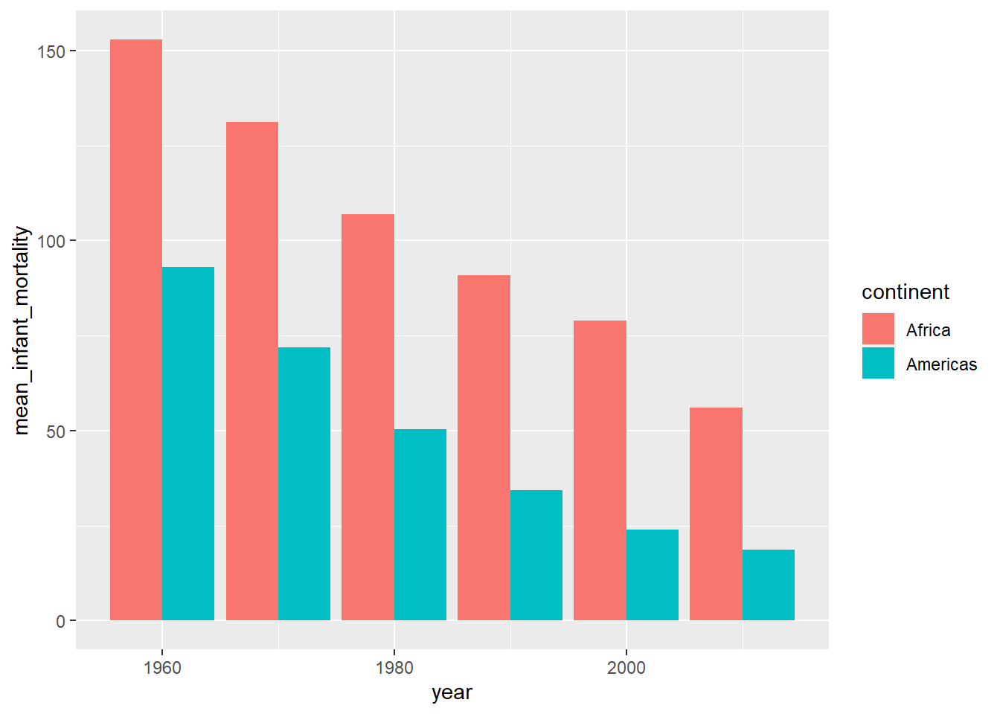

## Publication quality graphs
With ggplot2 you can create a publication quality graph that can be tweaked to finest details.

```r
## A more complicated example (for showing the capabilities of ggplot2)

west <- c("Western Europe","Northern Europe","Southern Europe",
          "Northern America","Australia and New Zealand")

pub_plot <- gapminder <- gapminder %>%
  mutate(group = case_when(
    region %in% west ~ "The West",
    region %in% c("Eastern Asia", "South-Eastern Asia") ~ "East Asia",
    region %in% c("Caribbean", "Central America", "South America") ~ "Latin America",
    continent == "Africa" & region != "Northern Africa" ~ "Sub-Saharan Africa",
    TRUE ~ "Others"))
gapminder <- gapminder %>%
  mutate(group = factor(group, levels = rev(c("Others", "Latin America", "East Asia","Sub-Saharan Africa", "The West"))))

dplyr::filter(gapminder, year%in%c(1962, 2013) & !is.na(group) &
         !is.na(fertility) & !is.na(life_expectancy)) %>%
  mutate(population_in_millions = population/10^6) %>%
  ggplot( aes(fertility, y=life_expectancy, col = group, size = population_in_millions)) +
  geom_point(alpha = 0.8) +
  guides(size=FALSE) +
  theme(plot.title = element_blank(), legend.title = element_blank()) +
  coord_cartesian(ylim = c(30, 85)) +
  xlab("Fertility rate (births per woman)") +
  ylab("Life Expectancy") +
  geom_text(aes(x=7, y=82, label=year), cex=7, color="grey") +
  facet_grid(. ~ year) +
  theme(strip.background = element_blank(),
        strip.text.x = element_blank(),
        strip.text.y = element_blank(),
   legend.position = "top")
```

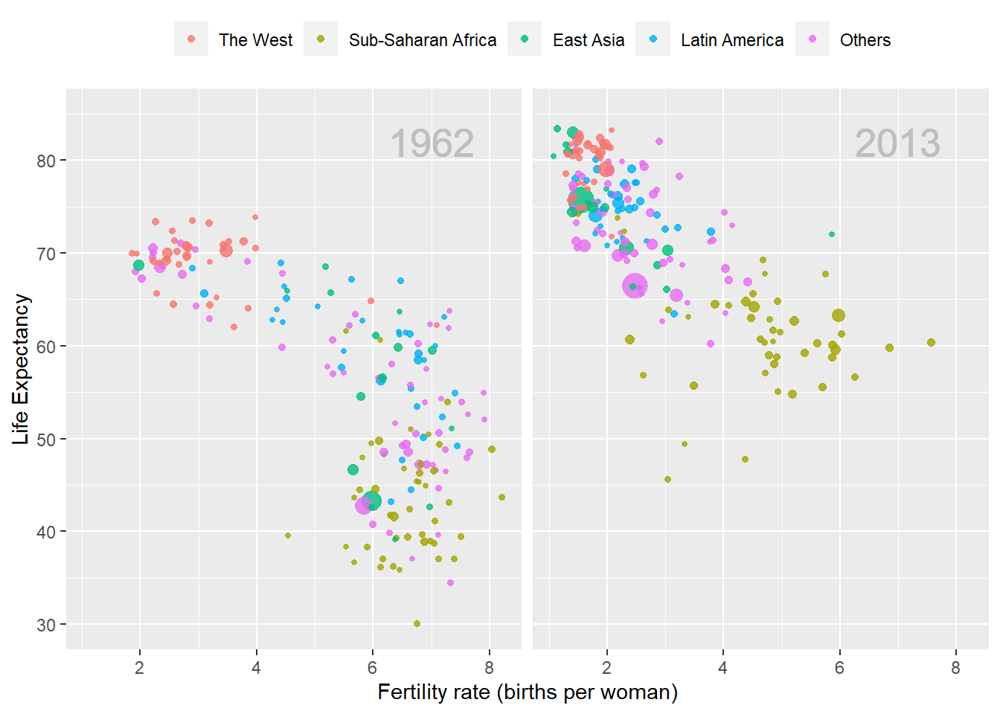

```r
pub_plot
```

```
## # A tibble: 10,545 x 10
##    country  year infant_mortality life_expectancy fertility population      gdp
##    <chr>   <int>            <dbl>           <dbl>     <dbl>      <dbl>    <dbl>
##  1 Albania  1960            115.             62.9      6.19    1636054 NA      
##  2 Algeria  1960            148.             47.5      7.65   11124892  1.38e10
##  3 Angola   1960            208              36.0      7.32    5270844 NA      
##  4 Antigu~  1960             NA              63.0      4.43      54681 NA      
##  5 Argent~  1960             59.9            65.4      3.11   20619075  1.08e11
##  6 Armenia  1960             NA              66.9      4.55    1867396 NA      
##  7 Aruba    1960             NA              65.7      4.82      54208 NA      
##  8 Austra~  1960             20.3            70.9      3.45   10292328  9.67e10
##  9 Austria  1960             37.3            68.8      2.7     7065525  5.24e10
## 10 Azerba~  1960             NA              61.3      5.57    3897889 NA      
## # ... with 10,535 more rows, and 3 more variables: continent <fct>,
## #   region <fct>, group <chr>
```

## Data Distributions & Outliers

### Detecting outliers {-}
For this part we use a different and more simple dataset
This dataset contains 1192 observations on self-reported:

 - `height` (inch)
 - `earn` ($)
 - `sex` (gender)
 - `ed` (currently un-annotated)
 - `age` (years)
 - `race` 
 

```r
heights_data <- read_csv(file = here::here("data",
                                           "heights_outliers.csv"))
```

```
## 
## -- Column specification --------------------------------------------------------
## cols(
##   earn = col_double(),
##   height = col_double(),
##   sex = col_character(),
##   ed = col_double(),
##   age = col_double(),
##   race = col_character()
## )
```

```r
heights_data
```

```
## # A tibble: 1,192 x 6
##     earn height sex       ed   age race    
##    <dbl>  <dbl> <chr>  <dbl> <dbl> <chr>   
##  1 50000   74.4 male      16    45 white   
##  2 60000   65.5 female    16    58 white   
##  3 30000   63.6 female    16    29 white   
##  4 50000   63.1 female    16    91 other   
##  5 51000   63.4 female    17    39 white   
##  6  9000   64.4 female    15    26 white   
##  7 29000   61.7 female    12    49 white   
##  8 32000   72.7 male      17    46 white   
##  9  2000   72.0 male      15    21 hispanic
## 10 27000   72.2 male      12    26 white   
## # ... with 1,182 more rows
```

### Data characteristics {-}
We will focus on the variable `height` here

```r
summary_heights_data <- heights_data %>%
  group_by(sex, age) %>%
  summarise(mean_height = mean(height, na.rm = TRUE),
            min_height = min(height),
            max_height = max(height)) %>%
  arrange(desc(mean_height))
```

```
## `summarise()` regrouping output by 'sex' (override with `.groups` argument)
```

```r
summary_heights_data[c(1:4),]
```

```
## # A tibble: 4 x 5
## # Groups:   sex [2]
##   sex      age mean_height min_height max_height
##   <chr>  <dbl>       <dbl>      <dbl>      <dbl>
## 1 female    55       141.        61.9      664. 
## 2 male      39       134.        66.6      572. 
## 3 male      55        73.2       71.7       74.8
## 4 male      91        73.1       73.1       73.1
```

From the above summary we can conclude that there are two outliers (presumably entry errors).

### <mark>**EXERCISE 10; Calculate the height in meters for each outlier in the `Console`**</mark> {-}

1 inch = 0,0254 meters

**Please discuss the solution with your neighbour** 

### Checking the frequency distribution {-}

```r
heights_data %>%
  ggplot(aes(x = height)) +
  geom_histogram(aes(stat = "identity"), bins = 200)
```

```
## Warning: Ignoring unknown aesthetics: stat
```


This distribution looks odd. 
When you see a large x-axis with no data plotted on it, it usually means there is an outlier. If you look carefully, you will spot two outliers around 600

### Boxplots to detect outliers {-}

```r
heights_data %>%
  ggplot(aes(y = log10(height))) +
  geom_boxplot()
```


So apparantly there are two data points that are way off from the rest of the distribution. Let's remove these, using `filter()` from the `{dplyr}` package like we did before on the `gapminder` dataset.

### Identify the outliers {-}

```r
heights_data %>%
  dplyr::filter(height > 100)
```

```
## # A tibble: 2 x 6
##    earn height sex       ed   age race 
##   <dbl>  <dbl> <chr>  <dbl> <dbl> <chr>
## 1  7000   664. female    12    55 black
## 2 15000   572. male      12    39 white
```

### Boxplot with outliers removed {-}

```r
heights_data %>%
  dplyr::filter(height < 100) %>%
  ggplot(aes(y = height)) +
  geom_boxplot()
```


### By sex {-}

```r
heights_data %>%
  dplyr::filter(height < 100) %>%
  ggplot(aes(y = height, x = sex)) +
  geom_boxplot()
```

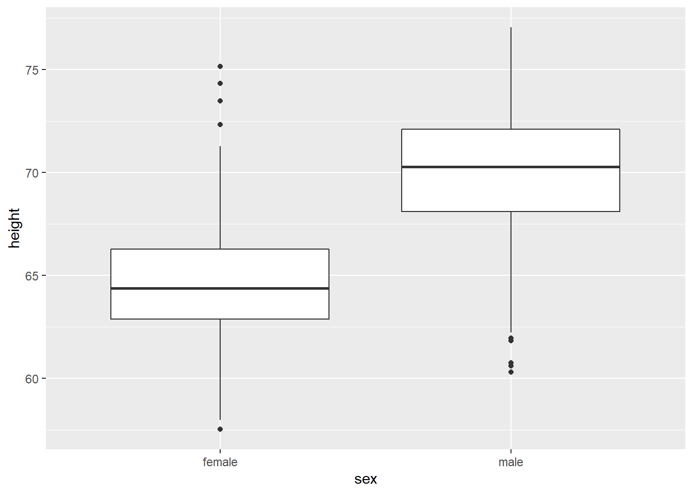

### New frequency distribution
Now let's plot a new distribution plot, this time we plot density, leaving the outlier out

```r
heights_data %>%
  dplyr::filter(height < 100) %>%
  ggplot(aes(height)) +
  geom_density(aes(y = ..density..))
```


## By sex

```r
heights_data %>%
  dplyr::filter(height < 100) %>%
  ggplot(aes(height)) +
  geom_density(aes(y = ..density.., colour = sex), size = 1.5)
```

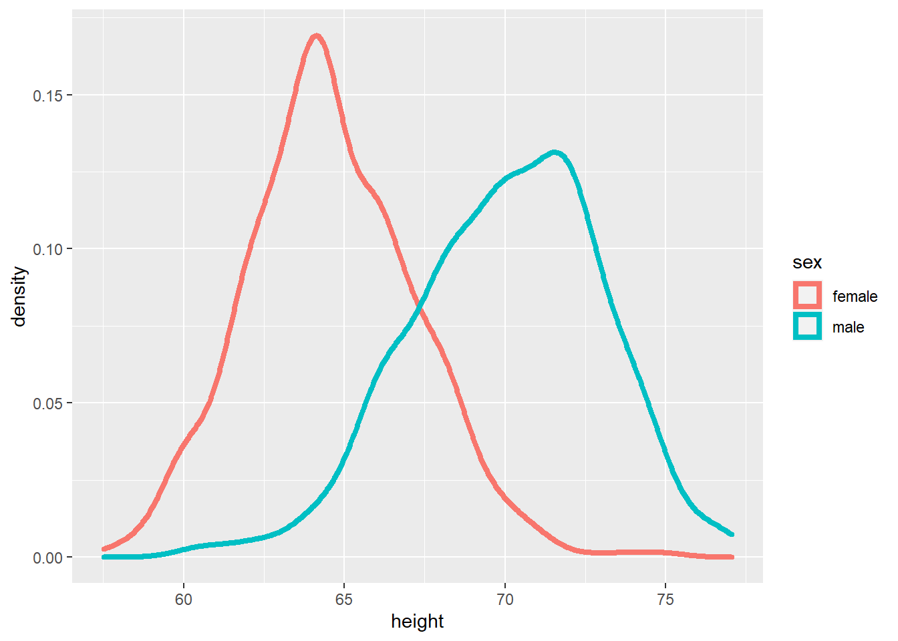
Question: Are the heights of males really different from females?


```r
model <- lm(data = heights_data, height ~ sex)
anova(model) %>% summary
```

```
##        Df             Sum Sq          Mean Sq          F value     
##  Min.   :   1.0   Min.   :  9024   Min.   : 520.4   Min.   :17.34  
##  1st Qu.: 298.2   1st Qu.:161591   1st Qu.:2646.3   1st Qu.:17.34  
##  Median : 595.5   Median :314157   Median :4772.2   Median :17.34  
##  Mean   : 595.5   Mean   :314157   Mean   :4772.2   Mean   :17.34  
##  3rd Qu.: 892.8   3rd Qu.:466724   3rd Qu.:6898.1   3rd Qu.:17.34  
##  Max.   :1190.0   Max.   :619290   Max.   :9024.0   Max.   :17.34  
##                                                     NA's   :1      
##      Pr(>F)        
##  Min.   :3.35e-05  
##  1st Qu.:3.35e-05  
##  Median :3.35e-05  
##  Mean   :3.35e-05  
##  3rd Qu.:3.35e-05  
##  Max.   :3.35e-05  
##  NA's   :1
```

```r
## are other factors (e.g. race) contributing? 
model <- lm(data = heights_data, height ~ sex * race)
anova(model)
```

```
## Analysis of Variance Table
## 
## Response: height
##             Df Sum Sq Mean Sq F value    Pr(>F)    
## sex          1   9024  9024.0 17.3922 3.262e-05 ***
## race         3   2582   860.8  1.6591    0.1741    
## sex:race     3   2384   794.7  1.5317    0.2046    
## Residuals 1184 614324   518.9                      
## ---
## Signif. codes:  0 '***' 0.001 '**' 0.01 '*' 0.05 '.' 0.1 ' ' 1
```

```r
## look at a plot
heights_data %>%
#  group_by(race, sex) %>%
#  summarise(mean_height = mean(height)) %>%
  dplyr::filter(height < 100) %>%
  ggplot(aes(x = race, y = height)) + 
  geom_point(aes(colour = race), position = "jitter")
```

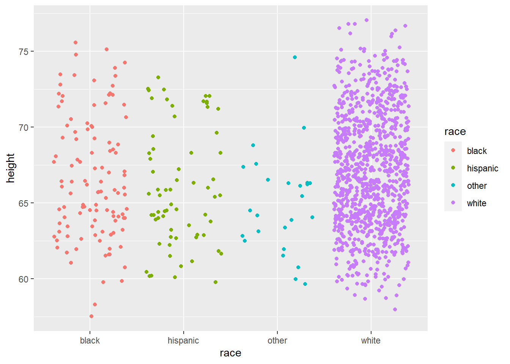

```r
## The sample size is unbalanced, s this a problem for the ANOVA we just did?

heights_data %>%
  group_by(race, sex) %>%
  tally() %>%
  ggplot(aes(x = race, y = n)) +
  geom_col(aes(fill = sex), position = "dodge")
```

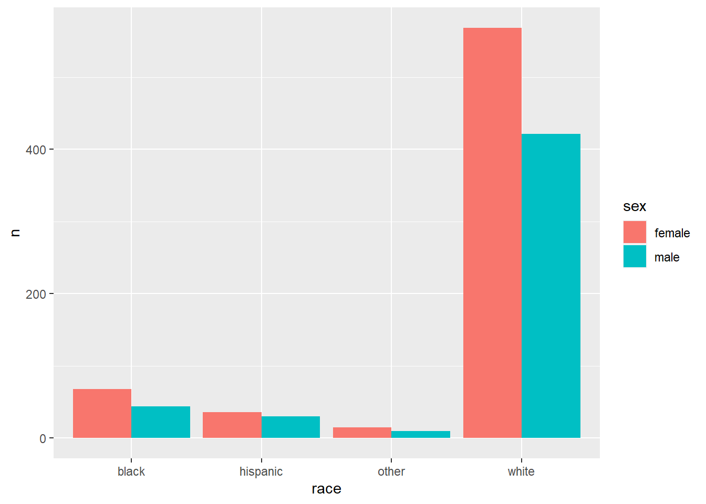


## CHAPTER EXERCISES {-}

### Packages {-}

```r
## the packages that you minimally need for this exercise
library(tidyverse)
library(cowplot)
```

```
## 
## Attaching package: 'cowplot'
```

```
## The following object is masked from 'package:ggpubr':
## 
##     get_legend
```

```
## The following object is masked from 'package:reshape':
## 
##     stamp
```

```r
library(readr)
library(readxl)
## add more if you need them
```

### `{ggplot2}` {-}
As shown in the demo, the {ggplot2} package is a very strong tool to make plots. It is somewhat more difficult to master than other plotting systems in R, but it is much stronger and much, much more versatile.

In order to force you to study ggplot syntax, you will have to create plots in this exercise using {ggplot2} syntax only!!

### Introduction {-}
In most cases, plotting is the main tool by which you get a ‘feel’ for the data. In many cases, the plots require some work on the data first, so we will have to process the data as well. A very important part of your preliminary analysis involves knowing the distribution of the data. That is, what are its typical values, and how do they relate to one another or to another data set. Probably the easiest plotting tool for this is the histogram. This is available as the `geom_histogram()` or `geom_freypoly()` in {ggplot2}. Alternatively you can use `geom_boxplot()` to create boxplots. 

### <mark>**EXERCISE 11. Airquality data**</mark> {-}

In this exercise we will use a build-in dataset from the {datasets} package. The data can be loaded by typing 
```
airq <- datasets::airquality
```
in your script. Try it now!

You will see a new object called chicks in you Global Environment.

```r
## load dataset airquality
airq <- datasets::airquality
```

11A) Inspect the data

 - Are there any missing values, if yes how many? (`sum(is.na()`)
 - What types of variables do we have? (use the `str()` command)
 - Convert to a tibble with `as_tibble()`
 - Are all the variables of the right type?
 - Which variables are categorical?
 - Which are numeric?
 - Change grouping/categorical variables to facors if neccesary
 

```r
head(airq)
```

```
##   Ozone Solar.R Wind Temp Month Day
## 1    41     190  7.4   67     5   1
## 2    36     118  8.0   72     5   2
## 3    12     149 12.6   74     5   3
## 4    18     313 11.5   62     5   4
## 5    NA      NA 14.3   56     5   5
## 6    28      NA 14.9   66     5   6
```

```r
sum(is.na(airq)) # so no missing values
```

```
## [1] 44
```

```r
str(airq) # you see that all variables have the right type
```

```
## 'data.frame':	153 obs. of  6 variables:
##  $ Ozone  : int  41 36 12 18 NA 28 23 19 8 NA ...
##  $ Solar.R: int  190 118 149 313 NA NA 299 99 19 194 ...
##  $ Wind   : num  7.4 8 12.6 11.5 14.3 14.9 8.6 13.8 20.1 8.6 ...
##  $ Temp   : int  67 72 74 62 56 66 65 59 61 69 ...
##  $ Month  : int  5 5 5 5 5 5 5 5 5 5 ...
##  $ Day    : int  1 2 3 4 5 6 7 8 9 10 ...
```

11B) Change all variable names to lower type case

Write a line of code that changes all `names()` of the variables to lower-case. Also, replace the dot in the variable name `sola.r` for an "_". Look at the help function for the function `str_replace` from the `{stringr}` package to do this.


```r
names(airq) <- tolower(names(airq))
head(airq)
```

```
##   ozone solar.r wind temp month day
## 1    41     190  7.4   67     5   1
## 2    36     118  8.0   72     5   2
## 3    12     149 12.6   74     5   3
## 4    18     313 11.5   62     5   4
## 5    NA      NA 14.3   56     5   5
## 6    28      NA 14.9   66     5   6
```

```r
names(airq) <- str_replace_all(names(airq), pattern = "\\.", replacement = "_")
head(airq)
```

```
##   ozone solar_r wind temp month day
## 1    41     190  7.4   67     5   1
## 2    36     118  8.0   72     5   2
## 3    12     149 12.6   74     5   3
## 4    18     313 11.5   62     5   4
## 5    NA      NA 14.3   56     5   5
## 6    28      NA 14.9   66     5   6
```

1C) Scatter plot of all the data

Create a plot in your Rmd script that shows all the data points. Plot the variable `month` on the x-axis and the variable `wind` on the y-axis.


```r
names(airq)
```

```
## [1] "ozone"   "solar_r" "wind"    "temp"    "month"   "day"
```

```r
plot_1c <-  airq %>%
  ggplot(aes(x = month, y = wind)) +
  geom_point(aes(), alpha = 0.4) 

#  geom_jitter(aes(x = time, y = weight), position = "jitter") 
  
plot_1c
```


11D) Overplotting

You will see that the plot contains many points that are overlaid (how do we know that they are overlaid?). How can you solve this "overplotting" problem? Write a few lines of code that shows your solution.

**TIPs**

 - Look-up overplotting in the "R for Data Science" book  or review Chapter \@ref(lab2viz) of this reader)
 - What does `alpha()` do?
 - Maybe use position = "jitter" as an extra layer in your graph
 (look at `?position = "jitter"`)


```r
names(airq)
```

```
## [1] "ozone"   "solar_r" "wind"    "temp"    "month"   "day"
```

```r
plot_1d <-  airq %>%
  ggplot(aes(x = month, y = wind)) +
  geom_point(aes(), alpha = 0.4, position = "jitter")
 
plot_1d
```


11E) Plot the relationship between wind and month with a straight line 


```r
names(airq)
```

```
## [1] "ozone"   "solar_r" "wind"    "temp"    "month"   "day"
```

```r
plot_1e <-  airq %>%
  ggplot(aes(x = month, y = wind)) +
  geom_point(aes(), alpha = 0.4, position = "jitter")  +
  geom_smooth(method = "lm")
  #
#+
 # geom_jitter(position = "jitter") 
  
plot_1e
```

```
## `geom_smooth()` using formula 'y ~ x'
```


11F) Wind Velocity
summarize the wind velocity per month (call this `mean_month`) in a bar plot. Plot the relationship between `month` and `mean_wind`. Plot error bars on the bars
Try looking up the solution for the error bars, using Google.


```r
airq %>%
  group_by(month) %>%
  summarise(mean_wind = mean(wind, na.rm = TRUE),
            sd = sd(wind, na.rm = TRUE)) %>%
  ggplot(aes(x = month, y = mean_wind)) +
  geom_col() +
  geom_errorbar(aes(x = month, ymax = mean_wind+sd, 
                    ymin = mean_wind - sd), size = 1, width = 0.4)
```

```
## `summarise()` ungrouping output (override with `.groups` argument)
```


### <mark>**EXERCISE 12. Overplotting solved by colours**</mark> {-}

For this exercise we wil use a new dataset "tb_burden":

The file: "/data/messy/TB_data_dictionary_2016-12-08.csv" contains additional info on the variables in the datafile.

12A) Import data
Read the file "/data/messy/TB_burden_countries_2016-12-08_messy.csv" into R with the following code:

```r
tb_burden <- read.csv(
  file = here::here(
    "data",
    "messy",
    "TB_burden_countries_2016-12-08_messy.csv"))


names(tb_burden)
```

```
##  [1] "country"                  "iso2"                    
##  [3] "iso3"                     "iso_numeric"             
##  [5] "g_whoregion"              "year"                    
##  [7] "e_pop_num"                "e_inc_100k"              
##  [9] "e_inc_100k_lo"            "e_inc_100k_hi"           
## [11] "e_inc_num"                "e_inc_num_lo"            
## [13] "e_inc_num_hi"             "source_inc"              
## [15] "e_inc_num_f014"           "e_inc_num_f014_lo"       
## [17] "e_inc_num_f014_hi"        "e_inc_num_f15plus"       
## [19] "e_inc_num_f15plus_lo"     "e_inc_num_f15plus_hi"    
## [21] "e_inc_num_f"              "e_inc_num_f_lo"          
## [23] "e_inc_num_f_hi"           "e_inc_num_m014"          
## [25] "e_inc_num_m014_lo"        "e_inc_num_m014_hi"       
## [27] "e_inc_num_m15plus"        "e_inc_num_m15plus_lo"    
## [29] "e_inc_num_m15plus_hi"     "e_inc_num_m"             
## [31] "e_inc_num_m_lo"           "e_inc_num_m_hi"          
## [33] "e_inc_num_014"            "e_inc_num_014_lo"        
## [35] "e_inc_num_014_hi"         "e_inc_num_15plus"        
## [37] "e_inc_num_15plus_lo"      "e_inc_num_15plus_hi"     
## [39] "e_tbhiv_prct"             "e_tbhiv_prct_lo"         
## [41] "e_tbhiv_prct_hi"          "e_inc_tbhiv_100k"        
## [43] "e_inc_tbhiv_100k_lo"      "e_inc_tbhiv_100k_hi"     
## [45] "e_inc_tbhiv_num"          "e_inc_tbhiv_num_lo"      
## [47] "e_inc_tbhiv_num_hi"       "source_tbhiv"            
## [49] "e_mort_exc_tbhiv_100k"    "e_mort_exc_tbhiv_100k_lo"
## [51] "e_mort_exc_tbhiv_100k_hi" "e_mort_exc_tbhiv_num"    
## [53] "e_mort_exc_tbhiv_num_lo"  "e_mort_exc_tbhiv_num_hi" 
## [55] "e_mort_tbhiv_100k"        "e_mort_tbhiv_100k_lo"    
## [57] "e_mort_tbhiv_100k_hi"     "e_mort_tbhiv_num"        
## [59] "e_mort_tbhiv_num_lo"      "e_mort_tbhiv_num_hi"     
## [61] "e_mort_100k"              "e_mort_100k_lo"          
## [63] "e_mort_100k_hi"           "e_mort_num"              
## [65] "e_mort_num_lo"            "e_mort_num_hi"           
## [67] "source_mort"              "cfr"                     
## [69] "cfr_lo"                   "cfr_hi"                  
## [71] "c_newinc_100k"            "c_cdr"                   
## [73] "c_cdr_lo"                 "c_cdr_hi"
```

12B) Selection of relevant variables
For the subsequent analysis we will use the following variables:
 
 `country`
 `iso3`
 `g_whoregion`
 `year`
 `e_inc_num`
 `e_mort_exc_tbhiv_num`
 `e_pop_num`
 
 Select the above variables from the dataset.
 

```r
names(tb_burden)
```

```
##  [1] "country"                  "iso2"                    
##  [3] "iso3"                     "iso_numeric"             
##  [5] "g_whoregion"              "year"                    
##  [7] "e_pop_num"                "e_inc_100k"              
##  [9] "e_inc_100k_lo"            "e_inc_100k_hi"           
## [11] "e_inc_num"                "e_inc_num_lo"            
## [13] "e_inc_num_hi"             "source_inc"              
## [15] "e_inc_num_f014"           "e_inc_num_f014_lo"       
## [17] "e_inc_num_f014_hi"        "e_inc_num_f15plus"       
## [19] "e_inc_num_f15plus_lo"     "e_inc_num_f15plus_hi"    
## [21] "e_inc_num_f"              "e_inc_num_f_lo"          
## [23] "e_inc_num_f_hi"           "e_inc_num_m014"          
## [25] "e_inc_num_m014_lo"        "e_inc_num_m014_hi"       
## [27] "e_inc_num_m15plus"        "e_inc_num_m15plus_lo"    
## [29] "e_inc_num_m15plus_hi"     "e_inc_num_m"             
## [31] "e_inc_num_m_lo"           "e_inc_num_m_hi"          
## [33] "e_inc_num_014"            "e_inc_num_014_lo"        
## [35] "e_inc_num_014_hi"         "e_inc_num_15plus"        
## [37] "e_inc_num_15plus_lo"      "e_inc_num_15plus_hi"     
## [39] "e_tbhiv_prct"             "e_tbhiv_prct_lo"         
## [41] "e_tbhiv_prct_hi"          "e_inc_tbhiv_100k"        
## [43] "e_inc_tbhiv_100k_lo"      "e_inc_tbhiv_100k_hi"     
## [45] "e_inc_tbhiv_num"          "e_inc_tbhiv_num_lo"      
## [47] "e_inc_tbhiv_num_hi"       "source_tbhiv"            
## [49] "e_mort_exc_tbhiv_100k"    "e_mort_exc_tbhiv_100k_lo"
## [51] "e_mort_exc_tbhiv_100k_hi" "e_mort_exc_tbhiv_num"    
## [53] "e_mort_exc_tbhiv_num_lo"  "e_mort_exc_tbhiv_num_hi" 
## [55] "e_mort_tbhiv_100k"        "e_mort_tbhiv_100k_lo"    
## [57] "e_mort_tbhiv_100k_hi"     "e_mort_tbhiv_num"        
## [59] "e_mort_tbhiv_num_lo"      "e_mort_tbhiv_num_hi"     
## [61] "e_mort_100k"              "e_mort_100k_lo"          
## [63] "e_mort_100k_hi"           "e_mort_num"              
## [65] "e_mort_num_lo"            "e_mort_num_hi"           
## [67] "source_mort"              "cfr"                     
## [69] "cfr_lo"                   "cfr_hi"                  
## [71] "c_newinc_100k"            "c_cdr"                   
## [73] "c_cdr_lo"                 "c_cdr_hi"
```

```r
tb_data_selected <- tb_burden %>%
  dplyr::select(
    iso3,
    country,
    g_whoregion,
    year,
    e_inc_num,
    e_mort_exc_tbhiv_num,
    e_pop_num,
  )
```
 
12C) Data dictionary
Load the data dictionary into R ("/data/messy/TB_data_dictionary_2016-12-08_messy.csv")

Use `dplyr::filter()` together with the `%in%` operator to pull out the descriptions of the variables from the data dictionary. Do all the variables have a discription?


```r
dictionary <- read_csv("./data/messy/TB_data_dictionary_2016-12-08.csv")
```

```
## 
## -- Column specification --------------------------------------------------------
## cols(
##   variable_name = col_character(),
##   dataset = col_character(),
##   code_list = col_character(),
##   definition = col_character()
## )
```

```r
## filter solution
dplyr::filter(dictionary, variable_name %in% names(tb_data_selected))
```

```
## # A tibble: 5 x 4
##   variable_name     dataset        code_list definition                         
##   <chr>             <chr>          <chr>     <chr>                              
## 1 country           Country ident~ <NA>      Country or territory name          
## 2 iso3              Country ident~ <NA>      ISO 3-character country/territory ~
## 3 e_inc_num         Estimates      <NA>      Estimated number of incident cases~
## 4 e_mort_exc_tbhiv~ Estimates      <NA>      Estimated number of deaths from TB~
## 5 e_pop_num         Estimates      <NA>      Estimated total population number
```

### <mark>**EXERCISE 13. Exploratory graphs**</mark> {-}
Use the tuberculosis dataset from exercise 2.

13A) All data {-}
Plot the total number of Tuberculosis cases (y axis), for each country, for each year (x axis. Think about how to solve the overplotting this creates. How do you display country?

Which country has the highest number of annual TB cases?


```r
tb_burden %>%
  ggplot(aes(x = year, y = log10(e_inc_num))) +
  geom_point(aes(colour = country), position = "jitter") +
  theme(legend.position = "none") +
  ggtitle("Number of total TB cases")
```


```r
tb_burden %>%
  ggplot(aes(x = year, y = e_inc_num)) +
  geom_point(aes(colour = country), position = "jitter") +
  theme(legend.position = "none") +
  ggtitle("Number of total TB cases")
```


```r
tb_burden %>%
  dplyr::filter(e_inc_num > 2500000) %>%
  as_tibble() %>%
  select(country) %>%
  unique()
```

```
## # A tibble: 1 x 1
##   country
##   <chr>  
## 1 India
```

13B) Calculate incidence per 1.000
Calculate the incidence of TB per 1.000 inhabitants, per country, per year. Plot the incendence (y axis) for each country and each year (x axis), for only those countries that have a higer incidence of more than 5 per 1000 inhabitants.


```r
tb_data_selected %>%
  as_tibble() %>%
  mutate(incidence_1e3 = (e_inc_num/e_pop_num)*1000) %>%
  dplyr::filter(incidence_1e3 > 5) %>%
  ggplot(aes(x = year,
             y = incidence_1e3)) +
  geom_point(aes(colour = country)) +
  geom_line(aes(group = country, colour = country), show.legend = FALSE) +
  theme(legend.position = "none") +
  ggtitle("Number of total TB cases")
```

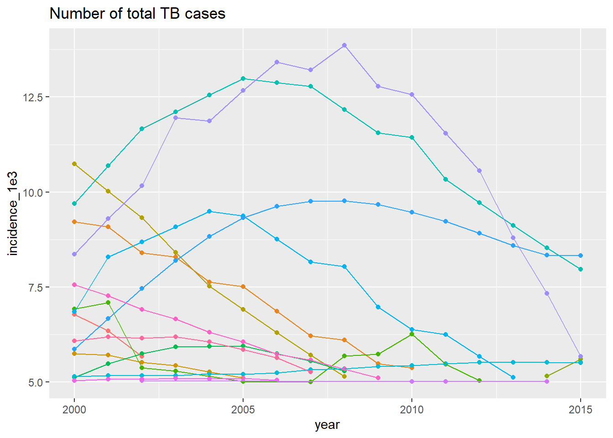

13C) Filtering from graph
Which country had the highest incidence of TB in the year 2010?

```r
tb_data_selected %>%
  as_tibble() %>%
  mutate(incidence_1e3 = (e_inc_num/e_pop_num)*1000) %>%
  dplyr::filter(incidence_1e3 > 5,
                year == "2010") %>%
  arrange(desc(incidence_1e3)) %>%
  select(country, incidence_1e3)
```

```
## # A tibble: 8 x 2
##   country      incidence_1e3
##   <chr>                <dbl>
## 1 Swaziland            12.6 
## 2 Lesotho              11.4 
## 3 South Africa          9.47
## 4 Namibia               6.38
## 5 Djibouti              6.26
## 6 Mozambique            5.43
## 7 Botswana              5.37
## 8 Timor-Leste           5.01
```

13D) Average incidence per WHO region
Show the relationship over years, between the WHO regions and the median TB incidence/1000 per region with a plot.


```r
names(tb_data_selected)
```

```
## [1] "iso3"                 "country"              "g_whoregion"         
## [4] "year"                 "e_inc_num"            "e_mort_exc_tbhiv_num"
## [7] "e_pop_num"
```

```r
tb_data_selected %>%
  as_tibble() %>%
  mutate(incidence_1e3 = (e_inc_num/e_pop_num)*1000) %>%  
  group_by(g_whoregion, year) %>%
  summarize(median_incidence_per_region = median(incidence_1e3)) %>%
  ggplot(aes(x = year, 
             y = median_incidence_per_region)) +
    geom_point(aes(colour = g_whoregion)) +
  geom_line(aes(group = g_whoregion, colour = g_whoregion)) +
  ggtitle("Mean Incidence of TB per WHO region")
```

```
## `summarise()` regrouping output by 'g_whoregion' (override with `.groups` argument)
```


### <mark>**EXERCISE 14; Tubercolosis data**</mark> {-}

14A Calculate the overall TB incidence per 1000 people for each WHO region

Plot the relationship between this overall incidence and the WHO region, over the years. Compare this result with your plot under 3D.  
To study the relationship between TB incidence and socio-economical and/or geographical characteristics we will use the TB Burden data (selection of the variables) together with the Geographical/Socio-economical dataset of the World (from `{tmap}`, `data("World")`)

14B) Load World data
Load the World data from the `{tmap}` package (`data("World")`) and combine (left_join the world data to the TB_burden data (with selected variables)). Be sure to indicate the keys for the join (join by ISO3 which is present in both datasets)


```r
library(tmap)
data("World") # from the tmap package
names(World)
names(tb_burden)

World <- World %>%
  dplyr::rename(iso3 = iso_a3)

joined_data <- left_join(World, tb_data_selected, by = "iso3")
names(joined_data)

joined_data <- joined_data %>%
  mutate(incidence_1e3 = (e_inc_num/e_pop_num)*1000)
```

14C) Facets for year
Plot the relationship between the median income per capita (gdp_cap_est) per WHO region and the median TB incidence per WHO region, use facets and `alpha` to handle the years and overplotting.


```r
names(joined_data) 
joined_data %>%
  na.omit() %>%
  ggplot(aes(x = gdp_cap_est,
             y = incidence_1e3)) +
  geom_point(alpha = 0.2) +
  facet_wrap(~ year) +
  geom_smooth(se = FALSE) -> ## reverse assign
  plot_gdp_tuberculosis
  
plot_gdp_tuberculosis
```

### <mark>**EXERCISE 15. Histograms**</mark> {-}

15A) Two histograms 
Create histograms of the following variables of the joined data:
`incidence_1e3`
`gdp_cap_est`

Account for `g_whoregion` in your plot. Take all years together in the histograms.


```r
joined_data %>%
  ggplot(aes(x = incidence_1e3)) +
  geom_histogram(aes(fill = g_whoregion), bins = 50)


joined_data %>%
  ggplot(aes(x = gdp_cap_est)) +
  geom_histogram(aes(fill = g_whoregion), bins = 50)
```

15B) Turn the code of the histgrams into code that plots frequency polynomes
Maybe do a log transformation on the incidence and/or gdp? Use factes for the years.

**TIPS**
 
 - Investigate the difference between `geom_density()` and `geom_freqpoly()`


```r
joined_data %>%
  ggplot(aes(x = log10(incidence_1e3))) +
  geom_freqpoly(aes(colour = g_whoregion), size = 1) +
  facet_wrap(~year)

joined_data %>%
  ggplot(aes(x = log10(gdp_cap_est))) +
  geom_freqpoly(aes(colour = g_whoregion), size = 1) +
  facet_wrap(~year)


joined_data %>%
  ggplot(aes(x = log10(gdp_cap_est))) +
  geom_density(aes(colour = g_whoregion, y = ..density..), size = 1) +
  facet_wrap(~year)
```

### <mark>**EXERCISE 16. Treatment Effect Relations**</mark> {-}
In this exercise we will use a build-in dataset from the {datasets} package. The data can be loaded by typing 
```
chicks <- datasets::ChickWeight
```
in your script. Try it now!

You will see a new object called chicks in you Global Environment.

```r
## load dataset ChickWeights
chicks <- datasets::ChickWeight 
```

16A) Inspect the data

 - Are there any missing values, if yes how many? (`sum(is.na()`)
 - What types of variables do we have? (use the `str()` command)
 - Convert to a tibble with `as_tibble()`
 - Are all the variables of the right type?
 - Which variables are categorical?
 - Which are numeric?
 - Change grouping/categorical variables to factors if necessary(`chicks$var <- as_factor(chicks$var)`)
 

```r
head(chicks)
```

```
## Grouped Data: weight ~ Time | Chick
##   weight Time Chick Diet
## 1     42    0     1    1
## 2     51    2     1    1
## 3     59    4     1    1
## 4     64    6     1    1
## 5     76    8     1    1
## 6     93   10     1    1
```

```r
sum(is.na(chicks)) # so no missing values
```

```
## [1] 0
```

```r
str(chicks) # you see that all variables have the right type
```

```
## Classes 'nfnGroupedData', 'nfGroupedData', 'groupedData' and 'data.frame':	578 obs. of  4 variables:
##  $ weight: num  42 51 59 64 76 93 106 125 149 171 ...
##  $ Time  : num  0 2 4 6 8 10 12 14 16 18 ...
##  $ Chick : Ord.factor w/ 50 levels "18"<"16"<"15"<..: 15 15 15 15 15 15 15 15 15 15 ...
##  $ Diet  : Factor w/ 4 levels "1","2","3","4": 1 1 1 1 1 1 1 1 1 1 ...
##  - attr(*, "formula")=Class 'formula'  language weight ~ Time | Chick
##   .. ..- attr(*, ".Environment")=<environment: R_EmptyEnv> 
##  - attr(*, "outer")=Class 'formula'  language ~Diet
##   .. ..- attr(*, ".Environment")=<environment: R_EmptyEnv> 
##  - attr(*, "labels")=List of 2
##   ..$ x: chr "Time"
##   ..$ y: chr "Body weight"
##  - attr(*, "units")=List of 2
##   ..$ x: chr "(days)"
##   ..$ y: chr "(gm)"
```

16B) Change all variable names to lower type case

Write a line of code that changes all `names()` of the variables to lower-case. 

```r
names(chicks) <- tolower(names(chicks))
names(chicks) <- c("weight", "time", "chick", "diet")  
head(chicks)
```

```
##   weight time chick diet
## 1     42    0     1    1
## 2     51    2     1    1
## 3     59    4     1    1
## 4     64    6     1    1
## 5     76    8     1    1
## 6     93   10     1    1
```

16C) Scatter plot of all the data

Create a plot in your Rmd script that shows all the data points. Plot the variable `time` on the x-axis and the variable `weight` on the y-axis.


```r
names(chicks)
```

```
## [1] "weight" "time"   "chick"  "diet"
```

```r
plot_1c <-  ggplot(data = chicks, aes(x = time, y = weight)) +
  geom_point(aes(colour = diet), alpha = 0.4, position = "jitter") 

#  geom_jitter(aes(x = time, y = weight), position = "jitter") 
  
plot_1c
```


16D) Overplotting

You will see that the plot contains many points that are overlaid. How can you solve this "overplotting" problem?

**TIPs**

 - Look-up overplotting in the "R for Data Science" book
 - What does `alpha()` do?
 - Maybe use geom_jitter() as an extra layer in your graph
 (look at `?geom_jitter`)


```r
plot_1d_1 <-  ggplot(data = chicks, 
                   aes(x = time, y = weight)) +
  geom_point(alpha = 0.6) 
## setting alpha does not really solve the overplotting 
plot_1d_1
```


```r
plot_1d_2 <-  ggplot(data = chicks, 
                   aes(x = time, y = weight)) +
  geom_point() + geom_jitter(position = "jitter") 
## setting "jitter" solves it
plot_1d_2
```


```r
## antoher solution
plot_1d_3 <-  ggplot(data = chicks, 
                   aes(x = time, y = weight, color = diet)) +
  geom_point() + geom_jitter(position = "jitter") 
## setting "color = diet" provides even more insight
plot_1d_3
```

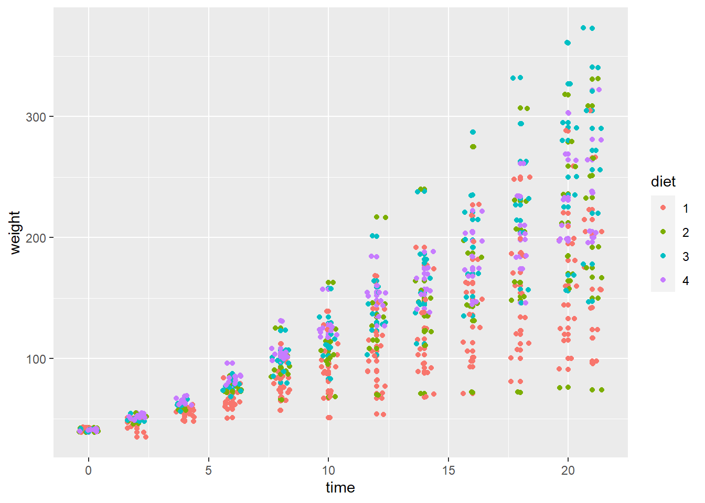

16E) Overplotting solved by colours
We could also solve the overplotting problem by using colour for each diet.
Add, `colour = diet` to the plot in such a way that you can see the diffences between the diets in one plot.

__Can you determine from this plot which diet has the strongest effect on the weight-gain per time on the chicks?__


```r
plot_1e <-  ggplot(data = chicks,
                   aes(x = time, y = weight, color = diet)) +
  geom_point()
plot_1e
```


16F) Combining "jitter" with group colours
Combining "jitter" with colours to reduce overplotting even more 
Combine adding "jitter" to the plot with asigning colours to diet.

**TIPs** 

 - Remember to `set.seed(1234)` to get a reproducible result.


```r
set.seed(1234)
plot_1f <-  ggplot(data = chicks,
                   aes(x = time, y = weight, color = diet)) +
  geom_point() +
  geom_jitter(position = "jitter")
plot_1f
```


16G) Solving overplotting by reducing data dimensionality: summarizing data
From the above plot it is still hard to see the trends in the data.

 - Summarize the data for each diet and make a plot on the summarized data. 
 - Again put `time` on the x-axis and the mean of the chick weight on the y-axis. 
 - Add appropriate labels to the plot, and a title.
 - Add regression curves (`geom_smooth(method = "lm"`) to the plot.

__Draw a conclusion: Which diet do you think shows the strongest effect on weight-gain over time in the investigated chicks?__

**TIPs**

 - For this you will need `dplyr::group_by()` and `dplyr::summarize`
 - call the new summarized dataframe: "chicks_summary"
 - Use `%>%` to create the "chicks_summary"
 - For this to work you will have to specify all the `aes()` arguments within the `ggplot()` call.
 

```r
# summarize the chicks data with {dyplyr}
chicks_summary <- chicks %>%
  group_by(diet, time) %>%
  summarise(mean_weight = mean(weight)) 
```

```
## `summarise()` regrouping output by 'diet' (override with `.groups` argument)
```

```r
# dot plot with a smoother, the method for smoothing is "linear model"
plot_1g <-  ggplot(data = chicks_summary, 
  aes(x = time, y = mean_weight, color = diet)) +
  geom_point() +
  geom_smooth(method = "lm", se = FALSE)

plot_1g
```

```
## `geom_smooth()` using formula 'y ~ x'
```


```r
plot(chicks$time ~ chicks$chick) # base plotting R
```


### <mark>**EXERCISE 17. Excel files - load and visualize**</mark> {-}
 
17A) Loading an Excel file
 
The data for this exercise can be found in:
`"./data/Animals.xls"`

It is an Miscrosoft Excel file containing brain and body weight of a number of animals: http://mste.illinois.edu/malcz/DATA/BIOLOGY/Animals.html 

DESCRIPTION:
Average brain and body weights for 27 species of land animals.

VARIABLES:

 - body: body weight in kg
 - brain: brain weight in g 

SIZE: 

 - Observations = 27; 
 - Variables = 2

SOURCE:
Rousseeuw, P.J. & Leroy, A.M. (1987) Robust Regression and Outlier Detection. Wiley, p. 57.

Write a code chunk that loads the file `"./data/Animals.xls"` into R. 
You may use any function you like, but you are not allowed to transform the data in any way using e.g. Excel. Name the dataframe `animals` as a datatable/dataframe/tibble in R. 

**TIPs** 
 
 - You can use the `readxl::read_excel()` function to solve this question.
 - Rember to use `library` to load the required package(s)
 - The first row that contains data is the "Mountain Beaver" observation
 - Remember that in some functions you can also set `header = FALSE`
 - The variables in this dataset need to be `animal`, `body_weigth` and `brain_weigth` and IN THAT ORDER! These are the so-called `names` of the dataframe and can be set or checked using the function `names()`
 - Remember `dplyr::select`, `dplyr::filter()`, `dplyr::group_by`, `dplyr::summarize()`
 

```r
# tidyverse solution
# readxl::readxl solution
library(readxl)
path_to_file <- here::here("data", "Animals.xls")
animals_readxl <- readxl::read_excel(path = path_to_file, sheet = 1,
                              skip = 1, trim_ws = TRUE)
```

```
## New names:
## * `` -> ...1
## * Weight -> Weight...2
## * Weight -> Weight...3
```

```r
animals_readxl <- na.omit(animals_readxl)

# ?readxl
## the names are not correct, change if neccessary, see 2C
```


```r
# Other option: {xlsx}
# install.packages("xlsx")
library(xlsx)
# ?read.xlsx2
animals_xlsx <- read.xlsx2(file = path_to_file, startRow = 4,
                           sheetIndex = 1)
# okay, so the version of Excel originally used to build this datafile is too old...
```


```r
# other option: {gdata}
library(gdata)
# ?read.xls()
# ?read.csv
animals_gdata = read.xls(path_to_file, sheet = 1, header = TRUE,
skip = 1)

## This needs a Perl installation (see: strawberryperl.com)
## OKAY, so obviously, there are good reasons, NOT to use Excel files to store data!!
```

17B) Variable names
The `names` of a dataframe can be found or set with `names(dataframe)`. Try setting the names for the `animal` dataframe to `animal`, `body_weigth` and `brain_weigth` and IN THAT ORDER. 


```r
names(animals_readxl) <- c("animal", "body_weight", "brain_weight")

## other solution:
colnames(animals_readxl) <- c("animal", "body_weight", "brain_weight")

pander::pander(head(animals_readxl))
```


----------------------------------------------
     animal        body_weight   brain_weight 
----------------- ------------- --------------
 Mountain beaver      1.35           465      

       Cow             465           423      

    Grey wolf         36.33         119.5     

      Goat            27.66          115      

   Guinea pig         1.04           5.5      

   Dipliodocus        11700           50      
----------------------------------------------

17C) Subsetting
The `animals` data can be subsetted and explored by using the subsetting functions from `dplyr`.

  - Which animal has a body weight of 6654.000 kg and a brain weight of 5712.0 g?
  - Write a few lines of code that extract this information from the dataframe.


```r
library(dplyr)
## dplyr solution:
animals_readxl %>% 
  dplyr::filter(body_weight == 6654 & brain_weight == 5712)
```

```
## # A tibble: 1 x 3
##   animal           body_weight brain_weight
##   <chr>                  <dbl>        <dbl>
## 1 African elephant        6654         5712
```

```r
## base-R solution 
#ind <- animals_readxl[,2] == 6654 & animals_readxl[, 3] == 5712 
#animals_readxl[ind, ]
```

17D) Filtering
Which animal has the smallest brain weight? 
Write code that confirms this finding  
 
 **TIPs**
 
 - Use `dplyr::filter()` and `%>%` to find the answer.
 - You can also use `min(vector, na.rm = TRUE)` to find the answer. 
 - Try to write a few lines of code that answer this question with the correct output in the `Console` 

```r
## dplyr solution
head(animals_readxl %>% arrange(brain_weight), 1)
```

```
## # A tibble: 1 x 3
##   animal body_weight brain_weight
##   <chr>        <dbl>        <dbl>
## 1 Mouse        0.023          0.4
```

```r
## or
animals_readxl %>% 
  dplyr::filter(brain_weight == min(animals_readxl$brain_weight, 
                             na.rm = TRUE))
```

```
## # A tibble: 1 x 3
##   animal body_weight brain_weight
##   <chr>        <dbl>        <dbl>
## 1 Mouse        0.023          0.4
```

17E) Plots 
Create a plot that shows the realtionship between `body_weigth` and `brain_weight`. Create a dot plot, that shows this relationship.

**TIPs**
 
 - Remember `ggplot2` from the "Visualizations" class
 - Remember `geom_point()`
 - Remember `geom_smooth()`
 - Remember using `%>%` in conjunction with `ggplot()` and the `dplyr` verbs
 

```r
library(ggplot2)
plot <- animals_readxl %>% 
  ggplot(aes(x = body_weight, y = brain_weight)) +
    geom_point() +
    geom_smooth()
plot
```

```
## `geom_smooth()` using method = 'loess' and formula 'y ~ x'
```


17F) Removing ouliers 
On the basis of the plot above, construct a new plot that eliminates the data point for the animal "Brachiosaurus". What can you conclude from the relationship between body weigth and brain weigth, from this new plot? 


```r
no_brachio <- animals_readxl %>% 
  dplyr::filter(!animal == "Brachiosaurus") %>%
  ggplot(aes(x = body_weight, y = brain_weight)) +
    geom_point() +
    geom_smooth()
no_brachio
```

```
## `geom_smooth()` using method = 'loess' and formula 'y ~ x'
```


 From the plot, what can you conclude about the relationship. Are there any outliers?

17G) Data Transformation
Plot the relationship of the full dataset (including "Brachiosaurus"), between body weight and brain weight.
Transform the body_weight variable to a log10 scale

```r
library(ggplot2)
plot <- animals_readxl %>% 
## create a new variable (log10 transformed body_weight)
    mutate(log10_bw = log10(body_weight)) %>%
## create a new plot  
  ggplot(aes(x = log10_bw, y = brain_weight)) +
    geom_point() +
    geom_smooth(method = "lm")
## call the plot
plot
```

```
## `geom_smooth()` using formula 'y ~ x'
```

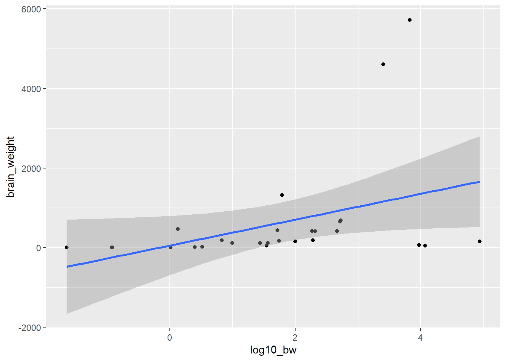

17H) What can you conclude from the 17G plot {-}
What happens to the relation between body_weigt and brain_weight if you excluse all dinosaurs ("Brachiosaurus", "Diplodocus" and "Triceratops") from the dataset?
**Write a short conclusion on this plot.**


```r
library(ggplot2)
no_dinos <- animals_readxl %>%
  dplyr::filter(!animal == "Brachiosaurus" & 
         !animal == "Diplodocus" &
         !animal == "Triceratops") %>%
## create a new variable (log10 transformed body_weight)
    mutate(log10_bw = log10(body_weight)) %>%
## create a new plot  
  ggplot(aes(x = log10_bw, y = brain_weight)) +
    geom_point() +
    geom_smooth(method = "lm")
## call the plot
no_dinos
```

```
## `geom_smooth()` using formula 'y ~ x'
```


