# Assumptions and statistical models {#assumptions}

## References
Input for content of this chapter was derived from [@dsur], [@apm], [@rethinking], [adventr], Applied Predictive Modelling from Max Kuhn and 

https://cran.r-project.org/web/packages/dlookr/vignettes/EDA.html and https://tylerburleigh.com/blog/surviving-the-titanic-with-r-caret/

https://www.geo.fu-berlin.de/en/v/soga/Basics-of-statistics/Continous-Random-Variables/The-Standard-Normal-Distribution/The-Standard-Normal-Distribution-An-Example/index.html

http://msenux2.redwoods.edu/MathDept/R/StandardNormal.php

http://www.cookbook-r.com/Manipulating_data/Changing_the_order_of_levels_of_a_factor/

http://rstudio-pubs-static.s3.amazonaws.com/78857_86c2403ca9c146ba8fcdcda79c3f4738.html

## Introduction
W ith this chapter, I hope to inspire the reader to try and use models (statistical models if you will) to do Exploratory Data Analysis. Although EDA is often said not to depend on statistics, I do not agree. Statistical inference and predictive modeling can learn you a lot about your data and provide valuable inside on where to go next in you analysis. 
There are many good works on statistics and R. Three books stand out and provide valuable information for this chapter:
[@dsur], [@apm], [@rethinking]. For a complete overview and solid work on using R for inference: [@adventr], [@moderndive] and [@dsur]

We will also examine some of the official statistical applications of R in lab 6b and 6c

## Packages

```r
library(tidyverse)
library(AppliedPredictiveModeling)
library(tidyverse)
library(devtools)
library(pastecs)
library(car)
library(e1071)
library(pastecs)
library(caret)
# install_github("profandyfield/adventr")
# library(adventr)
# devtools::install_github("tidymodels/parsnip")
library(parsnip)
library(tidymodels)
library(recipes)
library(moderndive)
library(skimr)
library(gapminder)
```

## Model assumptions
Every model has assumptions that are relevant for the applicability of a model. We must assume that a model is exactly what it is: a model and as such it is a representation of something else. In Data Science we use models to describe or even predict things about the world surrounding us. 

In statistical inference and also for EDA, assumptions are important. They are the prerequisites for the applicability of the models we use. Assumptions for statistical inference and models can be requirements for a distribution type, variable type, number of groups to compare, equality of variance. Usually we consider a statistical test invalid if it is performed on data that does not meet one more assumptions. A robust test is relatively uninfluenced by one or more assumptions. In this chapter, I will not extensively address statistical inference and robustness. We will however learn how to assess whether some common assumptions like distribution requirements and equality of variance between groups are met. After which we will explore how to use models to do EDA and learn some statistical methods to do inference.    

## Variable types
Just as a reminder, there are a number of variable types usually represented in one dataset. We already saw many different types. Basically, if we want to do statistics or modeling using machine learning we have to learn to recognize the different types of variables. A good recap can be foud [here:](https://statistics.laerd.com/statistical-guides/types-of-variable.php) 

In R terminology we can discriminate between these as:

### Categorical: 

 - Character: A variable with a set of discrete outcomes that can be ordered (ordinal) or have an arbitrary order.
 - A Factor: Usually derived from a categorical variable. Usually conveys something on the grouping structure of the data. Can be ordinal (ordered factor), nominal (unordered factor) or dichotomous (ordered or unordered, two levels). A dichotomous factor is especially of interest when dealing with classification problems. Dichotomous (dependent) variables are usually easier to train a machine learning model for.
 - A logical variable type is by definition dichotomous in nature and can contain the values TRUE or FALSE (or 1 and 0) only.

### Continuous:

 - A numeric variable can be an integer (ratio) variable or an interval variable. In R we call interval variables 'doubles'. Statistically, there is a strong relationship between  

Depending on the analysis method used and the question at hand we can have one or multiple independent (predictor) variables. Usually we have one dependent variable for a specific analysis question. R has a convenient formula interface that is used in many statistical methods and machine learning implementations. The formula interface of R denotes dependent and independent (or so-called 'predictor' variables) as:

$formula = dependent \sim predictor$ 

or if multiple predictors are used:
$formula = dependent \sim predictor1 + predictor2 + predictor3$ 

or, if used in comparing the effect of multiple independent variables on the group means, e.g. in an ANOVA. Below we specify the effect of predictor1 on dependent, the effect of predictor2 on dependent and the interaction of predictor1 and predictor2 on dependent:
$formula = dependent \sim predictor1 * predictor2$

We will see some examples of this in Lab 6b and 6c.

## The normal distribution

In statistics, there is a lot of fuzz around the Normal Distribution:
Many continuous variables follow a specific distribution called the Normal Distribution. Because many inferential statistical methods rely upon a variable being normally distributed (or at least approach it), we will look in more detail at this type of distribution. 

A distribution of a variable $x$ is said to be normally distributed if the frequency distribution of $x$ can be represented by this formula:

$f(x) = \frac{1}{\sqrt{2\pi\delta^2}} exp(-\frac{1}{2}(x-\mu)^2/\delta)$

The details of this formula are not so important here and we will not do any mathematical derivations. One remarkable thing about this formula stands out however. Are you able to spot what this is?...

Yes, you probably spotted the fact that a normal distribution is marked only by the mean ($\mu$) and the standard deviation ($\delta$) of a variable.

A normal distribution with $\mu = 0$ and $\delta = 1$ is called the `Standard Normal Distribution` 

### <mark>**EXERCISE 1; The Standard Normal Distribution**</mark> {-} 

In R we can easily experiment with the characteristics of the Normal Distribution

A) Rewrite the function of the Normal Frequency Distribution for $\mu = 0$ and $\delta = 1$  

B) The code below simulates the creation of 200 uniformly distributed random values of `x` between -4 and +4). The respective resulting graph is a graphical representation of the Standard Normal Distribution. To generate a sequence of normally distributed random values we can use the `rnorm()` function. This function uses the above-mentioned Normal Frequency Distribution Function under the hood, so we do not have to worry about the mathematics.   


```r
set.seed(1234999)
normals <- rnorm(n = 100, mean = 0, sd = 1) %>%
  enframe()

## determine mean and sd of our simulated random normals (should approach 0 and 1 resp.)
mean(normals$value)
```

```
## [1] 0.04725584
```

```r
sd(normals$value)
```

```
## [1] 0.9672451
```

```r
## 
hist(normals$value)
```

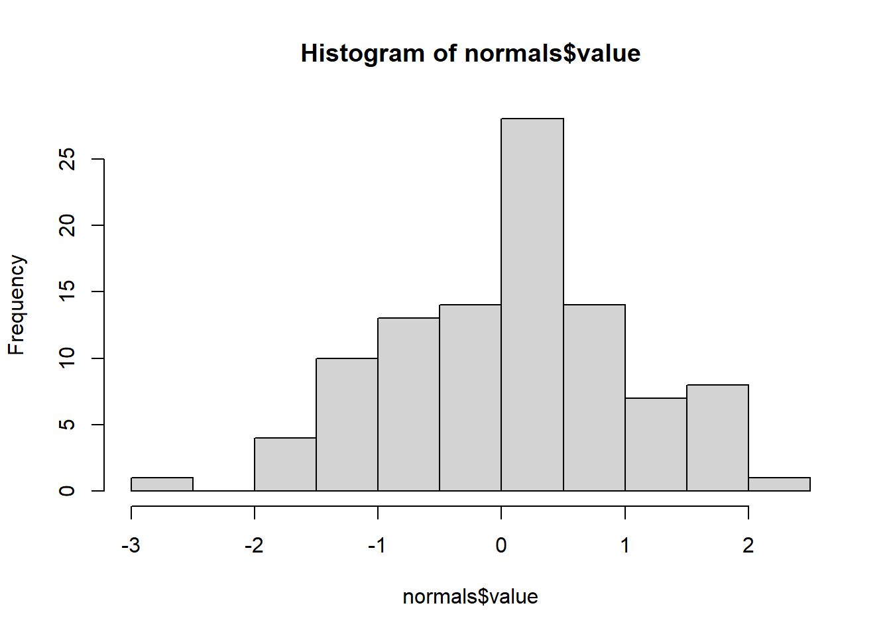

```r
## plot
normals %>%
ggplot(aes(x=value)) + 
  stat_function(fun = dnorm, colour = "red", size = 1) +
  xlim(c(-4, 4)) 
```

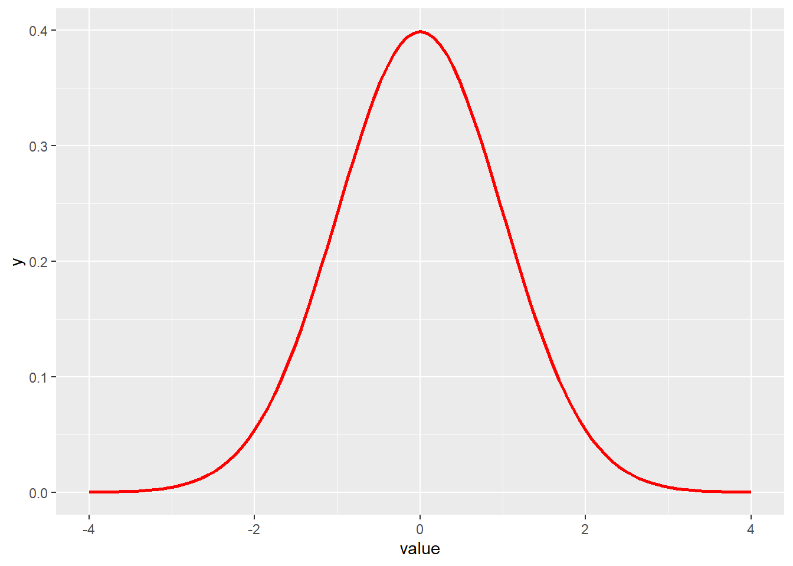

```r
## resampling

sample_1 <- sample_n(normals, 100, replace = TRUE)
mean(sample_1$value)
```

```
## [1] 0.1968376
```

```r
sample_2 <- sample_n(normals, 100, replace = TRUE)
mean(sample_2$value)  
```

```
## [1] 0.003821869
```

```r
## homework:
## create a function that generates 1000 boostrapped samples of the mean form the 'normal$value' sample
## plot a histogram of the 1000 mean-estimates
```

C) Add the `mean` and the `sd` as a vertical (dashed) line to the graph from B)


```r
normals %>%
ggplot(aes(x=value)) + 
  stat_function(fun = dnorm, colour = "red", size = 1) +
  xlim(c(-4, 4)) +
  geom_vline(xintercept = mean(normals$value), colour = 'blue', linetype = 'dashed') +
  geom_vline(xintercept = sd(normals$value), colour = 'darkblue', linetype = 'dashed') +
  geom_vline(xintercept = -sd(normals$value), colour = 'darkblue', linetype = 'dashed')
```


D) Why are the mean and sd of the simulated data (`value` variable in the `normals` data frame not exactly equal to 0 and 1 respectively?

### ---- EXERCISE END ---- {-} 

## Investigating your own data
To see if your own data is approaching a normal distribution we can start with plotting the density distribution of your dependent variable. Let's assume (I know it is hard) that we collect data on a number of cars ;-). On the basis of the data for miles per gallon we would like to get a prediction how these data would look if they would follow a normal distribution.


```r
ggplot(mtcars, aes(x = mpg)) +
stat_function(
fun = dnorm,
args = with(mtcars, c(mean = mean(mpg), sd = sd(mpg)))
) + scale_x_continuous("Miles per gallon")
```

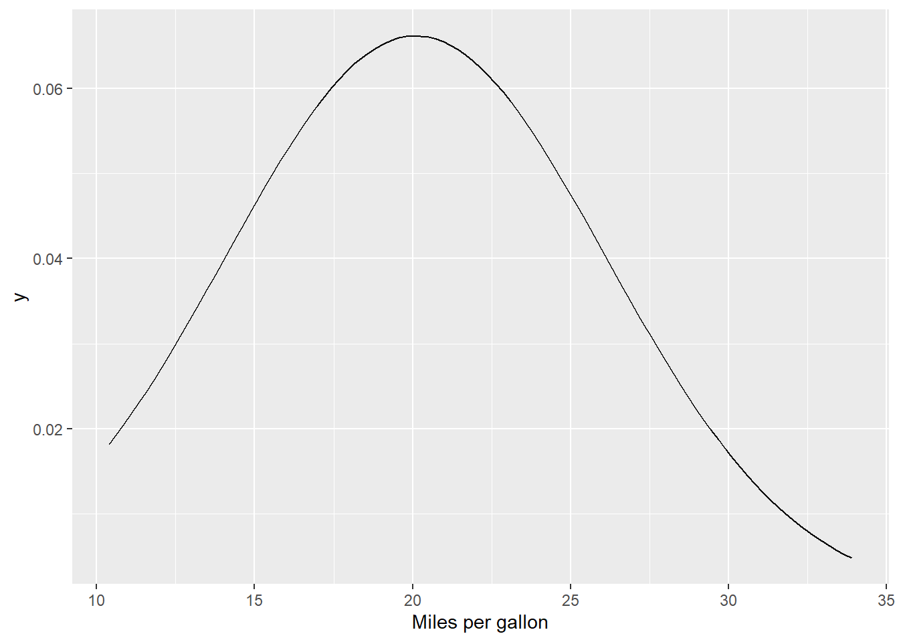

We can than overlay the actual distribution as a histogram


```r
ggplot(mtcars, aes(x = mpg)) +
  stat_function(
    fun = dnorm,
    args = with(mtcars, c(mean = mean(mpg), sd = sd(mpg)))) + 
  scale_x_continuous("Miles per gallon") +
  geom_histogram(aes(y=..density..),      
                   binwidth = 1,
                   colour = "red")
```


```r
## or density
ggplot(mtcars, aes(x = mpg)) +
  stat_function(
    fun = dnorm,
    args = with(mtcars, c(mean = mean(mpg), sd = sd(mpg)))) + 
  scale_x_continuous("Miles per gallon") +
  geom_density(aes(y=..density..),      
                   binwidth = 1,
                   colour = "red")
```

```
## Warning: Ignoring unknown parameters: binwidth
```


Here we can see that the `miles per gallon (mpg)` variable somewhat deviates from the the expected curve. The red curve that is displayed shows some additional observation between 25 and 35 mpg that were not 'predicted' by the normal distribution curve. The actual mean is also somewhat higher than the 'predicted' mean. We call this 'scewing'. Here the observations are skewed to the right. The actual mean lies to the right of the predicted mean. 

As long as the deviation is 'not to big' we can safely assume normality. 

**Preparing data for statistical analysis or predictive modeling always means that you have to study the data distributions. Each modeling or inference technique has assumptions that more or less influence the usefulness of the method (an the validity of the conclusions), if these assumptions are violated.**

We will later see that there are also formal ways of checking normality with a statistical test, but always look at the graphs too!

## Using normal distributions in practice
The mtcars dataset is all well for examples but not very exciting and we leave it behind now.

Let's look at a real world example where a number of 'features' (you could also call them predictors) were collected from a larger number of students. 
This dataset was derived from [Hartmann, K., Krois, J., Waske, B. (2018): E-Learning Project SOGA: Statistics and Geospatial Data Analysis. Department of Earth Sciences, Freie Universitaet Berlin.](https://www.geo.fu-berlin.de/en/v/soga/)

### <mark>**EXERCISE 2; Using distributions to do predictions**</mark> {-} 

Assuming a variable follows a normal distribution leaves us with the possibility to assess the probability for which a certain value (or range of values) for x is to be observed, under the assumption of normality. This may sounds a bit cryptic, but I will show you an example. After that we will move on to use the normal distribution to compare if the means of two distributions are the same or different.  

### Example data 
The students dataset can be found via this url: `https://userpage.fu-berlin.de/soga/200/2010_data_sets/students.csv`  

A) Download the data and load it into a tibble called `data_students`


B) Explore the variable names and write a short data-journal on which is what (we will need this for later use)

```r
names(data_students)
```

```
##  [1] "stud.id"         "name"            "gender"          "age"            
##  [5] "height"          "weight"          "religion"        "nc.score"       
##  [9] "semester"        "major"           "minor"           "score1"         
## [13] "score2"          "online.tutorial" "graduated"       "salary"
```

C) Explore the `height`, `weight`, `age` and `gender` variables individually and their relationship using at least a scatter plot with color aesthetics and facets if necessary. Especially study the data distributions for height.


D) Generate a histogram of all the values in the `height`variable. Overlay this histogram with a predicted normal distribution.

```r
data_students %>%
ggplot(aes(x = height)) +
  stat_function(
    fun = dnorm,
    args = with(data_students, c(mean = mean(height), sd = sd(height)))) + 
  scale_x_continuous("Height") +
  geom_density(aes(y=..density..),      
                   binwidth = 1,
                   colour = "red") +
  ylab("Density")
```

```
## Warning: Ignoring unknown parameters: binwidth
```

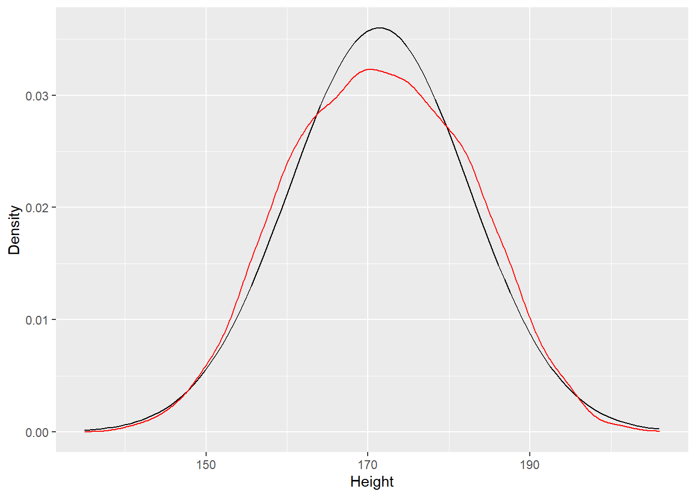

**What is your conclusion about the shape of the actual distribution vs the predicted distribution, under assumtion of normality?

E) Generate a histogram of the values in the `height`variable, by `gender` using color aesthetics. Overlay these histograms for their theoretical normal distributions.

**TIP**

 - Create two separate dataframes for the male and the femal data
 - Adopt the code above where we used the mtcars dataset to plot the actual and predicted (normal) distribution for males and female in a plot. Assign colors to discriminate between the sexes.


```r
data_males <- data_students %>%
  dplyr::filter(gender == "Male")

data_females <- data_students %>%
  dplyr::filter(gender == "Female")

data_students %>%
ggplot(aes(x = height)) +
  stat_function(
    fun = dnorm,
    args = with(data_males, c(mean = mean(height), sd = sd(height))),
    colour = "darkblue") +
  stat_function(
    fun = dnorm,
    args = with(data_females, c(mean = mean(height), sd = sd(height))),
    colour = "darkred") + 
  scale_x_continuous("Height") +
  geom_density(aes(colour = gender))
```

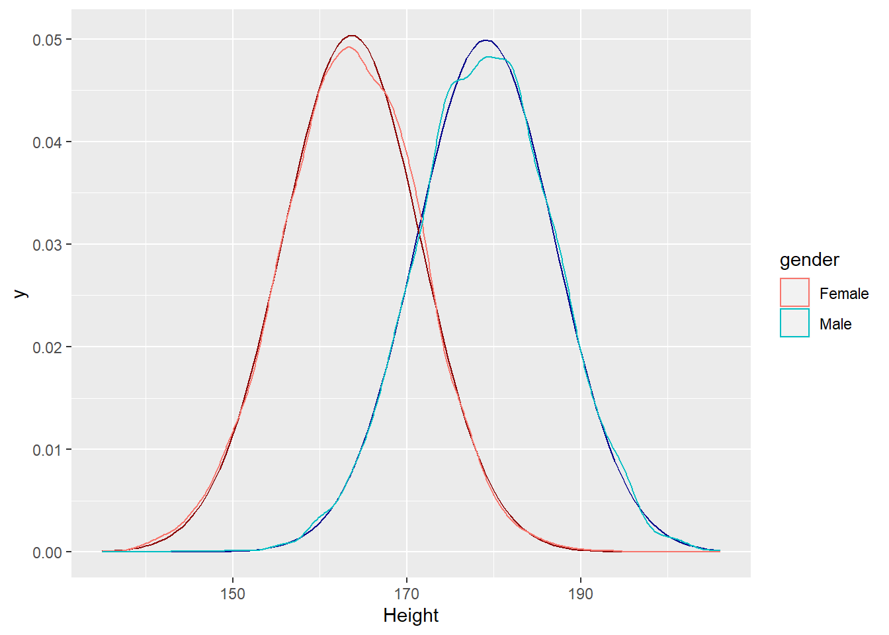


G) What is your conclusion on the total and split by gender distributions for the height variable in the `data_students` dataset in terms of assumptions met for normality?

### ---- EXERCISE END ---- {-}

### Checking the assumption that a distribution is not significantly different from normal in a more formal way

One additional way to check normality is by plotting the actual quantiles vs the theoretical quantiles. This plot is called a QQ or 'quantile-quantile' plot. If the points (actual) lie close to the line (theoretical) this means that the distribution is fairly normal. If the deviation is big, this means that the distribution of your data is probably deviating from normality as well.   


```r
qqnorm(data_females$height, main = 'Q-Q plot for the height of female students')
qqline(data_females$height, col = 3, lwd = 2)
```


## Performing a test to check for normality
We can formally assess whether a distribution adheres to the normality assumption with a statitical test called the 'Shapiro' test. Be aware that this test is only reliable when the amount of datapoints is not to big. Data with a huge number of observations tend to always approach normality.

Let's execute the Shapiro test on our 'students' dataset. Here I use a bit more sofiscation to test all variables in the students dataset for normality, when we split by gender. 

We use the 'split' -> 'nest' -> 'iterate' approach here.


```r
data_students %>%
  group_by(gender) %>%
  nest() -> data_nested_students

ind <- map_lgl(data_nested_students$data[[1]], is.numeric) 

## Females  
map(data_nested_students$data[[1]][, ind], shapiro.test) 
```

```
## $stud.id
## 
## 	Shapiro-Wilk normality test
## 
## data:  .x[[i]]
## W = 0.95535, p-value < 2.2e-16
## 
## 
## $age
## 
## 	Shapiro-Wilk normality test
## 
## data:  .x[[i]]
## W = 0.46413, p-value < 2.2e-16
## 
## 
## $height
## 
## 	Shapiro-Wilk normality test
## 
## data:  .x[[i]]
## W = 0.99824, p-value = 0.0001472
## 
## 
## $weight
## 
## 	Shapiro-Wilk normality test
## 
## data:  .x[[i]]
## W = 0.98563, p-value < 2.2e-16
## 
## 
## $nc.score
## 
## 	Shapiro-Wilk normality test
## 
## data:  .x[[i]]
## W = 0.94027, p-value < 2.2e-16
## 
## 
## $score1
## 
## 	Shapiro-Wilk normality test
## 
## data:  .x[[i]]
## W = 0.97164, p-value < 2.2e-16
## 
## 
## $score2
## 
## 	Shapiro-Wilk normality test
## 
## data:  .x[[i]]
## W = 0.97175, p-value < 2.2e-16
## 
## 
## $online.tutorial
## 
## 	Shapiro-Wilk normality test
## 
## data:  .x[[i]]
## W = 0.60985, p-value < 2.2e-16
## 
## 
## $graduated
## 
## 	Shapiro-Wilk normality test
## 
## data:  .x[[i]]
## W = 0.44587, p-value < 2.2e-16
## 
## 
## $salary
## 
## 	Shapiro-Wilk normality test
## 
## data:  .x[[i]]
## W = 0.99787, p-value = 0.5636
```

```r
vector <- c(1:10)

shapiro.test(vector)
```

```
## 
## 	Shapiro-Wilk normality test
## 
## data:  vector
## W = 0.97016, p-value = 0.8924
```

```r
# H0 = Shapiro = Distributie is normaal verdeeld

# %>%
#   map(., broom::tidy) %>% dplyr::bind_rows() %>%
#     mutate(var = names(data_nested_students$data[[1]][ind]),
#            gender = data_nested_students$gender[1]) -> shapiros_female
# 
## Males
map(data_nested_students$data[[2]][, ind], shapiro.test) %>%
  map(., broom::tidy) %>% dplyr::bind_rows() %>%
    mutate(var = names(data_nested_students$data[[2]][ind]),
           gender = data_nested_students$gender[2]) -> shapiros_male

map(data_nested_students$data[[1]][, ind], shapiro.test) %>%
  map(., broom::tidy) %>% dplyr::bind_rows() %>%
    mutate(var = names(data_nested_students$data[[1]][ind]),
           gender = data_nested_students$gender[1]) -> shapiros_female


dplyr::bind_rows(shapiros_female, shapiros_male) %>%
  mutate(p.value = round(p.value, 6)) -> shapiros
```

Let's examine the results:
The H0 for the Shapiro is that the data is normally ditributed. If the p value is very low, we can reject this H0 and state that we have reason the believe that the data sampled was not derived from a normal distribution.

Let's plot the results (p.values and variable names) in graph 

```r
shapiros %>%
  ggplot(aes(x = var, y = log10(p.value))) +
  geom_col(position = "dodge") +
  facet_wrap(~gender) +
  coord_flip()
```


We see here that this formal test may warrant a different conclusion than we previously drew from the qq-plot and the visual inspection of the distributions for the height variable. 
Like most statistical significance tests, if the sample size is sufficiently large this test may detect even trivial departures from the null hypothesis (i.e., although there may be some statistically significant effect, it may be too small to be of any practical significance); thus, additional investigation of the effect size is typically advisable, e.g., a Q–Q plot in this case. A good rule is to give precedence to graphs and visual inspection, above formal (black box) tests. The number of observations here is pretty large (> 4000 per group), so we might conclude that the distribution is normal for the weight variable and that the Shapiro test gives us an overestimation of departure form normality here.


```r
data_students %>%
  group_by(gender) %>%
  count()
```

```
## # A tibble: 2 x 2
## # Groups:   gender [2]
##   gender     n
##   <chr>  <int>
## 1 Female  4110
## 2 Male    4129
```

What is interesting from the Shapiro graph though is that the `salary` variable shows a rather large p.value (for females: 0.564). I did expect a variable such as income to be normaly distributed in this data. 

## EXERCISE xx {-}
Inspect the salary variable for both gender and show in a number of graphs how the distribution is related to `gender`, `age`, `graduated` and `major`. Look at the actual and theoretical distribution for `salary`, in relation to a major predictor. Can you see a pattern that is worhwhile investigating further?


```r
## distributions
data_students %>%
  ggplot(aes(x = salary)) +
  geom_density(aes(colour = gender))
```

```
## Warning: Removed 6486 rows containing non-finite values (stat_density).
```


```r
## actual vs theoretical


## Age and salary, vs major
data_students %>%
  ggplot(aes(x = age, y = salary)) +
  facet_grid(gender ~ major) +
  geom_point()
```

```
## Warning: Removed 6486 rows containing missing values (geom_point).
```


```r
qqnorm(data_females$salary, main = 'Q-Q plot for the salary of female students')
qqline(data_females$salary, col = 3, lwd = 2)
```


If we look at the relationship between age, gender and major, can you think of an approach with which to study whether there is a true difference between gender, irrespective of major and whether there is true difference between majors, irrespective of gender. And whether gender and major are interacting factors, and whether age has any bearing on salary (in combination of the other factors, or considered in isolation)?

Write a short summary on how you would go about tackling the above analysis.

This plot might be of assistance:

```r
data_students %>%
  group_by(gender, major, age) %>%
  summarise(mean_salary = mean(salary, na.rm = TRUE)) %>%
  ggplot(aes(x = age, y = mean_salary)) +
  geom_point(aes(colour = gender)) +
  geom_smooth(aes(group = gender, colour = gender), se = FALSE, method = "lm") +
  facet_wrap(~ major)
```

```
## `summarise()` regrouping output by 'gender', 'major' (override with `.groups` argument)
```

```
## `geom_smooth()` using formula 'y ~ x'
```

```
## Warning: Removed 178 rows containing non-finite values (stat_smooth).
```

```
## Warning: Removed 178 rows containing missing values (geom_point).
```

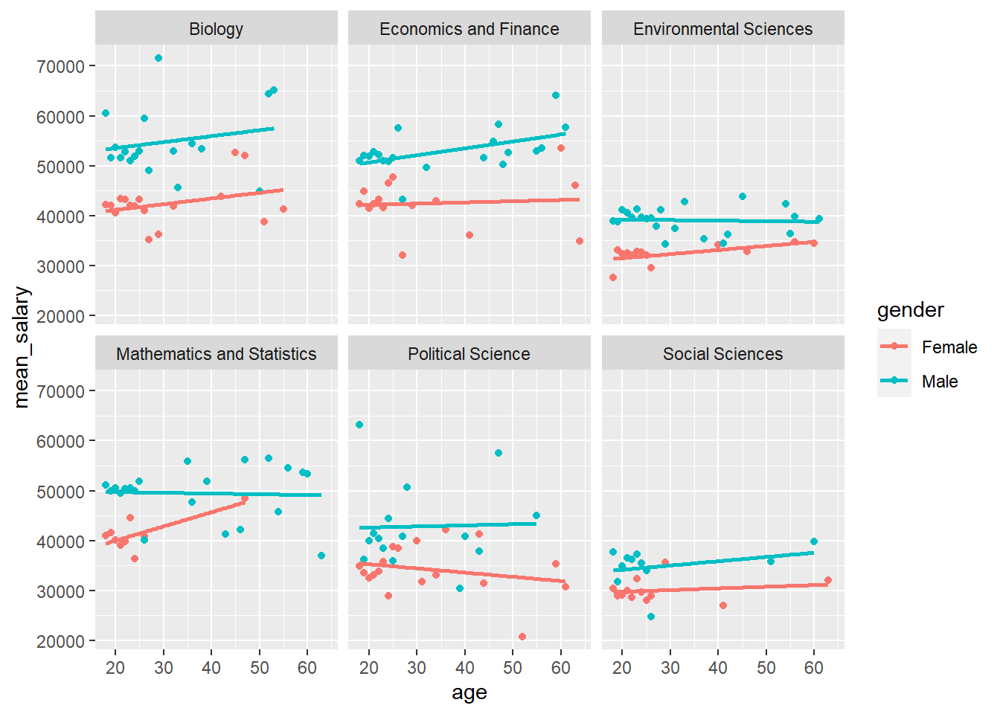


## Data transformations

We can formally assess whether a distribution is normal.
Below is a complete worked out example on how to test for the assumption of normality and equality of variance. The example is taken from [@dsur].

### Read in the 'Festival Dataset' from [@dsur]:

```r
dlf <- read_delim(file = here::here("data", 
                                   "DownloadFestival.dat"), 
                                   delim =  "\t", na = c("", " "))
```

```
## 
## -- Column specification --------------------------------------------------------
## cols(
##   ticknumb = col_double(),
##   gender = col_character(),
##   day1 = col_double(),
##   day2 = col_double(),
##   day3 = col_double()
## )
```

```r
dlf %>% head(3)
```

```
## # A tibble: 3 x 5
##   ticknumb gender  day1  day2   day3
##      <dbl> <chr>  <dbl> <dbl>  <dbl>
## 1     2111 Male    2.64  1.35  1.61 
## 2     2229 Female  0.97  1.41  0.290
## 3     2338 Male    0.84 NA    NA
```

Checking missing values, distributions and detecting outliers

```r
sum(is.na(dlf))
```

```
## [1] 1233
```

```r
x <- summary(dlf)
min_maxs <- x[c(1, 6), c(3:5)] %>% unlist() %>% print()
```

```
##       day1             day2             day3       
##  Min.   : 0.020   Min.   :0.0000   Min.   :0.0200  
##  Max.   :20.020   Max.   :3.4400   Max.   :3.4100
```

```r
naniar::vis_miss(dlf)
```

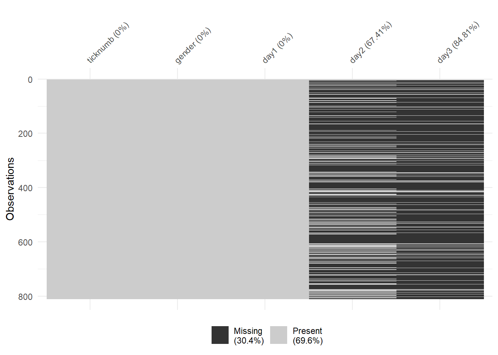

Detecting an outlier with a histogram

```r
hist.outlier <- ggplot(dlf, aes(day1)) + 
  geom_histogram(aes(y=..density..), 
                 colour="black", 
                 fill="white") + 
  labs(x="Hygiene score on day 1", y = "Density") +
  theme(legend.position = "none")
hist.outlier
```

```
## `stat_bin()` using `bins = 30`. Pick better value with `binwidth`.
```


`{ggplot2}` works best with long or so-called stacked datasets.

```r
dlf_long <- dlf %>% 
  tidyr::gather(day1:day3, key = "days", value = "hygiene_score")
dlf_long
```

```
## # A tibble: 2,430 x 4
##    ticknumb gender days  hygiene_score
##       <dbl> <chr>  <chr>         <dbl>
##  1     2111 Male   day1           2.64
##  2     2229 Female day1           0.97
##  3     2338 Male   day1           0.84
##  4     2384 Female day1           3.03
##  5     2401 Female day1           0.88
##  6     2405 Male   day1           0.85
##  7     2467 Female day1           1.56
##  8     2478 Female day1           3.02
##  9     2490 Male   day1           2.29
## 10     2504 Female day1           1.11
## # ... with 2,420 more rows
```

Boxplots with outlier

```
## Warning: Removed 1233 rows containing non-finite values (stat_boxplot).
```

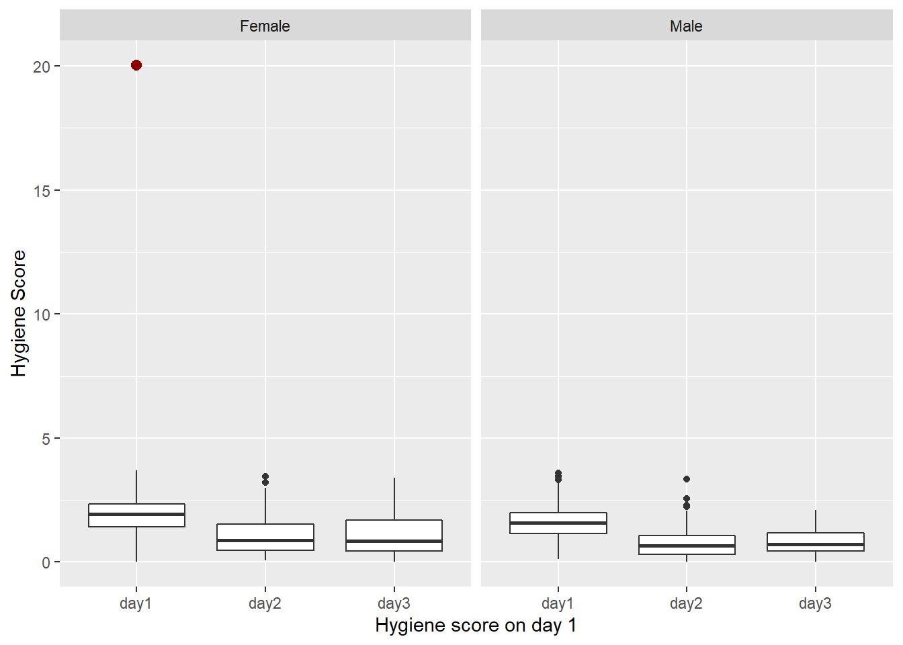


### <mark>**EXERCISE 1; Removing outliers and distributions**</mark> {-} 

A) Remove the outlier identified above


B) Create a new series of boxplots split by `gender` and `day` 


C) Create a plot showing all the data, except for the one outlier you just removed. Think about whether you need to fix overplotting by some smart trick.   


D) Create a plot showing the distributions for `hygiene_score` for each day. Disregard any difference in gender. *Is this a safe assumtion?*


E) Are these distributions following a Gaussian bell-shaped curve?

### ---- EXERCISE END ---- {-}


### How would the distribution look if it were Gaussian?
We add the simulated normal distributions to the original dataframe and create a new stacked version. We set the seed for reproducibility.

Compare the real distributions to the 'predicted' distributions. Try discribing what you see.

```r
set.seed(123)
## add normal distribution to the data (based on observed mean and sd per day)
dlf_norm <- dlf %>%
  mutate(
    norm_day_1 = rnorm(
      mean = mean(dlf$day1, na.rm = TRUE), 
      n = nrow(dlf), 
      sd = sd(dlf$day1, na.rm = TRUE)),
    norm_day_2 = rnorm(
      mean = mean(dlf$day2, na.rm = TRUE), 
      n = nrow(dlf), 
      sd = sd(dlf$day2, na.rm = TRUE)),
    norm_day_3 = rnorm(
      mean = mean(dlf$day3, na.rm = TRUE), 
      n = nrow(dlf), 
      sd = sd(dlf$day3, na.rm = TRUE))) %>%
  dplyr::select(gender, norm_day_1:norm_day_3) %>%
  tidyr::gather(norm_day_1:norm_day_3, 
                key = "days", 
                value = "norm_hygiene_score")
  

## add to plot
dlf_long %>%
  dplyr::filter(!hygiene_score > 19) %>%
  ggplot(aes(x = hygiene_score)) +
  geom_density(aes(colour = days)) +
  geom_density(data = dlf_norm, aes(x = norm_hygiene_score,
                                    colour = days)) +
  facet_wrap(~days)
```


### Q-Q Plot
The quantile-quantile plot shows the realtionship between the true data distribution and the estimated distribution, under the assumption of Gaussian (or normal) distribution.

Q-Q plot for day 1

```r
## see the file ggqq.R for the function definition
source(file = here::here("code", "ggqq.R"))
gg_qq_1 <- gg_qq(dlf$day1)
```


```r
gg_qq_1
```

```
##      25%      75% 
## 1.770000 0.681997
```

Q-Q Day 2

```r
gg_qq_2 <- gg_qq(dlf$day2)
```

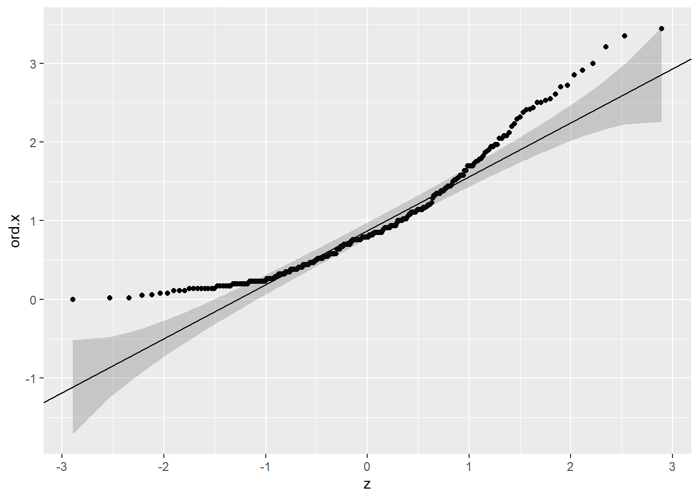

```r
gg_qq_2
```

```
##       25%       75% 
## 0.8725000 0.6857035
```
Clearly not normally distributed

Q-Q Day 3

```r
gg_qq(dlf$day3)
```

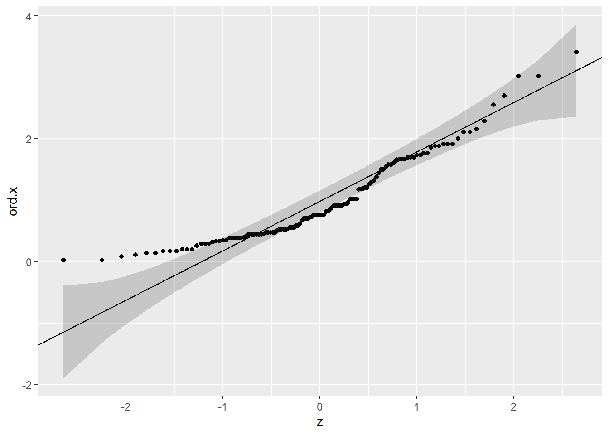

```
##       25%       75% 
## 0.9825000 0.8043117
```
Not evenly distributed and not a good fit to the estimated distribution. Not normally distributed

## Skewness and kurtosis
Skewness and kurtosis are parameters that display the deviation from normality looking at the shape of the distribution polynom. A distribution with an absolute `skew.2SE` > 1 is significantly skewed and not normal. A distribution with an absolute `kurt.2SE` > 1 has significant kurtosis and is not normally distributed. 

`kurt.2SE` and `skew.2SE` are calculated from

 - $kurt.2SE = kurt / 2*(standard.error)$ 
 - $skew.2SE = skew / 2*(standard.error)$
 
## `Shapiro-Wilk test` 
To test for normality we can use the `Shapiro-Wilk test`. This test checks whether the deviation from normality is significant (H0) or not (H1), 

 - p-value < 0.05 means that the distribution is significantly different from a normal distribution: assumption "the distribution is not normal"
 - p-value > 0.05 means that the distribution is not significantly different from normal: assumption "the distribution cannot be proved to deviate from normal"
 
## <mark>**EXERCISE 2; Discriptive statistics** </mark>

Here we use `stat.desc()` function from the `{pastecs}` package, to get descriptive statistics for a dataframe or a variable. 

A) Look at the help function of `stat.desc()`. what do the arguments `basic` and `norm` do?

B) Run the `stat.desc` function on the `dlf` dataframe. Try getting descriptive statitics for each day seperatly 


```r
library(pastecs)
round(stat.desc(dlf[, c("day1", "day2", "day3")], basic = FALSE, norm = TRUE), digits = 3)
```

```
##                day1  day2  day3
## median        1.790 0.790 0.760
## mean          1.771 0.955 0.977
## SE.mean       0.024 0.044 0.064
## CI.mean.0.95  0.048 0.087 0.127
## var           0.482 0.513 0.504
## std.dev       0.694 0.716 0.710
## coef.var      0.392 0.750 0.727
## skewness     -0.003 1.097 1.008
## skew.2SE     -0.018 3.653 2.309
## kurtosis     -0.424 0.829 0.595
## kurt.2SE     -1.235 1.386 0.686
## normtest.W    0.996 0.908 0.908
## normtest.p    0.032 0.000 0.000
```

```r
## or 
descriptives <- map(dlf, stat.desc, basic = FALSE, norm = TRUE) 
```

### ---- EXERCISE END ---- {-}

## Levene's Test
The Levene Test can be used to asses whether the variance for two or more distributions is equal. As always, when using the Levene Test it is important to assess also visually if the outcome of the statitical test makes sense. 


```r
leveneTest(dlf$day1, dlf$day2)
leveneTest(data = dlf_long, hygiene_score ~ days)
# leveneTest(data = dlf_long, hygiene_score ~ days * gender)

dlf_long %>%
  ggplot(aes(x = hygiene_score, y = ticknumb)) +
  geom_point(aes(colour = days)) +
  facet_wrap(days ~ gender, nrow = 3)
```
A significant Levene Test indicates that the H0 = variances are equal does not hold and can be rejected. So if we look at the days as a factor, variance is equal over the days, but if we also take gender into consideration, we see that the variances between all groups are not equal.

## Transforming data

 - To remove skewness or kurtosis
 - Apply the __*same*__ transformation to __*all variables*__
 - After transformation and analysis or especially with predictions, sometimes you need to inverse-transform to make sense of the outcome. 
 - It can be a time comsuming process: 'trial-and-error'

### Log, square root and inverse
Sometimes skewness can be greatly reduced by applying a log (10, n or 2) transformation to the data.

### Center and scale
Centering and scaling is the most simple transfromation. 
When centering a variable, the average value is subtracted from all the values, resulting in a zero mean. To scale the data, each value of the variable is divided by its standard deviation. We will see below in an EXERCISE how to explore whether transformations work.

### <mark>**EXERCISE 3; Exploring data with `{dlookr}`, transformations.**</mark> {-}

A) The `{dlookr}` package can automate a number of exploratory tasks. Have a look at the vignette here: 
https://cran.r-project.org/web/packages/dlookr/vignettes/EDA.html

B) Look at the `help()` for functions
`normality()` and 
`plot_normality()` of the `{dlookr}` package. Try confirming with these functions what we already know about normality of the `hygiene_score` by `day`.

**Remember, the H0 for Shapiro: 'Distribution == Normal', so a significant P rejects the H0 and therefore indicates deviance from normality.**


C) Does this confirm the previous analysis? Is there a candidate for transformation you could try?

### ---- EXERCISE END ---- {-}


## Formal inference of the Festival data
Let's assume we can make the data fairly normal by doing a $\sqrt{yi}$ transformation on every measured `hygiene_score`. When we do this transformation, the distribution for day 2 and 3 approaches normality much better, but for Day 1 it slightly deteriorates. Let's stick with this for now.

Under the assumption of normality, and the realization that this is not completely met, we can do a two way anova on the data. We include gender and days as predictors to the transformed hygiene score.


```r
lm_festival <- lm(data = dlf_long_new, hygiene_score_sqrt ~ gender + days)

summary(lm_festival)
```

```
## 
## Call:
## lm(formula = hygiene_score_sqrt ~ gender + days, data = dlf_long_new)
## 
## Residuals:
##      Min       1Q   Median       3Q      Max 
## -1.20437 -0.19688  0.02092  0.20384  0.99193 
## 
## Coefficients:
##             Estimate Std. Error t value Pr(>|t|)    
## (Intercept)  1.34579    0.01288  104.46  < 2e-16 ***
## genderMale  -0.11693    0.01813   -6.45 1.63e-10 ***
## daysday2    -0.39049    0.02173  -17.97  < 2e-16 ***
## daysday3    -0.37095    0.02969  -12.49  < 2e-16 ***
## ---
## Signif. codes:  0 '***' 0.001 '**' 0.01 '*' 0.05 '.' 0.1 ' ' 1
## 
## Residual standard error: 0.3065 on 1192 degrees of freedom
## Multiple R-squared:  0.2781,	Adjusted R-squared:  0.2763 
## F-statistic: 153.1 on 3 and 1192 DF,  p-value: < 2.2e-16
```

```r
anova(lm_festival) 
```

```
## Analysis of Variance Table
## 
## Response: hygiene_score_sqrt
##             Df  Sum Sq Mean Sq F value    Pr(>F)    
## gender       1   4.477  4.4766  47.642 8.296e-12 ***
## days         2  38.670 19.3348 205.766 < 2.2e-16 ***
## Residuals 1192 112.006  0.0940                      
## ---
## Signif. codes:  0 '***' 0.001 '**' 0.01 '*' 0.05 '.' 0.1 ' ' 1
```

From this output we see (under the earlier mentioned restrictions, uncertainties and assumptions) that both gender and days have a significant affect on the outcome for the (transformed) hygiene score.

We can include the interaction between these predictors by specifying `gender * days` in the model. There is no significant interaction. Can you formulate in your own words what this could mean?


```r
lm_festival <- lm(data = dlf_long_new, hygiene_score_sqrt ~ gender * days)
anova(lm_festival)
```

```
## Analysis of Variance Table
## 
## Response: hygiene_score_sqrt
##               Df  Sum Sq Mean Sq F value    Pr(>F)    
## gender         1   4.477  4.4766  47.619 8.393e-12 ***
## days           2  38.670 19.3348 205.670 < 2.2e-16 ***
## gender:days    2   0.136  0.0679   0.722     0.486    
## Residuals   1190 111.870  0.0940                      
## ---
## Signif. codes:  0 '***' 0.001 '**' 0.01 '*' 0.05 '.' 0.1 ' ' 1
```

A post hoc analysis to see where the differences are: I illustrate two different way, using two different packages. Bonferroni corrrection is to compensate for multiple comparisons (in this case we have three comparisons for 'days' and one comparison for 'gender'). I will not go into detail here.

```r
library(agricolae)
```

```
## 
## Attaching package: 'agricolae'
```

```
## The following objects are masked from 'package:e1071':
## 
##     kurtosis, skewness
```

```r
library(emmeans)
```

```
## 
## Attaching package: 'emmeans'
```

```
## The following object is masked from 'package:devtools':
## 
##     test
```

```r
emmeans::emmeans(lm_festival, ~days)
```

```
## NOTE: Results may be misleading due to involvement in interactions
```

```
##  days emmean     SE   df lower.CL upper.CL
##  day1  1.289 0.0111 1190    1.267    1.310
##  day2  0.893 0.0193 1190    0.855    0.930
##  day3  0.916 0.0278 1190    0.862    0.971
## 
## Results are averaged over the levels of: gender 
## Confidence level used: 0.95
```

```r
emmeans::emmeans(lm_festival, ~gender)
```

```
## NOTE: Results may be misleading due to involvement in interactions
```

```
##  gender emmean     SE   df lower.CL upper.CL
##  Female   1.10 0.0156 1190    1.065     1.13
##  Male     0.97 0.0179 1190    0.934     1.00
## 
## Results are averaged over the levels of: days 
## Confidence level used: 0.95
```

```r
agricolae::LSD.test(lm_festival, "days", console = TRUE, p.adj = "bonferroni")
```

```
## 
## Study: lm_festival ~ "days"
## 
## LSD t Test for hygiene_score_sqrt 
## P value adjustment method: bonferroni 
## 
## Mean Square Error:  0.09400872 
## 
## days,  means and individual ( 95 %) CI
## 
##      hygiene_score_sqrt       std   r       LCL       UCL       Min      Max
## day1          1.3002586 0.2832933 809 1.2791091 1.3214080 0.1414214 1.920937
## day2          0.9092350 0.3670301 264 0.8722119 0.9462580 0.0000000 1.854724
## day3          0.9216026 0.3580432 123 0.8673624 0.9758429 0.1414214 1.846619
## 
## Alpha: 0.05 ; DF Error: 1190
## Critical Value of t: 2.39737 
## 
## Groups according to probability of means differences and alpha level( 0.05 )
## 
## Treatments with the same letter are not significantly different.
## 
##      hygiene_score_sqrt groups
## day1          1.3002586      a
## day3          0.9216026      b
## day2          0.9092350      b
```

```r
agricolae::LSD.test(lm_festival, "gender", console = TRUE, p.adj = "bonferroni")
```

```
## 
## Study: lm_festival ~ "gender"
## 
## LSD t Test for hygiene_score_sqrt 
## P value adjustment method: bonferroni 
## 
## Mean Square Error:  0.09400872 
## 
## gender,  means and individual ( 95 %) CI
## 
##        hygiene_score_sqrt       std   r      LCL      UCL       Min      Max
## Female           1.224662 0.3604338 721 1.202259 1.247065 0.1414214 1.920937
## Male             1.099628 0.3471971 475 1.072027 1.127229 0.0000000 1.892089
## 
## Alpha: 0.05 ; DF Error: 1190
## Critical Value of t: 1.961959 
## 
## Groups according to probability of means differences and alpha level( 0.05 )
## 
## Treatments with the same letter are not significantly different.
## 
##        hygiene_score_sqrt groups
## Female           1.224662      a
## Male             1.099628      b
```

There is lot we can bring to the table to discuss this formal inference of this dataset. We know that there is a problem with assuming normally ditributed data. Therefore it always wise to check the models fit. After model checking you can dicide to apply a alternative model. For instance we can use a non-paramteric test or a robuster analysis of variance. How you do this is out of scope for this course.
What I can illustrate though is one way to check whether this anova model is appropriatly catching all variance in the data. One way to do this is by checking the models residuals.


```r
tibble(resids = lm_festival$residuals,
          fitted = lm_festival$fitted.values) %>%
  ggplot(aes(x = fitted,
             y = resids)) +
  geom_point(shape = 1, alpha = 0.4) +
  geom_hline(yintercept = 0, linetype = "dashed", colour = "red", size = 1)
```


```r
plot(lm_festival)
```

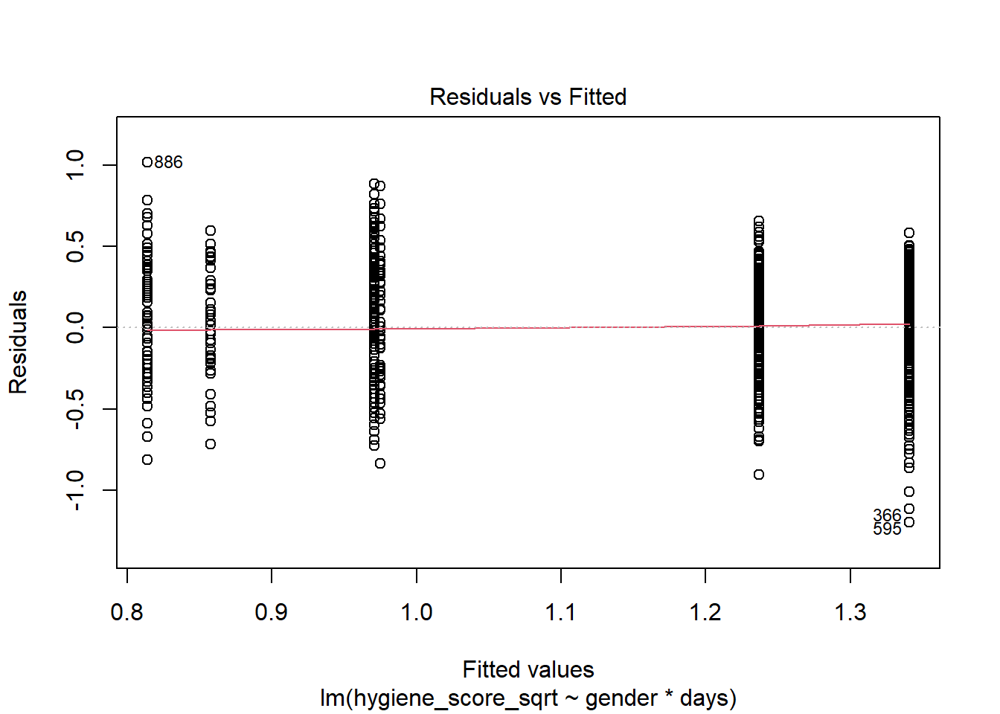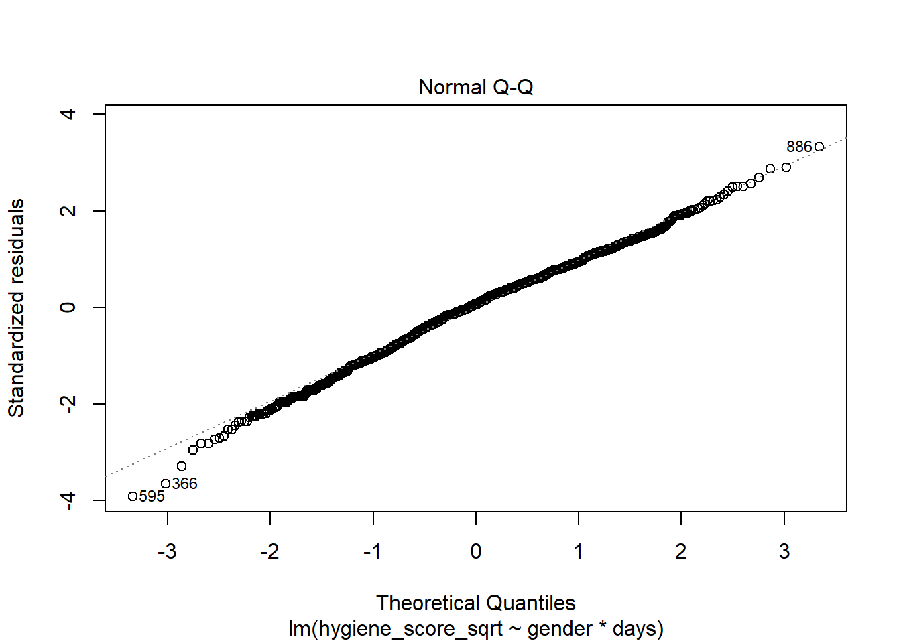

The residuals vs fitted plot shows a even distribution above and below the red line, this is good. It also shows that the variance over the different point-series is equally large. It does show some sytematic pattern, the series of dots being equally lined up, which shows that the model was unable to catch all information in the data.

Calling plot on a model object in R also shows a number of diagnostic plots to assess model fit. Here we see that the Q-Q plot of the residuals: the points should be on the line for the assumption of nromality to be met. 


