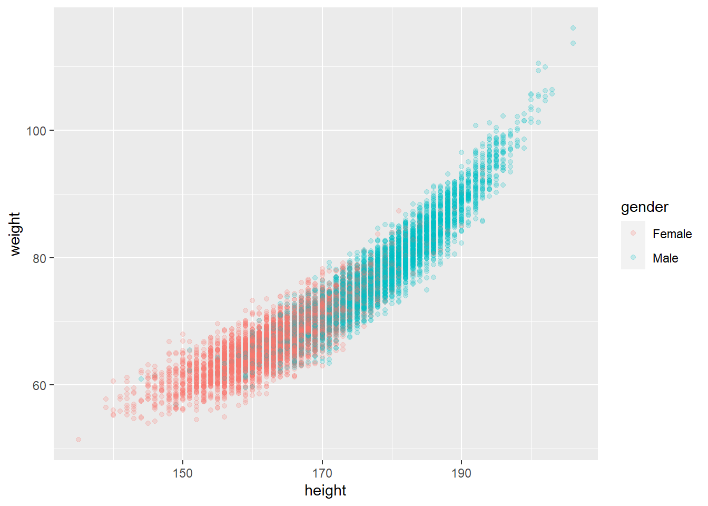
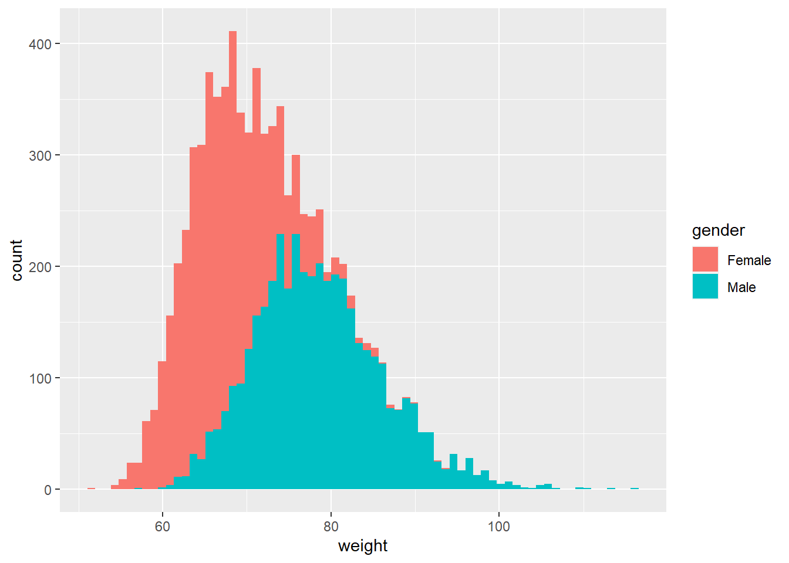
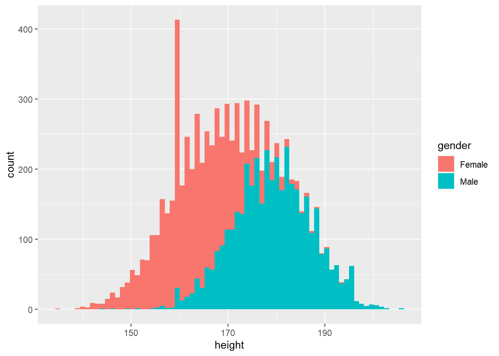

# Sampling, Probability distributions and bootstrapping {#sampling_bootstrapping}

## Packages

```r
library(tidyverse)
```

## Data 

For this chapter we use data from the 'Freie Universitaet' Berlin downloaded from: https://www.geo.fu-berlin.de/en/v/soga/Basics-of-statistics/Continous-Random-Variables/The-Standard-Normal-Distribution/The-Standard-Normal-Distribution-An-Example/index.html 

```r
data_students <- read.csv("https://userpage.fu-berlin.de/soga/200/2010_data_sets/students.csv") %>%
  as_tibble()
data_students
```

```
## # A tibble: 8,239 x 16
##    stud.id name  gender   age height weight religion nc.score semester major
##      <int> <chr> <chr>  <int>  <int>  <dbl> <chr>       <dbl> <chr>    <chr>
##  1  833917 Gonz~ Female    19    160   64.8 Muslim       1.91 1st      Poli~
##  2  898539 Loza~ Female    19    172   73   Other        1.56 2nd      Soci~
##  3  379678 Will~ Female    22    168   70.6 Protest~     1.24 3rd      Soci~
##  4  807564 Nem,~ Male      19    183   79.7 Other        1.37 2nd      Envi~
##  5  383291 Powe~ Female    21    175   71.4 Catholic     1.46 1st      Envi~
##  6  256074 Pere~ Male      19    189   85.8 Catholic     1.34 2nd      Poli~
##  7  754591 Clar~ Female    21    156   65.9 Protest~     1.11 2nd      Poli~
##  8  146494 Alle~ Female    21    167   65.7 Other        2.03 3rd      Poli~
##  9  723584 Trac~ Male      18    195   94.4 Other        1.29 3rd      Econ~
## 10  314281 Nimm~ Female    18    165   66   Orthodox     1.19 2nd      Envi~
## # ... with 8,229 more rows, and 6 more variables: minor <chr>, score1 <int>,
## #   score2 <int>, online.tutorial <int>, graduated <int>, salary <dbl>
```

In this chapter we will be working with the `height` and `age` column of the `data_students` data frame. Let's make a few exploratory graphs, to see how they relate to each other and to see some characteristics of the data.
 

```r
## relationship between weight, height and gender
data_students %>%
  ggplot(aes(x = height, y = weight)) +
  geom_point(aes(colour = gender), alpha = 0.2)
```



```r
## distribution of weight
data_students %>%
  ggplot(aes(x = weight)) +
  geom_histogram(aes(fill = gender), bins = 70)
```



```r
## distribution of height
data_students %>%
  ggplot(aes(x = height)) +
  geom_histogram(aes(fill = gender), bins = 70)
```



```r
## missingness
```

We can use the distributions of height variable to learn something about probablities and the normal distribution. 

## Probability distributions and predictions

First calculate the sample mean ($\overline{x}$), and the standard deviation of the sample mean $S_x$, of the target variable (in this case the `height` variable in the `data_students` data frame. Then, we standardize the `height` variable to get a standard normal distribution with $\overline{x} = 0$ and $S_x = 1$ and assign it to an appropriate variable name.

The formula for culculating the standard deviation of the sample mean is:

$\Large s_x = \sqrt{\frac{\sum_{i=1}^N (x_i - \overline{x})^2}{N-1}}$

## <mark>EXERCISE 1. Calculating the stardard deviation</mark> {-}

 a) Calculate the standard deviation ($s_x$) of the sample mean by writing an expression in R that implements the above formula.

 b) Use the function `mean()` to calculate the sample mean ($\overline{x}$), store it in a variable in R called `mean_height`
 
 c) and the function `sd()` to confirm your 'manual' calculations, store it in a variable called `sd_height`

**TIPS**

 - The $N-1$ bit are the degrees of freedom, it is the number of observations in this case minus `1`
 - If you are struggling with the order in which to calculate things, extract out the different pieces of the calculations first, then put them back together (use in-between steps)
 - If you are not sure, look at the answer for c) to check your calculations
 - The R function for the root-square ('Wortel' in Dutch) is `sqrt()`
 - To use power ('Tot de macht' in Dutch) in R use the caret (`^`) (which is something else than a carrot)
 - The numerator is the top part of the fraction, the denominator is the bottom part. The numerator here is also called the sum of squares for the sample. 


<mark>--- END OF EXERCISE ---</mark>

## Z-transformation of the female observations

We already saw that gender makes a difference for the distribution of height. In the exploratory graphs, we see again the distributions looking normal if you split by gender. Of course, only looking at a distribution will not tell you whether the data is normally distributed. In the previous chapter (\@ref(assumptions)) we saw a more formal way of determining the nature of this distribution. For the remainder of this chapter we will be working with observations from the `data_students` that are labeled 'Female' in the `gender` variable.   

Here we store the 'Female' data in a separate data frame and transform the female sample distribution to a standard normal distribution.

```r
females <- data_students %>%
  dplyr::filter(gender == "Female") %>%
  as_tibble()

females
```

```
## # A tibble: 4,110 x 16
##    stud.id name  gender   age height weight religion nc.score semester major
##      <int> <chr> <chr>  <int>  <int>  <dbl> <chr>       <dbl> <chr>    <chr>
##  1  833917 Gonz~ Female    19    160   64.8 Muslim       1.91 1st      Poli~
##  2  898539 Loza~ Female    19    172   73   Other        1.56 2nd      Soci~
##  3  379678 Will~ Female    22    168   70.6 Protest~     1.24 3rd      Soci~
##  4  383291 Powe~ Female    21    175   71.4 Catholic     1.46 1st      Envi~
##  5  754591 Clar~ Female    21    156   65.9 Protest~     1.11 2nd      Poli~
##  6  146494 Alle~ Female    21    167   65.7 Other        2.03 3rd      Poli~
##  7  314281 Nimm~ Female    18    165   66   Orthodox     1.19 2nd      Envi~
##  8  200803 Lang~ Female    22    162   66.8 Other        1.04 4th      Econ~
##  9  444907 Rodr~ Female    18    172   66.8 Other        3.81 3rd      Envi~
## 10  317812 Lope~ Female    20    158   64.4 Catholic     2.5  6th      Envi~
## # ... with 4,100 more rows, and 6 more variables: minor <chr>, score1 <int>,
## #   score2 <int>, online.tutorial <int>, graduated <int>, salary <dbl>
```

```r
mean_height_f <- mean(females$height)
sd_height_f <- sd(females$height)
height_z <- (females$height - mean_height_f)/sd_height_f
height_z %>% hist(main = "Z-transformed, female height")
```


The female height variable has a mean of 163.7 cm of and a standard deviation of 7.92 cm.

If we assume the sample in the data is a proper representation of the complete population, We can make predictions about the chance of observing females with a specific height or height-range by finding the area to the left of a (or between) z-score(s)

Question 1
What is the probability of a randomly picked female student from the student data set with a height less or equal to 168 cm. Thus, we are looking for $P(x ≤ 168)

First, we calculate the probability for the standardized variable. Therefore, we have to transform our value of interest (168 cm) into a z-score.

$\Large z = \frac{x−\overline{x}}{S_x} = \frac{168−163.7}{7.9} = 0.55$

Then we have to calculate the area under the curve left to the obtained z-score. We can calculate this area under the curve of a normal distributed variable by using the `pnorm()` function. The `pnorm()` function is written as `pnorm(q, mean = 0, sd = 1, lower.tail = TRUE, log.p = FALSE)`. For this particular example we can accept all default argument values.


```r
x <- 168 # height in cm (that we want the probability for)
x_z <- (x - mean_height_f)/sd_height_f # z-transformation
pnorm(x_z) %>% round(2)
```

```
## [1] 0.71
```

Awesome, we have a result: 

$\Large P(z≤0.55) ≈ 0.71$

Now, we do the same calculation, however this time we skip the step of standardization. Thanks to the power of R we do not need to rely on tables, but can we can easily put the sample mean, $\overline{x}$ and the sample standard deviation, $S_x$ into the `pnorm()` function.


```r
x <- 168 # height in cm 
pnorm(x, 
      mean = mean_height_f, 
      sd = sd_height_f, 
      lower.tail = TRUE, log.p = FALSE
      ) %>%
  round(3)
```

```
## [1] 0.708
```

The numbers are not identical but they are comparable: 

$P(x ≤ 168) ≈ 0.708. 
To make sure we realize what is going on, both the area under the curve for the standardized variable in z-values (left panel) as well as the area for the non-standardized variable in cm (right panel) are visualized below.


```r
z_prob <- ggplot(females, aes(x = height_z)) +
stat_function(
fun = dnorm,
args = with(females, c(mean = mean(height_z), sd = sd(height_z)))
) + stat_function(
  args = with(females, c(mean = mean(height_z), sd = sd(height_z))),
    fun = dnorm,
    geom = "area",
    fill = "steelblue",
    alpha = .5,
  xlim = c(-3.5, 0.55)) +
  ggtitle("P(z =< 0.55") +
  xlab("Z-transformed height") +
  ylab(NULL) +
  theme(axis.text.y = element_blank(),
        axis.ticks.y = element_blank())


real_prob <- ggplot(females, aes(x = height)) +
stat_function(
fun = dnorm,
args = with(females, c(mean = mean(height), sd = sd(height)))
) + stat_function(
  args = with(females, c(mean = mean(height), sd = sd(height))),
    fun = dnorm,
    geom = "area",
    fill = "steelblue",
    alpha = .5,
  xlim  = c(135, 168)) +
  ggtitle("P x =< 168 cm") +
  xlab("Height (cm)") +
  ylab(NULL) +
  theme(axis.text.y = element_blank(),
        axis.ticks.y = element_blank())

cowplot::plot_grid(z_prob, real_prob)
```


## Sampling distributions

Based upon our intuition of randomness in the sampling process, we introduce the Sampling Distribution. The sampling distribution is a distribution of a sample statistic. Often the name of the computed statistic is added as part of the title. For example, if the computed statistic was the sample mean, the sampling distribution would be titled the `sampling distribution of the sample mean`.

Let's assume we have a population that is represented by 5961 randomly generated numbers from a Normally distributed collections of numbers. If we repeatedly sample from that population and each time compute the sample statistic (e.g. $\overline{x}$ or $s_x$, the resulting distribution of sample statistics is called the sampling distribution of that statistic. We pre-define the mean of population at `24` and set the standard deviation of that mean to `7.9`. Because by definition a normal distributed population is defined by the mean ($\mu$) and the standard deviation of $\mu$ called $\sigma$.

Normally, we do not know what the population distribution looks like. This would be information we do NOT have (hence, we need to sample the population to get an estimate of this distribution. This is often the aim of inferential statistics. Because we would like to know how good we did on our sampling we need some form of assessment for this. The exercise below, hopefully helps you understand this need. 

Let us take repeatedly random samples ($x_1$ to $xn$)
without replacement of sizes where $n$ is . We take these samples randomly from the population to determine the `sampling distribution of the sample mean`.  


```r
# set.seed() is for reproducibility
set.seed(1234)
# define opulation and put in a dataframe
population <- rnorm(mean = 24, sd = 7.9, n = 5961) %>%
  enframe()

## see a fast picture of how the population distribution looks like (it should )
## normally this would be information we do NOT have (hence, we need to sample the population to get an estimate of this distribution)
population %>%
  ggplot(aes(x = ))
```


```r
## what is the mean?
mean(population$value)
```

```
## [1] 24.03374
```

```r
## define the sample-sized that we want to draw from the population
no_samples <- c(5, 10, 100, 500, length(population$value))

## draw random samples of size `no_samples` from the population
## we construct a loop by using map from the purrr package
samples <- map(
  .x = no_samples,
  .f = sample_n,
  tbl = population,
  replace = FALSE
)

## function to plot the draws from the population
plot_bootstrap <- function(bootstrap_tbl, mu, size = 1){

  bootstrap_tbl %>%
    ggplot(aes(x = value)) +
    geom_histogram() +
 #   xlim(c(1,100)) +
    geom_vline(xintercept = mu, 
               size = 1, 
               colour = "red", 
               linetype = "dashed")
  
  }


map(
  .x = samples,
  .f = plot_bootstrap,
  mu = mean(population$value)
)
```

```
## [[1]]
```

```
## `stat_bin()` using `bins = 30`. Pick better value with `binwidth`.
```


```
## 
## [[2]]
```

```
## `stat_bin()` using `bins = 30`. Pick better value with `binwidth`.
```


```
## 
## [[3]]
```

```
## `stat_bin()` using `bins = 30`. Pick better value with `binwidth`.
```


```
## 
## [[4]]
```

```
## `stat_bin()` using `bins = 30`. Pick better value with `binwidth`.
```


```
## 
## [[5]]
```

```
## `stat_bin()` using `bins = 30`. Pick better value with `binwidth`.
```


What we can conclude from the above graphs is that low sample numbers do not provide a good insight for the population mean, bigger samples approximate the population mean better and if we can study the complete population we get exactly the population mean, but usually we cannot sample the complete population. How do we know we took a good (large enough) sample?

## Bootstrap resampling

_This example was adapted after Resampling a sample distribution (`bootstrapping`) from "The Art of Statistics", by Sr. David Spiegelhalter, 2019_

For each set of samples we can calculate a sample statistic. In this example we take the mean, $\overline{x}$, of each collection of samples. However, please note that the sample statistic could be any descriptive statistic, such as the median, the standard deviation or a proportion, among others. 

Now we want to know how precise we have been able to estimate the mean for the different sample-sets that we took from the population. In order to determine how accurate our statistic (in this case the mean) is we can imagine taking repeated samples (let's say 1000) from the population, we could determine how much the calculated mean would vary, each time we take a sample. If we know how much these estimates vary we would know how precise they are. But only if we know the details of the population (this we usually do not know in real data).

One way to resolve this is to assume that the sample looks like the population. Because in real live we usually cannot take many repeated new samples from the population, we take repeated new samples from our samples. The underlying assumption is that we took care of randomization procedures for sample-taking 

Suppose we draw a series of samples from our 100 samples we collected earlier. We randomly pick 1 sample, record its value, put it back in the population and draw another sample. We repeat this procedure 50 times. This is called a `boot`. A bootstrapping experiments usually consists of 1000 boots. Meaning that we draw 1000 samples of 50, with replacement (meaning that we put the sample back, before drawing a new sample)

Here we see 10 boots of a small bootsrapping experiment:

```r
source(
  here::here("R", "these_boots_are_made_for.R"))

bootstrap(x = population$value,
          n = 50,
          iter = 10,
          as_tbl = TRUE,
          mode = "raw") %>%
  tidyr::pivot_longer(
    cols = c(V1:V10), names_to = "boot", values_to = "value" 
  ) %>%
  mutate(iter = rep(1:10, times = 50)) -> boots_50 
```

```
## Warning: The `x` argument of `as_tibble.matrix()` must have unique column names if `.name_repair` is omitted as of tibble 2.0.0.
## Using compatibility `.name_repair`.
## This warning is displayed once every 8 hours.
## Call `lifecycle::last_warnings()` to see where this warning was generated.
```

```r
boots_50 %>%
  ggplot(aes(x = value)) +
  geom_histogram() +
  facet_wrap(~iter, ncol = 2) +
  ggtitle("Sampled values (n=50) of the 10 boots")
```

```
## `stat_bin()` using `bins = 30`. Pick better value with `binwidth`.
```


We now run a full bootstrapping experiment, with a number of different sample sizes (no_samples) and 1000 iterations (boots). In this experiment we will calculate the sample mean ($\overline{x}$) for each bootstrapped sample. Below we run the experiment by using the function defined in "./R/these_boots_are_made_for.R"


```r
source(
  here::here(
    "R",
    "these_boots_are_made_for.R"
  )
)

## run my self-written bootstrap function, this function takes a number of arguments to tune your bootstraps, you can get mean, median sd or raw (the actual sampled values) for  bootstrap
## look at the source code here: ".R/these_boots_are_made_for.R"
## we use map to loop over the predifined list of bootstrap iterations (repeats of sampling 30 samples from our simulated population) 
set.seed(1234)


bootstraps <- map_df(
  .x = no_samples, ## we use map to loop over the different sample sizes
  .f = bootstrap,
  x = population$value,
  iter = 1000, ## usually we run 1000 bootstraps 
  mode = "mean", ## the resampling statistic to be calculated after the bootstrapping
  as_tbl = TRUE
)

bootstraps_df <- bootstraps %>%
  mutate(sample_size = rep(no_samples, each = 1000))
```

Let's plot each bootstrap in a seperate graph.

```r
mu <- mean(population$value)
## in one plot
bootstraps_df %>%
  ggplot(aes(x = value)) +
  geom_histogram(bins = 100) +
  facet_wrap(~sample_size, ncol = 2) +
  ggtitle("Sampled values bootstrapping experiment") +
    geom_vline(xintercept = mu, 
               size = 0.5, 
               colour = "red", 
               linetype = "dashed")
```


We see that the estimate for the mean of the sample distribution becomes more centered around the population mean mu (here we know it because we assumed the population to be the integers 1:5961). Usually the population mean is unknown and we use sampling to get an estimate for it. What we also can see from the graphs is that the variability in the original sample distribution is almost gone in the resampled bootstrap distribution of the means. It is most apparent if you compare the histograms to the earlier dot plots. Now we can estimate the precision of the estimated mean in the bootstrapped sample distribution, providing us with an idea on how precise a specific size of samples from a population represents the estimate for the mean. 

To provide a number to this precision we can calculate the 95% confidence interval of the bootstrapped estimation for the sample mean. We also call this the `estimation of the margin of error`


```r
# install.packages("Rmisc")
library(Rmisc)
```

```
## Loading required package: lattice
```

```
## Loading required package: plyr
```

```
## ------------------------------------------------------------------------------
```

```
## You have loaded plyr after dplyr - this is likely to cause problems.
## If you need functions from both plyr and dplyr, please load plyr first, then dplyr:
## library(plyr); library(dplyr)
```

```
## ------------------------------------------------------------------------------
```

```
## 
## Attaching package: 'plyr'
```

```
## The following objects are masked from 'package:dplyr':
## 
##     arrange, count, desc, failwith, id, mutate, rename, summarise,
##     summarize
```

```
## The following object is masked from 'package:purrr':
## 
##     compact
```

```r
bootstraps_list <- map(
  .x = no_samples, ## we use map to loop over the different sample sizes
  .f = bootstrap,
  x = population$value,
  iter = 1000, ## usually we run 1000 bootstraps 
  mode = "mean", ## the resampling statistic to be calculated after the bootstrapping
  as_tbl = FALSE
)


margins_of_error <- map_df(
  .x = bootstraps_list,
  .f = CI
) %>%
  mutate(sample_size = no_samples) %>%
  select(
    sample_size,
    lower,
    mean,
    upper
  )

margins_of_error
```

```
## # A tibble: 5 x 4
##   sample_size lower  mean upper
##         <dbl> <dbl> <dbl> <dbl>
## 1           5  24.0  24.2  24.4
## 2          10  23.8  24.0  24.1
## 3         100  24.0  24.0  24.1
## 4         500  24.0  24.0  24.1
## 5        5961  24.0  24.0  24.0
```

```r
## Of course we can put them in a plot
#margins_of_error %>%
#  ggplot(aes(x = mean)) 
```

OBVIOUSLY, If we bootstrap the whole population, we exactly get the population mean. Because we cannot sample the complete population in most cases, this is for demonstration purposes and derivative proof that bootstrapping is generally a good idea.

DOWNSIDE, The downside of bootstrapping is that it can be computationally expesive when we run many iterations over very large sample sizes.
